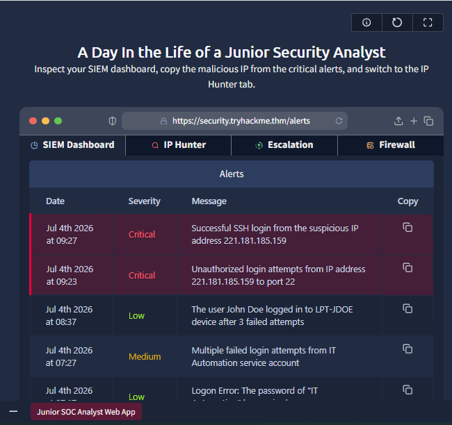
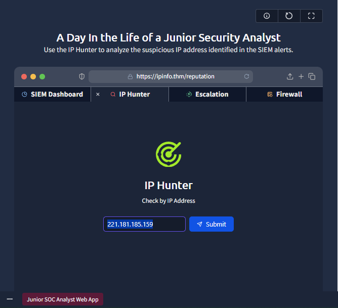
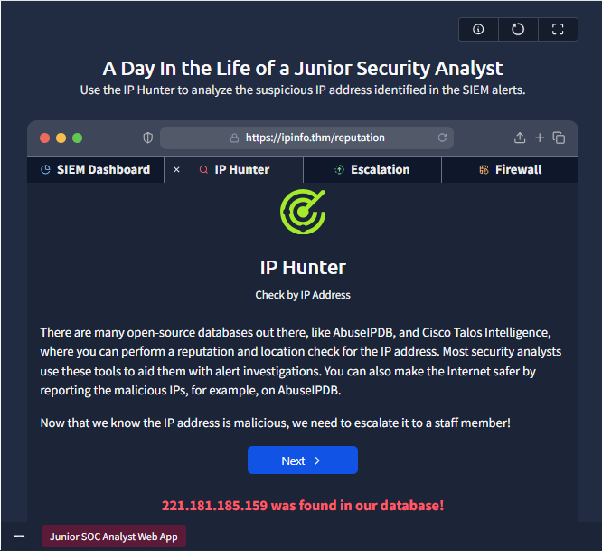
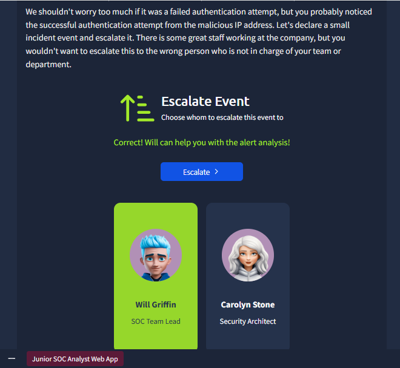
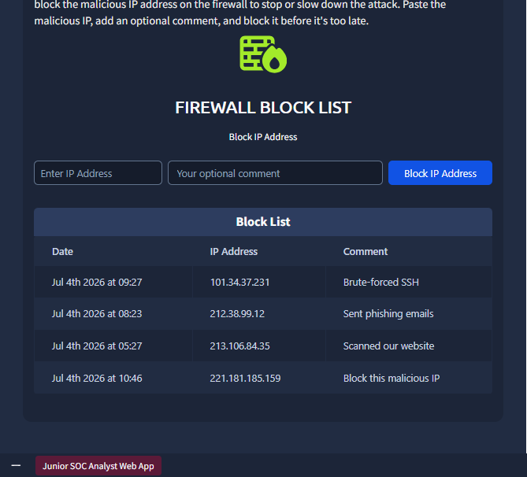

# Room 1: Junior Security Analyst Intro

**Path:** SOC Level 1
**Platform:** TryHackMe
**Status:** ✅ Completed

---

## 📌 Overview

This room is the entry point into the **SOC Level 1** path on TryHackMe. It introduces the role of a Junior Security Analyst (SOC Level 1 Analyst) through a narrative-driven walkthrough of a typical day in a Security Operations Center (SOC).

The room covers:
- The daily duties of a SOC Level 1 Analyst (monitoring alerts, SOC brainstorms, cross-team collaboration, continuous learning)
- The structure of a SOC team and the roles that support an analyst (SOC engineers, senior analysts, SOC managers)
- A hands-on simulation: **"A Day in the Life of a Junior Security Analyst"**, where I had to inspect a SIEM dashboard, identify a malicious IP from a critical alert, investigate it, and escalate it appropriately.

---

## 🛠️ Tools Used

- **SIEM Dashboard** (simulated, within the TryHackMe VM)
- **IP Hunter** (threat intelligence / IP reputation lookup tool)
- Virtual Machine environment provided by TryHackMe

---

## 🪜 Steps Followed

**1. Launched the simulation and reviewed the SIEM dashboard**
Opened the "A Day in the Life of a Junior Security Analyst" VM and inspected the SIEM dashboard's Alerts tab. Two critical alerts stood out, both tied to IP `221.181.185.159` — one for a successful SSH login from a suspicious IP, and one for unauthorized login attempts to port 22.

**2. Copied the malicious IP and switched to IP Hunter**
Copied `221.181.185.159` from the critical alert and moved to the IP Hunter tab to check its reputation.

**3. Investigated the IP's reputation**
Submitted the IP for a reputation and location check. IP Hunter confirmed the address was already flagged in its database as malicious.

**4. Escalated the alert to the correct staff member**
With the IP confirmed malicious, I escalated the incident — choosing **Will Griffin (SOC Team Lead)** over Carolyn Stone (Security Architect), since Will was the right point of contact for this alert analysis.

**5. Blocked the IP on the firewall**
Added `221.181.185.159` to the firewall block list with a comment noting it as the malicious IP, to stop or slow down the attack while the escalation was being handled.

---

## 🔍 Key Findings

- Malicious IP identified in the critical alert: **`221.181.185.159`**
- The alert required escalation rather than being resolved at Tier 1, reinforcing the real-world workflow of a SOC analyst: **detect → investigate → escalate → contain**.
- Containment action taken: the malicious IP was added to the **firewall block list**, cutting off further contact from that source while the escalation was handled.

---

## 💡 Lessons Learned

- A SOC Level 1 Analyst's core job isn't just "watching a dashboard" — it's about **triaging** alerts quickly, pulling threat intel on indicators (like IPs), and knowing when an issue is beyond your scope to resolve alone.
- Escalation is a critical skill, not a failure. Recognizing when to hand an alert to a senior analyst or SOC lead is part of the job, not a shortcut around it.
- Escalating doesn't mean stepping back — containment (blocking the IP at the firewall) still fell to me. A Level 1 analyst acts to limit damage immediately, then lets the escalation path handle deeper investigation or remediation.
- The SOC is a **team sport** — engineers build the tools, analysts monitor and investigate, seniors handle complexity, and managers keep the operation running. Understanding this structure early helps me see where I fit and where I'm headed on the path to CISO.

---

*Next room: [Room 2 — coming soon]*
