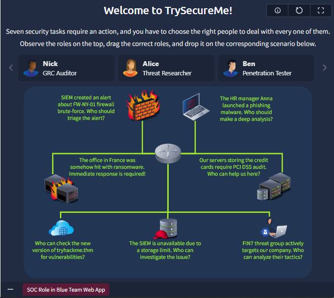
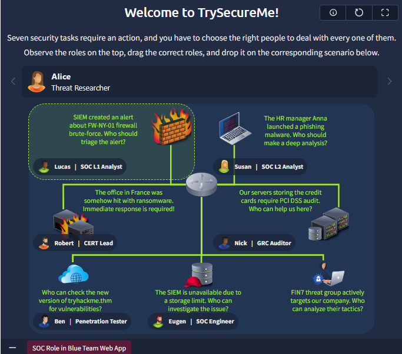
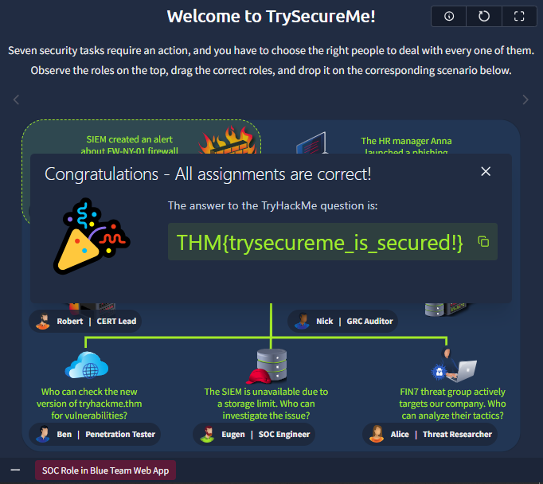

# Day 2: SOC Role in Blue Team

**Path:** SOC Level 1
**Platform:** TryHackMe
**Status:** ✅ Completed

---

## 📌 Overview

This room breaks down where a SOC Level 1 Analyst fits within a company's broader security structure. Cyber security priorities differ by industry (privacy for law firms, uptime for factories, patient safety for hospitals), which is why every organization builds its security team differently.

The room covers:
- The three core security departments in larger companies: **Red Team** (offensive), **GRC Team** (governance, risk & compliance), and **Blue Team** (defensive) — all overseen by a CISO.
- The structure of the **Security Operations Center (SOC)**: L1 Analysts (triage), L2 Analysts (advanced investigation), Engineers (tooling), and a Manager.
- The role of the **Cyber Incident Response Team (CIRT/CSIRT/CERT)** — called in when an incident escalates beyond SOC capability — with real-world examples (JPCERT, Mandiant, AWS CIRT).
- Specialized Blue Team roles that sit beyond L1/L2: Digital Forensics Analyst, Threat Intelligence Analyst, AppSec Engineer, AI Researcher.
- The difference between working in an **Internal SOC** vs. an **MSSP** (Managed Security Services Provider) — pace, tooling breadth, and incident exposure differ significantly between the two.
- A hands-on simulation: **TrySecureMe**, where I acted as a CISO and had to correctly match staff roles to seven simultaneous security incidents.

---

## 🛠️ Tools Used

- **TrySecureMe** simulation web app (drag-and-drop role-assignment challenge)
- Conceptual knowledge of SOC/Blue Team/Red Team/GRC structures (no technical tooling required for this room)

---

## 🪜 Steps Followed

**1. Reviewed the roles and incidents on the board**
Opened the TrySecureMe web app and studied the seven active incidents laid out on the board, along with the pool of available staff roles at the top: GRC Auditor, Threat Researcher, Penetration Tester, SOC L1 Analyst, SOC L2 Analyst, CERT Lead, and SOC Engineer.

**2. Matched each role to its correct incident**
Worked through each scenario and dragged the right person into place based on their specialty — for example, assigning **Alice (Threat Researcher)** to the incident involving the FIN7 threat group actively targeting the company, since analyzing threat actor tactics falls under threat intelligence, not incident triage.

**3. Completed all seven assignments correctly**
After placing every role — including Lucas (SOC L1 Analyst) on the firewall brute-force alert, Susan (SOC L2 Analyst) on the phishing malware deep-dive, Robert (CERT Lead) on the ransomware incident, Nick (GRC Auditor) on the PCI DSS audit, Ben (Penetration Tester) on the vulnerability check, and Eugen (SOC Engineer) on the SIEM storage issue — the challenge confirmed all assignments were correct and returned the flag.

---

## 🔍 Key Findings

- **Flag obtained:** `THM{trysecureme_is_secured!}`
- Correct role-to-incident mapping for the seven scenarios:
  | Incident | Correct Role |
  |---|---|
  | Firewall brute-force alert (needs triage) | **Lucas** — SOC L1 Analyst |
  | Phishing malware (needs deep analysis) | **Susan** — SOC L2 Analyst |
  | Ransomware hit on France office (urgent response) | **Robert** — CERT Lead |
  | PCI DSS audit on credit card servers | **Nick** — GRC Auditor |
  | New tryhackme.thm version needs vulnerability check | **Ben** — Penetration Tester |
  | SIEM unavailable due to storage limit | **Eugen** — SOC Engineer |
  | FIN7 threat group actively targeting the company | **Alice** — Threat Researcher |
- The exercise reinforced that **not every security incident belongs to the SOC** — GRC handles compliance, Red Team handles offensive testing, and CIRT/CERT takes over when an incident is severe or ongoing (like active ransomware), while routine alert triage stays with SOC L1/L2.

---

## 💡 Lessons Learned

- Understanding the **full security org chart** — not just the SOC — makes it easier to know when to escalate and to whom. An L1 analyst who only knows their own team can misroute a serious incident.
- **GRC and Red Team are not "extra" departments** — they're core to a mature security program. Compliance (GRC) and proactive testing (Red Team) work alongside Blue Team's reactive defense.
- The distinction between **Internal SOC and MSSP** matters for career planning: an MSSP offers faster, broader incident exposure across many clients and tools, while an internal SOC offers deeper focus on fewer tools with a calmer pace. Worth weighing both when I start applying for SOC roles.
- CIRT/CERT roles are the "firefighters" of security — they only get called when things are already bad, which means they need broad crisis-handling skill rather than routine tool dependency. This is a longer-term path worth keeping in mind alongside the SOC → CISO track.
- This room made the abstract idea of "security teams" concrete by forcing me to actually place the right person on the right problem — a useful mental model to carry into real alert triage.

---

