# Day 3: Humans as Attack Vectors

**Path:** SOC Level 1
**Platform:** TryHackMe
**Status:** ✅ Completed

---

## 📌 Overview

This room reframes the human element as the weakest link in cyber security — often easier for attackers to exploit than any firewall or vulnerability. It covers **why** humans are targeted (they hold access to accounts, mailboxes, and databases attackers want) and the psychology behind why social engineering works: attacks succeed by appearing **trustworthy** and triggering **emotion** (urgency, fear, curiosity).

The room walks through the major categories of human-targeted attacks:
- **Phishing** — still the most common form of social engineering, with billions of malicious emails sent daily.
- **Malware downloads** — disguised through fake CAPTCHAs, malicious QR codes, and SEO poisoning.
- **Deepfakes** — AI-generated audio/video used to impersonate executives, colleagues, or partners (referencing the real $25 million deepfake CFO scam).
- **Impersonation** — attackers posing as IT support or other trusted staff over the phone.
- Other vectors: USB drop campaigns, physical attacks, insider threats, fake job offers.

It also introduces the two-pronged SOC defense model: **Mitigation** (anti-phishing tools, antivirus/EDR, "trust but verify," security awareness training) to reduce the chance of an attack succeeding, and **Detection** — the SOC analyst's core job — to catch what slips through mitigation.

The hands-on portion is a simulation on the **TryHackMe Security Dashboard**, split into two parts:
1. **Employees at Risk** — four realistic case files where I had to investigate and make a verdict call as a SOC analyst.
2. **Security Policy** — rebuilding the company's security policy by selecting the four most effective mitigation measures out of several options.

---

## 🛠️ Tools Used

- **TryHackMe Security Dashboard** (simulated SOC analyst web app)
- Analytical/verdict-based decision making — no external technical tooling required, but each case mirrors real SOC triage (email header analysis, URL inspection, login anomaly review, verifying requests out-of-band)

---

## 🪜 Steps Followed

### Part 1: Employees at Risk (4 cases)

**Dashboard start**
Opened the Security Dashboard and reviewed the two pending tasks for the day: review Employees at Risk, and update the corporate Security Policy.

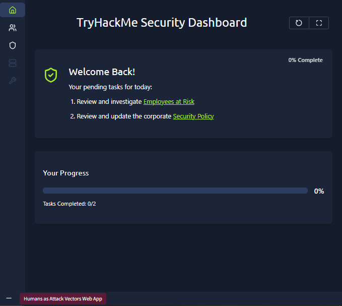

**Case 1 — Lucas Martinez (blocked software install)**
Lucas, a new software engineer, urgently needed 7-Zip but its `Setup.exe` — downloaded from an unfamiliar freeware site (`best-freeapps-2025.top`) — was being blocked by antivirus after 6 launch attempts. My verdict: **quarantine the file and instruct Lucas to use the official 7-Zip installer**, rather than whitelisting an unverified executable from a suspicious freeware site.

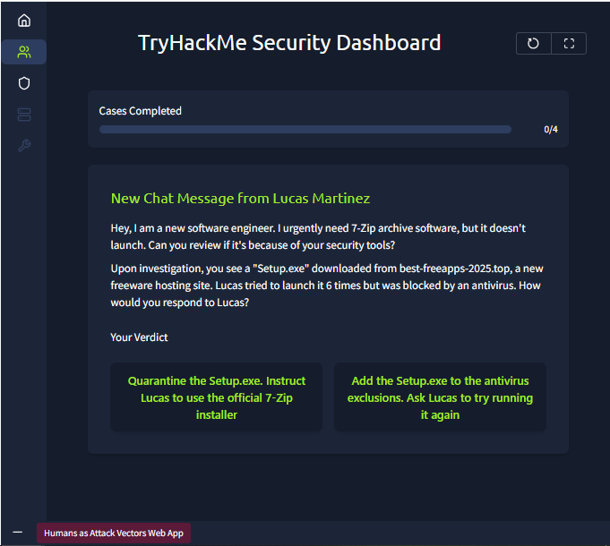

The file was confirmed as a **data stealer** — quarantining it protected Lucas.

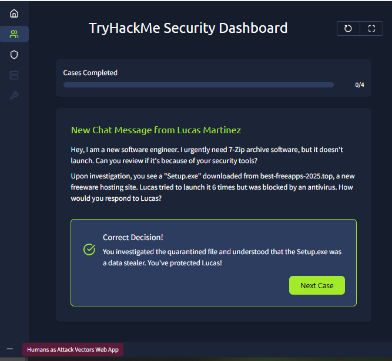

**Case 2 — Suspicious "Stripe Invoice" email**
A SIEM alert flagged an email to the Finance Director claiming to confirm a $23,650 Stripe payment, with a password-protected `Invoice.rar` attachment and a lookalike sender domain (`noreply@stripe-payments.xyz`). My verdict: **block the email and start the analysis** as a phishing attempt, rather than trusting it as a legitimate invoice.

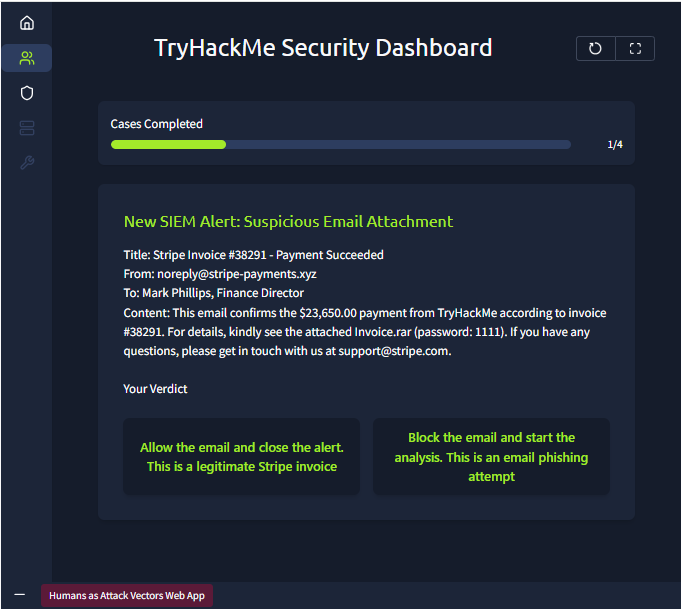

Analysis confirmed `stripe-payments.xyz` was a fake domain and the `.rar` contained a **malicious DOCX document**.

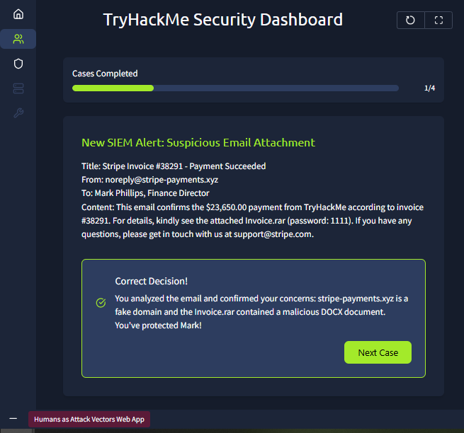

**Case 3 — "CEO" requesting a password reset**
IT support (Isabella) received a call from someone claiming to be the CEO, Ben, asking for a Gmail password reset — made at 9 PM from a hidden number, later cross-checked against a login from Ben's home country (USA) that Ben himself didn't confirm. My verdict: **disable Ben's Gmail account until he confirms the login or is back in the office**, rather than waiting passively.

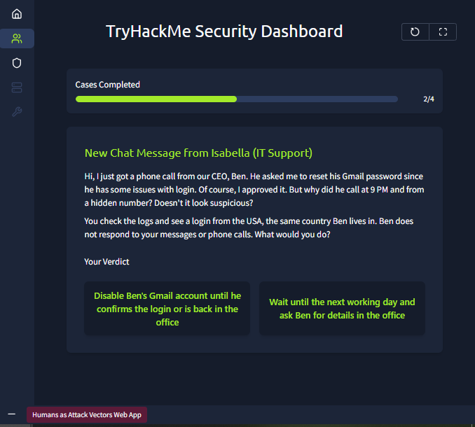

Correct — it was a **deepfake voice call**, and disabling the account pre-emptively prevented the attackers from stealing the CEO's emails.

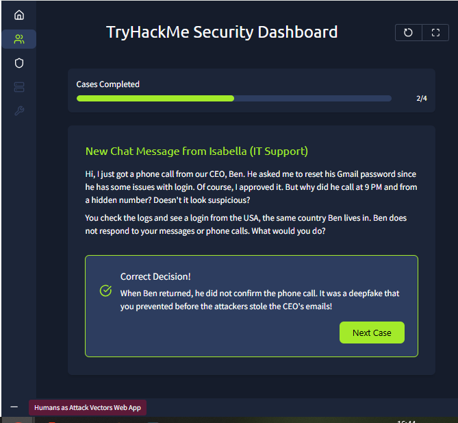

**Case 4 — Anomalous login for Rose Lewis (HR Assistant)**
A SIEM alert flagged a Microsoft 365 login from London for a user typically based in Oxford, with suspicious URLs visited beforehand — including a lookalike domain (`login[.]micrsoft365-online[.]ru`). My verdict: **disable Rose Lewis's account until more confident in the verdict**, rather than dismissing the location difference as trivial.

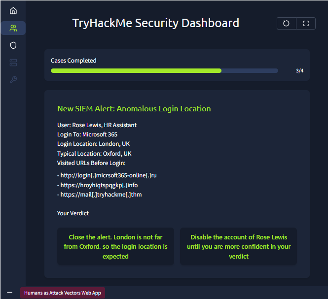

Correct — Rose had fallen for a **fake login page (credential phishing)**, confirmed by the visited-URL history before the login.

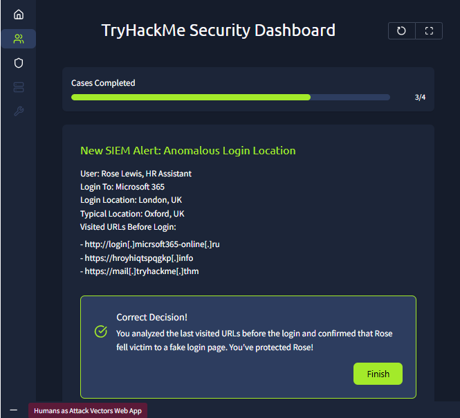

**Employees at Risk completed**
All four cases resolved correctly.

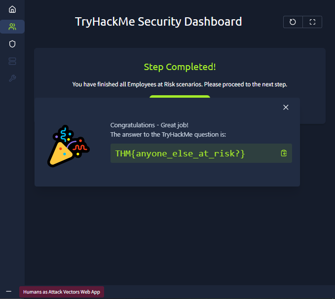

### Part 2: Security Policy Rebuild

**Selecting policies (first attempt)**
Reviewed the available policy options and selected 4: Security Awareness Program, Antivirus Solution, Anti-Phishing Solution, and Daily Vulnerability Scanning.

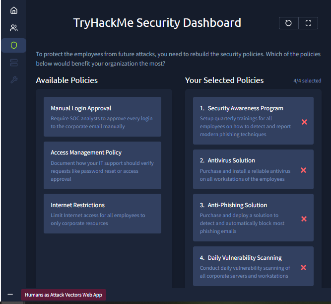

Feedback showed 3 of the 4 were solid choices, but **Daily Vulnerability Scanning** was flagged as generating huge load for little benefit — daily scanning across all workstations was overkill.

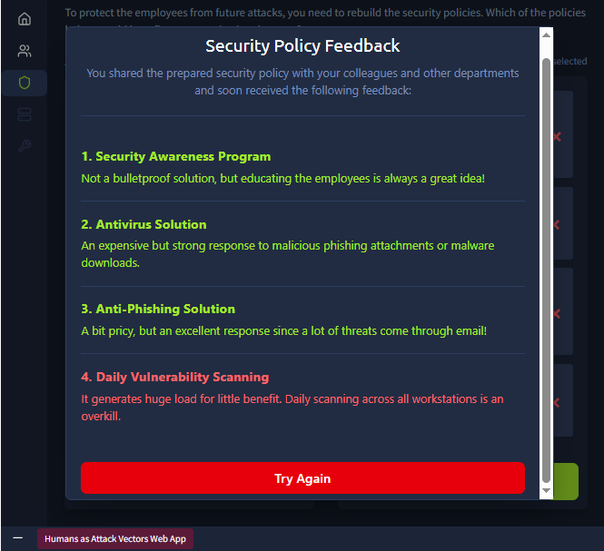

**Selecting policies (corrected attempt)**
Swapped Daily Vulnerability Scanning for **Access Management Policy** instead, keeping Anti-Phishing Solution, Security Awareness Program, and Antivirus Solution. This time all 4 policies received positive feedback — including the Access Management Policy being noted as helpful against deepfake-based social engineering targeting IT support.

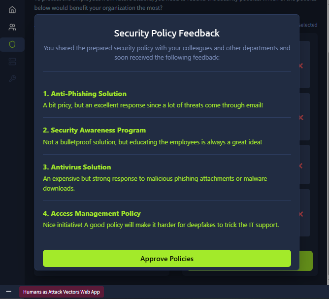

**Security Policy submitted**

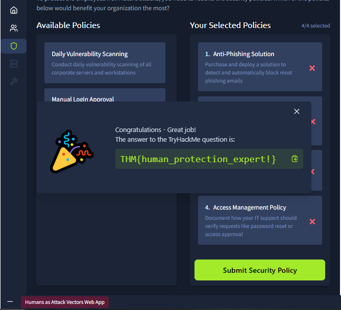

---

## 🔍 Key Findings

- **Flag 1 (Employees at Risk):** `THM{anyone_else_at_risk?}`
- **Flag 2 (Security Policy):** `THM{human_protection_expert!}`
- All 4 "Employees at Risk" cases traced back to core social engineering patterns from the room's theory: a **data stealer** disguised as freeware, a **phishing email with a malicious attachment**, a **deepfake voice impersonation** of a CEO, and **credential phishing via a fake Microsoft 365 login page**.
- The right security policy mix wasn't just "pick the strongest tools" — **Daily Vulnerability Scanning**, despite sounding proactive, was the wrong choice due to its operational cost outweighing its benefit. The correct set (Security Awareness, Antivirus, Anti-Phishing, Access Management) balanced technical controls with human-focused ones.

---

## 💡 Lessons Learned

- Attackers don't need to break through a firewall when they can convince a human to open the door — every case in this room hinged on a human decision point, not a technical exploit.
- Verifying identity **out-of-band** (waiting for Ben to confirm in person/via a trusted channel, rather than trusting a phone call alone) is one of the simplest and most effective defenses against impersonation and deepfakes.
- Not every "more security" option is the right security option. Daily Vulnerability Scanning looked like a strong choice on paper but was the wrong one in this context — a reminder to weigh operational cost and actual risk reduction, not just how proactive a control sounds.
- Mitigation and Detection are two different jobs but work together: mitigation (training, antivirus, anti-phishing, access policies) reduces how often I'll see these cases; detection is what catches the ones that get through anyway — which is where my SOC L1 skills come in.
- Small details mattered across every case: a slightly-off domain (`stripe-payments.xyz`, `micrsoft365-online.ru`), a call at an odd hour from a hidden number, a login location just far enough from the norm to be worth checking. SOC triage often comes down to noticing what looks "almost right."
