# Day 4: Systems as Attack Vectors

**Path:** SOC Level 1
**Platform:** TryHackMe
**Status:** ✅ Completed

---

## 📌 Overview

Where Day 3 focused on humans as the weak link, this room shifts to **systems** — the servers, laptops, and cloud platforms where data actually lives. The value of a breached system scales with what it controls: compromising one mailbox via phishing is bad, but compromising the mail *server* means every mailbox on it is exposed.

The room breaks system attacks into three categories:
- **Human-led attacks** — malicious USBs, pirated software, and password reuse (81% of breaches involve stolen or breached passwords).
- **Vulnerabilities** — software flaws tracked as CVEs; over 40,000 were published in 2024 alone, with 300+ actively exploited. Includes the concept of **zero-days** (vulnerabilities discovered by attackers before defenders) and **supply chain attacks** (compromising a trusted app or library to hit all its users at once — SolarWinds, 3CX, and even TryHackMe's own Lottie Player incident are cited).
- **Misconfigurations** — not a software bug, but a setup mistake (weak default passwords, unrestricted access), with real-world examples like the McDonald's chatbot password leak and the Capital One AWS breach.

It reinforces that mitigation for systems looks different from mitigation for humans — you can't "train" a system, but you can enforce **Patch Management**, **IT training**, **Network Protection** (restricting access to trusted IPs), and **Antivirus Protection**.

The hands-on simulation continues on the **TryHackMe Security Dashboard**, now with two new tabs: **Systems at Risk** (four alerts requiring a response) and **Remediation Plan** (selecting the best hardening measures).

---

## 🛠️ Tools Used

- **TryHackMe Security Dashboard** (simulated SOC analyst web app)
- Root-cause analysis and incident response reasoning — each alert required identifying and fixing the *actual* cause (a CVE, breached credentials, an outdated device, a supply chain compromise) rather than a surface-level fix

---

## 🪜 Steps Followed

### Part 1: Systems at Risk (4 alerts)

**Alert 1 — HQ-MAIL-02 (Exchange mail server)**
A penetration test reported the internet-exposed Exchange server was vulnerable to **CVE-2024-49040**. My verdict: **ask IT to apply a patch and update Exchange**, addressing the root cause rather than just rotating passwords.

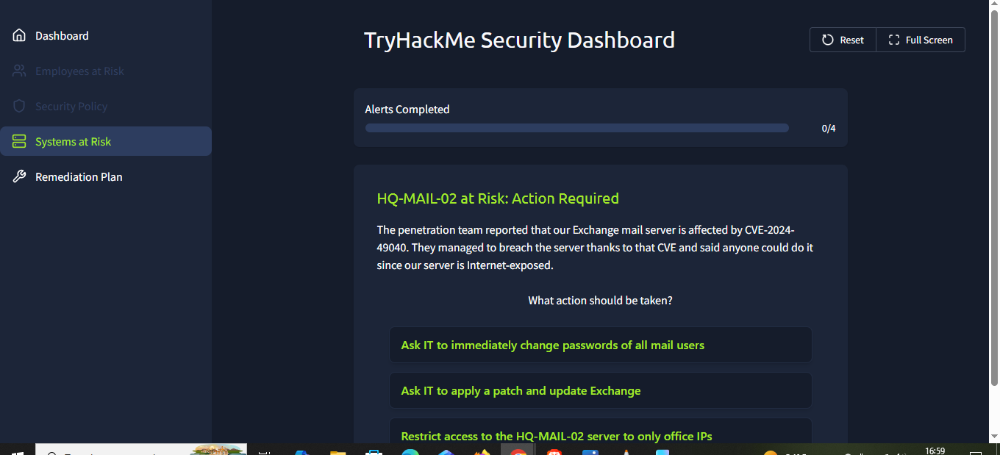

Correct — patching the CVE was the right call, with a note to then hunt for any threats that slipped in *before* the patch was applied.

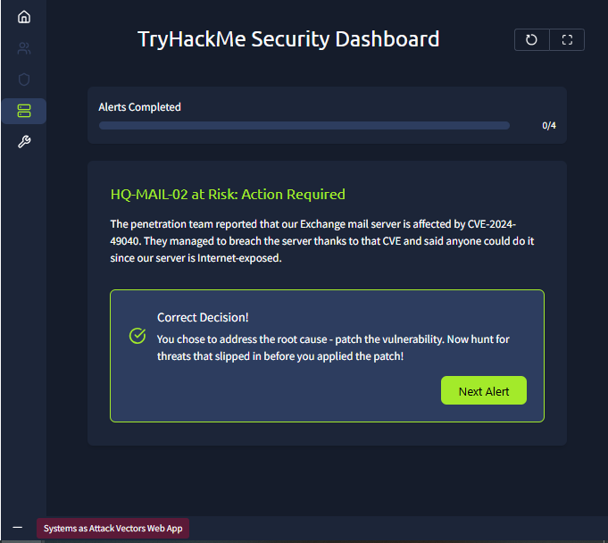

**Alert 2 — Corporate Website (WordPress)**
Threat actors brute-forced the WordPress admin panel and defaced the homepage with malware links and gambling ads. My verdict: **change the admin's password to a more secure one**, targeting the actual weakness (breached credentials) rather than just restoring the site.

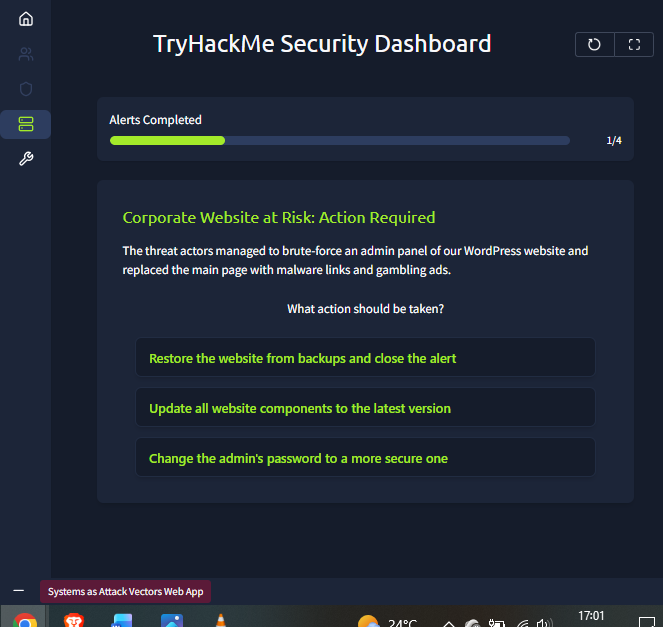

Correct — mitigating the breached credentials was the priority, followed by restoring the defaced pages and checking for backdoors left behind.

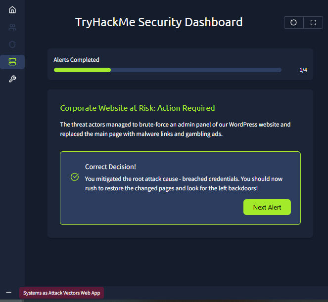

**Alert 3 — Threat Intelligence: Cisco firewall**
A neighboring company was hit by ransomware via an exploited, outdated Cisco firewall, and shared the warning to audit similar devices. My verdict: **ensure all corporate firewalls are patched and have no known CVEs** — a proactive audit rather than an overreaction like disabling firewalls entirely.

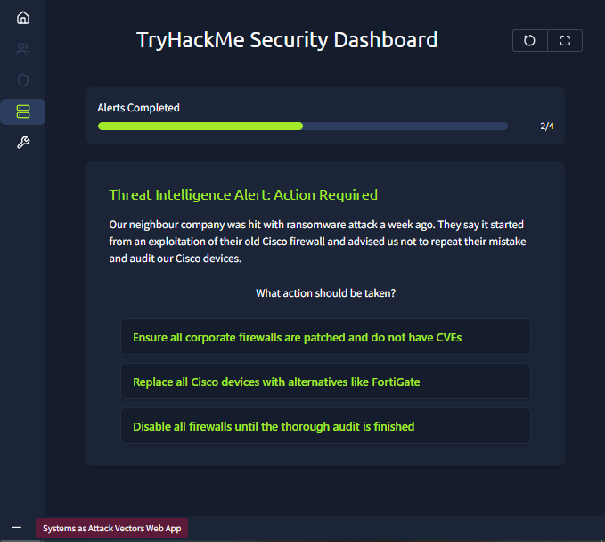

Correct — an outdated firewall was found in the London office and patched before it could be exploited.

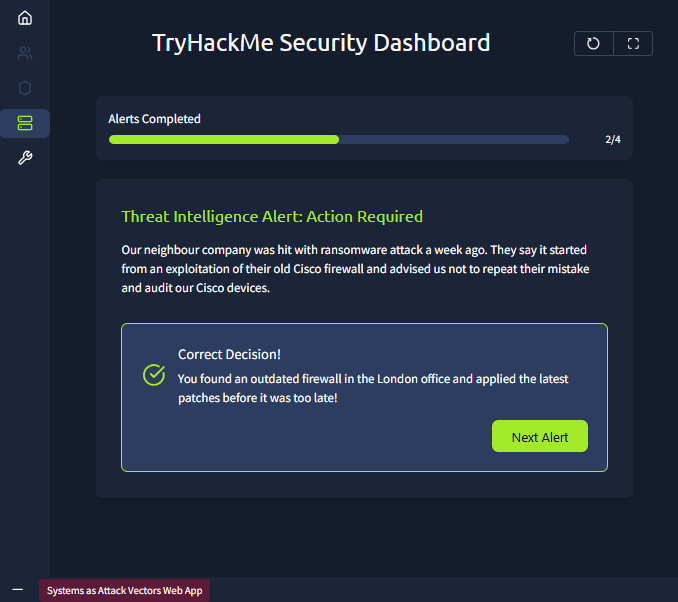

**Alert 4 — LPT-01518 (Designer's laptop)**
A trusted 3D design application suddenly began running malicious CMD commands right after a routine update. My verdict: **investigate a supply chain attack coming with the update**, rather than blaming the user or assuming a standalone app vulnerability.

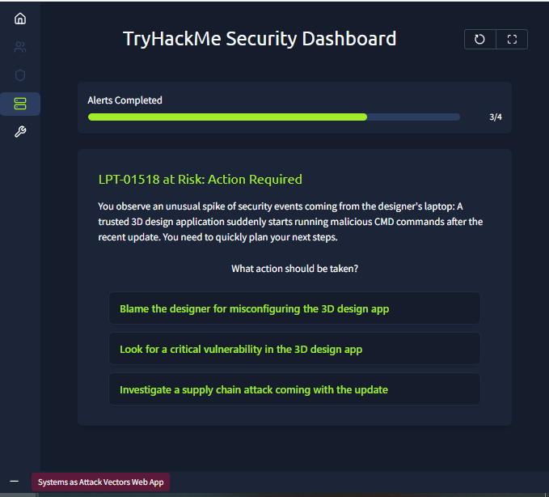

Correct — when a trusted app suddenly behaves maliciously right after an update, that's the signature of a supply chain attack.

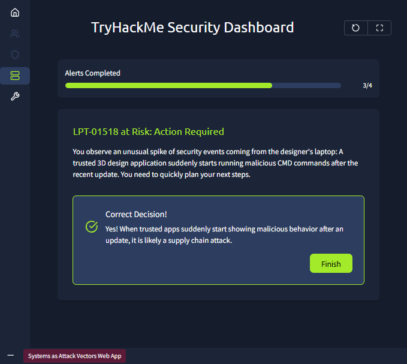

**Systems at Risk completed**

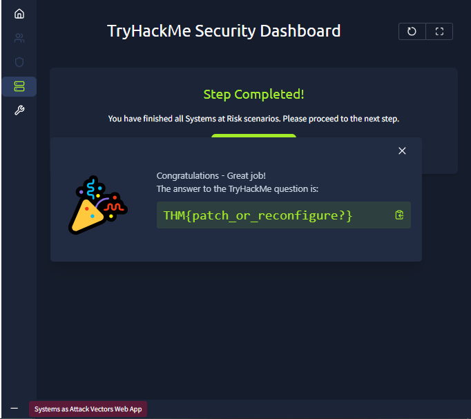

### Part 2: Remediation Plan

Selected the four strongest hardening measures: **Security Training for IT**, **Patch Management Policy**, **Antivirus Protection**, and **Secure Password Policy** — over the alternative option of Website Restrictions, since blocking public access to the company website wasn't a proportionate fix for the underlying issues seen in the alerts.

All four were approved with positive feedback.

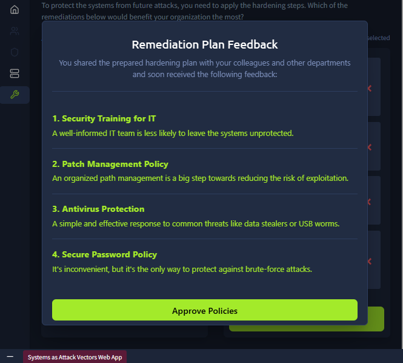

Remediation Plan submitted.

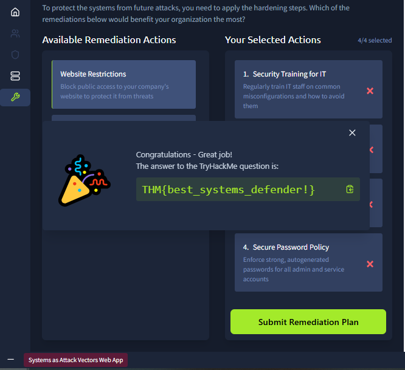

---

## 🔍 Key Findings

- **Flag 1 (Systems at Risk):** `THM{patch_or_reconfigure?}`
- **Flag 2 (Remediation Plan):** `THM{best_systems_defender!}`
- All four alerts mapped directly to the room's three attack categories: a **known CVE** (Exchange server), a **misconfiguration/weak credential** (WordPress brute-force), an **unpatched legacy device** (Cisco firewall, tied to vulnerability management), and a **supply chain attack** (3D design app update).
- In every case, the correct response addressed the **root cause** first (patch, password change, firewall update, supply chain investigation) rather than a surface-level fix like restoring a site or blaming a user — root-cause remediation was a consistent pattern across the whole room.

---

## 💡 Lessons Learned

- The value of a breached system scales with what it controls — a single laptop is bad, a mail server or firewall is much worse. This reframes prioritization during incident response: not every alert deserves equal urgency.
- Supply chain attacks are uniquely hard to defend against because you can't fully control every library or app your organization depends on. Recognizing the *pattern* — a trusted app suddenly acting maliciously right after an update — is often the only early warning.
- Misconfigurations and vulnerabilities require different mitigations: a CVE needs a **patch**, but a misconfiguration needs a **better setup** — there's no vendor patch for a weak password policy or an overly permissive access rule.
- Root-cause thinking beat reactive thinking in every alert this room threw at me. Restoring a defaced website or resetting passwords blindly would have left the actual entry point open for attackers to walk right back in.
- Systems and humans aren't separate battles — the room explicitly ties this back to Day 3: attackers don't care whether the easiest way in is a person or a machine, so Mitigation and Detection need to cover both equally.
