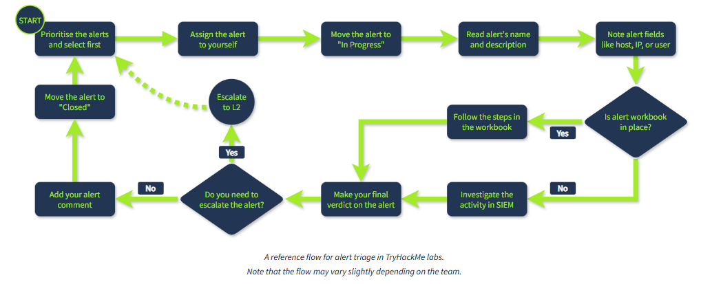

# Day 5: SOC L1 Alert Triage

**Path:** SOC Level 1
**Platform:** TryHackMe
**Status:** ⚠️ Completed (theory only — hands-on lab not captured)

> **Note:** I wasn't able to locate/access the lab machine for this room again, so no lab screenshots were captured this time. This write-up covers the room's core theory and reference material honestly, without fabricating lab steps I didn't perform.

---

## 📌 Overview

This room covers the full **lifecycle of an alert** — from a raw system event to a properly closed, triaged alert — and is foundational to everything an L1 analyst does day to day.

Key concepts covered:
- **From Events to Alerts:** An event occurs (login, process launch, file download) → gets logged by the source system → logs ship to a security solution (SIEM/EDR) → the solution generates an **alert** only for suspicious or anomalous activity, sparing analysts from manually reviewing millions of raw logs.
- **Alert Management Platforms:** SIEM (Splunk ES, Elastic) for most SOC teams; EDR/NDR (MS Defender, CrowdStrike) which have their own dashboards but are usually paired with SIEM/SOAR; SOAR (Splunk SOAR, Cortex SOAR) for aggregating alerts across bigger teams; and ITSM/ticketing tools (Jira, TheHive) for custom setups.
- **L1's role in the bigger triage picture:** L1 analysts review and separate real threats from noise, escalating to L2 when needed. L2 does the deeper analysis, engineers ensure alerts carry enough context, and the SOC manager tracks the speed and quality of triage overall.
- **Alert Properties (8 total):** Alert Time, Alert Name, Alert Severity (🟢 Low → 🔴 Critical), Alert Status (🆕 New → 🔄 In Progress → ✅ Closed), Alert Verdict (True Positive vs. False Positive), Alert Assignee, Alert Description, and Alert Fields (the specific values — hostname, IP, command line, etc. — that triggered the alert).
- **Alert Prioritisation:** the standard approach is (1) filter out alerts already claimed by other analysts, (2) sort by severity (critical → low), (3) sort by time (oldest first, since an older breach likely means the attacker has had more time to act).
- **The Alert Triage lifecycle** itself: Initial Actions (assign to yourself, move to "In Progress", read the alert's name/description/fields) → Investigation (use a workbook/playbook if available, or fall back to identifying the affected asset, the action taken, surrounding events, and threat intel lookups) → Final Actions (decide True Positive or False Positive, write a comment explaining your reasoning, escalate to L2 if needed, then close the alert).

---

## 🛠️ Tools Used

- No hands-on lab environment this time (see note above) — this room is primarily conceptual, covering SIEM/EDR/SOAR/ITSM platforms at a reference level rather than requiring direct tool use.

---

## 🪜 Steps Followed

Since the lab machine wasn't accessible, I wasn't able to complete the hands-on alert triage exercise for this room. Instead, I worked through the room's reference material and built the flowchart below to internalize the triage process end-to-end, since this loop (assign → investigate → verdict → escalate or close) is the backbone of every alert-based room going forward.

---

## 🔍 Key Findings

- The triage loop has three clear phases: **Initial Actions** (ownership + context), **Investigation** (SIEM analysis, workbook-guided if available), and **Final Actions** (verdict, comment, escalate-or-close).
- Alert prioritisation isn't just "highest severity first" — it's **filter → severity → time**, in that order. Skipping the filter step risks duplicating a teammate's work; skipping the time-based tiebreaker risks leaving an older, more-progressed breach unattended while chasing a newer one.
- The distinction between **True Positive** and **False Positive** as the core verdict types is the single most important judgment call in the entire triage process — everything before it is gathering the context to make that call correctly.

---

## 💡 Lessons Learned

- Even without lab access, this room's theory is dense enough to be worth documenting properly — the alert lifecycle and prioritisation logic will apply to nearly every future room in this path, so it was worth slowing down here rather than skipping ahead.
- I want to be upfront in my own documentation when I couldn't complete the hands-on portion, rather than reconstructing steps I didn't actually perform. Being accurate about what I did and didn't do matters as much for my portfolio's credibility as the technical content itself.
- Next time I hit a "lab machine not found" issue, my plan is to try restarting the room from TryHackMe's room page directly, or reach out on the TryHackMe Discord/support if it persists, rather than losing the practical rep entirely.

