# Day 6: SOC L1 Alert Reporting

**Path:** SOC Level 1
**Platform:** TryHackMe
**Status:** ✅ Completed

---

## 📌 Overview

Following on from Day 5's alert triage lifecycle, this room covers what happens **after** a verdict is reached: **reporting, escalation, and communication**.

Key concepts covered:
- **Alert Reporting:** before closing an alert or handing it to L2, especially for True Positives, the analyst documents the investigation in enough detail that someone else could pick it up cold. Reports matter because (1) they give L2 the context needed to act fast, (2) raw SIEM logs are only kept 3–12 months while alerts are kept indefinitely — so the report *is* the long-term record, and (3) writing a clear report is itself a way to sharpen investigation skills ("if you can't explain it simply, you don't understand it well enough").
- **Report Format — the Five Ws:** every good report answers **Who** (user/account involved), **What** (the action or event sequence), **When** (start/end of the activity), **Where** (device, IP, or site), and **Why** (the reasoning behind the final verdict — the most important W).
- **Escalation Guide:** escalate to L2 when the alert indicates a major attack needing deeper investigation, when remediation (malware removal, host isolation, password reset) is required, when cross-department/external communication is needed, or simply when the analyst doesn't fully understand the alert.
- **Escalation Steps:** move the alert to In Progress → investigate and write the report → set a verdict → reassign to the on-shift L2 (and ping them directly if urgent).
- **SOC Communication / Crisis Cases:** e.g. if L2 is unreachable for 30 minutes on a critical alert, escalate up the chain (L2 → L3 → manager); never validate a compromised chat account *through that same chat* — use an alternate channel; if overwhelmed with alerts, keep following the prioritisation workflow but flag the volume to L2; if a past alert turns out misclassified, report it immediately rather than quietly fixing it, since attackers can stay dormant for weeks.

The hands-on portion continues on the **TryHackMe SIEM dashboard**, where I had to investigate two new alerts, write proper Five-Ws reports, and escalate both to the on-shift L2 analyst.

---

## 🛠️ Tools Used

- **TryHackMe SIEM Dashboard** (alert list, alert detail view, Edit Alert modal with an "Authenticity" score for analyst comments)

---

## 🪜 Steps Followed

**1. Reviewed the dashboard's existing alerts**
Five alerts were listed, two still unassigned ("Spike of Domain Discovery Commands" and "Email Marked as Phishing after Delivery") and three already handled by other analysts.

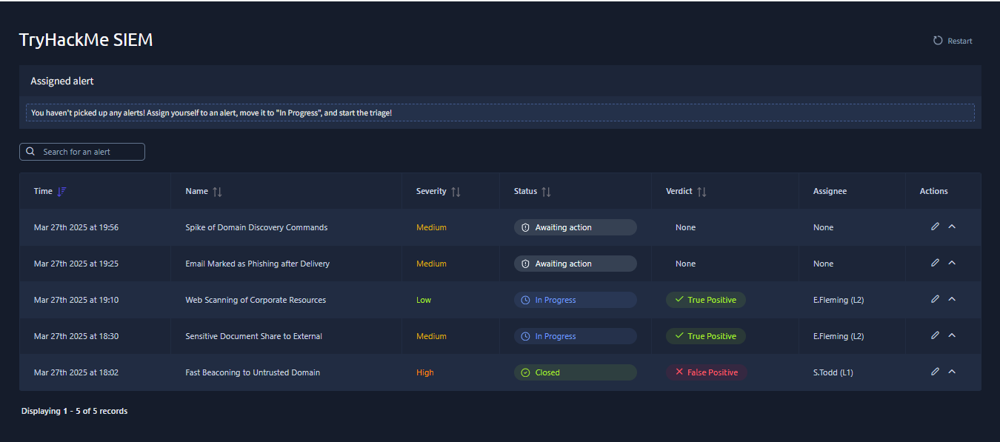

**2. Reviewed a pre-existing alert for context**
Expanded "Sensitive Document Share to External" to see how a properly documented True Positive report looks: HR lead **m.boslan@tryhackme.thm** had shared an "Employee Records (Updated)" spreadsheet to an unidentified external Proton Mail address after being blocked from bulk-downloading the HR folder — already escalated to E.Fleming (L2).

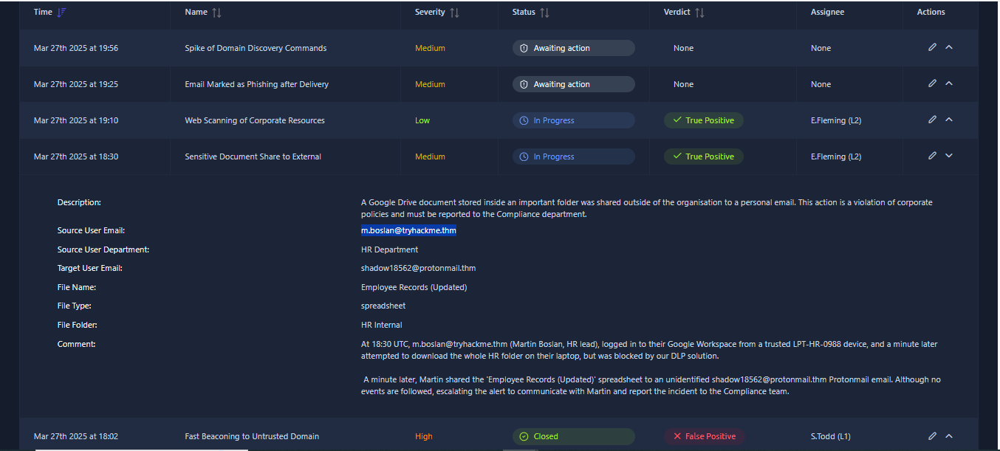

**3. Investigated the phishing alert**
Expanded "Email Marked as Phishing after Delivery": a spoofed email claiming to be from **Microsoft Support (support@microsoft.com)**, sent to Eddie Huffman (IT Manager), with a fake "600% price increase" urgency hook, failed SPF/DKIM checks, and a suspicious `REPORT.rar` attachment.

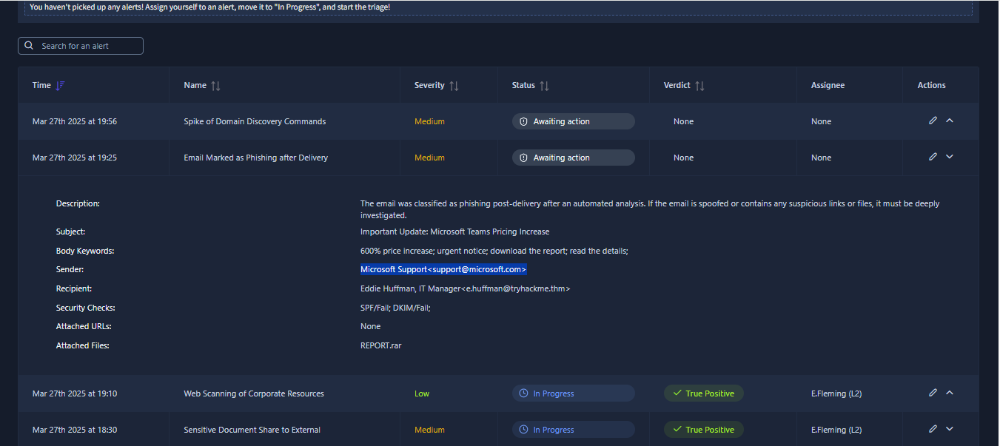

**4. Assigned the alert to myself and moved it to In Progress**

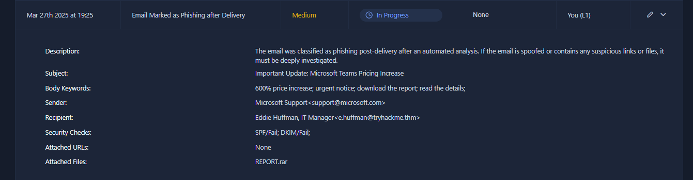

**5. Wrote my first report attempt**
Filled in a short comment and set Severity to Critical / Verdict to True Positive. The dashboard scored it only **66% Authenticity**.

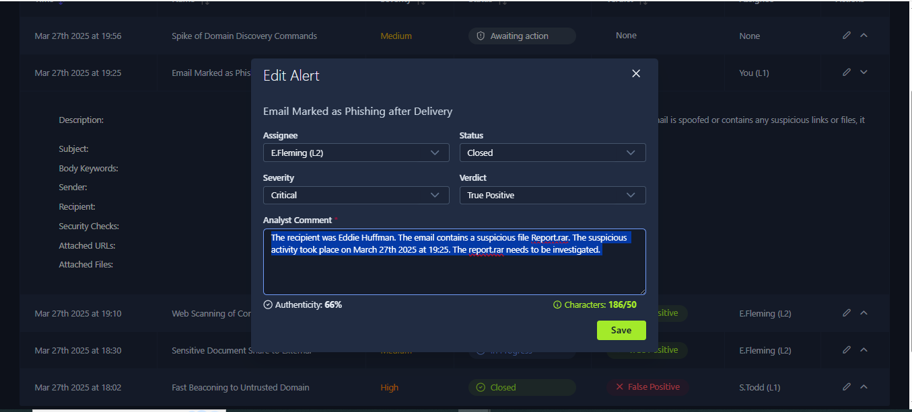

**6. Expanded the report, but still missed the mark**
Added more detail, but the dashboard flagged that the comment **didn't provide enough context according to the 5W approach** — still 66% Authenticity.

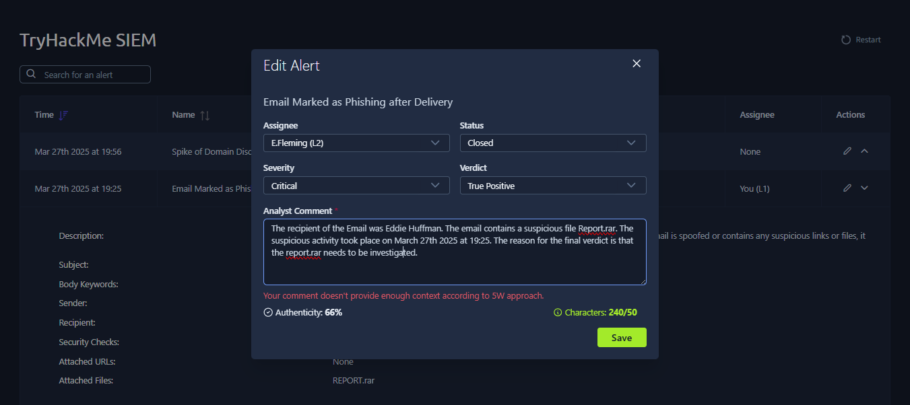

**7. Rewrote the report following the Five Ws properly**
Covering who (Eddie Huffman, sender "Microsoft support"), what (suspicious REPORT.rar attachment needing analysis), when (Mar 27th 2025, 19:25), and why (the file needs to be investigated) brought the report to **100% Authenticity** and returned the first flag.

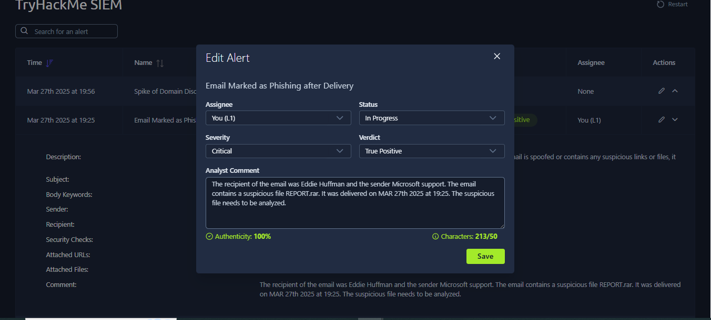

**8. Escalated the phishing alert to L2**
Reassigned the alert to **E.Fleming (L2)**, kept it In Progress with a concise Five-Ws summary, and saved — earning the escalation flag.

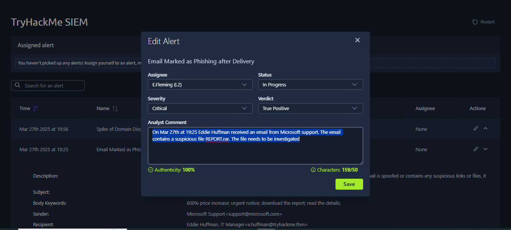

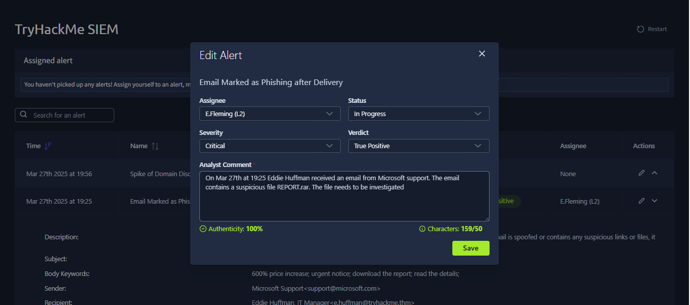

**9. Investigated the second alert: Spike of Domain Discovery Commands**
Reviewed the alert details — commands like `whoami`, `net group "Domain Admins"`, and `nltest` run on host **DMZ-MSEXCHANGE-2013** (Windows Server 2012 R2), under `NT AUTHORITY\SYSTEM`, with a suspicious process chain: `w3wp.exe` → `revshell.exe` → `cmd.exe`.

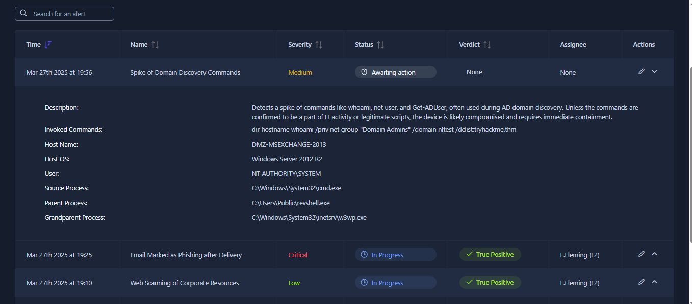

**10. Opened the report form (initially empty)**

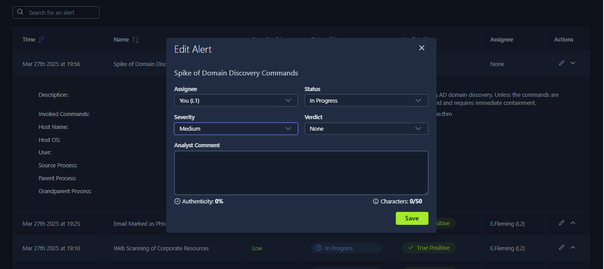

**11. Wrote a complete Five-Ws report and escalated**
Documented who/what/when/where clearly, reaching 100% Authenticity, then escalated according to the workflow — earning the final flag.

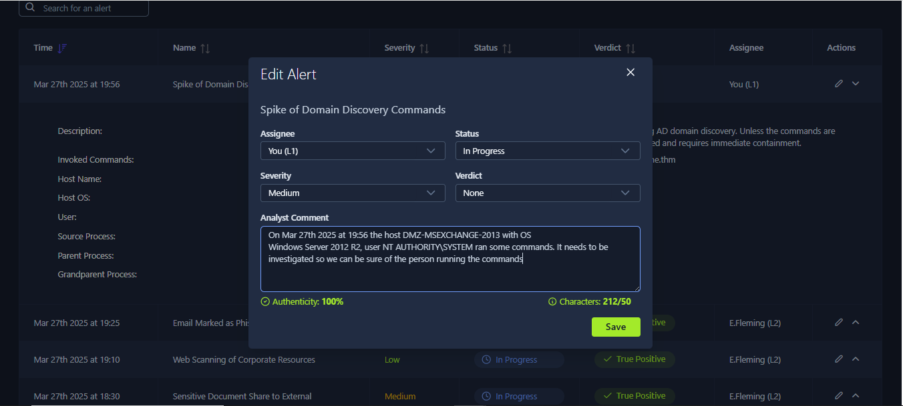

**12. Confirmed all alerts were properly triaged**
Final dashboard view: all 5 alerts now show a verdict, with both new alerts escalated to E.Fleming (L2).

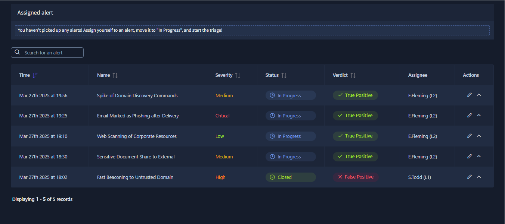

---

## 🔍 Key Findings

- Email leak source (pre-existing alert): **m.boslan@tryhackme.thm**
- Phishing sender: **support@microsoft.com** (spoofed, failed SPF/DKIM)
- **Flag 1 (Phishing report):** `THM{nice_attempt_faking_microsoft_support}`
- **Flag 2 (Phishing escalation):** `THM{good_job_escalating_your_first_alert}`
- **Flag 3 (Domain Discovery escalation):** `THM{looks_like_webshell_via_old_exchange}`
- The process chain on the domain discovery alert (`w3wp.exe` → `revshell.exe` → `cmd.exe`) strongly suggests a **web shell** planted on the Exchange server — `w3wp.exe` is the IIS worker process, so a reverse shell spawning from it points to a compromised web application (fitting Day 4's Exchange CVE theme).
- The dashboard's **Authenticity score** directly measures how well a report follows the Five Ws — vague or short comments (66%) get flagged even with a technically correct verdict, while a complete who/what/when/where/why writeup hits 100%.

---

## 💡 Lessons Learned

- A correct verdict isn't the finish line — **how** it's documented determines whether the next analyst can act on it without redoing the investigation from scratch. This directly maps to how I want to write my own TryHackMe lab write-ups: overview, steps, findings, lessons, not just "I got the flag."
- The Five Ws (Who, What, When, Where, Why) is a genuinely reusable structure — I can see myself using it as a checklist before closing or escalating any future alert-style room.
- The "Authenticity" scoring on this dashboard made an abstract standard ("write a good report") into something I could see fail and fix in real time — my first two attempts both technically had the right verdict but were still marked incomplete until they told the full story.
- Escalation isn't a sign of weakness — it's a defined, expected part of the L1 role. Recognizing *when* to escalate (major attack indicators, required remediation, cross-team communication, or genuine uncertainty) is as much a skill as the investigation itself.
- The process-chain detail here (`w3wp.exe → revshell.exe → cmd.exe`) is a good reminder to always look at parent/grandparent processes, not just the immediate command — the grandparent process is often what reveals *how* an attacker actually got in.
