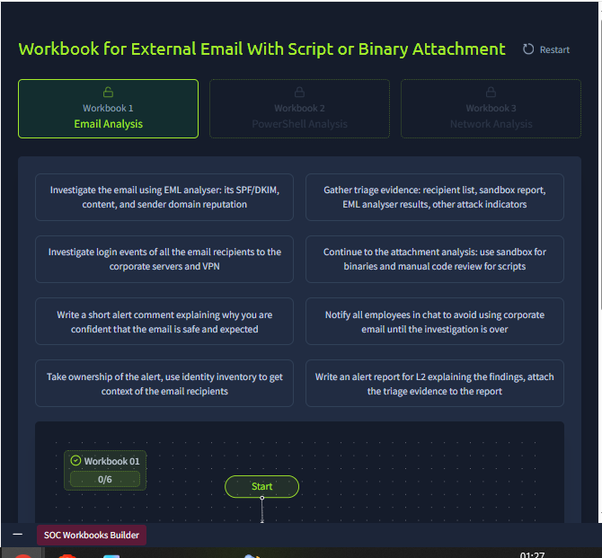
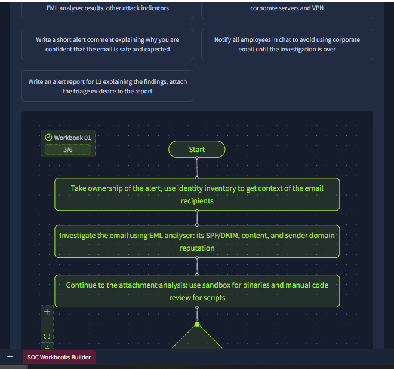
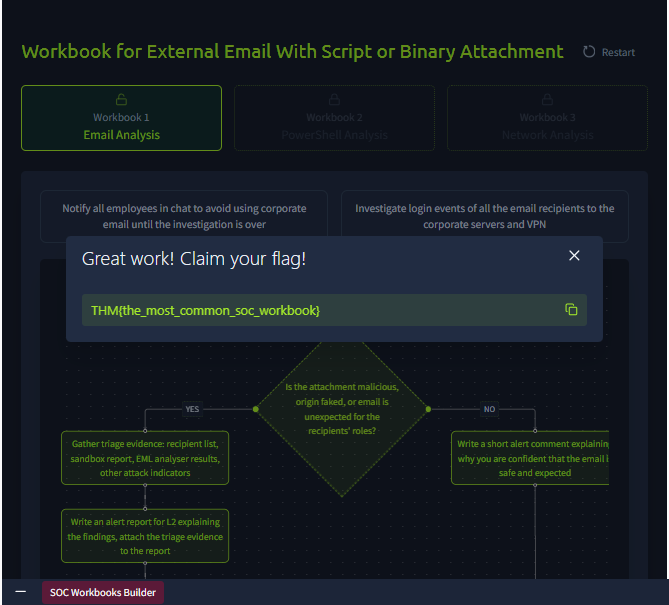
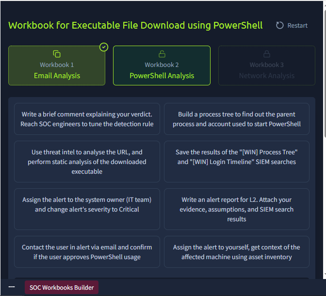
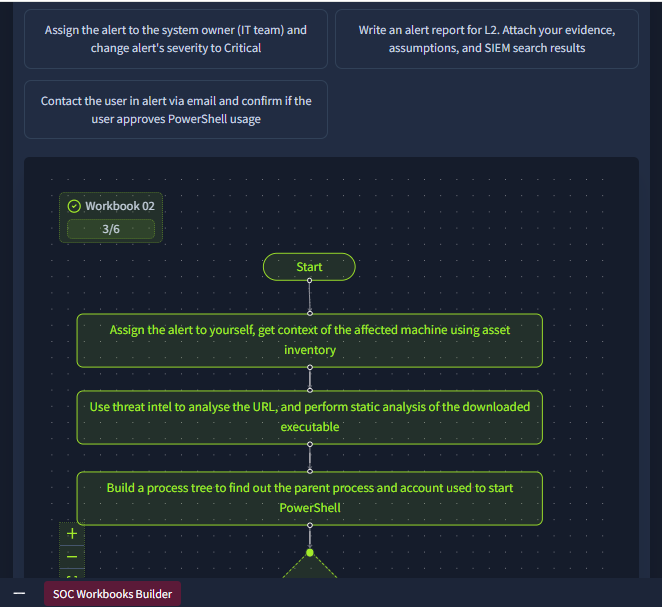
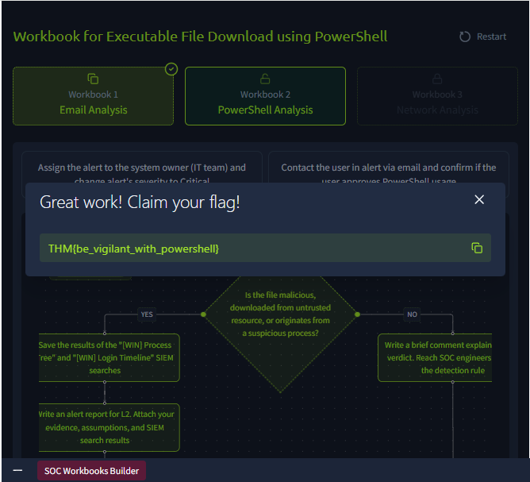
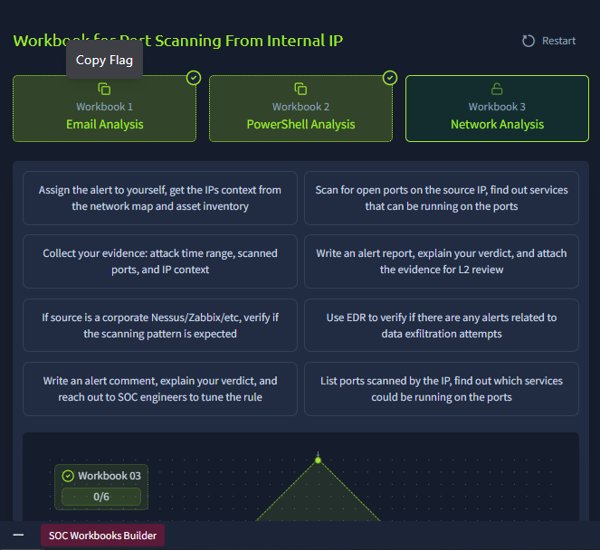
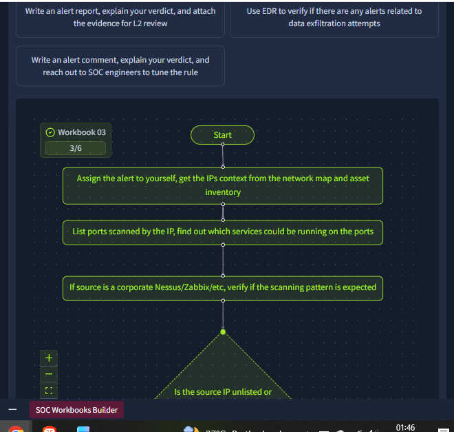
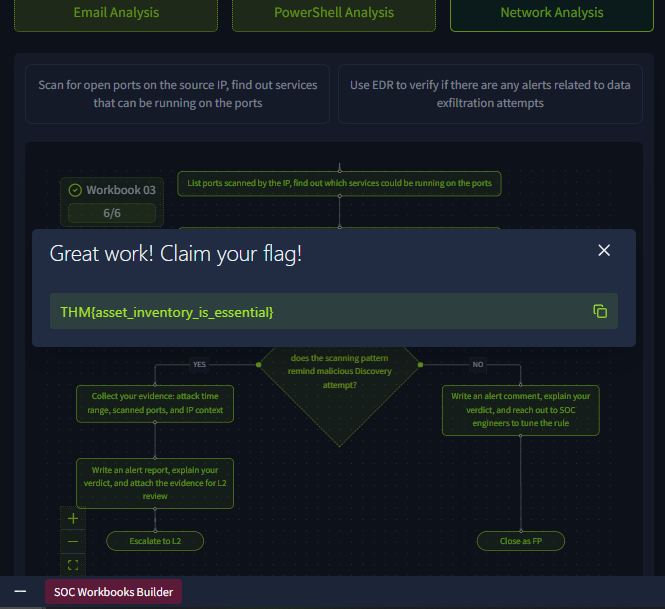

# Day 7: SOC Workbooks and Lookups

**Path:** SOC Level 1
**Platform:** TryHackMe
**Status:** ✅ Completed

---

## 📌 Overview

This room covers the reference sources and structured processes L1 analysts lean on to get context fast during triage — and how to turn that context-gathering into a repeatable, mistake-resistant workflow.

Key concepts covered:
- **Identity Inventory:** a catalogue of employee and service accounts with role, location, and access details (e.g. knowing G.Baker is a CFO with HQ/FINANCE access explains why he'd be touching financial records). Sourced from Active Directory/Entra ID, SSO providers (Okta, Google Workspace), HR systems (BambooHR, SAP), or custom spreadsheets.
- **Asset Inventory:** the equivalent catalogue for servers and workstations — hostname, location, IP, OS, owner, and purpose — so an alert on "HQ-FINFS-02" immediately resolves to "UK Datacenter file server for financial records, owned by Central IT." Sourced from AD, SIEM/EDR agents, MDM solutions (Intune, Jamf), or custom sheets.
- **Network Diagrams:** visual maps of subnets and their connections, used to reconstruct attack paths from raw IP/port data — e.g. tracing a VPN brute force → successful login → blocked Database Subnet scan → pivot to the Office Subnet.
- **SOC Workbooks** (aka playbooks/runbooks): structured, senior-analyst-prepared step sequences that guide L1s through investigating a specific alert type consistently, split into three phases: **Enrichment** (pull identity/threat intel context) → **Investigation** (form a verdict from SIEM logs) → **Escalation** (hand off to L2 or contact the user if needed).

The hands-on portion is on the **SOC Workbooks Builder** site, where I had to drag-and-drop the correct steps into place, in the correct order, across three separate workbooks: **Email Analysis**, **PowerShell Analysis**, and **Network Analysis**.

---

## 🛠️ Tools Used

- **SOC Workbooks Builder** (interactive drag-and-drop flowchart builder simulating real workbook construction)

---

## 🪜 Steps Followed

### Workbook 1: External Email With Script or Binary Attachment

Started with six unordered step options and built the flow from scratch.

Assembled the first half of the flow: **take ownership of the alert → investigate the email using EML analyser (SPF/DKIM, content, sender domain) → continue to attachment analysis (sandbox for binaries, manual code review for scripts)**.

Completed the decision branch: if the attachment is malicious/faked/unexpected → gather triage evidence and write an alert report for L2; if not → write a short comment confirming the email is safe and expected.

### Workbook 2: Executable File Download using PowerShell

Reviewed the six options for this workbook.

Built the first half: **assign the alert to yourself (asset inventory for machine context) → use threat intel on the URL + static analysis of the downloaded executable → build a process tree to find the parent process and account that started PowerShell**.

Completed the decision branch: if the file is malicious/from an untrusted source/from a suspicious process → save the Process Tree and Login Timeline SIEM search results, then write an alert report for L2 with evidence and assumptions attached; if not → write a brief comment explaining the verdict and loop in SOC engineers to tune the detection rule.

### Workbook 3: Port Scanning From Internal IP

Reviewed the six options for this final workbook.

Built the first half: **assign the alert to yourself (get IP context from network map + asset inventory) → list ports scanned by the IP to find out what services could be running → check if the source is a corporate scanner (Nessus/Zabbix/etc.) and whether the scanning pattern is expected**.

Completed the decision branch: if the scanning pattern resembles a malicious Discovery attempt → collect evidence (attack time range, scanned ports, IP context), write an alert report for L2, and escalate; if not → write an alert comment explaining the verdict, reach out to SOC engineers to tune the rule, and close as a False Positive.

---

## 🔍 Key Findings

- **Flag 1 (Email Analysis Workbook):** `THM{the_most_common_soc_workbook}`
- **Flag 2 (PowerShell Analysis Workbook):** `THM{be_vigilant_with_powershell}`
- **Flag 3 (Network Analysis Workbook):** `THM{asset_inventory_is_essential}`
- All three workbooks follow the same three-phase skeleton from the room's theory — **Enrichment → Investigation → Escalation** — just with different context sources and decision criteria per alert type (sender/attachment reputation for email, process lineage for PowerShell, scan pattern legitimacy for network).
- Every workbook's final decision point is a binary branch (malicious/expected vs. safe/expected), and every "malicious" branch ends the same way: **gather evidence → write a report for L2**, matching directly with Day 6's Five-Ws reporting standard.

---

## 💡 Lessons Learned

- Workbooks exist specifically because L1 analysts (myself included, at this stage) aren't expected to reliably improvise a full investigation from scratch every time — having a pre-built, senior-reviewed decision tree removes guesswork and keeps triage consistent across different analysts and shifts.
- Identity inventory, asset inventory, and network diagrams aren't separate tools I'll only use occasionally — they're the *inputs* that make a workbook's steps actually answerable. A workbook step like "get context of the affected machine using asset inventory" is meaningless without knowing where that inventory lives and how to query it.
- Building all three workbooks back-to-back made the shared structure click: no matter the alert type (email, PowerShell, network), the shape is always assign → enrich → investigate → decide → (report + escalate) or (comment + close). That's a mental template I can now apply even to alert types this room didn't cover.
- The room's opening scenario (G.Baker downloading a financial report and sharing it with R.Lund) is a good reminder that identity inventory alone can flip a verdict — the same action looks completely different depending on whether the people involved have a legitimate reason to be touching that data.

