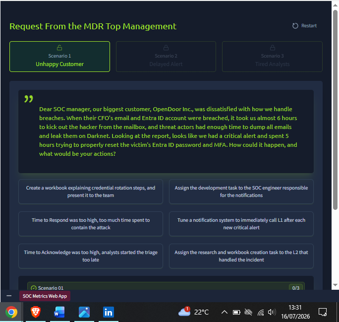
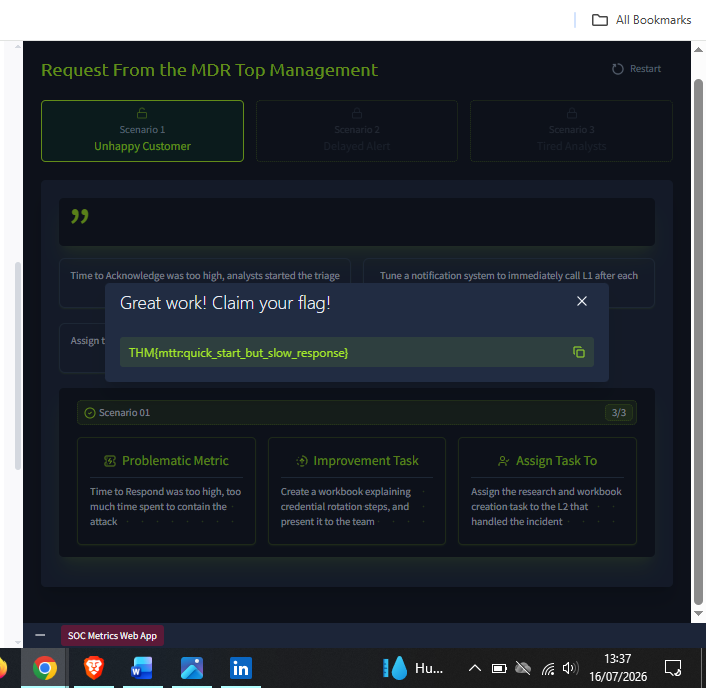
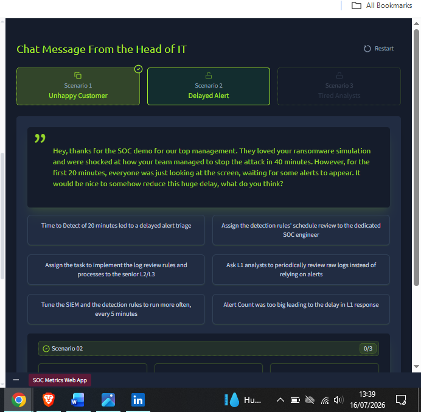
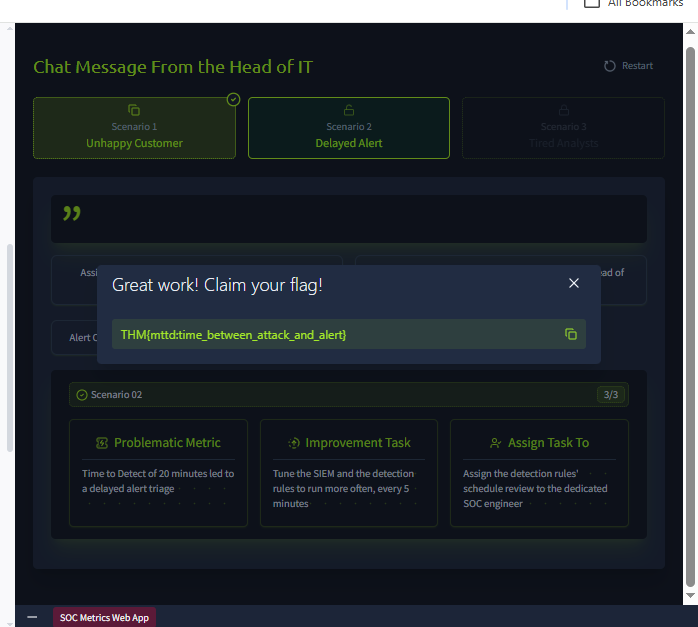
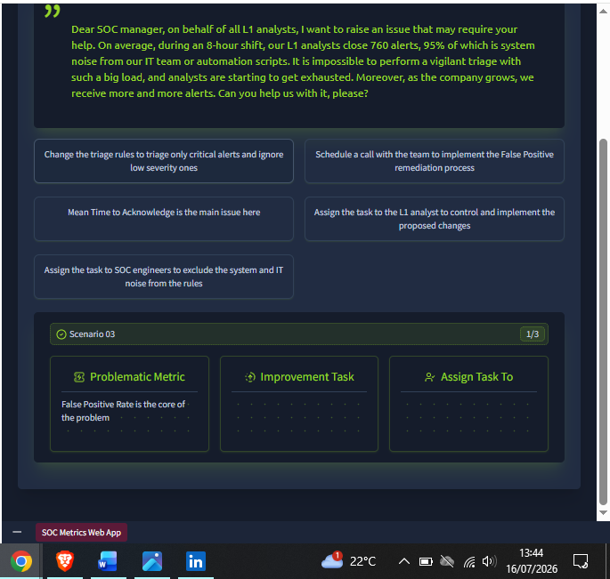
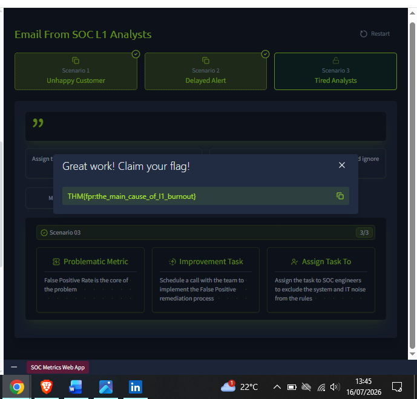

# Day 8: SOC Metrics and Objectives
 
**Path:** SOC Level 1
**Platform:** TryHackMe
**Status:** ✅ Completed
 
---
 
## 📌 Overview
 
This room shifts perspective from doing triage to **measuring** how well a SOC team triages — the metrics that determine whether a team is actually protecting the company, and that determine an L1 analyst's own career growth.
 
Key concepts covered:
- **Four core alert metrics:**
  | Metric | Formula | Measures |
  |---|---|---|
  | Alerts Count (AC) | Total alerts received | Overall SOC load |
  | False Positive Rate (FPR) | False Positives ÷ Total Alerts | Noise level in alerts |
  | Alert Escalation Rate (AER) | Escalated Alerts ÷ Total Alerts | L1 analyst experience/independence |
  | Threat Detection Rate (TDR) | Detected Threats ÷ Total Threats | Reliability of the SOC team |
- **Healthy targets:** ~5–30 alerts per day per L1 analyst is a good load; FPR should be nowhere near 80%+ (that signals a serious noise problem needing "False Positive Remediation"); AER should ideally stay below 20–50%; TDR should always be **100%** — a missed threat can mean ransomware or data exfiltration, so there's no acceptable margin here.
- **Triage/SLA metrics — MTTD, MTTA, MTTR:** grouped under a **Service Level Agreement (SLA)**, the contract between a SOC team and its company (or an MSSP and its customers). Common SLA targets: **MTTD** (Mean Time to Detect) ~5 minutes, **MTTA** (Mean Time to Acknowledge) ~10 minutes, **MTTR** (Mean Time to Respond/contain) ~60 minutes.
- **Diagnosing and fixing problem metrics:** FPR over 80% → exclude trusted/system activity from detection rules, or automate common alert triage via SOAR; MTTD over 30 min → speed up detection rules, check for SIEM log ingestion delay; MTTA over 30 min → ensure real-time analyst notification and even alert distribution across the shift; MTTR over 4 hours → escalate faster to L2, and make sure attack-scenario response steps are documented in advance.
The hands-on portion puts me in the shoes of a **SOC manager** on the SOC Metrics Web App, responding to three real complaints by correctly diagnosing the problematic metric, choosing the right improvement task, and assigning it to the right person/team.
 
---
 
## 🛠️ Tools Used
 
- **SOC Metrics Web App** (scenario-based simulation: diagnose metric → pick improvement task → assign task owner)
---
 
## 🪜 Steps Followed
 
### Scenario 1: Unhappy Customer
 
MDR top management reported that when a customer's CFO had their email and Entra ID account breached, it took **~6 hours** to kick the attacker out of the mailbox — despite triage starting reasonably (an analyst caught the critical alert), the actual containment (password/MFA reset) dragged on for 5 hours.
 

 
My diagnosis: **Time to Respond was too high — too much time was spent containing the attack** (not a detection or acknowledgement problem, since the alert was caught quickly). Improvement task: **create a workbook explaining credential rotation steps and present it to the team**. Assigned to: **the L2 analyst who handled the incident**, tasked with the research and workbook creation.
 

 
### Scenario 2: Delayed Alert
 
The Head of IT noted that during a ransomware demo, the team stopped the attack in 40 minutes total — but the first **20 minutes** were spent just waiting for alerts to appear at all.
 

 
My diagnosis: **Time to Detect of 20 minutes led to a delayed alert triage** (this is a detection-speed problem, not an acknowledgement or response problem). Improvement task: **tune the SIEM and detection rules to run more often, every 5 minutes**. Assigned to: **the dedicated SOC engineer** responsible for the detection rules' schedule review.
 

 
### Scenario 3: Tired Analysts
 
L1 analysts raised that during an 8-hour shift they close **760 alerts**, **95% of which are system noise** from IT or automation scripts — making vigilant triage nearly impossible, especially as alert volume keeps growing with the company.
 

 
My diagnosis: **False Positive Rate is the core of the problem** — a 95% FPR is a textbook noise crisis. Improvement task: **schedule a call with the team to implement the False Positive remediation process**. Assigned to: **SOC engineers, to exclude system/IT noise from the detection rules**.
 

 
---
 
## 🔍 Key Findings
 
- **Flag 1 (Scenario 1 — Unhappy Customer):** `THM{mttr:quick_start_but_slow_response}`
- **Flag 2 (Scenario 2 — Delayed Alert):** `THM{mttd:time_between_attack_and_alert}`
- **Flag 3 (Scenario 3 — Tired Analysts):** `THM{fpr:the_main_cause_of_l1_burnout}`
- Each scenario mapped to a distinct metric failure: **MTTR** (fast start, slow containment), **MTTD** (slow initial detection), and **FPR** (alert noise burning out L1 analysts) — reinforcing that "something's wrong with the SOC" always needs a specific metric diagnosis before a fix can be assigned correctly.
- The fix for each metric targets a different role: an **L2 analyst** builds the credential-rotation workbook (Scenario 1, closer to Investigation/Escalation expertise), a **SOC engineer** tunes detection rule scheduling (Scenario 2) and excludes system noise (Scenario 3) — reinforcing Day 2's lesson that different SOC roles own different problems.
---
 
## 💡 Lessons Learned
 
- Metrics aren't just a management scorecard — they're diagnostic tools. "Something took too long" needs to be broken into *which* phase was slow (detection, acknowledgement, or response) before anyone can actually fix it.
- The 95%-False-Positive scenario hit close to home as a preview of a real burnout risk in this career path — noisy alerts don't just waste time, they actively erode an analyst's vigilance over time, making it more likely a real threat gets waved through as "probably nothing."
- Every fix assigned in this room routed to a specific role, not just "the SOC team" generically — a useful reminder that as an L1, my job isn't to fix every systemic problem myself, but to recognize which metric is broken and escalate the *fix* to whoever owns that lever (engineer for tuning, L2 for deeper workbook/process work).
- Threat Detection Rate having a target of literally 100% (versus "healthy ranges" for the other metrics) stood out — it's the one metric where "good enough" isn't good enough, since a single missed threat can be catastrophic regardless of how well every other metric looks.
- I noticed I'd accidentally captured a duplicate screenshot for Scenario 1's flag — worth double-checking screenshot counts against the number of distinct dashboard states before wrapping up a day's documentation.
