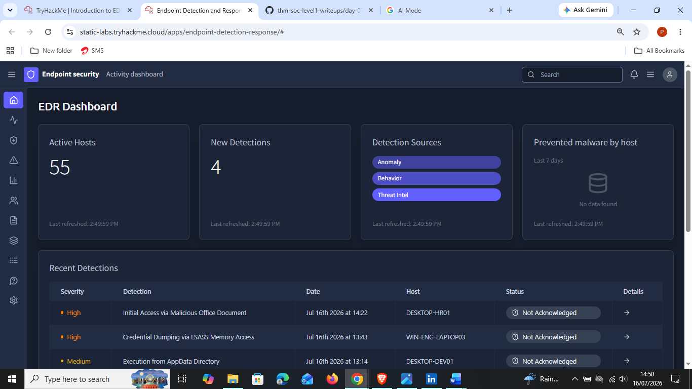
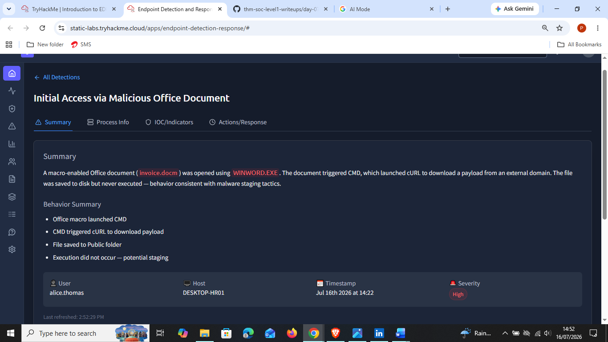
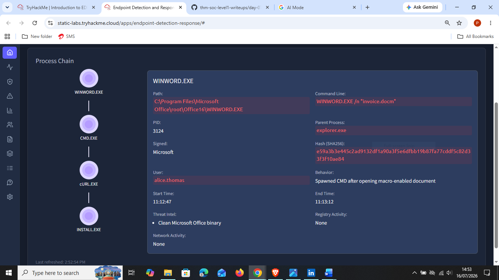
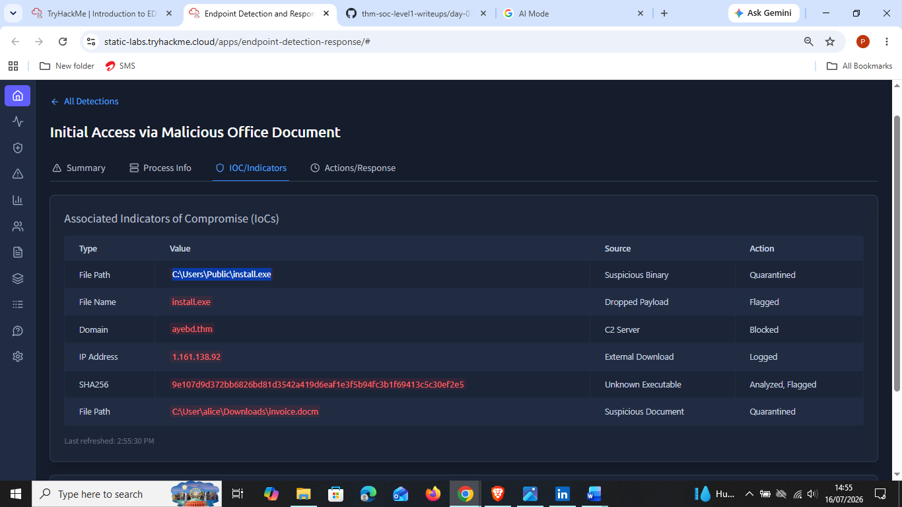
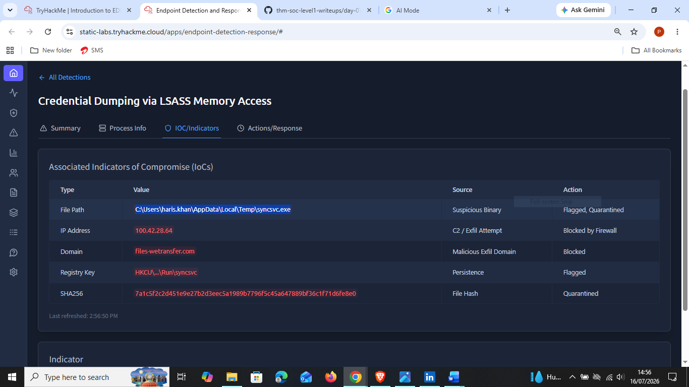
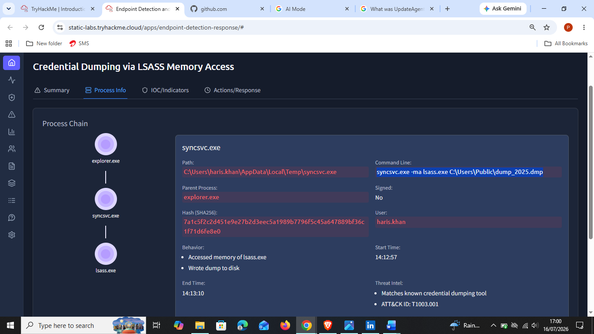

# Day 9: Introduction to EDR

**Path:** SOC Level 1
**Platform:** TryHackMe
**Status:** ✅ Completed

---

## 📌 Overview

This room introduces **Endpoint Detection and Response (EDR)** — a security solution that goes far beyond traditional antivirus by continuously monitoring, detecting, and enabling response to advanced threats at the endpoint level, regardless of whether that endpoint sits inside or outside the corporate network perimeter.

Key concepts covered:
- **The three pillars of EDR:** **Visibility** (deep telemetry — process, registry, file/folder, and user activity, presented as a full process tree with historical data for threat hunting), **Detection** (signature- and behavior-based, plus anomaly detection, fileless malware detection, and custom IOC matching), and **Response** (isolate a host, terminate a process, quarantine a file, or connect remotely — all from the same console).
- **EDR vs. Antivirus (the airport analogy):** AV is like an immigration checkpoint — it checks incoming "passports" (file signatures) against a known-criminal list and blocks matches, but lets anyone unknown walk straight through. EDR is like security officers patrolling *inside* the airport with CCTV and motion sensors — even if a threat gets past the initial check, EDR keeps watching behavior (loitering near restricted areas, suspicious actions, unattended bags) and can act or alert regardless of whether the "person" was previously known as a threat.
- **A worked attack chain (phishing macro → PowerShell → svchost.exe injection → C2 access)** where AV does nothing at almost every stage (no signature match, legitimate parent processes, no memory-injection visibility, no network-level visibility), while EDR logs, flags, and eventually surfaces the *full attack chain* as a single alert.
- **How EDR actually works:** lightweight **agents/sensors** deployed on each endpoint stream detailed telemetry to a centralized **EDR console**, which correlates it using threat intel and machine learning to generate alerts with full context. EDR typically feeds into a broader **SIEM** alongside firewalls, DLP, email security, and IAM.
- **Telemetry collected:** process executions/terminations, network connections, command-line activity, file/folder modifications, and registry modifications — individually mundane, but revealing when correlated.
- **Detection techniques:** Behavioral Detection (e.g. `winword.exe` spawning `powershell.exe` — an unusual parent-child relationship), Anomaly Detection (deviation from an endpoint's learned baseline), IOC Matching (hash/domain/IP matches against threat intel feeds), MITRE ATT&CK Mapping (tagging detections with Tactic/Technique), and Machine Learning (catching multi-stage or fileless attacks where no single step looks malicious alone).
- **Response capabilities:** Isolate Host (stop lateral movement), Terminate Process, Quarantine (move a malicious file somewhere inert, pending review), Remote Access (a live shell into the endpoint, e.g. CrowdStrike's RTR), and Artefact Collection (memory dumps, event logs, folder contents, registry hives) for forensics or legal follow-up.

The hands-on portion put me in the role of a SOC analyst at "TECH THM," triaging real detections inside a simulated EDR console.

---

## 🛠️ Tools Used

- **Simulated EDR Console** (TryHackMe static lab app — Summary / Process Info / IOC-Indicators / Actions-Response tabs per detection)

---

## 🪜 Steps Followed

**1. Reviewed the EDR Dashboard**
55 active hosts, 4 new detections, with sources spanning Anomaly, Behavior, and Threat Intel detections. The Recent Detections table listed two High-severity and one Medium-severity item at a glance.

### Detection 1: Initial Access via Malicious Office Document (DESKTOP-HR01)

**2. Reviewed the Summary tab**
A macro-enabled document (`invoice.docm`) was opened via `WINWORD.EXE` by user **alice.thomas**. The macro triggered CMD, which used cURL to download a payload from an external domain. The file was saved to disk but **never executed** — consistent with malware staging rather than a completed compromise.

**3. Reviewed the Process Info tab**
Traced the full process chain: `WINWORD.EXE` → `CMD.EXE` → `CURL.EXE` → `INSTALL.EXE`. Confirmed `WINWORD.EXE` itself was a clean, Microsoft-signed binary — the malicious behavior was entirely in what it *spawned*, not the binary itself.

**4. Reviewed the IOC/Indicators tab**
Confirmed the dropped payload path, C2 domain, and file hash — all already actioned by the EDR (quarantined, flagged, or blocked).

### Detection 2: Credential Dumping via LSASS Memory Access (WIN-ENG-LAPTOP03)

**5. Reviewed the IOC/Indicators tab**
Found a suspicious binary (`syncsvc.exe`) under user **haris.khan**'s Temp folder, an exfiltration attempt to `files-wetransfer.com`, and a persistence mechanism via a `Run` registry key — all flagged or quarantined by the EDR.

**6. Reviewed the Process Info tab**
Traced the process chain: `explorer.exe` → `syncsvc.exe` → `lsass.exe`, with `syncsvc.exe` running an unsigned binary whose command line (`syncsvc.exe -ma lsass.exe C:\Users\Public\dump_2025.dmp`) directly dumped LSASS memory to disk. Threat Intel confirmed this matched a known credential-dumping tool, mapped to **MITRE ATT&CK T1003.001** (OS Credential Dumping: LSASS Memory).

### Detection 3: Execution from AppData Directory (DESKTOP-DEV01)

I answered the related triage question for this detection directly within the room (see Key Findings below), though I didn't capture a screenshot of this detection's tabs this time.

---

## 🔍 Key Findings

- Tool launched by CMD.exe to download the payload on **DESKTOP-HR01**: **`CURL.exe`**
- Absolute path to the downloaded malware on **DESKTOP-HR01**: **`C:\Users\Public\install.exe`**
- Absolute path to the suspicious `syncsvc.exe` on **WIN-ENG-LAPTOP03**: **`C:\Users\haris.khan\AppData\Local\Temp\syncsvc.exe`**
- Exfiltration attempt URL on **WIN-ENG-LAPTOP03**: `https://files-wetransfer.com/upload/session/ab12cd34ef56/dump_2025.dmp`
- Threat Intel label for `UpdateAgent.exe` on **DESKTOP-DEV01**: **"Known internal IT utility tool"** — a reminder that not every unusual-looking process on a Medium-severity alert turns out to be malicious.
- Both investigated detections followed the same underlying logic from the room's theory: a **legitimate, signed process** (`WINWORD.EXE`, `explorer.exe`) spawning a **suspicious child process** is exactly the "unusual parent-child relationship" behavioral detection the room describes — and both times, the IOC/Indicators tab confirmed the EDR had already auto-contained the threat (quarantine, block, flag) ahead of my manual review.

---

## 💡 Lessons Learned

- The AV-vs-EDR airport analogy stuck with me because it reframes detection as a *timeline* problem, not a single checkpoint decision — AV asks "have I seen this before?" once, while EDR keeps watching *after* that first check passes.
- Process chains are the fastest way to understand an attack at a glance. In both detections, reading the chain top-to-bottom (`WINWORD.EXE → CMD.EXE → CURL.EXE → INSTALL.EXE` and `explorer.exe → syncsvc.exe → lsass.exe`) told the story faster than reading the Summary text alone — I want to make checking Process Info a habit early in any future triage, not a step I get to eventually.
- The Detection 1 case (payload downloaded and saved but **never executed**) is a good reminder that "malicious activity happened" and "compromise succeeded" aren't the same thing — the verdict and urgency should reflect where in the kill chain the attacker actually got to, not just that suspicious files exist on disk.
- Seeing `UpdateAgent.exe` come back as a known internal IT tool (Detection 3) reinforced Day 6 and Day 7's lesson: context sources like Threat Intel and Asset/Identity Inventory can flip a scary-looking alert into a quick False Positive close — triage isn't just about spotting suspicious names, it's about checking them against what's actually expected.
- MITRE ATT&CK mapping (like T1003.001 here) is genuinely useful shorthand — it let me confirm this wasn't just "suspicious," but a specifically known credential-dumping technique, which changes how urgently and confidently I'd escalate it.
