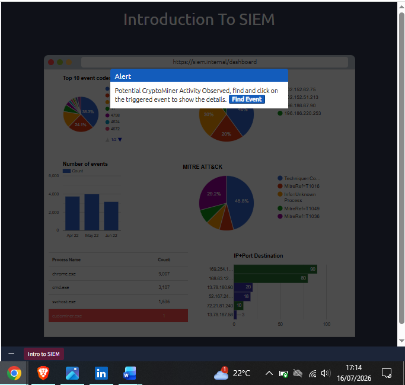
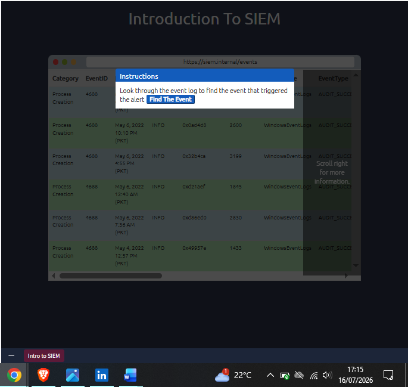
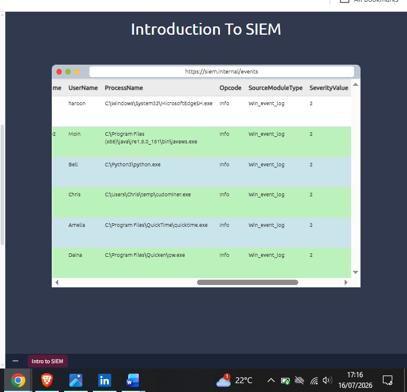
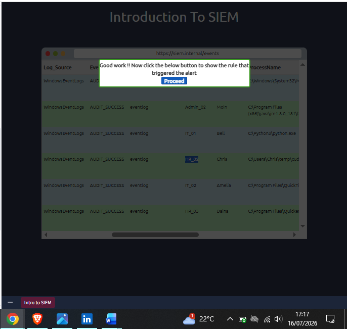
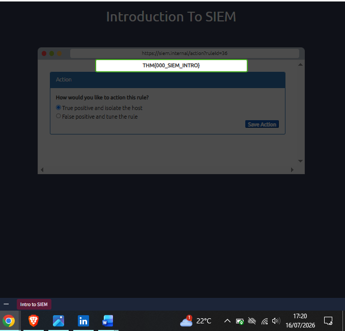

# Day 10: Introduction to SIEM

**Path:** SOC Level 1
**Platform:** TryHackMe
**Status:** ✅ Completed

> **Note:** My screenshots for this room skip from the initial dashboard straight to the event log (file numbering jumps 2→3→4→5→7), so a couple of intermediate states aren't captured below. The narrative still covers every step I actually performed.

---

## 📌 Overview

This room introduces **Security Information and Event Management (SIEM)** — the tool that ties together everything from Days 5–9 (alert triage, reporting, workbooks, metrics, and EDR) by centralizing and correlating logs from across the whole network, not just individual endpoints.

Key concepts covered:
- **Logs Everywhere:** every device generates logs, split into **Host-Centric** (Windows/Linux/server events — file access, authentication, process execution, registry changes, PowerShell) and **Network-Centric** (firewall, IDS/IPS, router — SSH connections, FTP access, web traffic, VPN access, file sharing) sources.
- **Answers Nowhere — the problem SIEM solves:** with logs scattered across countless devices, analysts face **no centralization** (manually SSH/RDP-ing into each machine), **limited context** (an individual log looks harmless in isolation — it's only correlated with others that the real story emerges), **limited analysis** (humans can't manually review the sheer volume), and **format issues** (every log source speaks a different "language").
- **SIEM's core features:** **Centralized Log Collection** (via agents/APIs), **Normalization** (parsing raw logs into consistent fields regardless of source), **Correlation** (connecting individually-innocent events — e.g. an unfamiliar VPN login + document access + a PowerShell script + an outbound connection — into a single data-exfiltration story), **Real-time Alerting** (via detection rules, both default and analyst-authored), and **Dashboards/Reporting** (alert highlights, failed logins, top domains visited, rules triggered, etc.).
- **Log sources in practice:** Windows Event Viewer (unique Event IDs per activity type); Linux log paths (`/var/log/httpd`, `/var/log/cron`, `/var/log/auth.log` or `/var/log/secure`, `/var/log/kern`); web server logs (`/var/log/apache` or `/var/log/httpd`).
- **Log ingestion methods:** Agent/Forwarder (lightweight endpoint tool), Syslog (standard real-time protocol), Manual Upload (offline data ingestion), Port-Forwarding (SIEM listens on a configured port).
- **How detection rules work:** rules are logical expressions built on log source + field values — e.g. **Event ID 104** (WinEventLog) firing an "Event Log Cleared" alert (a classic anti-forensics/log-clearing indicator), or **Event ID 4688** with `NewProcessName` containing `whoami` firing a "WHOAMI command Execution DETECTED" alert (a common post-exploitation/recon indicator).
- **Alert Investigation & response actions:** tune the rule if it's a False Positive; investigate further, contact the asset owner, isolate the host, or block the suspicious IP if it's a True Positive.

The hands-on portion is a simulated SIEM dashboard where a **Potential CryptoMiner Activity** alert fires, and I had to trace it back through the raw event log to the specific process, user, and hostname responsible, then take the correct response action.

---

## 🛠️ Tools Used

- **Simulated SIEM Dashboard** (Top 10 event codes, MITRE ATT&CK breakdown, process name counts, IP+Port destination charts, and a linked Events table)

---

## 🪜 Steps Followed

**1. Alert triggered on the dashboard**
A pop-up flagged **Potential CryptoMiner Activity Observed**, prompting me to find the triggering event. The dashboard's process name breakdown already hinted at the culprit — a suspicious `cudominer.exe` entry appeared at the bottom of the Process Name list with a count of 1, standing out against legitimate high-count processes like `chrome.exe` and `svchost.exe`.

**2. Navigated to the event log**
Followed the "Find the Event" prompt into the raw Windows Event Log table (Category: Process Creation, EventID: 4688), which needed scrolling right to see the full field set.

**3. Located the suspicious process in the event list**
Scrolled through `ProcessName` values across several users (haroon, Moin, Bell, Chris, Amelia, Daina) and found the standout entry: **`C:\Users\Chris\temp\cudominer.exe`**, run by user **Chris**, clearly out of place next to legitimate paths like `MicrosoftEdgeSH.exe` or `quicktime.exe`.

**4. Confirmed the triggering rule and pulled hostname context**
Correlating the event back to the alert confirmed the rule match, and the corresponding log source metadata resolved Chris's hostname as **HR_02**.

**5. Reviewed the matched rule and took action**
Examined the detection rule itself — it matched on the term **"Miner"** in the process name. Classified the event as a **True Positive** and selected **"True positive and isolate the host"** as the response action, which returned the flag.

---

## 🔍 Key Findings

- Process that triggered the alert: **`cudominer.exe`**
- User responsible: **Chris**
- Hostname: **HR_02**
- Rule-matching term: **"Miner"**
- Verdict: **True Positive**
- **Flag:** `THM{000_SIEM_INTRO}`
- The dashboard's process-count table was itself a subtle correlation clue — a process appearing with a count of just **1**, sitting among processes with counts in the thousands, was a strong anomaly signal before I even opened the raw event log.

---

## 💡 Lessons Learned

- This room made the earlier rooms click into place structurally — the SIEM is the thing that actually *hosts* the alerts I triaged on Days 5–7, generates the metrics I diagnosed on Day 8, and often ingests EDR telemetry alongside its own logs (Day 9). It's less a "new tool" and more the connective backbone behind everything so far.
- The Event ID 104 / Event ID 4688 examples were a good concrete reminder that a "detection rule" isn't magic — it's a plain logical condition (source + field value), which means reading a rule's actual definition (like I did in Step 5, matching on "Miner") is often the fastest way to understand *why* something fired.
- A single anomalous entry in an aggregate table (that `cudominer.exe` count-of-1 in Step 1) can be a faster lead than digging through raw logs — worth scanning dashboard summaries for outliers before diving into event-by-event review.
- The final decision — True Positive + isolate the host — is a direct, practical instance of Day 9's EDR "Response" capabilities (isolate host) being triggered off a SIEM-side detection, showing how SIEM and EDR complement rather than duplicate each other.
