# Day 12: Elastic Stack: The Basics

**Path:** SOC Level 1
**Platform:** TryHackMe
**Status:** ✅ Completed

---

## 📌 Overview

This room introduced the Elastic Stack (ELK) — not a traditional SIEM, but a
tool many SOC teams use like one because of how well it searches and
visualizes large volumes of data. The stack is a set of open-source
components that work together: **Beats** are host-based agents (e.g.
Winlogbeat for Windows event logs, Packetbeat for network traffic) that ship
raw data from endpoints. **Logstash** picks that data up from beats, ports,
or files and normalizes it into field-value pairs through its three-part
config (Input → Filter → Output), then writes it into **Elasticsearch**,
which acts as the searchable, full-text JSON database with a RESTful API.
**Kibana** sits on top and turns what's in Elasticsearch into visualizations,
dashboards, and — most relevantly for analyst work — the **Discover** tab.

The Discover tab is where most SOC time actually gets spent: raw logs on the
right, parsed fields on the left, a time filter/interval chart up top, and a
search bar that speaks **KQL (Kibana Query Language)**. Each log source maps
to its own **index pattern**, since different sources normalize into
different field structures — for this room, VPN logs live in the
`vpn_connections` index.

KQL supports two search styles: **free text** (e.g. searching `United
States` matches the phrase anywhere, but `United` alone returns nothing —
KQL matches whole terms, not substrings, unless you add a wildcard like
`United*`) and **field-based** search using `field: value` syntax (e.g.
`Source_ip : 238.163.231.224 AND UserName : Suleman`). Logical operators —
`AND`, `OR`, `NOT` — combine and refine terms, e.g. excluding a state with
`"United States" AND NOT ("Florida")`.

Beyond searching, Kibana's **Visualize** tab turns saved searches and field
correlations into tables, pie charts, and bar charts, which then get pulled
into a **Dashboard** via "Add from Library" for a single-pane-of-glass view —
in this room's case, a custom VPN log visibility dashboard combining a
"Country with TOP traffic" table and a "Failed Attempts" table.

---

## 🛠️ Tools Used

- Elastic Stack (Kibana Discover, Visualize, and Dashboard tabs) on the TryHackMe AttackBox
- KQL (Kibana Query Language) for free-text, field-based, and logical-operator searches
- `vpn_connections` index/data view

---

## 🪜 Steps Followed

**1. Selected the `vpn_connections` index and set the time range**
Filtered the index from Dec 31, 2021 to Feb 2, 2022 in Discover to get a baseline view of the dataset — 2,861 hits total.

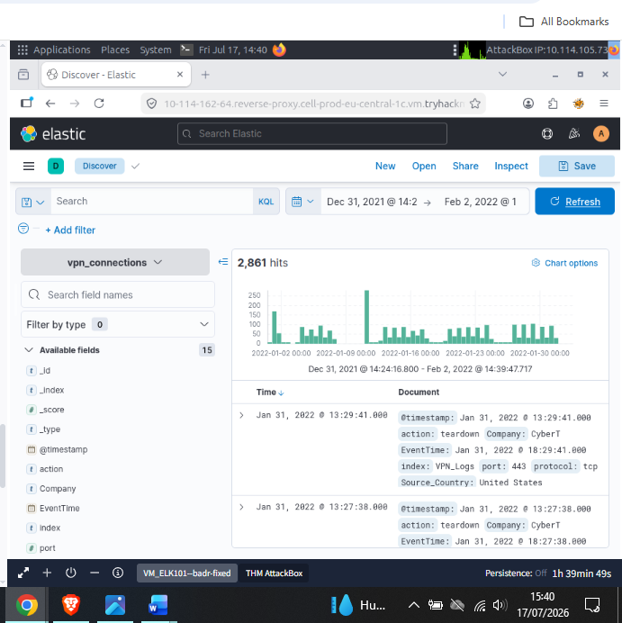

**2. Drilled into the `Source_ip` field**
Clicked the `Source_ip` field in the left pane to see its top 5 values. `238.163.231.224` came out on top at 3.2% of the dataset — the IP address with the maximum number of connections.

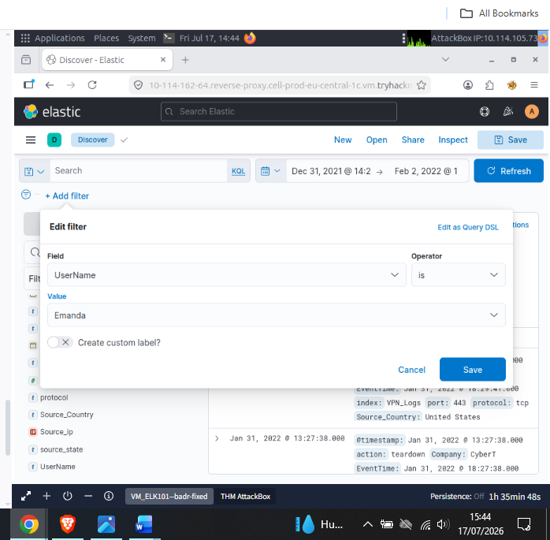

**3. Drilled into the `UserName` field**
Same approach on `UserName` — `James` led at 4.0%, making him the user responsible for the overall maximum traffic.

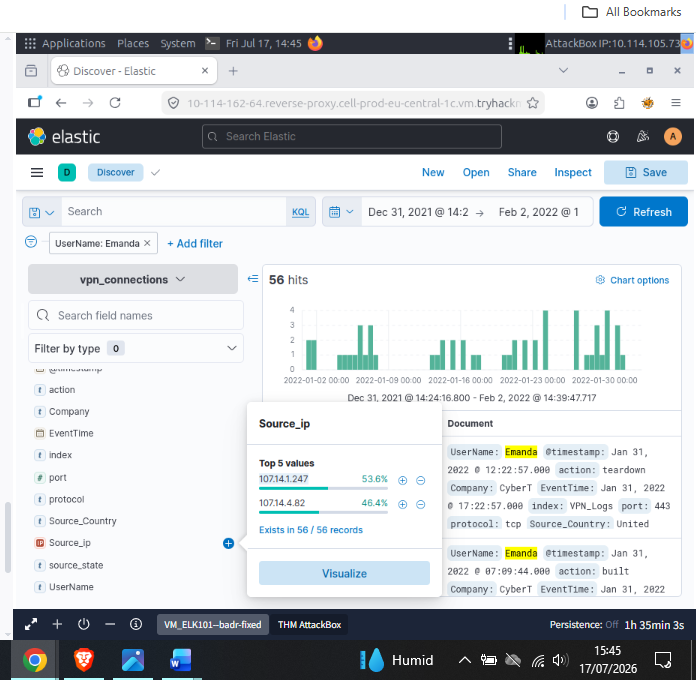

**4. Applied a filter for `UserName: Emanda`**
Used "Add filter" to isolate Emanda's activity specifically, to see which source IP she connected from most.

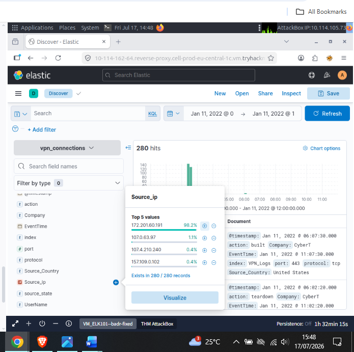

**5. Reviewed Emanda's filtered results**
With the filter applied, 56 hits came back. Drilling into `Source_ip` on this filtered set showed `107.14.1.247` at 53.6% — the max-hits source IP for her account.

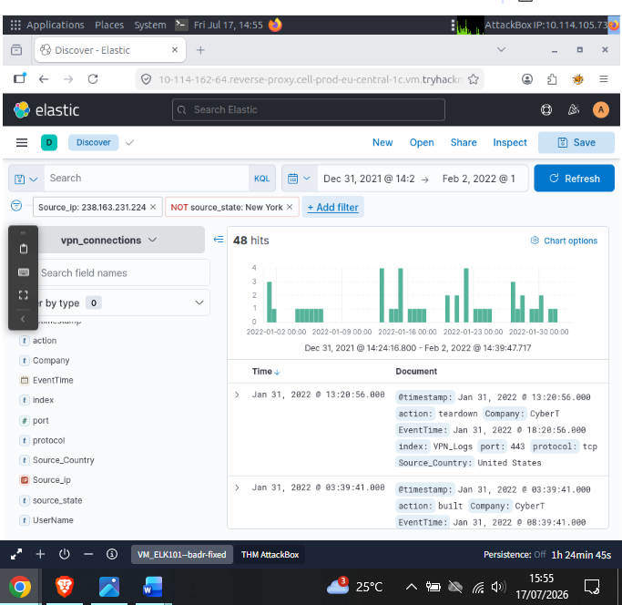

**6. Narrowed the time range to Jan 11, 2022**
Set the time picker to just that day to investigate a spike visible in the earlier time chart. 280 hits returned, and `Source_ip` showed `172.201.60.191` responsible for 98.2% of that day's traffic — the cause of the spike.

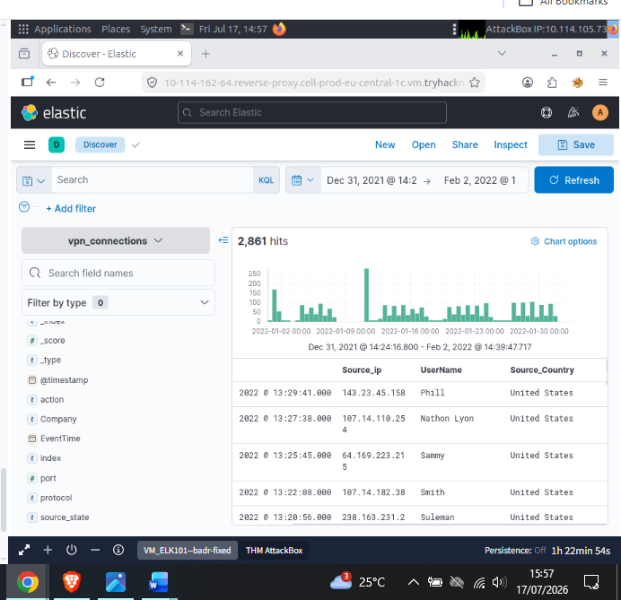

**7. Queried `Source_ip: 238.163.231.224` while excluding New York state**
Used a combined query (`Source_ip` filter + `NOT source_state: New York`) to see how many connections that IP made from anywhere other than New York — 48 hits.

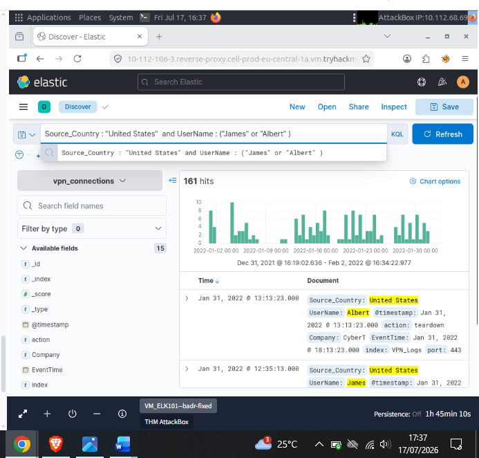

**8. Reviewed the full dataset as a structured table**
Switched to a table view of `Source_ip`, `UserName`, and `Source_Country` across all 2,861 hits — a cleaner way to scan the raw data before moving into KQL-specific queries.

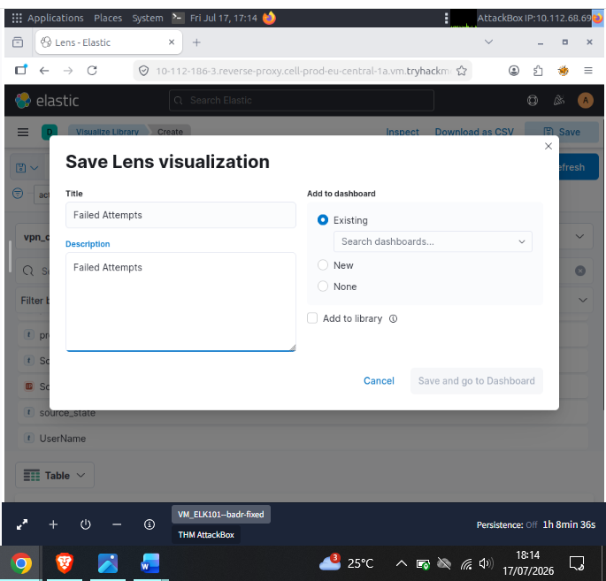

**9. Ran a KQL query with logical operators**
Queried `Source_Country: "United States" and UserName: ("James" or "Albert")` to combine a field match with an OR condition. Returned 161 records.

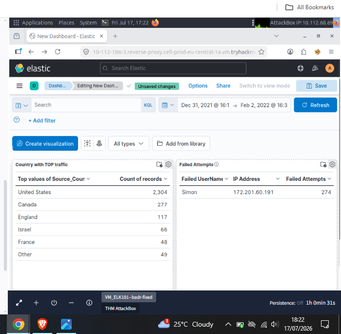

**10. Built and saved the Failed Connection Attempts visualization**
Set the `vpn_connections` data view, time picker to January 2022, and filtered for `action: failed` (no exclusions) to build a table of failed attempts by `UserName` and `Source_ip`. Saved it to the library as "Failed Attempts" so it could be added to a dashboard.

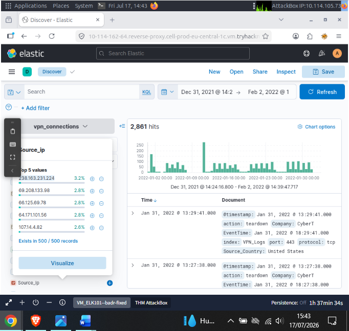

**11. Assembled the custom VPN dashboard**
Created a dashboard and added both the "Country with TOP traffic" table and the saved "Failed Attempts" visualization from the library. The Failed Attempts table showed `Simon` at `172.201.60.191` with 274 failed attempts — both the user with the most failed attempts and the January-wide failed-attempt count in one view.

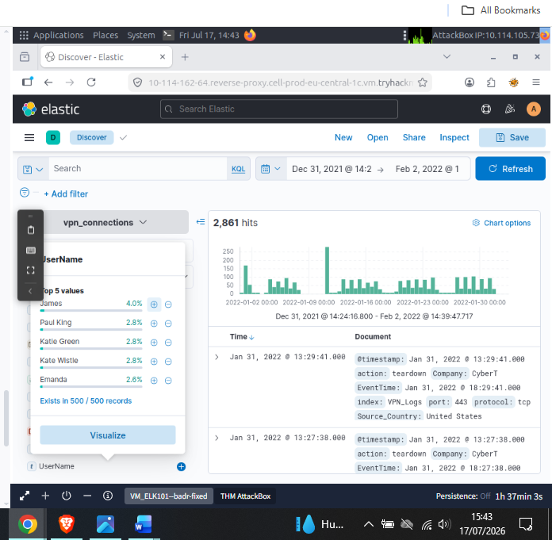

**12. Investigated the Johny Brown termination question**
Ran a search query to check for any VPN connections after Johny Brown's termination on Jan 1, 2022. The room's text field confirmed the answer (1 connection observed after termination), but I didn't capture a screenshot of this specific query.

---

## 🔍 Key Findings

- `vpn_connections` index, Dec 31 2021 – Feb 2 2022: **2,861 hits**
- IP with max connections overall: **238.163.231.224**
- User responsible for max overall traffic: **James**
- Emanda's top source IP: **107.14.1.247**
- Jan 11 traffic spike caused by: **172.201.60.191**
- Connections from 238.163.231.224 excluding New York: **48**
- `Source_Country: "United States"` and `UserName: ("James" or "Albert")`: **161 records**
- VPN connections observed after Johny Brown's Jan 1, 2022 termination: **1**
- User with the greatest number of failed attempts: **Simon**
- Total failed VPN connection attempts in January: **274**
- Pattern worth calling out: nearly every investigative step in this room followed the same loop — click a field, read the top-5 breakdown, then either filter on it or build a query around it. That's the core Discover-tab workflow, and it's the same "isolate the anomaly, then verify with a targeted query" instinct from earlier detection-focused days, just applied to log search instead of alert triage.

---

## 💡 Lessons Learned

- KQL's whole-term matching (`United` returning nothing where `United States` returns 2,304 hits) was the biggest surprise — I'd assumed partial-word matching by default, and the wildcard (`United*`) behavior clicked once I saw why it's needed.
- Field-based search (`field: value`) plus logical operators (`AND`/`OR`/`NOT`) is genuinely fast once the syntax is internalized — building the "US and (James or Albert)" query took seconds compared to manually clicking through filters.
- Saving a visualization to the library first, then adding it to a dashboard, is the same two-step pattern as saving a Discover search — Kibana keeps "build" and "assemble" as separate stages, which makes dashboards easy to update without rebuilding the underlying visualizations.
- Not screenshotting the Johny Brown termination query was a gap I noticed after the fact — a reminder to screenshot every question I answer through the search bar, not just the ones that produce a visualization.
- This connects to earlier log-analysis days: the "isolate → filter → confirm" loop here is the same triage logic used with SIEM alert queues, just running against raw normalized log data instead of pre-generated alerts.

---
