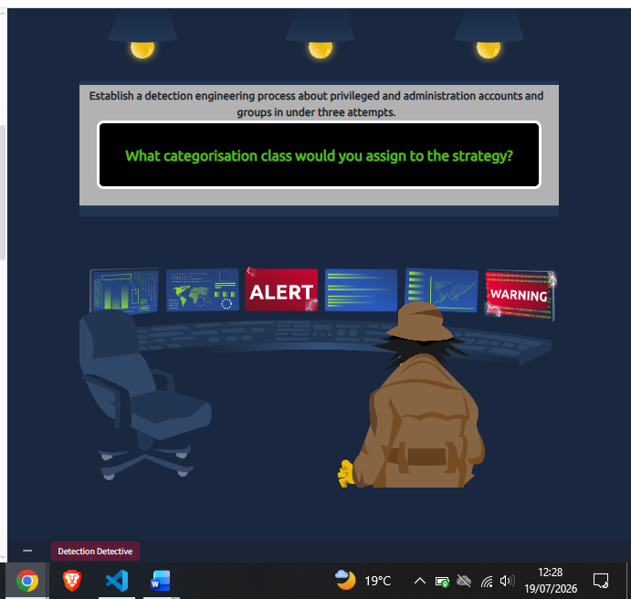
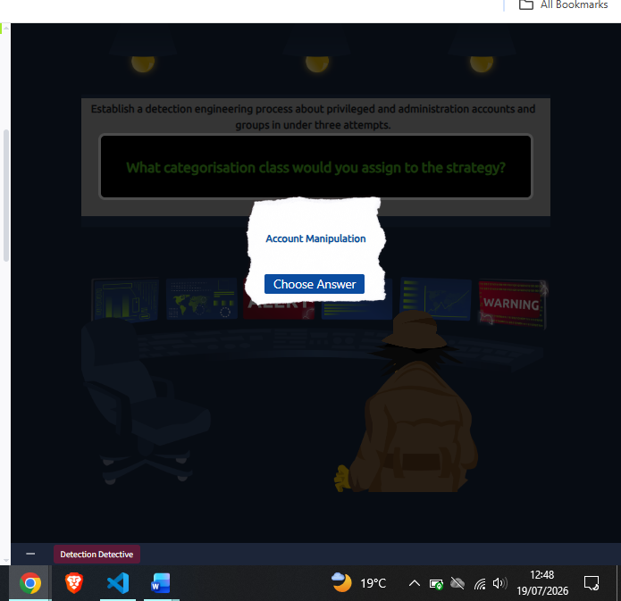
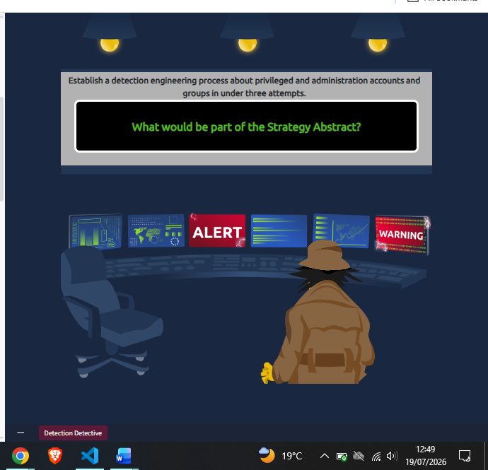
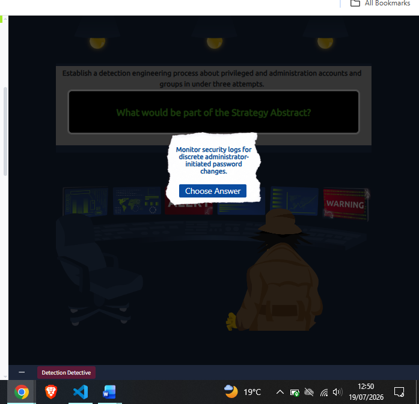
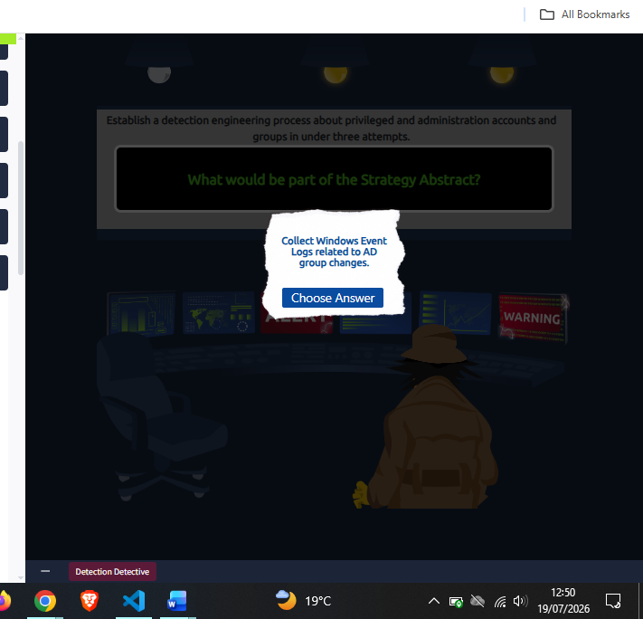
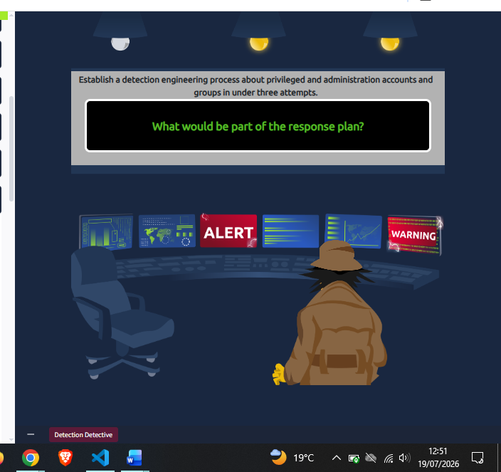
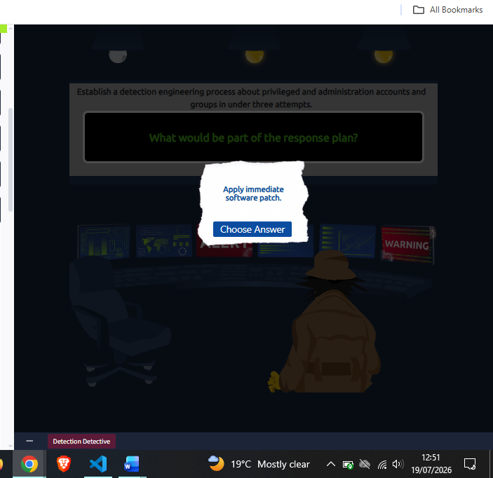
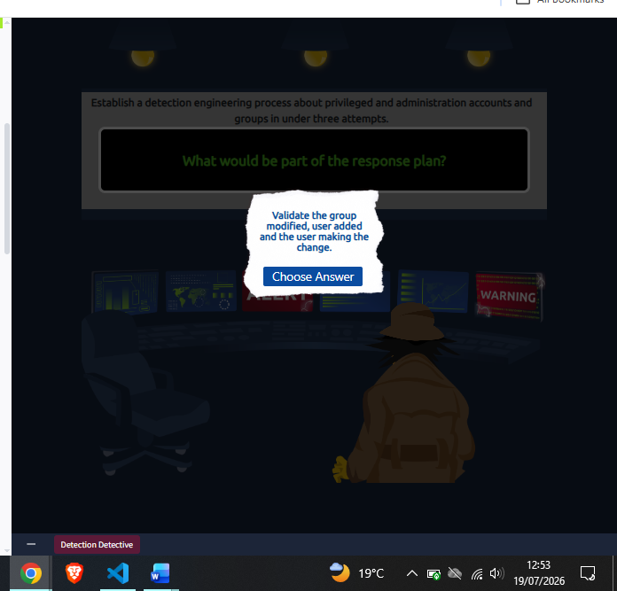
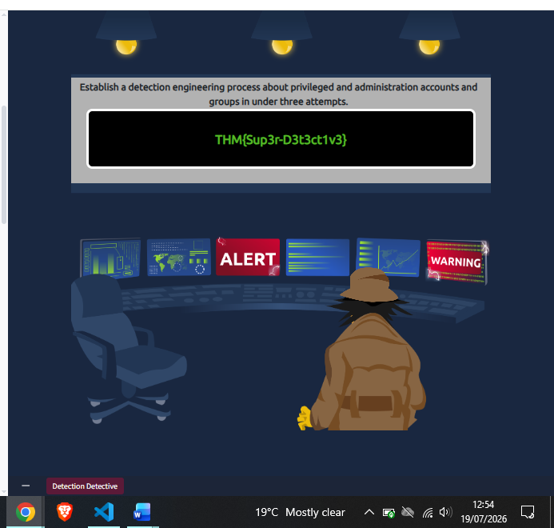

# Day 13: Intro to Detection Engineering

**Path:** SOC Level 1
**Platform:** TryHackMe
**Status:** ✅ Completed

---

## 📌 Overview

Detection engineering is the ongoing discipline of building and tuning
analytics that flag malicious activity or misconfigurations, and it
requires buy-in across security teams rather than being a solo analyst
task. Detection splits into two broad perspectives, each with two
categories: **environment-based** detection (configuration detection and
modelling, which look for deviations from known infrastructure or
established baselines) and **threat-based** detection (indicators and
threat-behaviour detection, which look at artefacts and TTPs tied
directly to an adversary). Each has a different trade-off — configuration
detection is easy to build in static environments but breaks down as
things change; behaviour-based detection survives an adversary changing
tools but needs a lot of data to cover properly.

**Detection as Code (DaC)** borrows CI/CD practices — version control and
automated testing — so detection rules built in vendor-agnostic languages
like Sigma or YARA can be reviewed, tested, and reused instead of living
as untracked SIEM config. Building a detection follows a pipeline: a
**gap analysis** (reactive, from past incidents, or proactive, using
ATT&CK-based threat modelling) identifies what's missing, then relevant
log sources get identified and collected, a **baseline** of normal
behaviour gets established (high-level policy baselines vs
technical/OS-based baselines), rules get written (Snort for network
traffic, YARA for files, Sigma for generic log detections), and finally
the rule gets deployed, automated, and tuned over time.

Several frameworks support this process: **MITRE ATT&CK/CAR** map
adversary tactics and techniques to guide what to detect; the **Pyramid
of Pain** measures how costly a detection is for an adversary to evade;
the **Cyber Kill Chain** (and its 18-phase Unified Kill Chain successor)
breaks an attack into sequential phases; and Palantir's **Alerting and
Detection Strategy (ADS) Framework** gives a strict 9-stage template
(Goal → Categorisation → Strategy Abstract → Technical Context → Blind
Spots & Assumptions → False Positives → Validation → Priority →
Response) for documenting a detection before it goes to production. The
**Detection Maturity Level (DML)** model then scores an organization's
detection maturity on a 0–8 scale, from no detection process at all
(DML-0) up to detecting an adversary's actual goals (DML-8) — with most
practical detections sitting in the tools/procedures/techniques/tactics
band in between.

The room's hands-on scenario had me play detection analyst for a
fictional company, THM, building out an ADS Framework entry to detect
changes made to privileged and administrative Active Directory accounts
and groups — filling in the Categorisation, Strategy Abstract, and
Response stages through an interactive "Detection Detective" exercise.

---

## 🛠️ Tools Used

- TryHackMe's "Detection Detective" interactive scenario (no VM/AttackBox lab — browser-based decision exercise)
- ADS Framework (Palantir) as the documentation template
- Reference: MITRE ATT&CK framework for categorisation mapping

---

## 🪜 Steps Followed

**1. Read the scenario and Categorisation prompt**
The exercise set the goal — detect changes to privileged/admin accounts and groups in Active Directory — then asked which categorisation class the strategy should be filed under.

**2. Selected "Account Manipulation" as the categorisation**
Chose Account Manipulation as the ATT&CK-aligned category for this detection, since the scenario centers on changes to accounts and group membership rather than credential theft or lateral movement.

**3. Moved to the Strategy Abstract prompt**
The exercise then asked what should be part of the Strategy Abstract — the top-level description of what the detection actually watches for.

**4. Selected "Monitor security logs for discrete administrator-initiated password changes"**
Picked this as one Strategy Abstract component, since admin-initiated password resets are a direct, log-visible signal of privileged account activity.

**5. Selected "Collect Windows Event Logs related to AD group changes"**
Picked this as a second Strategy Abstract component — group membership changes (adds/removes) are the other half of "privileged accounts and groups" the goal calls out, so both log sources belong in the abstract.

**6. Moved to the Response Plan prompt**
The exercise then asked what belongs in the Response stage — how an analyst should triage an alert once it fires.

**7. Selected "Apply immediate software patch"**
Chose this as a candidate response action.

**8. Selected "Validate the group modified, user added, and the user making the change"**
Chose this as a second response action — confirming exactly what changed and who made the change is the core validation step for an account-manipulation alert.

**9. Completed the exercise and captured the flag**
Finished building out the ADS entry and received the completion flag.

---

## 🔍 Key Findings

- Categorisation class selected: **Account Manipulation**
- Strategy Abstract components: monitoring security logs for admin-initiated password changes, and collecting Windows Event Logs for AD group changes
- Response Plan components: applying an immediate software patch, and validating the group modified, the user added, and who made the change
- Flag: `THM{Sup3r-D3t3ct1v3}`
- Pattern worth calling out: the ADS Framework's own structure (Goal → Categorisation → Strategy Abstract → ... → Response) is the same shape as this write-up series' own template (Overview → Steps → Findings) — documenting a detection and documenting a day's learning both come down to "what were we looking for, how did we look for it, what did we conclude."

---

## 💡 Lessons Learned

- The two-perspective, four-category breakdown of detection types (configuration/modelling vs indicators/threat-behaviour) gave me a clearer mental model than just "signature vs anomaly detection" — each category has a distinct maintenance cost as environments change.
- The DML model's framing — that maturity is about *applying* intel to detection and response, not just collecting it — is a useful gut check for evaluating any detection program, including my own learning approach here.
- I didn't fully grasp the exercise's mechanics on first read and had to go back through the room's ADS template example (the Unusual PowerShell Host Process case) to understand what each stage was actually asking for before the Detection Detective questions made sense.
- This connects back to Day 10's SIEM-triggered isolation work and Day 12's Elastic Stack log search — both are exactly the kind of environment-based/log-collection groundwork this room's ADS Strategy Abstract stage depends on (you can't monitor logs you never collected).
