# Day 14: Introduction to SOAR

**Path:** SOC Level 1
**Platform:** TryHackMe
**Status:** ✅ Completed

---

## 📌 Overview

Traditional SOCs run on a stack of disconnected tools — SIEM, EDR,
firewalls, threat intel platforms — plus constant back-and-forth with IT
and management. That produces four recurring pain points: **alert
fatigue** from too many low-value alerts, **too many disconnected
tools** forcing analysts to pivot between separate consoles, **manual
processes** that live only as undocumented tribal knowledge, and a
**talent shortage** that leaves the remaining analysts overloaded.

**SOAR (Security Orchestration, Automation, and Response)** is the tool
built to solve this by unifying SIEM, EDR, firewall, and other tools
into one interface, plus adding case/ticket management on top. Its value
comes from three capabilities: **Orchestration** — coordinating multiple
tools under one workflow instead of manually switching between them, via
predefined **playbooks** (step-by-step investigation logic, e.g. for a
VPN brute-force alert: check the SIEM for whether the user normally uses
that IP, check the IP's reputation via TI platforms, check for
successful logins, then escalate to containment); **Automation** — the
same playbook steps executed by SOAR itself with no manual clicking, so
one alert can be checked, verified, and actioned end-to-end without an
analyst touching each tool; and **Response** — taking the actual
containment action (blocking an IP on the firewall, disabling a user in
IAM, opening a ticket) from that single interface.

Two concrete playbook examples came up: a **Phishing playbook**, which
branches on whether a suspicious email contains a URL or attachment
before deciding on notification vs. deeper investigation and
remediation, and a **CVE Patching playbook**, which analyses a newly
disclosed CVE, assesses its risk to the environment, opens a patching
ticket, and tests the patch before production rollout.

The room's hands-on scenario put this into practice: a colleague
("McSkidy") sends over a checklist for a Threat Intelligence integration
workflow, and the task is to configure five workflow stages — **Case
Management**, **Threat Intelligence Feeds**, **Incident Data
Extraction**, **Reputation Checks**, and **Course of Action** — deciding
per action whether it should run as **Automated** or stay **Manual**,
then running the flowchart to validate the configuration.

---

## 🛠️ Tools Used

- TryHackMe's interactive SOAR workflow simulator (browser-based toggle exercise, no AttackBox/VM lab)
- No external SOAR product used — this was the room's own simulated configuration screen

---

## 🪜 Steps Followed

**1. Read the room's instructions**
The exercise explained the goal: toggle each workflow stage's settings between Automated and Manual to get the right combination to activate the flowchart.

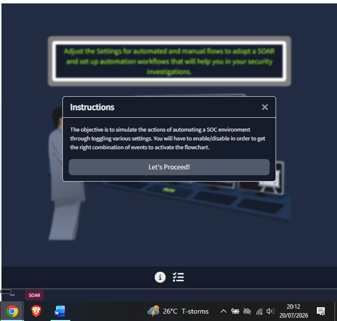

**2. Reviewed the objective and the five-stage workflow layout**
The main screen laid out the five configurable stages along the bottom — Case Ticket, Threat Intel, Data Extraction, Reputation Checks, and Course of Action — feeding into a flowchart at the top, with a RUN command to validate the configuration.

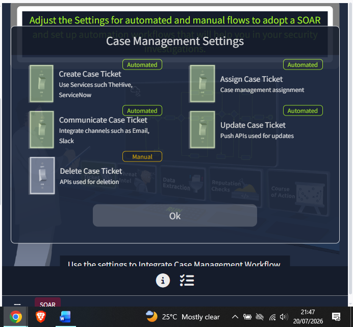

**3. Opened the Check List**
Reviewed McSkidy's checklist for the Threat Intelligence integration workflow before configuring anything, to understand what the workflow needed to accomplish.

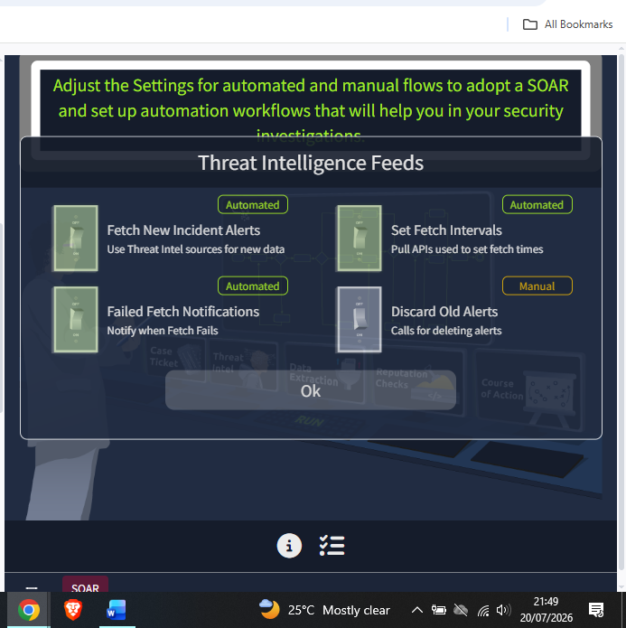

**4. Set the Case Management stage — first attempt**
Opened Case Management Settings and set Assign Case Ticket to Automated, leaving Create, Communicate, Update, and Delete Case Ticket as Manual.

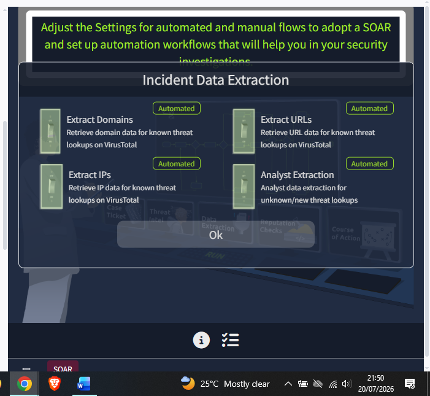

**5. Revised the Case Management stage**
Came back to this panel and switched Create, Communicate, and Update Case Ticket to Automated as well, keeping only Delete Case Ticket on Manual — reasoning that ticket creation, assignment, communication, and updates are all safe to automate via API, while deletion is destructive enough to warrant a manual check.

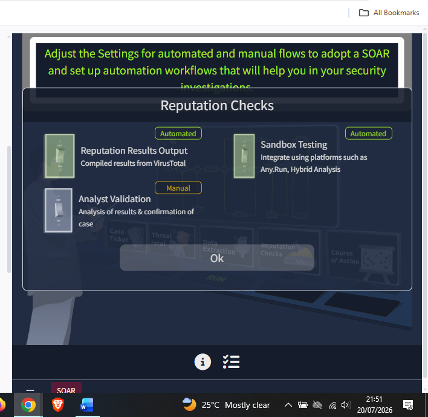

**6. Set the Threat Intelligence Feeds stage**
Set Fetch New Incident Alerts, Set Fetch Intervals, and Failed Fetch Notifications to Automated, and left Discard Old Alerts on Manual — following the same logic as Delete Case Ticket, that removing/discarding data is the one action worth a manual check.

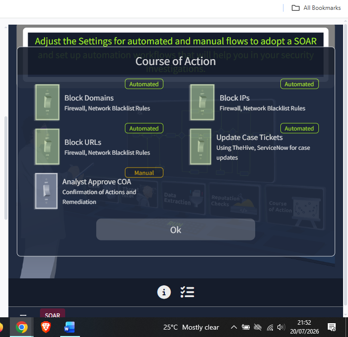

**7. Set the Incident Data Extraction stage**
Set Extract Domains, Extract URLs, Extract IPs, and Analyst Extraction all to Automated.

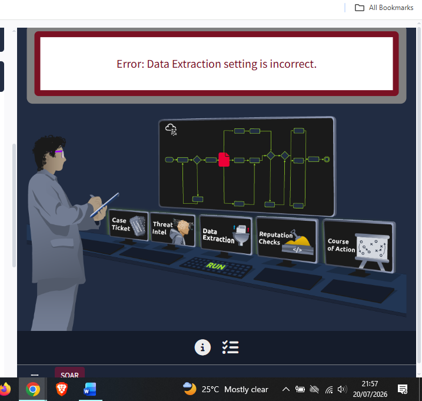

**8. Set the Reputation Checks stage**
Set Reputation Results Output and Sandbox Testing to Automated, and left Analyst Validation on Manual, since validating and confirming a case is explicitly an analyst judgment call.

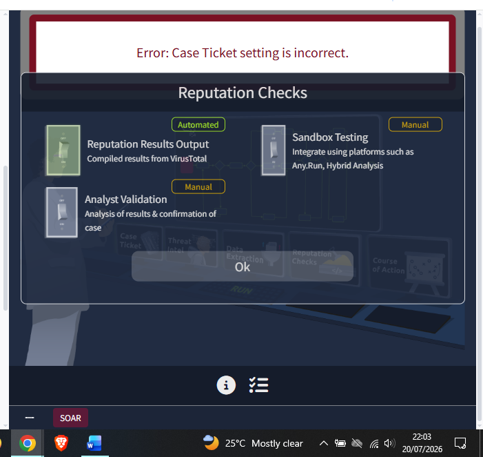

**9. Set the Course of Action stage**
Set Block Domains, Block IPs, Block URLs, and Update Case Tickets to Automated, and left Analyst Approve COA on Manual, for the same reason — final approval of remediation actions stays with a human.

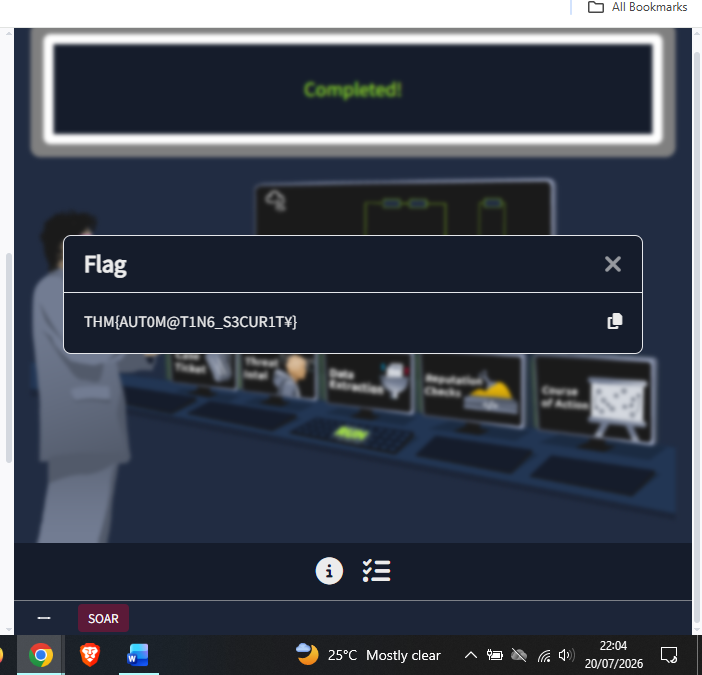

**10. Ran the flowchart — first attempt failed**
Hit RUN with all five stages configured. Got an error flagging the Data Extraction setting as incorrect — most likely Analyst Extraction, since every other "Analyst"-labelled action across the other stages was correctly left Manual, so setting it to Automated here was the odd one out. Went back and corrected it before re-running.

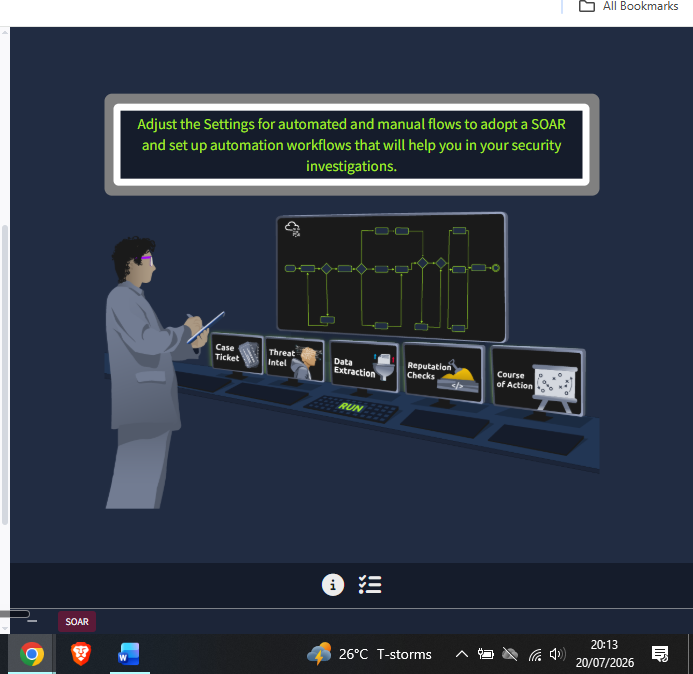

**11. Ran the flowchart — second attempt failed**
Hit RUN again and got a second error, this time flagging the Case Ticket setting as incorrect. Reviewed the Case Management panel again and adjusted the remaining setting before the next run (the exact toggle changed wasn't screenshotted).

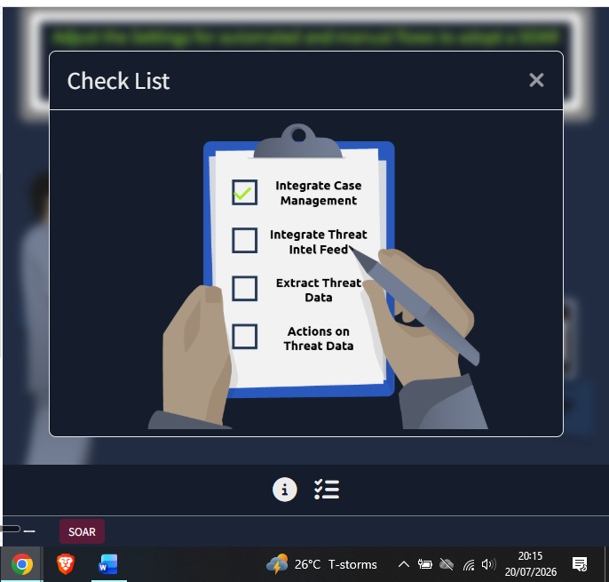

**12. Ran the flowchart — succeeded and captured the flag**
Third RUN completed the flowchart successfully and returned the flag.

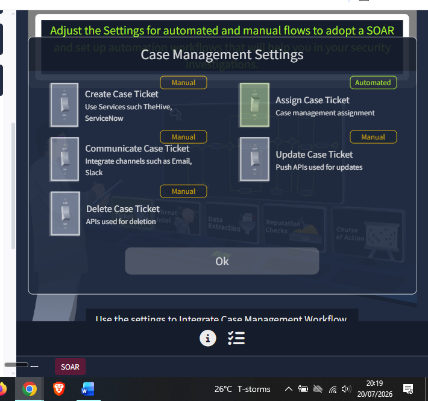

---

## 🔍 Key Findings

- Correct final toggle pattern (as far as verified): anything driven by an API/feed pull (create/assign/communicate/update tickets, fetch alerts, extract domains/URLs/IPs, reputation output, sandbox testing, blocking domains/IPs/URLs) → **Automated**; anything destructive (delete, discard) or explicitly analyst-judgment-based (analyst validation, analyst approval, analyst extraction) → **Manual**
- It took three RUN attempts to get the full workflow correct — errors specifically called out Data Extraction and Case Ticket settings before the configuration passed
- Flag: `THM{AUT0M@T1N6_S3CUR1T¥}`
- Pattern worth calling out: the "keep analyst-labelled and destructive actions manual" rule held consistently across every stage in this room, which is a genuinely useful heuristic for SOAR playbook design generally, not just this exercise

---

## 💡 Lessons Learned

- Two RUN attempts failed before I got the full workflow right — the room doesn't tell you exactly which switch is wrong, just which section, so I had to reason through the pattern (Automated = API-driven, Manual = destructive or analyst-judgment) rather than being told the answer directly.
- I didn't screenshot the exact settings I changed after each error, which is a gap — next time I should capture the "after" state of the panel right after fixing it, not just the error message and the eventual pass.
- This room reframes a lot of what earlier days covered piecemeal (SIEM queries on Day 12, detection strategy documentation on Day 13) as parts of a single orchestrated playbook — SOAR doesn't replace that work, it's the automation layer that chains those individual actions together.
- The "keep the human in the loop for destructive/judgment actions" pattern here is basically the automation-side mirror of Day 13's ADS Framework Response stage — both come down to knowing exactly when to hand a decision back to an analyst instead of letting the tool run unattended.
