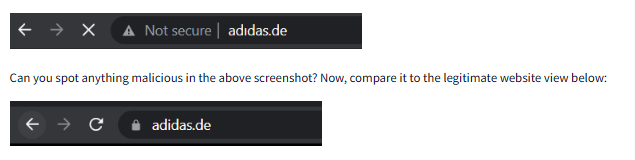
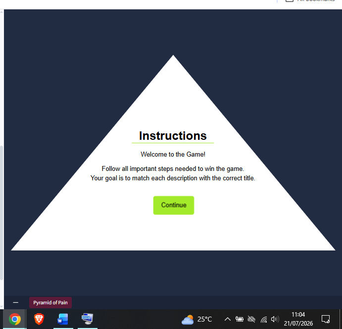
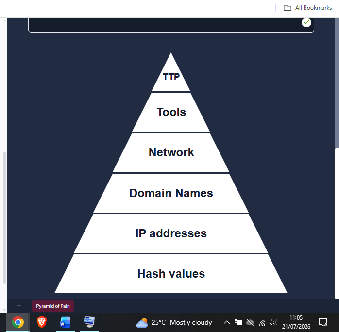
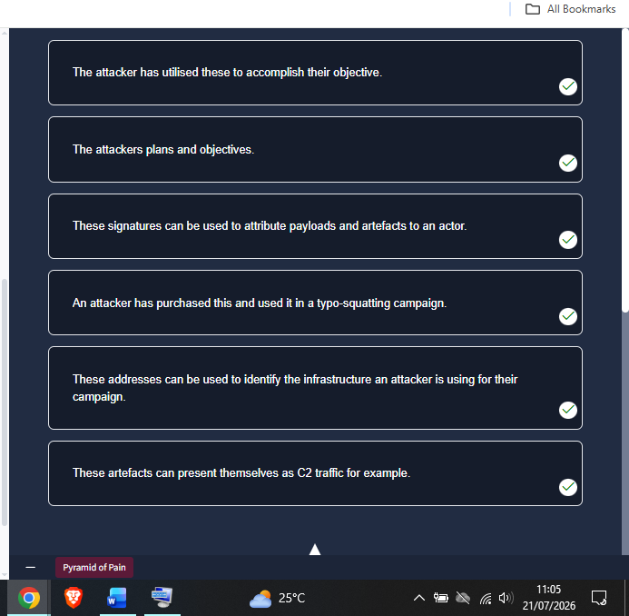
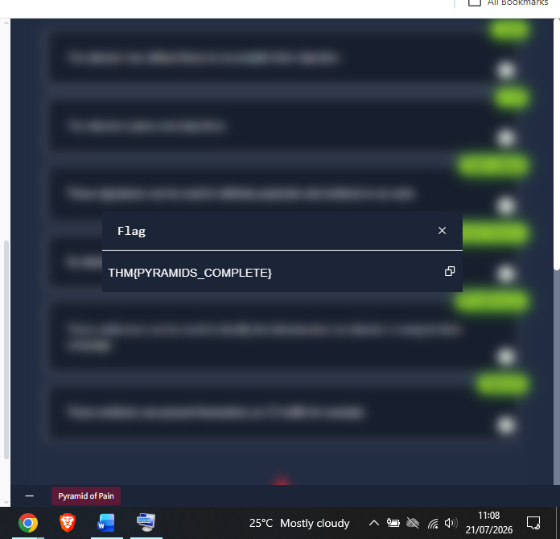
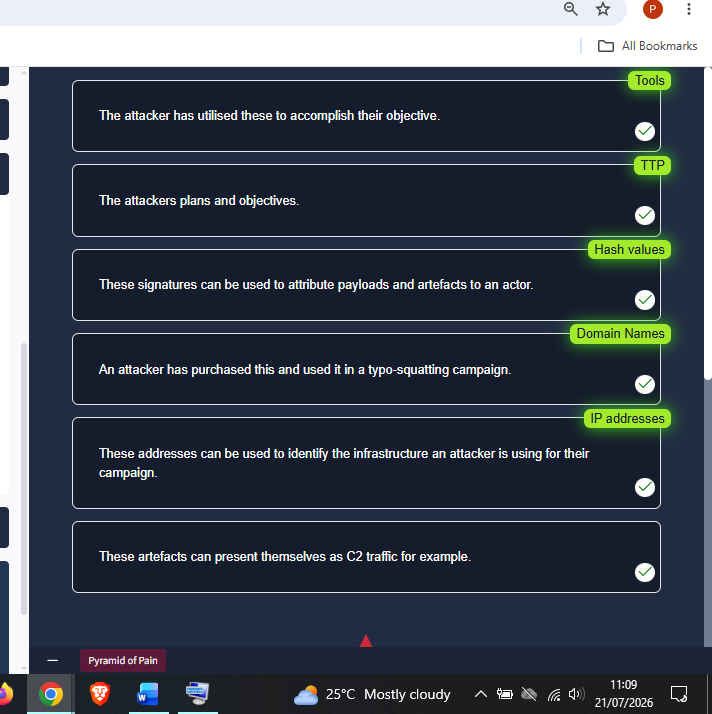

# Day 15: Pyramid of Pain

**Path:** SOC Level 1
**Platform:** TryHackMe
**Status:** ✅ Completed

---

## 📌 Overview

The Pyramid of Pain ranks the indicators an analyst can act on by how
much *pain* — time, money, and effort — it costs an adversary when that
indicator gets detected and blocked. It's six tiers, bottom to top,
color-coded from easy-for-the-defender to genuinely damaging-for-the-attacker:

- **Hash Values (Trivial)** — unique fingerprints of a file (MD5, SHA-1,
  SHA-2/SHA-256) used to identify a specific malicious sample. MD5 and
  SHA-1 are both now considered cryptographically broken (MD5 flagged in
  RFC 6151, SHA-1 deprecated by NIST in 2011), but hash values are still
  useful for uniquely referencing a known-bad file — the catch is an
  attacker only has to change a single byte to produce a completely
  different hash, so this tier costs the adversary nothing to evade.
- **IP Address (Easy)** — blocking an IP on a perimeter firewall is
  trivial to set up but just as trivial for an adversary to route
  around, especially with **Fast Flux**, where a botnet rotates many IPs
  behind one constantly-changing domain specifically to outrun IP-based
  blocking.
- **Domain Names (Simple)** — domains cost more for an attacker to
  rotate than an IP, since they involve purchasing and DNS
  registration, though loose DNS provider APIs make this easier than
  it should be. This tier is also where **Punycode** homograph attacks
  live — a domain like `adıdas.de` renders as if it were the real
  `adidas.de`, but is actually encoded as `xn--addas-o4a.de`, and
  attackers hide these (and other malicious domains) behind URL
  shorteners like bit.ly or tinyurl.com to obscure the destination
  further.
- **Network / Host Artifacts (Annoying)** — traces an attacker leaves
  behind: registry values, dropped files, unusual process execution on
  a host, or on the network side, a distinctive User-Agent string, C2
  beacon pattern, or POST-request URI pattern. Detecting these forces
  the adversary to actually go back and adjust their tooling or
  tradecraft, which starts to cost real time — visible via PCAP analysis
  in Wireshark/TShark or IDS tools like Snort, or a sandbox's HTTP/DNS/
  connection logs.
- **Tools (Challenging)** — the actual utilities behind an attack:
  maldoc builders, backdoors, custom EXEs/DLLs, password crackers.
  Detecting and blocking the tool itself (via AV signatures, YARA
  rules, or fuzzy hashing techniques like SSDeep for near-duplicate
  matching) is expensive for an attacker to route around — they need a
  new tool entirely, which may mean money, new training, or giving up.
- **TTPs (Tough)** — Tactics, Techniques, and Procedures: the full
  MITRE ATT&CK-mapped behavior pattern an adversary follows from initial
  access through to exfiltration. Detecting at this level (e.g. spotting
  a Pass-the-Hash attempt via Windows Event Log monitoring) leaves an
  adversary almost nowhere to go — they either have to retrain and
  rebuild their entire approach, or abandon the target.

The room's hands-on portion was a matching game: six description
prompts, each describing a behavior or artifact type, had to be dragged
onto the correct pyramid tier.

---

## 🛠️ Tools Used

- TryHackMe's Pyramid of Pain interactive matching game (browser-based, no AttackBox/VM lab)
- No external tools used — room content only (reading material + matching exercise)

---

## 🪜 Steps Followed

**1. Reviewed the room's Punycode domain-spoofing example**
Compared the browser address bar for a spoofed `adıdas.de` against the legitimate `adidas.de` — the malicious version flags as "Not secure" and visually mimics the real domain through homograph characters, illustrating exactly why Domain Names sit above IP Addresses on the pyramid (an attacker has to buy and register a convincing look-alike, not just spin up a new IP).

**2. Read the matching game instructions**
The game's goal: match each of six behavior/artifact descriptions to its correct pyramid tier.

**3. Reviewed the blank pyramid reference**
Looked over the six unlabeled tiers — Hash Values, IP addresses, Domain Names, Network, Tools, TTP — bottom to top, before starting the matching.

**4. Reviewed the six description prompts**
Read through all six statements to match against the tiers, covering everything from hash-based attribution to C2 traffic artifacts to an attacker's overall plans and objectives.

**5. Submitted the matches and captured the flag**
Matched each description to its tier and submitted — the flag appeared immediately on a correct submission.

**6. Reviewed the completed, labeled pyramid**
Closed the flag dialog to see the final tier labels confirmed against each description:
- **Tools** → "The attacker has utilised these to accomplish their objective."
- **TTP** → "The attackers plans and objectives."
- **Hash values** → "These signatures can be used to attribute payloads and artefacts to an actor."
- **Domain Names** → "An attacker has purchased this and used it in a typo-squatting campaign."
- **IP addresses** → "These addresses can be used to identify the infrastructure an attacker is using for their campaign."
- **Network** → "These artefacts can present themselves as C2 traffic for example."

---

## 🔍 Key Findings

- All six description-to-tier matches confirmed correct on first submission (see mapping in Step 6)
- Flag: `THM{PYRAMIDS_COMPLETE}`
- Pattern worth calling out: the pyramid's core insight isn't really about the indicators themselves, it's about designing detections that cost the adversary the most to evade — which reframes a lot of earlier days. Day 13's Account Manipulation categorisation and Day 14's SOAR playbooks are both, in Pyramid terms, aimed at the TTP/Tools tiers rather than the cheap-to-evade Hash/IP tiers.

---

## 💡 Lessons Learned

- The Punycode example made the Domain Names tier click in a way the text description alone wouldn't have — seeing `adıdas.de` render as visually identical to the real domain, while the address bar quietly flags it as not secure, is a good reminder to actually look at the padlock/security indicator, not just the domain text.
- The "cost to the attacker" framing is a cleaner mental model than just "how specific is this indicator" — a hash is maximally specific but costs an attacker nothing to change, while a TTP is broad but forces a full rework of their approach.
- This ties directly back to Day 13's Detection Engineering room: the ADS Framework's Categorisation stage (where I chose "Account Manipulation" for the AD detection) is effectively picking a spot on this same pyramid — TTP-level categorisation, not just an IOC list.
- Also connects to Day 14's SOAR playbooks: automating IP/domain blocking (low on the pyramid) is easy to justify handing off to automation, while TTP-level detection decisions are exactly the kind of thing the "Analyst" toggles from that room's exercise were built to keep in human hands.
