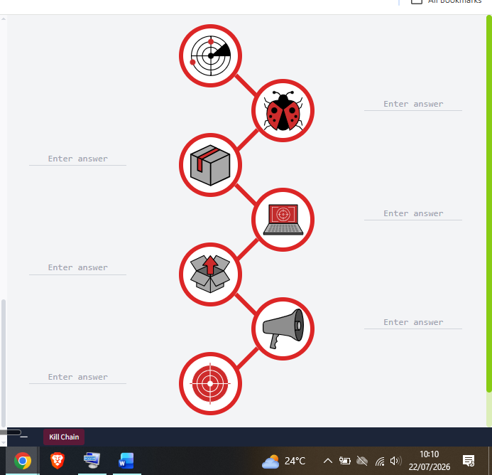
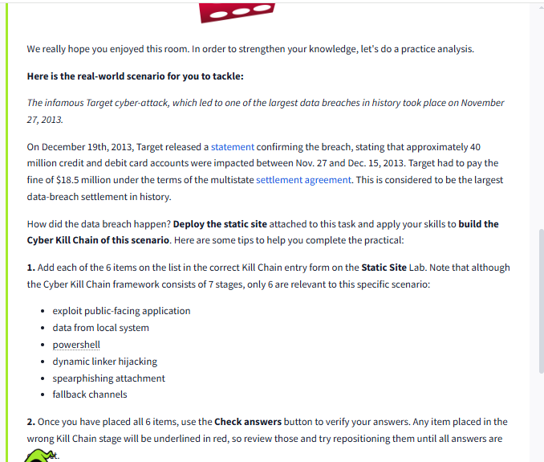
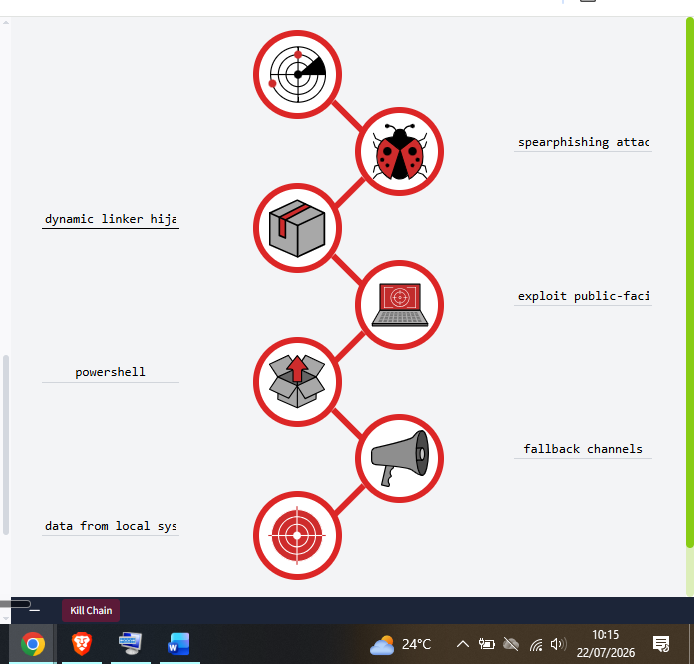
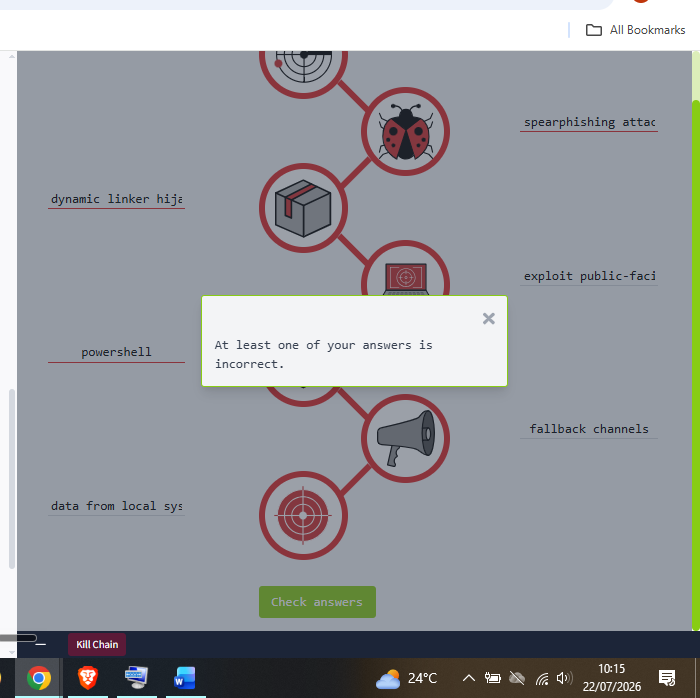
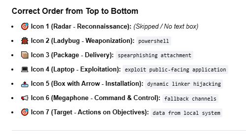
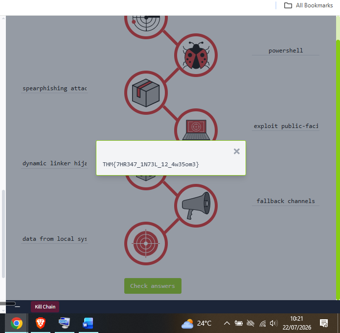

# Day 16: Cyber Kill Chain

**Path:** SOC Level 1
**Platform:** TryHackMe
**Status:** ✅ Completed

---

## 📌 Overview

The Cyber Kill Chain, adapted by Lockheed Martin in 2011 from a military
targeting concept, breaks an intrusion into seven sequential phases an
adversary has to move through to succeed:

1. **Reconnaissance** — researching the target, often passively, through
   OSINT: WHOIS lookups, social media scraping, breach data, or more
   actively through social engineering and port scanning. Email
   harvesting (via tools like theHarvester or Hunter.io) is a common
   recon activity feeding later phishing attempts.
2. **Weaponization** — turning gathered intel into an actual attack tool:
   crafting malware, buying a payload on the dark web, wrapping an
   exploit into a malicious Office macro, or standing up C2
   infrastructure ahead of time.
3. **Delivery** — choosing how the payload reaches the target: phishing
   email (broad or spear-phishing a specific person), physical USB
   drops, or watering-hole attacks that compromise a site the victim
   already visits.
4. **Exploitation** — the moment the payload actually executes, whether
   through a malicious macro, a zero-day, or an unpatched known CVE.
   Signs include unexpected process spawns, registry changes, or
   suspicious command-line arguments in logs.
5. **Installation** — establishing persistence so the attacker can
   reconnect even if the initial access point is patched or removed:
   web shells, backdoors like Meterpreter, modified Windows services
   (MITRE T1543.003), or Registry Run Key/Startup Folder entries —
   sometimes paired with timestomping to hide the activity from
   forensic review.
6. **Command & Control (C2)** — opening a channel back to the attacker's
   infrastructure to remotely operate the compromised host, commonly
   blended into legitimate-looking HTTP/HTTPS traffic or tunneled
   through DNS requests to avoid detection.
7. **Actions on Objectives** — the actual goal: credential theft,
   privilege escalation, internal recon, lateral movement, data
   exfiltration, or destructive actions like deleting shadow copies or
   corrupting data.

The room closes by noting the framework's real limitation: it hasn't
been updated since 2011, it's built around perimeter/malware defense,
and it has no way to model an **Insider Threat** — someone abusing
access they're already authorized to have. The recommendation is to pair
it with MITRE ATT&CK and the newer Unified Kill Chain rather than rely
on it alone.

The room's practical exercise applied this to a real case: the **2013
Target data breach** — one of the largest retail breaches in history,
impacting ~40 million card accounts and costing Target an $18.5M
multistate settlement. The task was to map six given techniques onto
the correct Kill Chain phase for that specific attack (Reconnaissance
wasn't relevant to this scenario, so only 6 of the 7 phases applied).

---

## 🛠️ Tools Used

- TryHackMe's Cyber Kill Chain static-site drag-and-drop exercise (browser-based, no AttackBox/VM lab)
- No external tools — room content and the 2013 Target breach scenario only

---

## 🪜 Steps Followed

**1. Reviewed the blank Kill Chain diagram**
The exercise laid out all 7 phase icons (Recon, Weaponization, Delivery, Exploitation, Installation, C2, Actions on Objectives) with empty answer boxes next to 6 of them — Reconnaissance had no box, since it wasn't part of this scenario.

**2. Read the Target breach scenario and task instructions**
The room gave the real-world context (the Nov 27, 2013 Target breach, the Dec 19 disclosure, and the $18.5M settlement) and the 6 techniques to place: exploit public-facing application, data from local system, powershell, dynamic linker hijacking, spearphishing attachment, and fallback channels.

**3. Placed all 6 items — first attempt**
Positioned exploit public-facing application at Exploitation, fallback channels at Command & Control, and data from local system at Actions on Objectives — all correct on this pass. Placed spearphishing attachment at Weaponization, dynamic linker hijacking at Delivery, and powershell at Installation.

**4. Checked answers — got an error**
Clicked Check Answers and got flagged: at least one answer was incorrect, with the Weaponization-stage entry underlined in red.

**5. Worked out the correct order**
Stepped back through the phase definitions and compiled the correct top-to-bottom mapping to verify the fix before resubmitting: Weaponization → powershell, Delivery → spearphishing attachment, Exploitation → exploit public-facing application, Installation → dynamic linker hijacking, Command & Control → fallback channels, Actions on Objectives → data from local system.

**6. Corrected the placements and captured the flag**
The three wrong entries were actually rotated one phase off from each other — moved spearphishing attachment from Weaponization down to Delivery, dynamic linker hijacking from Delivery down to Installation, and powershell from Installation up to Weaponization. Re-submitted and got the flag.

---

## 🔍 Key Findings

- Correct Target-breach mapping: **Weaponization** = powershell, **Delivery** = spearphishing attachment, **Exploitation** = exploit public-facing application, **Installation** = dynamic linker hijacking, **Command & Control** = fallback channels, **Actions on Objectives** = data from local system. Reconnaissance wasn't part of this scenario.
- First attempt had 3 of 6 correct (Exploitation, C2, Actions on Objectives); the other 3 were rotated one phase off from where they belonged
- Flag: `THM{7HR347_1N73L_12_4w35om3}`
- Pattern worth calling out: my first-attempt mistake was placing techniques one phase *too early* for three items in a row (spearphishing at Weaponization instead of Delivery, dynamic linker hijacking at Delivery instead of Installation, powershell at Installation instead of Weaponization) — worth double-checking phase boundaries specifically around "is this the tool being built, or the tool being delivered/used" next time this framework comes up.

---

## 💡 Lessons Learned

- The 3-way rotation in my first attempt wasn't random guessing gone wrong — it was a genuine boundary confusion between Weaponization (preparing the tool) and Delivery/Installation (using or persisting the tool), which suggests I need a clearer mental checklist for "is this phase about building/choosing a technique, or executing/persisting it" rather than relying on gut feel.
- Mapping a real breach (Target 2013) onto the framework made the phases click in a way the room's fictional "Megatron" example didn't — a real incident with a real financial and reputational cost makes the stakes of getting detection right at each phase much more concrete.
- The room's own critique of the Kill Chain — no way to model Insider Threats, no updates since 2011 — is a useful reminder that frameworks are tools with real boundaries, not universal answers; that's the same lesson Day 15's Pyramid of Pain reinforced about picking the right level of an indicator to detect on.
- This connects directly to Day 13's ADS Framework and Day 15's Pyramid of Pain: Kill Chain phase, ADS categorisation, and Pyramid tier are three different lenses on the same underlying question — where in an attacker's process am I trying to detect and disrupt them, and how much does that cost them if I succeed.
