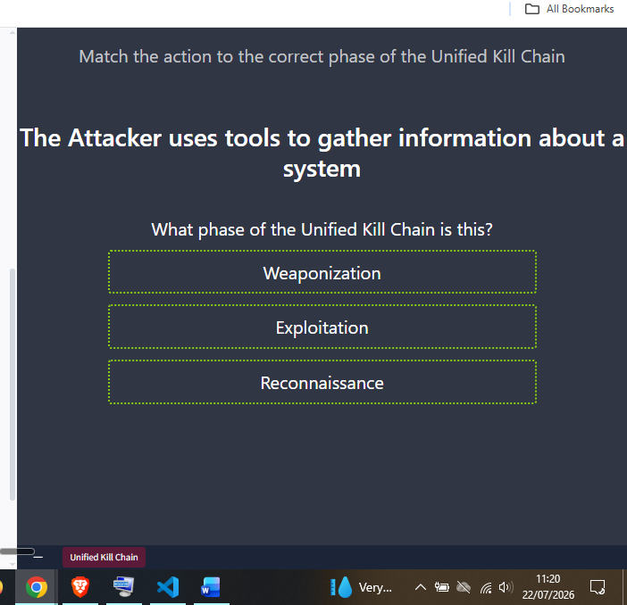
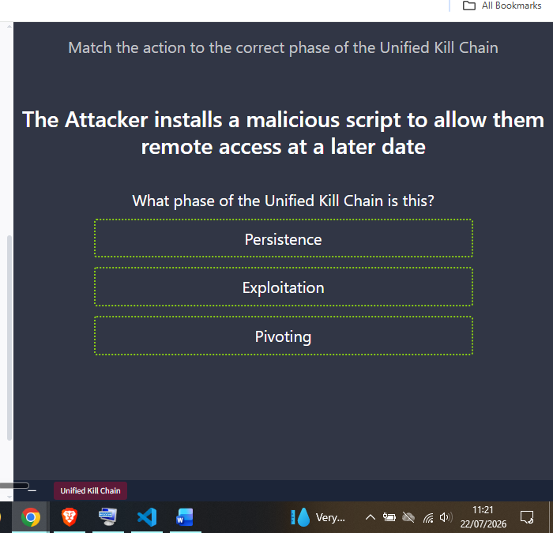
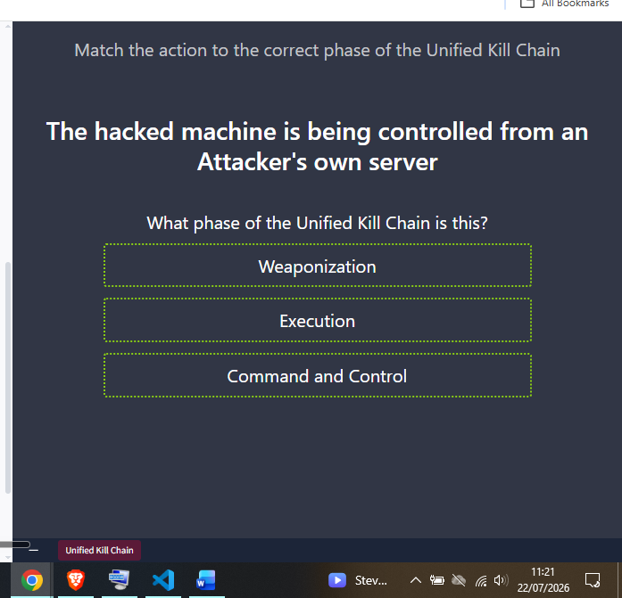
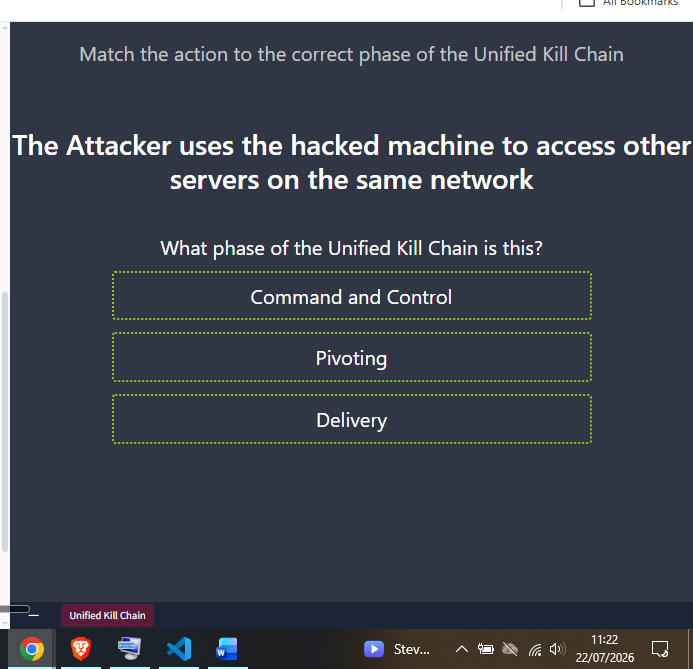
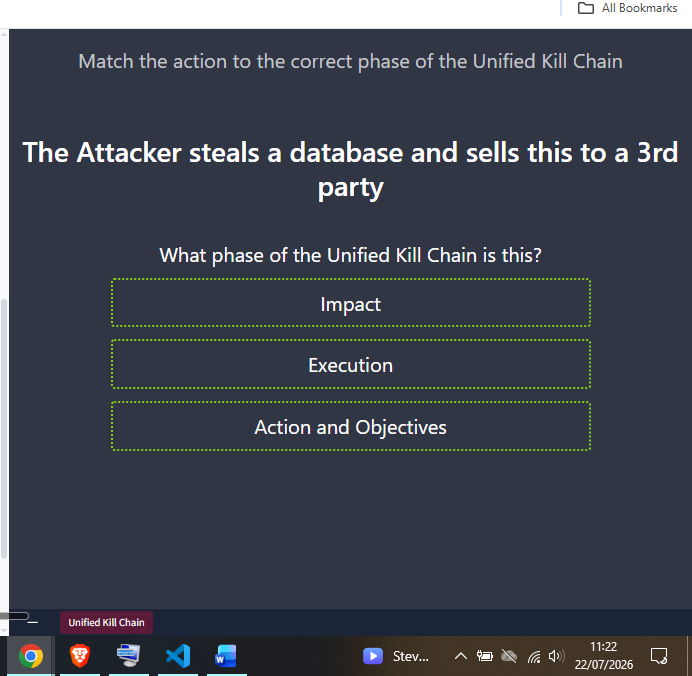
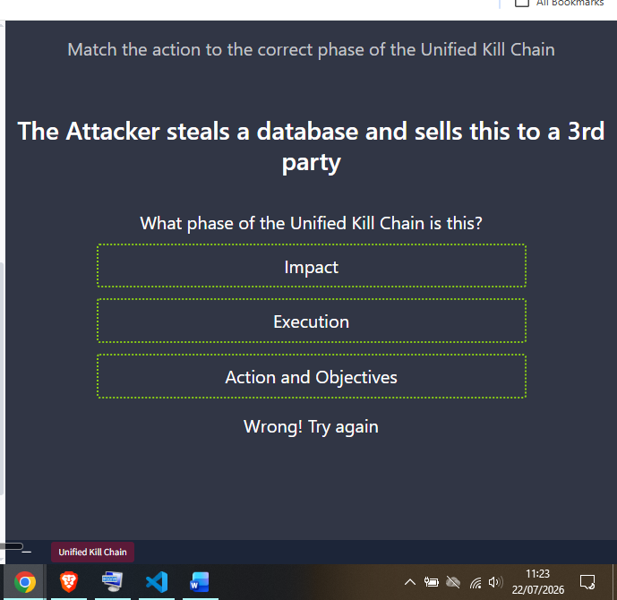
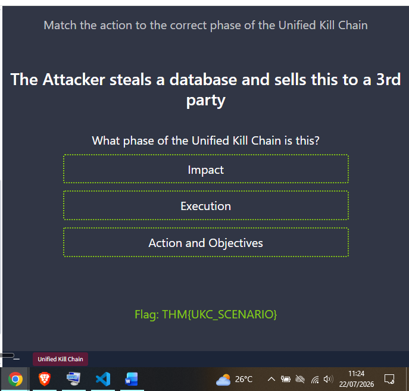

# Day 17: Unified Kill Chain

**Path:** SOC Level 1
**Platform:** TryHackMe
**Status:** ✅ Completed

---

## 📌 Overview

Where Lockheed Martin's Cyber Kill Chain covers 7 phases, Paul Pols'
**Unified Kill Chain (UKC)**, published in 2017, extends this to 18
phases — built to complement rather than compete with the original Kill
Chain and MITRE ATT&CK. The room groups those 18 phases under three
overarching goals:

**Goal: In (Initial Foothold)** — everything an attacker does to get a
first foothold. This starts with **Reconnaissance** (MITRE TA0043) —
passive or active info-gathering on systems, services, employee contact
lists, or leaked credentials — then **Weaponization** (TA0001), setting
up attack infrastructure like a C2 server, and **Social Engineering**
(TA0001), manipulating people directly (phishing attachments, fake
login pages, pretexting a password reset). **Exploitation** (TA0002) is
specifically defined in the UKC as abusing a vulnerability to achieve
code execution — uploading a reverse shell, hijacking an automated
script, exploiting a web app flaw. **Persistence** (TA0003) covers
maintaining that access (a malicious service, a C2 enrollment, a
backdoor triggered by a specific event), **Defence Evasion** (TA0005)
covers evading firewalls/AV/IDS, **Command & Control** (TA0011) is the
attacker's channel to actually run commands and steal data remotely,
and **Pivoting** (TA0008) is using the compromised host to reach systems
that aren't otherwise internet-accessible.

**Goal: Through (Network Propagation)** — once inside, if the objective
isn't complete, the attacker expands. This reuses **Pivoting** as a
staging point, then moves through **Discovery** (TA0007, mapping
accounts, permissions, software, shares, and configs), **Privilege
Escalation** (TA0004, working toward SYSTEM/root or admin-equivalent
access), **Execution** (TA0002, deploying the actual malicious code via
the pivot host — trojans, C2 scripts, scheduled tasks), **Credential
Access** (TA0006, stealing account credentials via keylogging or
dumping to blend in as a "legitimate" user), and **Lateral Movement**
(TA0008, using those credentials and privileges to reach further
systems).

**Goal: Out (Action on Objectives)** — the payoff. **Collection**
(TA0009) gathers the data of interest (drives, browser data, audio/
video, email), **Exfiltration** (TA0010) packages and steals it
(encrypted/compressed, often over the same C2 channel), and **Impact**
(TA0040) is where integrity/availability get hit directly — disk wipes,
ransomware encryption, defacement, DoS. The final **Objectives** step is
whatever the attacker's actual strategic goal was — financial extortion,
reputational damage, or something else entirely.

The room's hands-on portion was a scenario-matching quiz: match a
plain-language description of an attacker action to its correct UKC
phase, out of three possible options per question, to reveal the flag.

---

## 🛠️ Tools Used

- TryHackMe's Unified Kill Chain matching quiz (browser-based, no AttackBox/VM lab)
- No external tools — room content only

---

## 🪜 Steps Followed

**1. "The Attacker uses tools to gather information about a system"**
Chose between Weaponization, Exploitation, and Reconnaissance — this is textbook info-gathering before any access is attempted, so the correct phase is Reconnaissance.

**2. "The Attacker installs a malicious script to allow them remote access at a later date"**
Chose between Persistence, Exploitation, and Pivoting — installing something for later remote access is the definition of maintaining a foothold, so the correct phase is Persistence.

**3. "The hacked machine is being controlled from an Attacker's own server"**
Chose between Weaponization, Execution, and Command and Control — being actively controlled from the attacker's infrastructure is Command and Control by definition.

**4. "The Attacker uses the hacked machine to access other servers on the same network"**
Chose between Command and Control, Pivoting, and Delivery — using one compromised host to reach otherwise-unreachable systems on the same network is the definition of Pivoting.

**5. "The Attacker steals a database and sells this to a 3rd party" — first attempt**
Chose between Impact, Execution, and Action and Objectives.

**6. First answer was incorrect**
The selected answer came back "Wrong! Try again" — reviewed the three options again against the UKC's "Out" goal definitions before re-selecting.

**7. Selected "Action and Objectives" and captured the flag**
Stealing a database and monetizing it through a sale is exactly the "Out" goal's payoff step — Impact is specifically about damaging integrity/availability (wipes, ransomware, defacement), not data theft-for-profit, so Action and Objectives was the correct phase. The flag appeared on the correct submission.

---

## 🔍 Key Findings

- Correct matches: tools-based info gathering → **Reconnaissance**; malicious script for later remote access → **Persistence**; attacker-server-controlled hacked machine → **Command and Control**; using a hacked machine to reach other network servers → **Pivoting**; stealing and selling a database → **Action and Objectives**
- One incorrect attempt on the final question before landing on the right phase
- Flag: `THM{UKC_SCENARIO}`
- Pattern worth calling out: the option sets in each question were deliberately adjacent, plausible-sounding phases (Persistence vs. Exploitation vs. Pivoting; Impact vs. Execution vs. Action and Objectives) — the quiz is really testing whether you can distinguish *neighboring* phases, not just recall the full phase list in order.

---

## 💡 Lessons Learned

- The UKC's "In / Through / Out" three-goal grouping makes the 18 phases much easier to hold in your head than a flat list — I found myself categorizing each quiz question by goal first, then narrowing to the specific phase within that goal.
- The Impact vs. Action and Objectives distinction on the final question is one I'll want to keep straight going forward: Impact is specifically about damaging the CIA triad's integrity/availability (destructive), while Action and Objectives covers achieving the attacker's actual payoff, which can be non-destructive (like a straightforward data sale).
- This directly extends Day 16's Cyber Kill Chain room — the UKC's Reconnaissance/Weaponization/C2 phases map almost one-to-one onto the traditional Kill Chain's early phases, but the UKC's "Through" goal (Pivoting, Discovery, Privilege Escalation, Credential Access, Lateral Movement) fills in a level of internal-network detail the 7-phase model doesn't really break out on its own.
- Also connects to Day 15's Pyramid of Pain: Pivoting and Lateral Movement are exactly the kind of TTP-level behavior that sits at the top of the pyramid — hard for an attacker to change, and valuable to detect regardless of which specific tool or IP they're using that day.
