# Day 19: Summit

**Path:** SOC Level 1
**Platform:** TryHackMe
**Status:** ✅ Completed

---

## 📌 Overview

Summit is a purple-team simulation for PicoSecure: an external
penetration tester named Sphinx runs malware samples against a
simulated internal workstation, one at a time, and the job is to
configure PicoSecure's security tools (Malware Sandbox, Manage Hashes,
Firewall Manager, DNS Filter, and a Sigma Rule Builder) to detect and
block each sample before Sphinx's next attempt. The room is explicitly
built around Day 15's **Pyramid of Pain**: every time a sample gets
blocked, Sphinx has to invest more time and money to get past the new
detection, so each successive sample forces a move up the pyramid —
starting at Hash Values and ending at TTPs — until the cost of
continuing outweighs the reward and Sphinx gives up entirely.

I got a bit lost on what the lab actually wanted from me early on and
asked an AI assistant (Gemini) for orientation on the room's structure
before diving in — that's reflected in the screenshots below as a
research step, not a room-native screen.

The six samples, and the pyramid tier each one forced:

- **sample1.exe → Hash Values.** The Malware Sandbox's static analysis
  report gives a unique MD5/SHA1/SHA256 fingerprint for the file, which
  gets submitted to Manage Hashes to block that exact binary.
- **sample2.exe → IP Addresses.** The sandbox's dynamic/behavioral
  report shows the sample's actual network connections — a C2 IP the
  Firewall Manager can block.
- **sample3.exe → Domain Names.** The sandbox's DNS request log shows
  the domain the malware resolves before connecting — blocked via the
  DNS Filter instead of an IP, since Sphinx started rotating IPs behind
  a stable C2 domain.
- **sample4.exe → Host Artifacts.** No sandbox report this time —
  instead, a live Registry Activity feed shows the sample writing
  `DisableRealtimeMonitoring = 1` to the Windows Defender Real-Time
  Protection key. This needed an actual Sigma detection rule (built
  through PicoSecure's Sigma Rule Builder and mapped to a MITRE ATT&CK
  ID) rather than a simple blocklist entry.
- **sample5.exe → Network Artifacts.** Sphinx moved all the "heavy
  lifting" server-side so the tool and its artifacts could change
  freely — the tell instead was *behavioral*: a recurring 97-byte
  beacon connection roughly every 30 minutes, regardless of destination
  IP. The Sigma rule here had to key off connection size and frequency
  rather than any specific host or domain.
- **sample6.exe → Tools/TTPs.** The final sample's "heavy lifting"
  happened server-side too, but this time the tell was pure procedure:
  every reconnaissance command it ran (`dir`, `net localgroup
  administrator`, `systeminfo`, `ipconfig /all`, `netstat -ano`, `net
  start`) got piped into the same output file, `exfiltr8.log`. The
  detection rule targets the *creation of that file*, which stays
  constant no matter which specific commands or tools Sphinx swaps in —
  a TTP-level detection that survives a full tool rewrite.

---

## 🛠️ Tools Used

- TryHackMe's Summit lab (AttackBox-hosted PicoSecure web app)
- PicoSecure Malware Sandbox (static + dynamic/behavioral analysis)
- PicoSecure Manage Hashes (hash blocklist)
- PicoSecure Firewall Manager (ingress/egress IP rules)
- PicoSecure DNS Filter (domain-based rules)
- PicoSecure Sigma Rule Builder (Sysmon-based detection rules, MITRE ATT&CK-mapped)
- Gemini (external AI assistant, used briefly for orientation on the room's structure — not a room-native tool)

---

## 🪜 Steps Followed

### sample1.exe — Hash Values

**1. Read the intro brief from Sphinx**
Sphinx introduced the engagement and handed over the first sample, `sample1.exe`, with instructions to scan it in the Malware Sandbox and find a way to distinguish and block it.

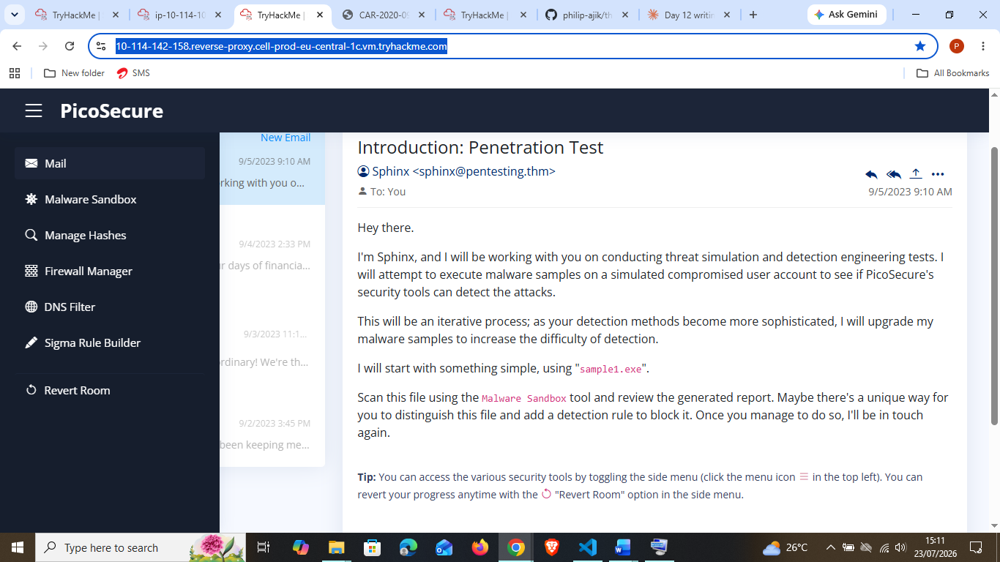

**2. Reviewed the PicoSecure side menu**
Opened the toggle menu per the intro email's tip, to see the full toolset available: Mail, Malware Sandbox, Manage Hashes, Firewall Manager, DNS Filter, Sigma Rule Builder, and Revert Room.

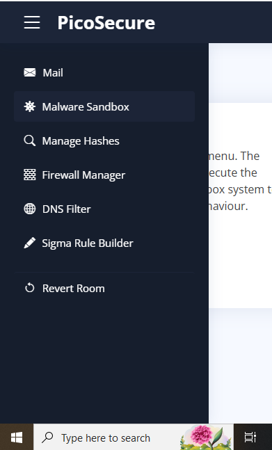

**3. Uploaded sample1.exe to the Malware Sandbox**
Selected sample1.exe from the dropdown and submitted it for analysis.

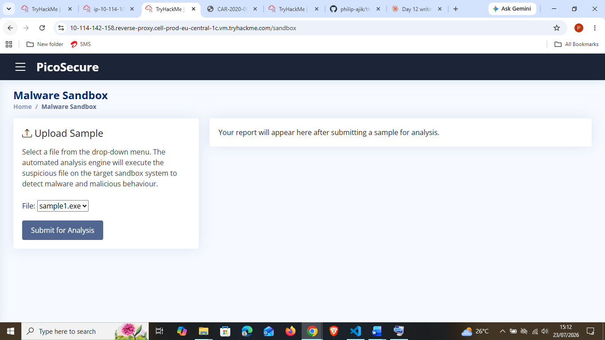

**4. Got oriented with outside help**
Wasn't immediately sure what the lab wanted structurally, so asked Gemini for guidance on the room — it confirmed the core mechanic: climb the Pyramid of Pain as each detection forces Sphinx to escalate.

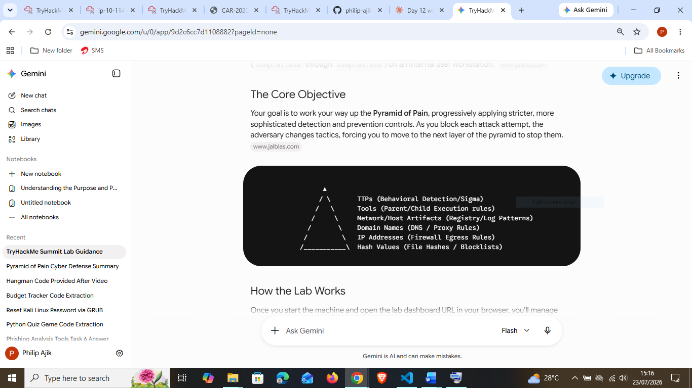

**5. Reviewed sample1's General Info report**
The sandbox flagged it as `Trojan.Metasploit.A` and returned unique MD5/SHA1/SHA256 hashes for the file.

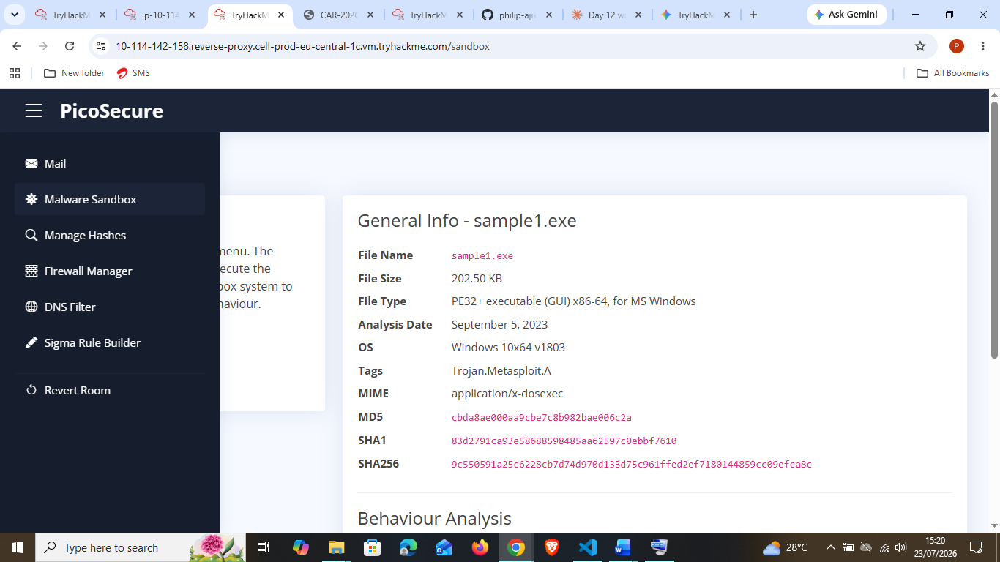

**6. Isolated the MD5 hash**
Highlighted `cbda8ae000aa9cbe7c8b982bae006c2a` as the unique identifier to block.

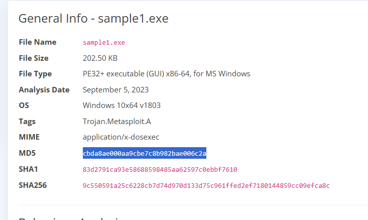

**7. Submitted the MD5 to Manage Hashes**
Added the hash to PicoSecure's blocklist — confirmed: "You prevented sample1.exe from executing by detecting its unique hash value."

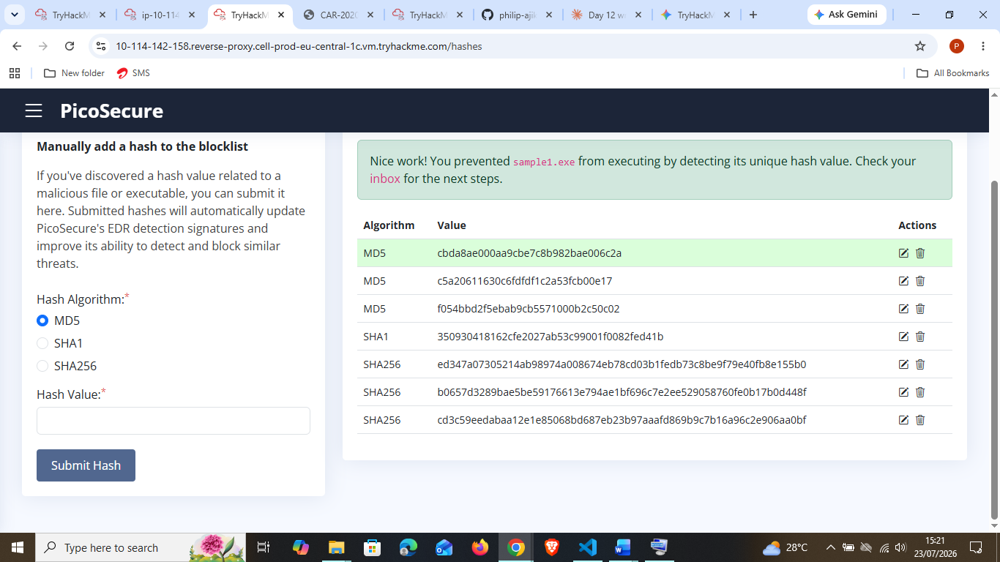

**8. Sphinx confirms the block and hands over sample2.exe**
Sphinx explained hashes are high-confidence but trivial to evade (a single changed bit produces a new hash) and moved to `sample2.exe`.

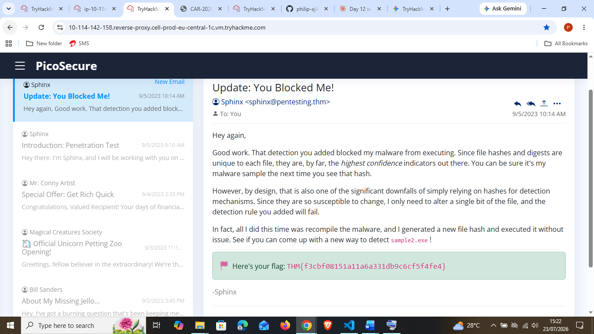

### sample2.exe — IP Addresses

**9. Reviewed sample2's General Info report**
Same Trojan.Metasploit.A tag, new hashes — expected, since Sphinx recompiled to dodge the hash block.

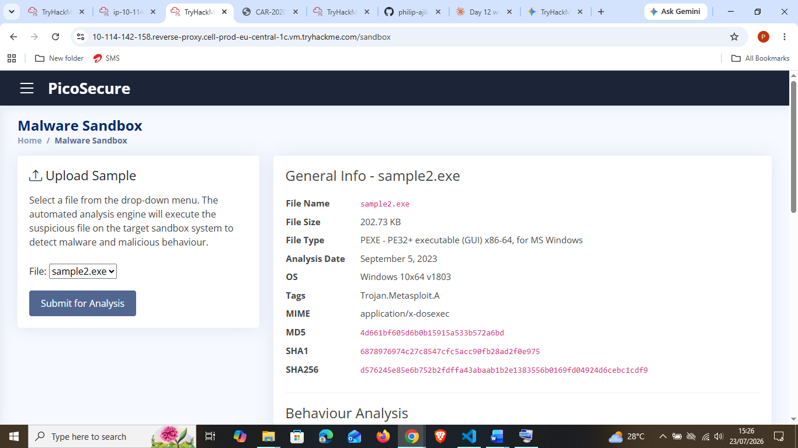

**10. Reviewed sample2's network activity**
The behavioral report showed an outbound GET request and connection to `154.35.10.113:4444`, hosted by Intrabuzz Hosting Limited — the C2 server.

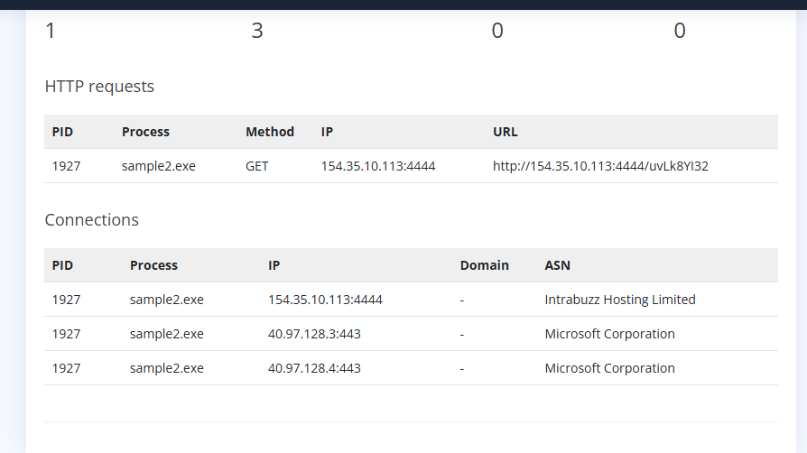

**11. Firewall rule attempt — Ingress**
First tried blocking Ingress traffic *from* `154.35.10.113` to Any, on the assumption of blocking the C2 source outright.

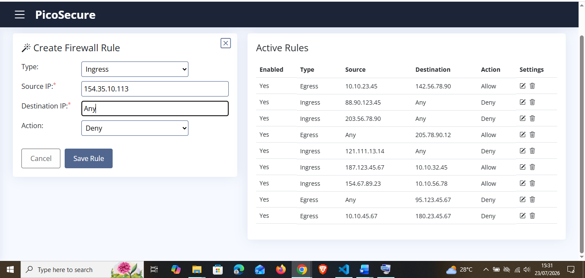

**12. Reviewed the Active Rules with the new Ingress entry**
The rule got added, but this alone didn't stop the malware — the connection is outbound (the infected host calling out to C2), not inbound, so an Ingress rule on that IP doesn't intercept it.

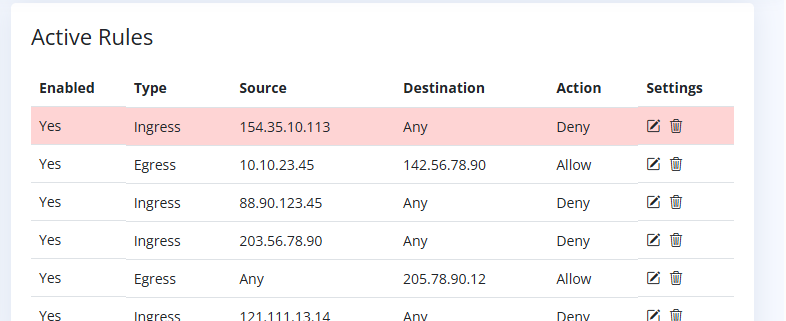

**13. Firewall rule correction — Egress**
Added a second rule: Egress from Any to `154.35.10.113`, Deny — blocking the host's own outbound beacon instead. This one worked: "The firewall rule prevented sample2.exe from connecting to the tester's command-and-control server."

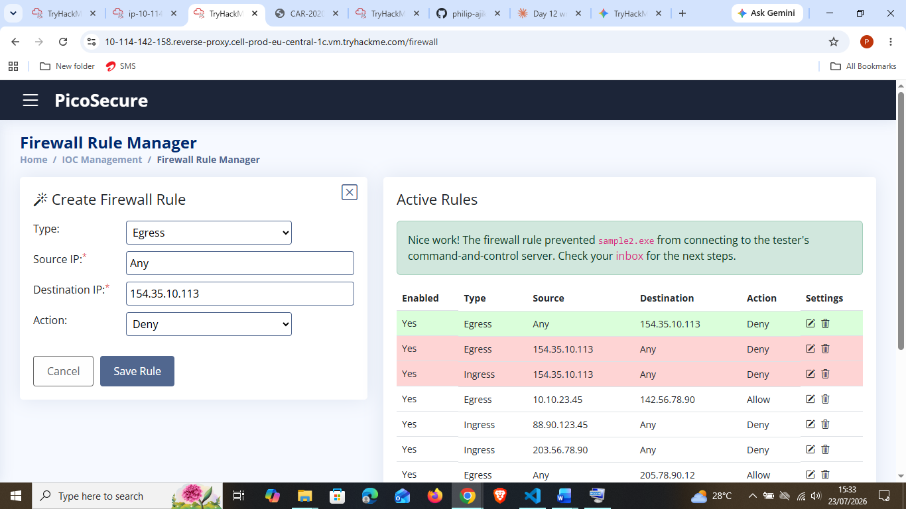

**14. Sphinx confirms the block and hands over sample3.exe**
Sphinx noted this method isn't bulletproof against a motivated adversary with more IPs and moved to `sample3.exe`.

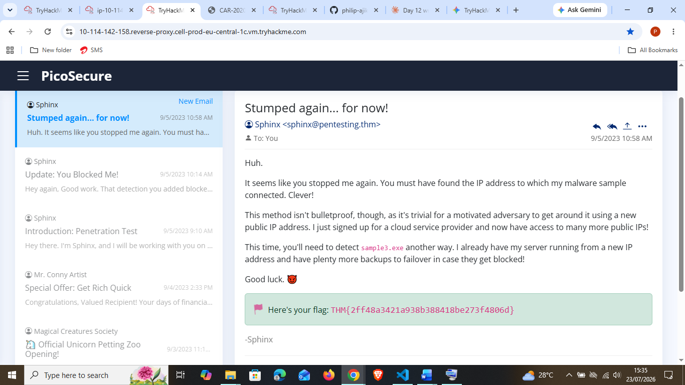

### sample3.exe — Domain Names

**15. Reviewed sample3's General Info report**
New file, new hashes, same Trojan.Metasploit.A tag.

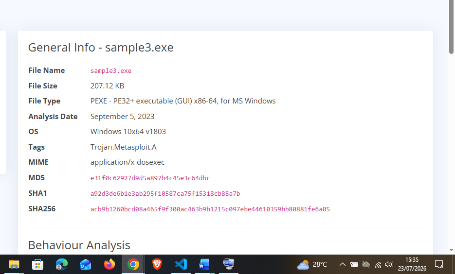

**16. Reviewed sample3's DNS requests**
The report showed connections and DNS lookups routing through `emudyn.bresonicz.info`, resolving to a new IP (`62.123.140.9`) hosted by Xplorita Cloud Services — confirming Sphinx had indeed rotated to fresh infrastructure behind a stable domain, plus a secondary `backdoor.exe` download from the same domain.

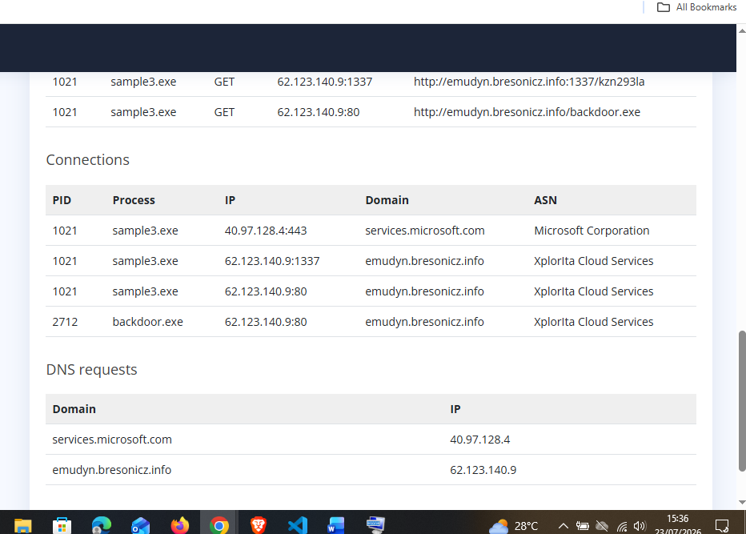

**17. Created a DNS Filter rule**
Since the IP had changed but the domain hadn't, added a rule blocking `emudyn.bresonicz.info` under the Malware category with a Deny action.

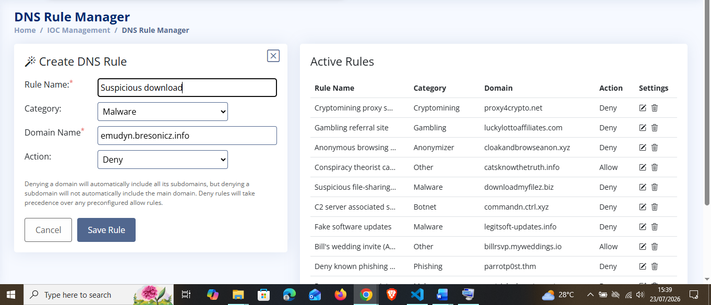

**18. Rule confirmed working**
"The DNS filter rule prevented sample3.exe from connecting to the tester's command-and-control server."

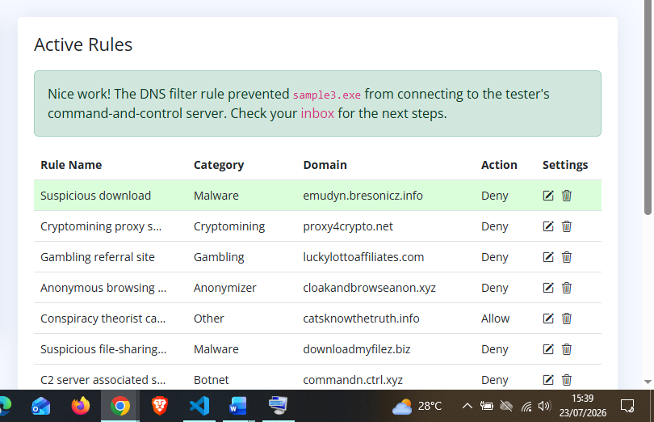

*(No screenshot captured of the follow-up mail assigning sample4.exe — the next screenshot jumps straight into sample4's registry activity.)*

### sample4.exe — Host Artifacts

**19. Reviewed sample4's live Registry Activity**
This sample didn't get a sandbox network report — instead, a live registry monitor showed 3 total events, including a write to `HKEY_LOCAL_MACHINE\SOFTWARE\Microsoft\Windows Defender\Real-Time Protection`, setting `DisableRealtimeMonitoring = 1`.

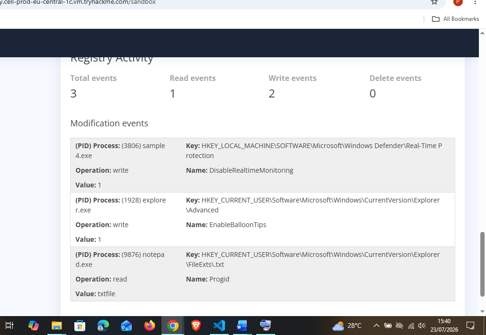

**20. Started building a Sigma rule**
Opened the Sigma Rule Builder and selected Sysmon Event Logs as the focus, since this needed an actual behavioral detection rule rather than a static blocklist entry.

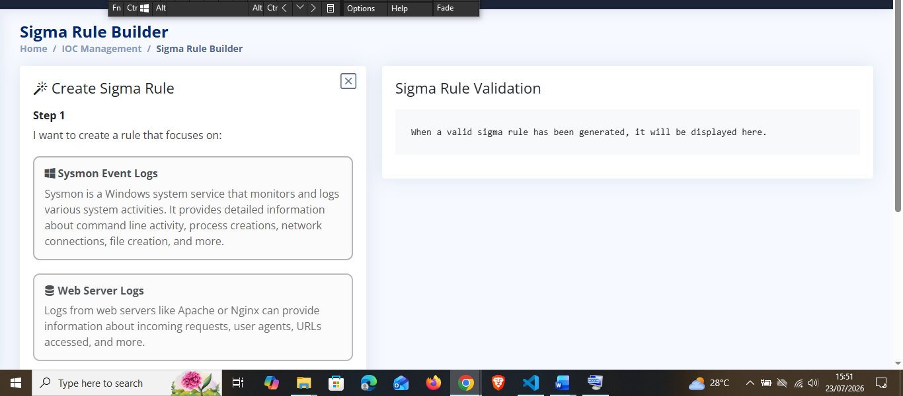

**21. First rule attempt — wrong condition type**
Tried building the rule under a "File Creation and Modification" condition, entering the registry path as the File Path and a made-up name ("Malicious process") as the File Name — the wrong tool for a registry-based indicator.

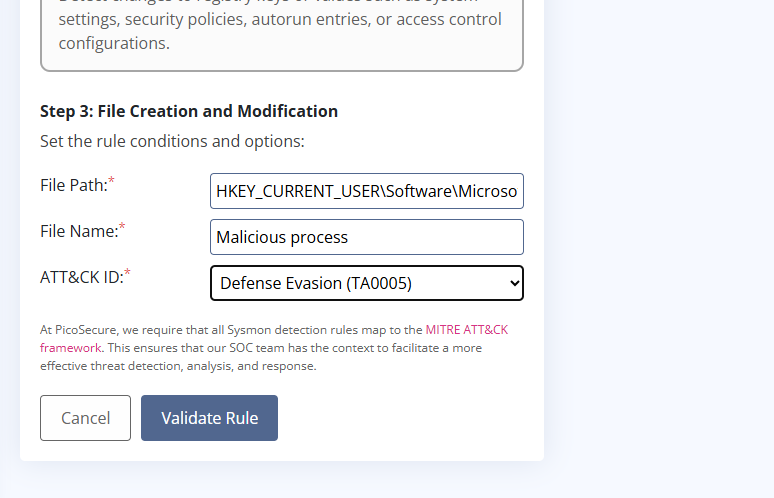

**22. Corrected to a Registry Modification condition**
Rebuilt the rule using the correct "Registry Modifications" step instead: Registry Key `HKEY_LOCAL_MACHINE\SOFTWARE\Microsoft\Windows Defender\Real-Time Protection`, Registry Name `DisableRealtimeMonitoring`, Value `1`, tagged to Defense Evasion (TA0005).

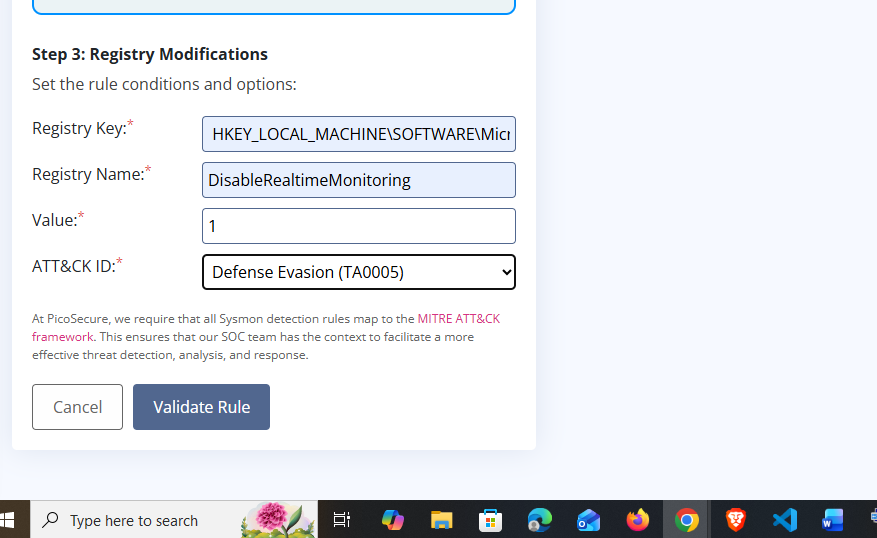

**23. Rule validated**
The builder generated a working Sigma rule — "Modification of Windows Defender Real-Time Protection" — keyed on Sysmon EventID 4663, the exact registry object and new value.

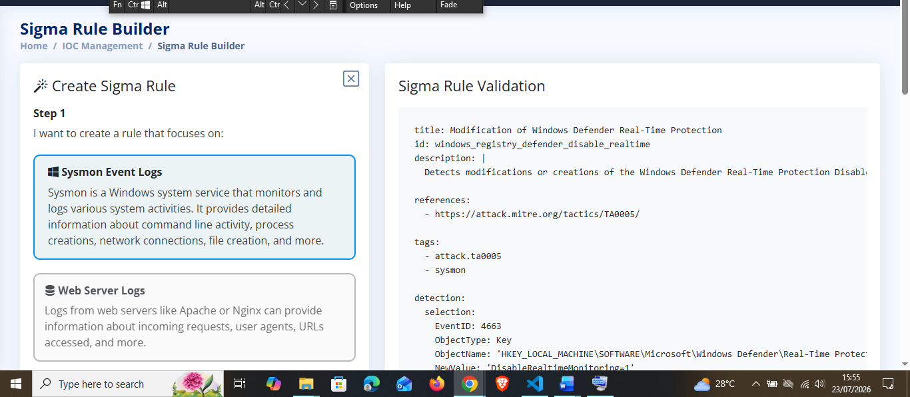

**24. Sphinx confirms the block and hands over sample5.exe**
Sphinx was visibly annoyed this time — noted the cost of retooling was adding up — and moved to `sample5.exe`, warning that this one moves all the "heavy lifting" server-side so its artifacts can change freely, and attached the last 12 hours of outgoing connection logs as a hint.

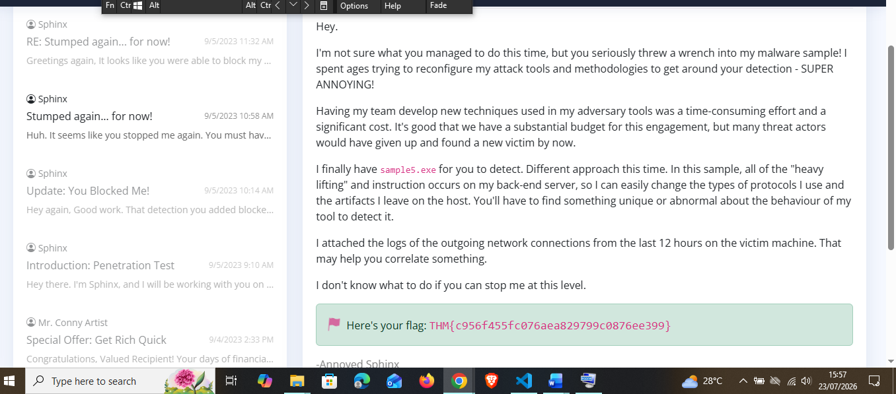

### sample5.exe — Network Artifacts

**25. Reviewed the outgoing connections log**
Scanned through `outgoing_connections.log` and found a recurring pattern: repeated 97-byte connections to `51.102.10.19:443` at regular ~30-minute intervals, standing out against the irregular sizes and destinations of normal traffic — a classic C2 beacon signature.

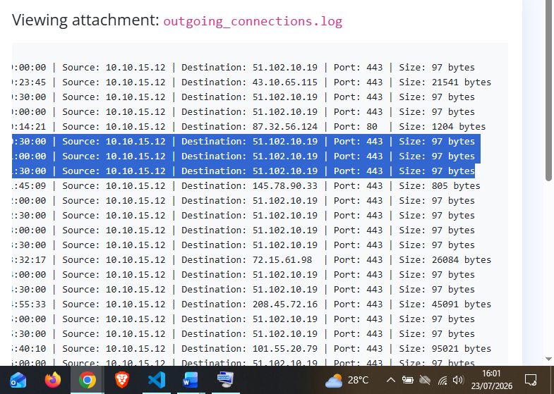

**26. Built a behavior-based Sigma rule**
Set Remote IP and Remote Port to "Any" (since the destination itself isn't the reliable signal), Size to 97 bytes, and Frequency to 1800 seconds (30 minutes), tagged to Command and Control (TA0011) — detecting the beacon's rhythm and payload size instead of any specific host.

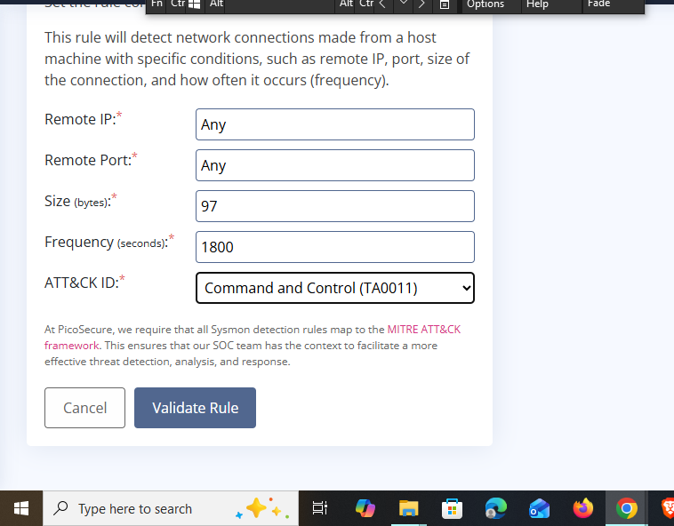

**27. Rule validated**
The builder generated "Alert on Suspicious Beacon Network Connections," detecting network connections matching that size/frequency pattern regardless of destination.

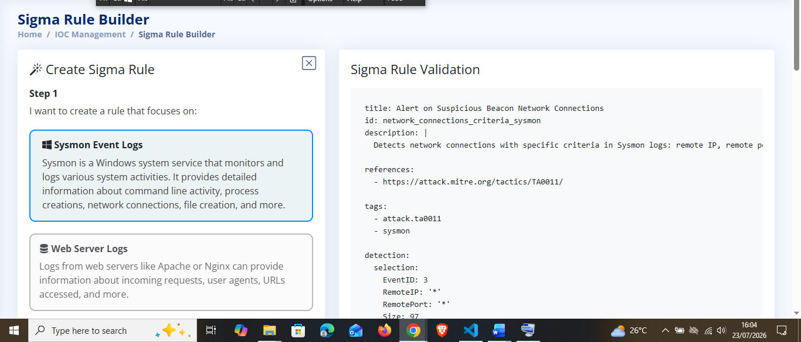

**28. Sphinx confirms the block and hands over sample6.exe — the last trick**
Sphinx was impressed and said this would be the last attempt, warning it needs more than artifact or tool detection this time — it has to target Sphinx's actual techniques and procedures — and attached the recorded command logs from all previous samples as a reference.

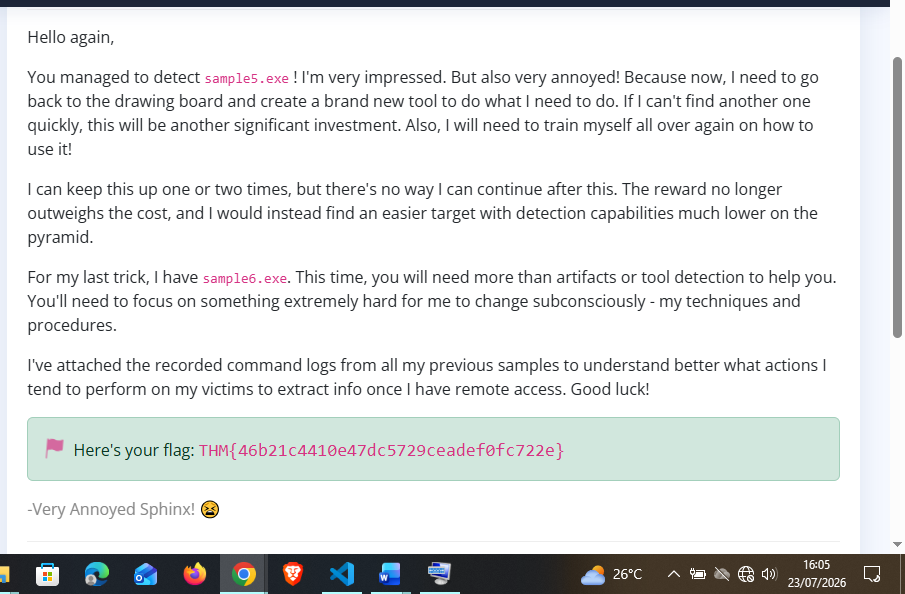

### sample6.exe — Tools/TTPs

**29. Reviewed the attached commands.log**
Every reconnaissance command Sphinx's samples had run — `dir c:\`, `dir "c:\Documents and Settings"`, `dir "c:\Program Files\"`, `dir d:\`, `net localgroup administrator`, `ver`, `systeminfo`, `ipconfig /all`, `netstat -ano`, `net start` — all piped their output into the same file: `%temp%\exfiltr8.log`.

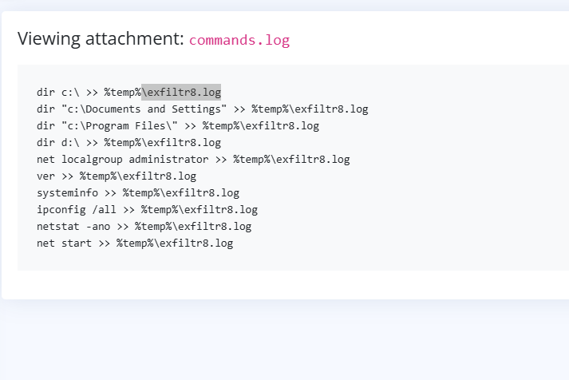

**30. Built a TTP-level Sigma rule**
Instead of detecting any individual command, set the rule to watch for the creation of that specific output file — File Path `%temp%`, File Name `exfiltr8.log` — tagged to Exfiltration (TA0010). This survives Sphinx swapping in entirely different recon commands, since the procedure of dumping everything to one file is the actual constant.

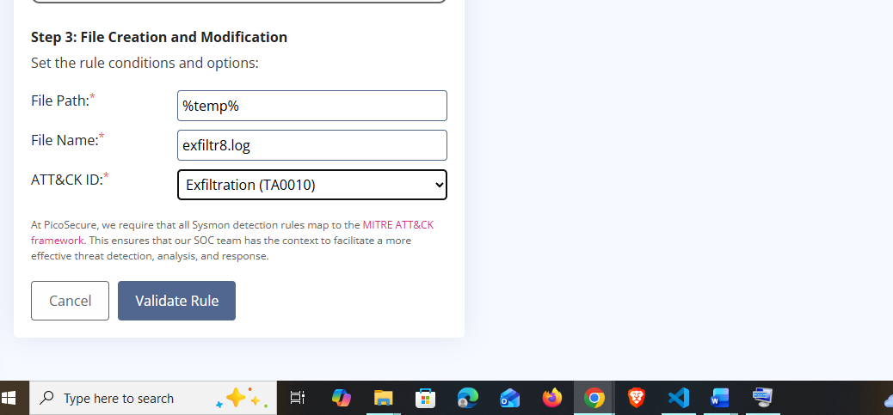

**31. Sphinx gives up — final flag captured**
With detection now covering hash, IP, domain, host artifact, network artifact, and TTP, Sphinx conceded the engagement, saying a full retrain and fresh research would be needed to get past this — and confirmed there'd be no further attempts.

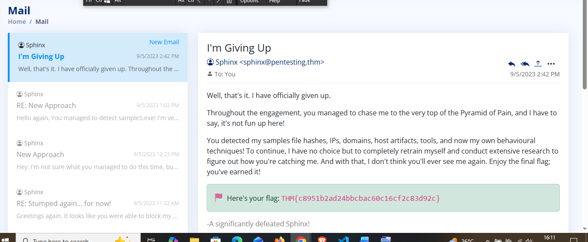

---

## 🔍 Key Findings

- Pyramid of Pain climb, sample-by-sample: **sample1** → Hash Values (MD5 blocklist) → **sample2** → IP Addresses (egress firewall rule, after an ingress-only rule failed to catch outbound C2 traffic) → **sample3** → Domain Names (DNS filter on the C2 domain after Sphinx rotated IPs) → **sample4** → Host Artifacts (Sigma rule on a Windows Defender registry key, after an initial wrong-condition-type attempt) → **sample5** → Network Artifacts (Sigma rule on beacon size/frequency, 97 bytes every 1800s) → **sample6** → Tools/TTPs (Sigma rule on the behavioral pattern of piping all recon output to one log file)
- Flags captured: `THM{f3cbf08151a11a6a331db9c6cf5f4fe4}` (sample1), `THM{2ff48a3421a938b388418be273f4806d}` (sample2), `THM{c956f455fc076aea829799c0876ee399}` (sample4), `THM{46b21c4410e47dc5729ceadef0fc722e}` (sample5), `THM{c8951b2ad24bbcbac60c16cf2c83d92c}` (sample6/final) — no screenshot was captured of the flag/mail for sample3's completion specifically, so that one isn't recorded here
- Two corrected wrong attempts along the way: an Ingress-only firewall rule that didn't stop sample2's outbound beacon (needed Egress instead), and a "File Creation and Modification" Sigma condition wrongly used for sample4's registry-based indicator (needed "Registry Modifications" instead)
- Both wrong attempts shared a root cause worth naming: picking the condition/rule type that matched the *indicator's storage location* rather than what it actually *did* — a registry key isn't a file, and an outbound beacon isn't inbound traffic

---

## 💡 Lessons Learned

- This room is basically Day 15's Pyramid of Pain made mechanical and adversarial — instead of matching descriptions to pyramid tiers in the abstract, each sample forced a real decision about which PicoSecure tool maps to which tier, and getting it wrong (like the ingress/egress mixup) had an immediate, visible consequence rather than an abstract "wrong answer" message.
- The room's structure doubles as a live argument for the pyramid's core thesis: sample1 through sample3 got progressively more annoying for Sphinx but were still detectable with static rules (hash, IP, domain); sample4 onward needed actual Sigma rules mapped to MITRE ATT&CK IDs, which is a qualitatively different (and more expensive, for both sides) kind of detection work.
- Sample6's detection is the one I'm most likely to reuse the reasoning from — instead of trying to catch every possible recon command an attacker might run, watching for the artifact their *procedure* consistently produces (one dumping ground file) is a much smaller, more durable rule.
- I did get oriented by asking an AI tool what the lab wanted early on, which is worth being upfront about — it didn't hand me answers, just clarified the room's overall shape (progressive pyramid climb) before I started working through the actual detections myself.
- Directly continues Day 18's MITRE ATT&CK material — every Sigma rule built here required picking a real ATT&CK ID (Defense Evasion, Command and Control, Exfiltration), which is exactly the CAR-style "ATT&CK technique → actual detection logic" pipeline that room described in the abstract.

