# Day 20: Eviction

**Path:** SOC Level 1
**Platform:** TryHackMe
**Status:** ✅ Completed

---

## 📌 Overview

This room drops you into the seat of Sunny, a SOC analyst at E-corp — a company that manufactures rare earth metals for government and non-government clients. Sunny receives a classified intelligence report warning that APT28 may be targeting organizations like E-corp. Instead of hunting blind, she's handed the MITRE ATT&CK Navigator layer for APT28 (Group G0007) and has to work through it column by column — Reconnaissance → Resource Development → Initial Access → Execution → Persistence → Defense Evasion → Discovery → Lateral Movement → Collection → Command and Control — to map out which of the group's known TTPs to hunt for, confirm whether any have already fired inside E-corp's network, and shut the intrusion down before data leaves the building.

The exercise is less about running tools and more about reading a threat intel layer correctly: for each ATT&CK tactic, identify the specific technique(s) that connect logically to the next stage of the intrusion. A recon technique that doubles as an initial-access vector, a resource-development step that sets up the accounts needed for phishing, a scripting interpreter that would show up in the logs if a malicious file actually ran — the room is really testing whether you can follow the attack chain forward, not just memorize a static list of techniques.

---

## 🛠️ Tools Used

- MITRE ATT&CK Navigator (APT28 / G0007 layer, hosted at TryHackMe's static-labs site)

No SIEM or endpoint tooling was used in this room — it's a pure threat-intel mapping exercise against a pre-built Navigator layer.

---

## 🪜 Steps Followed

**1. Loaded the APT28 layer in ATT&CK Navigator**
Opened the provided Navigator link and got the full picture of every tactic column with APT28's known techniques highlighted — Reconnaissance, Resource Development, Initial Access, Execution, Persistence, and further along Defense Evasion, Discovery, Lateral Movement, Collection, and Command and Control.

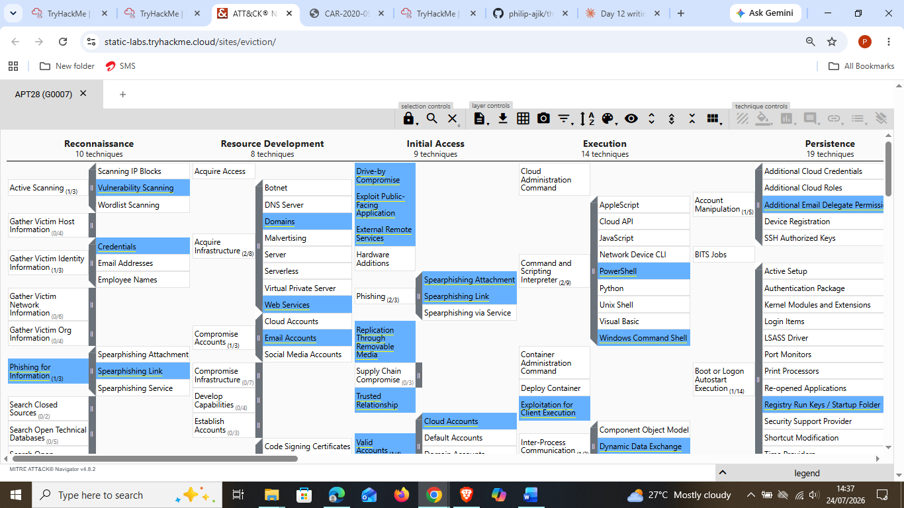

**2. Identified the dual-purpose recon/initial-access technique**
Under Reconnaissance, Spearphishing Link is highlighted alongside Phishing for Information — but it's the same technique that reappears under Initial Access, which is the giveaway that APT28 uses it both to gather information and as an actual entry vector.

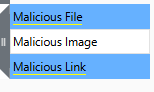

**3. Traced which accounts APT28 develops resources around**
Under Resource Development → Compromise Accounts, Email Accounts is highlighted (alongside Cloud Accounts and Social Media Accounts) — this is the account type Sunny needs to watch for, since compromised email accounts feed directly into the spearphishing infrastructure identified in the previous step.

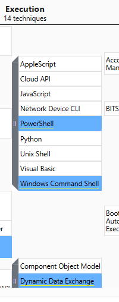

**4. Checked which user-execution technique gets the payload running**
Under Execution → User Execution, the room's answer calls out both Malicious File and Malicious Link as the techniques to watch for. In this screenshot, Malicious Link shows the highlighted background clearly — Malicious File is listed in the same submenu but isn't as visually distinct in this particular crop, worth double-checking against the live Navigator if reproducing this.

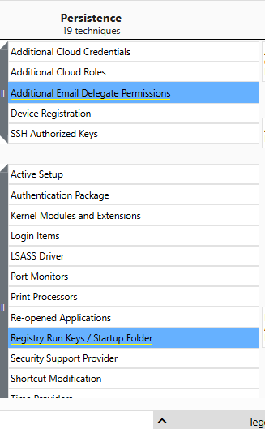

**5. Identified the scripting interpreters to search logs for**
If user execution succeeded, the next place to look is the scripting interpreters actually invoked. PowerShell and Windows Command Shell are both highlighted under Execution — these are the two interpreters Sunny should be filtering command-line logs for.

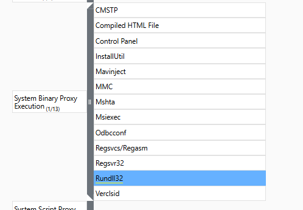

**6. Found the persistence mechanism behind the obfuscated scripts**
Assuming the obfuscated scripts found alongside those interpreters were modifying the registry to survive reboot, Registry Run Keys / Startup Folder is the highlighted persistence technique to track. Additional Email Delegate Permissions is also highlighted in the same column — a reminder that APT28 doesn't just persist on the host, it persists inside the mailbox too.

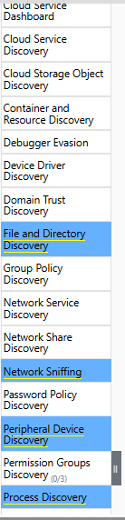

**7. Pinned down the defense-evasion proxy binary**
Under System Binary Proxy Execution, Rundll32 is the highlighted sub-technique — this is the LOLBin Sunny should scrutinize for signs APT28 is using a trusted Windows binary to proxy its own execution and dodge detection.

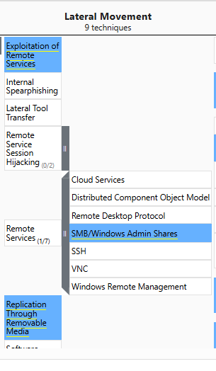

**8. Connected the discovered tcpdump binary to a Discovery technique**
Finding tcpdump on a compromised host points to Network Sniffing as the Discovery technique in play — visible highlighted here alongside File and Directory Discovery, Peripheral Device Discovery, and Process Discovery.

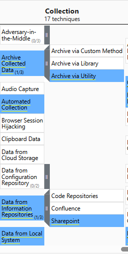

**9. Traced lateral movement to Windows admin shares**
Under Lateral Movement, Exploitation of Remote Services is highlighted, and drilling into Remote Services shows SMB/Windows Admin Shares specifically highlighted — the concrete service Sunny should be watching for APT28's lateral movement traces.

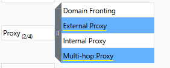

**10. Identified the collection target — E-corp's information repository**
With the goal being IP theft, the Collection tactic points to Data from Information Repositories, with Sharepoint specifically highlighted as the likely target — matching E-corp's need to protect its rare-earth-metals IP.

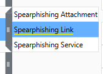

**11. Identified the proxy types blocking exfiltration**
The final piece: APT28 collected the data but couldn't reach its C2 for exfiltration. Under the Command and Control tactic's Proxy technique, External Proxy and Multi-hop Proxy are both highlighted — the two proxy types APT28 would fall back on to try to get data out.

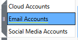

---

## 🔍 Key Findings

- Recon + Initial Access overlap: **Spearphishing Link**
- Resource Development account target: **Email Accounts**
- User Execution techniques: **Malicious File** and **Malicious Link**
- Scripting interpreters to search: **PowerShell** and **Windows Command Shell**
- Persistence mechanism: **Registry Run Keys / Startup Folder**
- Defense evasion / proxy execution binary: **Rundll32**
- Discovery technique tied to tcpdump: **Network Sniffing**
- Lateral movement vector: **SMB/Windows Admin Shares**
- Collection target: **Sharepoint** (E-corp's information repository)
- Exfiltration-blocking proxy types: **External Proxy** and **Multi-hop Proxy**
- End state: E-corp's IP was successfully protected — APT28 collected data internally but was thwarted before it could exfiltrate it out through C2.

---

## 💡 Lessons Learned

- The room's real skill isn't memorizing ATT&CK technique names — it's reading a layer as a *chain*, where the account type compromised in Resource Development explains the vector used in Initial Access, and the discovery technique explains what tool an analyst would actually find on disk (tcpdump → Network Sniffing).
- Spearphishing Link showing up in both Reconnaissance and Initial Access was the clearest example of how ATT&CK tactics aren't mutually exclusive stages — the same technique can serve two purposes for the same actor.
- Rundll32 as a proxy-execution binary is a pattern worth carrying forward: it's a legitimate Windows binary, which is exactly why it's attractive for defense evasion — a theme that connects back to earlier SOC Level 1 rooms on LOLBins and living-off-the-land techniques.
- Registry Run Keys as a persistence mechanism is a recurring one across this path — worth keeping a running mental list of persistence locations (registry, scheduled tasks, startup folders, email delegate permissions) since they keep showing up as the "final answer" across different rooms and different threat actors.
- The Additional Email Delegate Permissions technique was a good reminder that persistence isn't only host-based — mailbox-level persistence is just as real and often overlooked if you're only watching endpoint telemetry.

