# Day 21: Phishing Analysis Fundamentals

**Path:** SOC Level 1
**Platform:** TryHackMe
**Status:** ✅ Completed

---

## 📌 Overview

This room breaks down how to read and investigate an email the way an attacker built it, not just the way an inbox renders it. It starts with the basics of the email address itself: username, `@` symbol, and domain, and how that maps onto a real-world mailing address (domain = building, username = mailbox). From there it walks through the delivery protocols — SMTP for sending, POP3 for single-device download-and-delete, IMAP for server-side sync across devices — and the full journey a message takes: client → SMTP → DNS lookup for the recipient's mail server → delivery → retrieval via POP3/IMAP.

The core of the room is the split between an email's two parts: the **header** (routing metadata — From, To, Reply-To, Subject, Date) and the **body** (the actual rendered content, plain text or HTML). Viewing the raw **message source** exposes fields the inbox view hides entirely, most importantly `X-Originating-IP` (the real originating address) and `Authentication-Results` (which server evaluated SPF/DKIM/DMARC for the message). Viewing the **HTML source** of the body shows how tracking pixels, hidden links, and styling are actually structured behind what Thunderbird renders.

Attachments get the same treatment: a base64-encoded file embedded in the raw source carries `Content-Type` (the real file type), `Content-Disposition` (that it's an attachment, plus filename), and `Content-Transfer-Encoding: base64`. That base64 blob can be decoded back into the original file using CyberChef's `From Base64` recipe or a dedicated converter.

The room closes with a taxonomy of malicious mail — spam/malspam, phishing, spear phishing, whaling, smishing, vishing — and the common tells of a phishing email: spoofed sender, urgency, brand impersonation, generic greetings, disguised links, and disguised attachments (`invoice.pdf.exe`). It also introduces **defanging**: replacing `.`/`@` with bracketed equivalents (`hxxp[://]`, `10[.]253[.]62[.]157`) so IOCs can be written up without being clickable, plus a pointer toward Business Email Compromise (BEC) as the next topic.

---

## 🛠️ Tools Used

- Mozilla Thunderbird — rendered view + raw message source (`Ctrl+U`) for both emails
- CyberChef — `From Base64`, `From Hex`, and `Defang IP Addresses` recipes
- APIVoid's Base64-to-PDF converter — checked as an alternative to CyberChef, not what I ended up using for the actual decode
- Mousepad — reading the raw attachment MIME headers in `email2.txt`
- Xfce file manager — browsing the provided `Email Samples` folder

---

## 🪜 Steps Followed

**1. Reviewed the provided samples**
Before touching anything, I opened the `Email Samples` folder on the desktop to see what I was working with: `email1.eml`, `email2.txt`, and `email3.eml`.

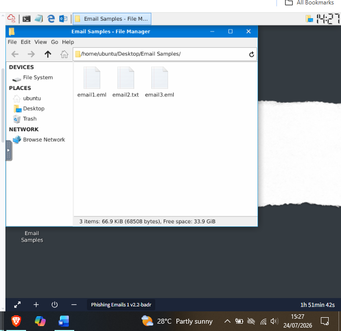

**2. Broke down email1's headers**
Opened `email1.eml` in Thunderbird and mapped out the five header components covered in the room — From, To, Reply-To, Subject, Date — against the rendered "ADT Security Services" message.

**3. Answered the subject line question**
Confirmed the full subject: **"Help protect your budget by protecting your home."**

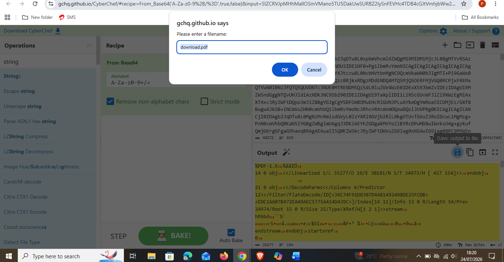

**4. Viewed the raw message source of email1**
Switched to View → Message Source (`Ctrl+U`) to see the full raw header block, which exposes fields the rendered view doesn't show at all.

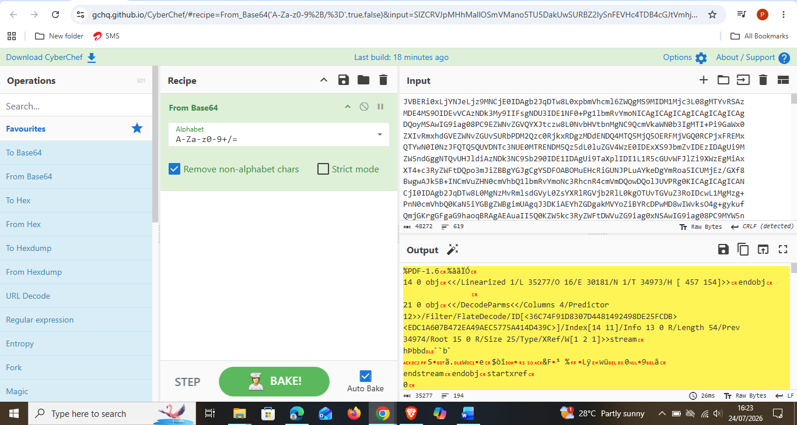

**5. Pulled the X-Originating-IP**
Found and highlighted the `X-Originating-Ip` field: **43.255.56.161**.

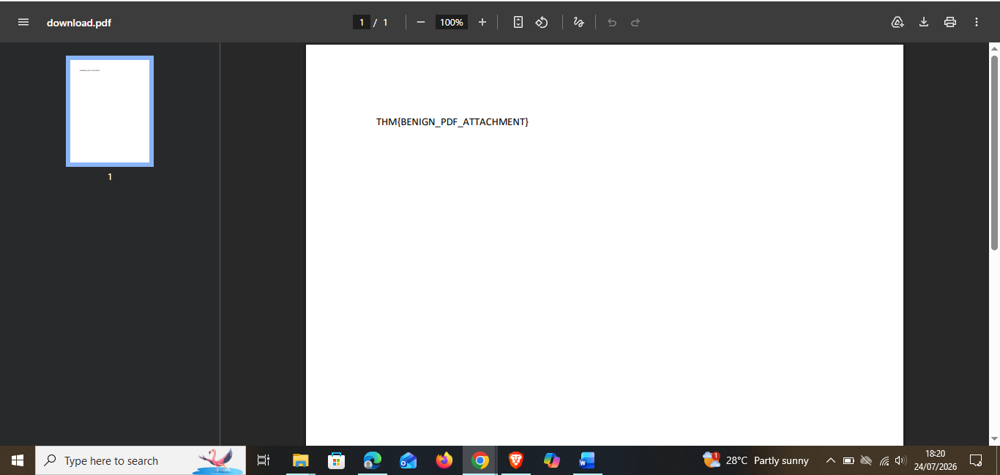

**6. Inspected the HTML source of the body**
Viewed the underlying HTML behind the rendered message — `Content-Transfer-Encoding: quoted-printable`, the ADT phone number embedded in a styled table, and the tracking/click-through links Thunderbird was blocking by default in the rendered view.

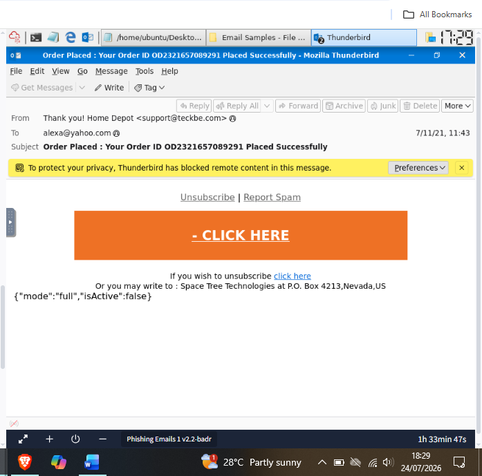

**7. Opened email2.txt to inspect the attachment**
This file is the source of an email carrying a PDF attachment. In Mousepad I could see the three headers the room calls out directly: `Content-Type: application/pdf`, `filename="zmqpalgh.pdf"`, and `Content-Transfer-Encoding: base64`, followed by the base64 blob itself.

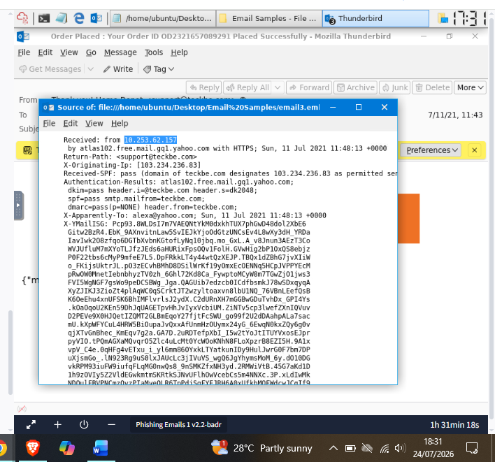

**8. Checked the alternative decode tool**
Before settling on CyberChef, I looked at APIVoid's Base64-to-PDF converter, which the room also lists as an option for reconstructing the attachment.

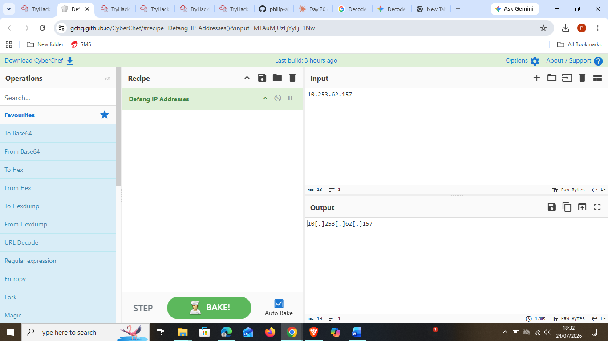

**9. Set up CyberChef instead**
Went with CyberChef's `From Base64` recipe as my decode environment.

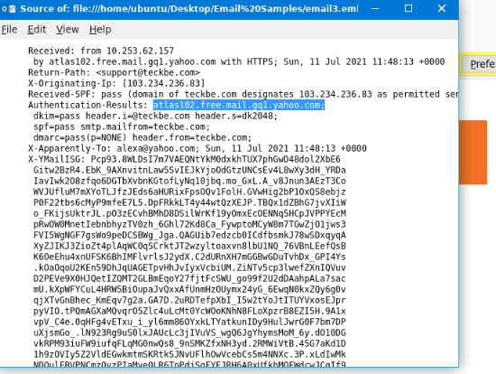

**10. Hit a decoding snag — hex mistaken for base64**
I pasted in a hex-looking string (`0917b1a3...`) and ran it through `From Base64`, which produced garbled bytes instead of readable text — the input was actually hex, not base64.

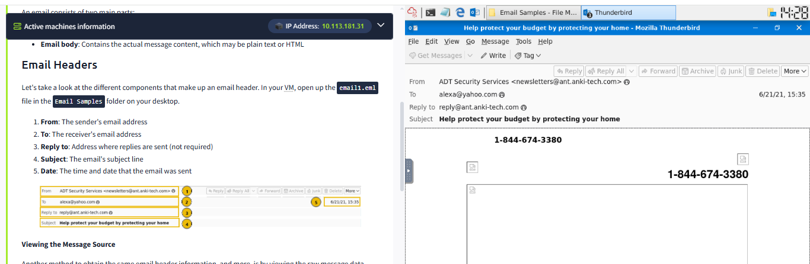

**11. Stacked From Hex on top instead of replacing**
Added a `From Hex` operation but left `From Base64` running above it, so CyberChef decoded from Base64 first and then tried to hex-decode the already-corrupted result — still garbled (`ACK BS`). The fix was removing `From Base64` entirely and keeping `From Hex` alone.

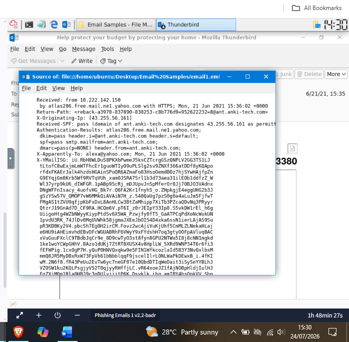

**12. Decoded the real attachment**
Working from the actual base64 blob out of `email2.txt` (not the short hex string from the troubleshooting step above), a plain `From Base64` recipe correctly decoded it — the output starts with `%PDF-1.6`, confirming a valid PDF.

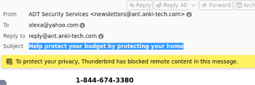

**13. Saved the decoded output as a PDF**
Used CyberChef's "Save output to file" and saved it as `download.pdf`.

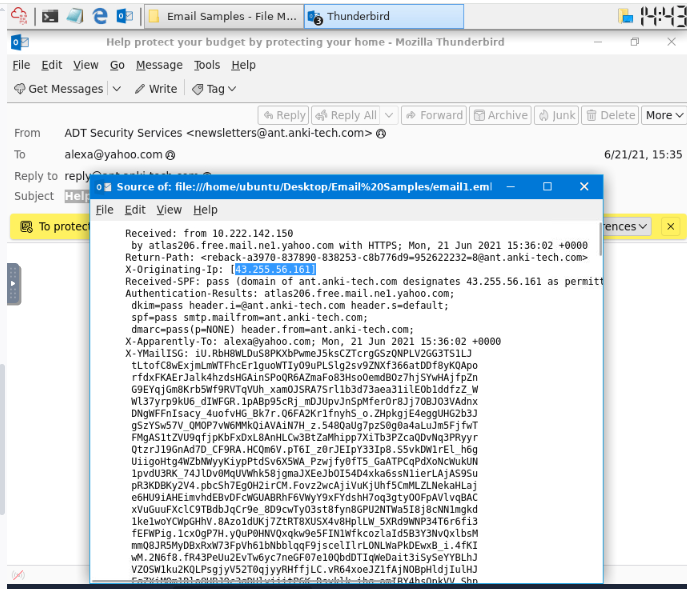

**14. Opened the reconstructed PDF**
The decoded PDF opened to reveal the flag: **`THM{BENIGN_PDF_ATTACHMENT}`**.

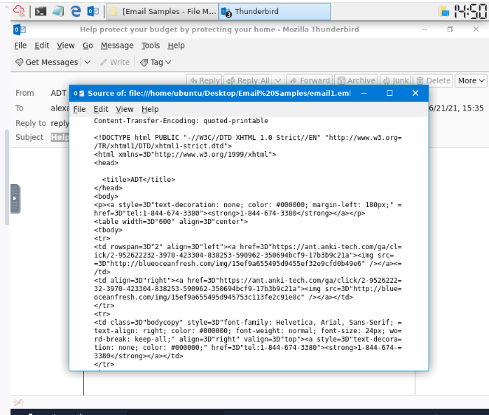

**15. Investigated email3 — the real test**
Opened `email3.eml`, rendered as a Home Depot order confirmation ("Order Placed: Your Order ID OD2321657089291 Placed Successfully").

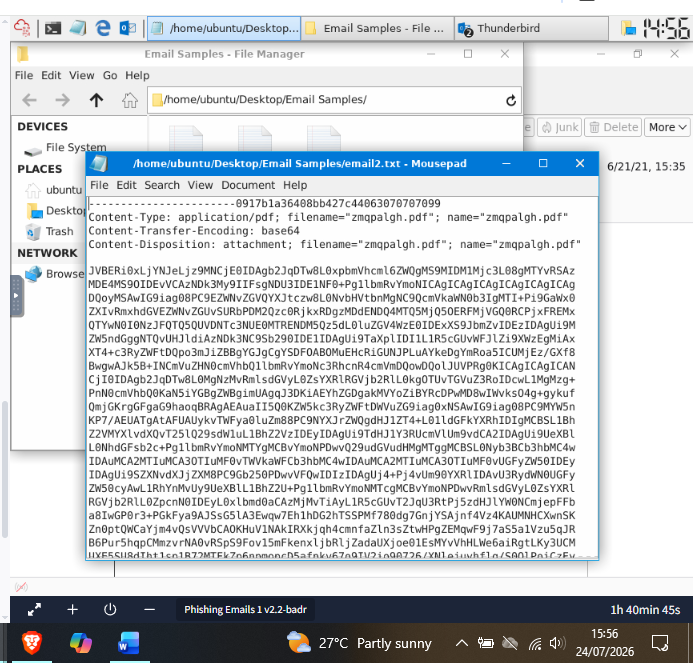

**16. Viewed email3's raw source**
Pulled up the message source and located the `Received:` chain, `Return-Path`, `X-Originating-Ip`, and `Authentication-Results` block.

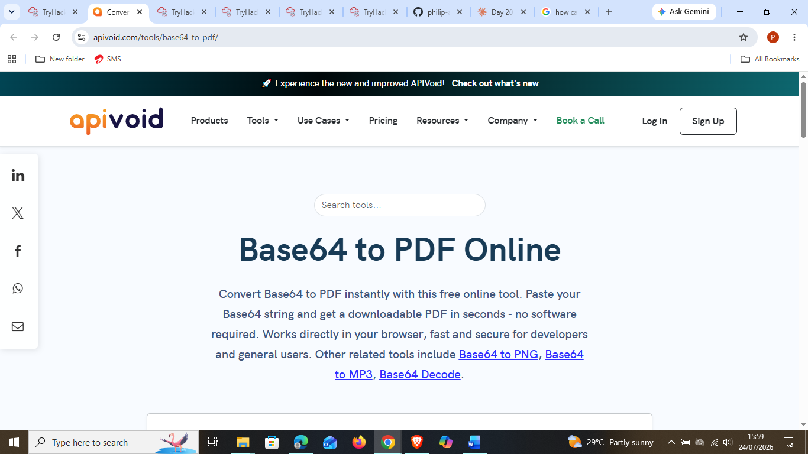

**17. Defanged an IP from the header**
Ran the `Received: from` IP (`10.253.62.157`) through CyberChef's `Defang IP Addresses` recipe, producing `10[.]253[.]62[.]157`. (Note: the room's actual answer key IP for this question is the `X-Originating-IP`, `103.234.236.83` → `103[.]234[.]236[.]83` — I defanged the `Received:` IP as a check on the technique itself, not the specific field the question was pointing at.)

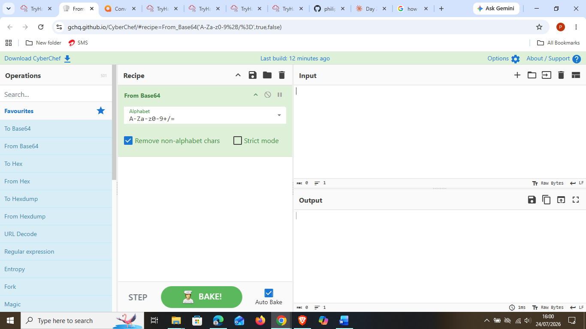

**18. Identified the Authentication-Results mail server**
Highlighted the server that generated the `Authentication-Results` header: **atlas102.free.mail.gq1.yahoo.com**.

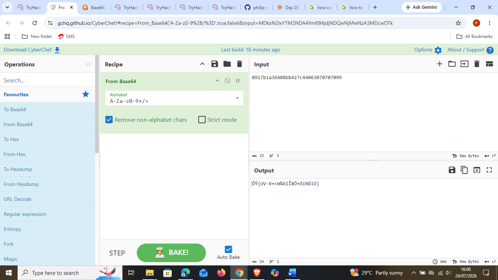

---

## 🔍 Key Findings

- **email1.eml** — Subject: `Help protect your budget by protecting your home` | X-Originating-IP: `43.255.56.161`
- **email2.txt** (attachment) — Content-Type: `application/pdf` | Filename: `zmqpalgh.pdf` | Flag: `THM{BENIGN_PDF_ATTACHMENT}`
- **email3.eml** — Spoofed brand: **Home Depot** | Sender: `support[@]teckbe[.]com` (domain has nothing to do with Home Depot) | X-Originating-IP (answer key): `103[.]234[.]236[.]83` | Authentication-Results generated by: `atlas102.free.mail.gq1.yahoo.com`
- The email2 attachment task was a good reminder that "readable" and "correctly decoded" aren't the same thing — a wrong recipe (Base64 on hex data, or two conflicting operations stacked) produces output that *looks* like a decode failure but is actually a configuration mistake, not a bad file.
- email3 is a textbook brand-impersonation case: the rendered content is dressed up as Home Depot, but the actual sending domain (`teckbe.com`) shares zero relationship with Home Depot's real domain — exactly the "Spoofed From Address" pattern the room's Anatomy of a Phishing Email section calls out.

---

## 💡 Lessons Learned

- The single biggest unlock in this room was learning to stop trusting the rendered inbox view and go straight to the raw source — `X-Originating-IP` and `Authentication-Results` simply don't exist in the normal Thunderbird view, but they're the fields that actually tell you where a message came from and whether it passed authentication checks.
- Getting garbled CyberChef output taught me to isolate variables one at a time: when a recipe fails, check whether the *input encoding* is what I assumed it was before adding more operations on top of a bad decode.
- Reconstructing an attachment from raw MIME headers (`Content-Type`, `Content-Disposition`, `Content-Transfer-Encoding`) made the abstract idea of "an email carries files as encoded text" concrete — I watched a base64 blob turn into an actual openable PDF.
- Defanging IOCs is a small habit but an important one for documentation hygiene — I practiced it on the wrong field this time (Received-from IP instead of the X-Originating-IP the question wanted), which was a useful mistake to catch rather than something to hide.
- Home Depot spoof in email3 reinforced a pattern I'm starting to see across this path: the sender domain is almost always the fastest tell, faster than anything in the rendered body.

