# Day 22: Phishing Emails In Action

**Path:** SOC Level 1
**Platform:** TryHackMe
**Status:** ⚠️ Completed (theory/example walkthrough — no hands-on lab in this room)

---

## 📌 Overview

This room is the practical follow-up to Day 21's Phishing Analysis Fundamentals. Instead of a lab machine, it hands over six real phishing samples (the room explicitly notes these are pulled from actual captured emails) and walks through the same header/body/attachment analysis from Day 21, but against live examples instead of theory. There's no VM to interact with here — the room's own screenshots are already annotated, and the task is to read the reasoning behind each red flag rather than reproduce it.

The six samples, in the order the room presents them:

1. **Cancel your order (PayPal)** — a spoofed transaction receipt for a gift card purchase. The `From` address (`gibberish@sultanbogor.com`) doesn't match the displayed `service@paypal.com`, and the only interactive element, a "Cancel the order" button, routes through a URL-shortening service (`is.gd`) to obscure the real destination. The room introduces WhereGoes as a tool for unwrapping shortened URLs without visiting them.
2. **Track your package (Distribution Center)** — a fake shipping notification where the display name "Distribution Center" doesn't match the sending domain `beginpro.club`. Yahoo auto-blocked the images in this one, and the raw source shows why: a 0×0 tracking pixel (`Tracking.png`) sitting alongside the visible tracking-number link, both routed through the same `devret.xyz` infrastructure.
3. **Download document here (Citrix fax)** — a multi-stage credential-harvesting chain. A "Download Document Here" link (with a same-day expiration to force urgency) leads to a fake OneDrive share, which chains to a fake Adobe Document Cloud page, which finally lands on a fake Outlook login. Even entering valid credentials here would just return a generic error, because the page's only job is forwarding whatever gets typed to the attacker.
4. **Your Account is on hold (Netflix)** — brand impersonation via a misspelled sender ("Netllx billing") and a malicious PDF attachment instead of a direct link, presumably to dodge link-scanning filters. The PDF's "Update Payment Account" link doesn't point at any real Netflix domain.
5. **Your Recent Purchase (Apple)** — the recipient is BCC'd rather than addressed directly, the body is completely blank, and the entire attack rides on a `.dot` (Word template) attachment — an unusual format for a "receipt." Clicking the embedded image inside the document redirects through a long, convoluted URL designed to look legitimate at a glance (using words like "apps" and "ios").
6. **Scheduled shipment (DHL)** — spoofed DHL branding paired with a malicious `.xlsx` attachment. The spreadsheet itself is a mess of contradictions (German sender domain, Indian delivery address, Mandarin-language content) and contains a link that, when clicked, tries to download and execute `regasms.exe` — a payload that would normally aim for persistence, data exfiltration, or ransomware deployment, though it errored out harmlessly in this captured sample.

---

## 🛠️ Tools Used

No hands-on lab or VM in this room — it's a guided read-through of the room's own annotated real-world samples. No tools of my own were used beyond reading the material; the room itself references WhereGoes for unwrapping shortened URLs, though I didn't run it myself here.

---

## 🪜 Steps Followed

**1. Cancel your order — PayPal spoof**
Reviewed the email header: subject line built around a fake $120 gift-card transaction, sender `service@paypal.com` not matching the real address `gibberish@sultanbogor.com`.

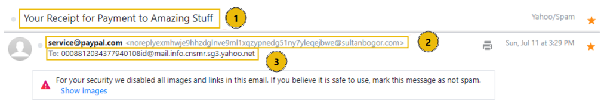

**2. Cancel your order — body and button**
Looked at the rendered body — a fake PayPal receipt for a "Amazing Stuff" gift card purchase, with a single interactive "Cancel the order" button as the only call to action.

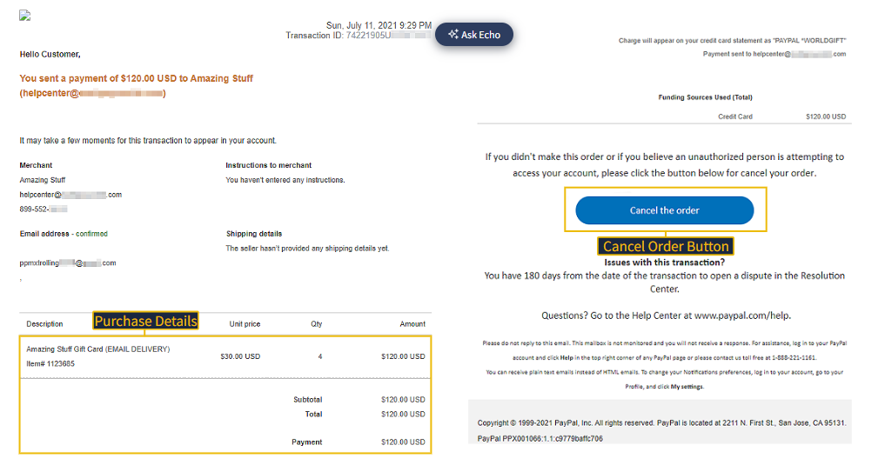

**3. Cancel your order — unwrapping the shortened URL**
Traced the button's `href` in the raw HTML to a `is.gd` shortened link, then followed the room's use of WhereGoes to preview the real destination without visiting it directly.

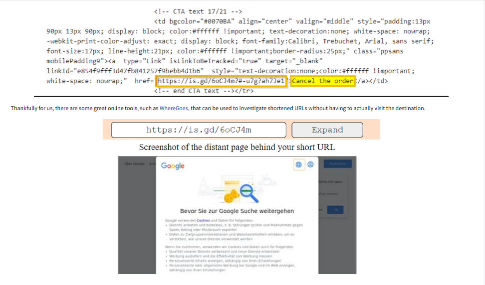

**4. Track your package — header**
Noted the mismatch between the "Distribution Center" display name and the actual sender, `contact@beginpro.club`.

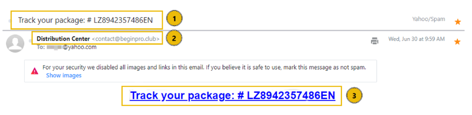

**5. Track your package — HTML source and tracking pixel**
Reviewed the raw HTML: the visible "Track your package" link and a hidden 0×0 tracking pixel (`Tracking.png`) both routed through the same `devret.xyz` domain — this is why Yahoo blocked the images automatically.

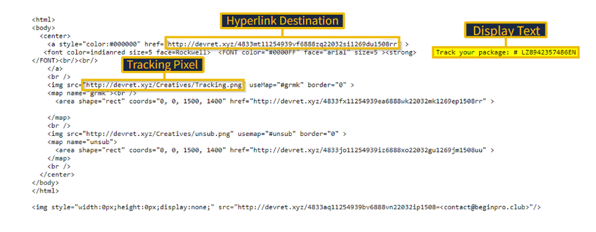

**6. Download document here — the Citrix fax email**
Reviewed the initial lure: a fake "Citrix Attachments" notification with a same-day expiration date and a "Download Document Here" link, built to pressure a fast click.

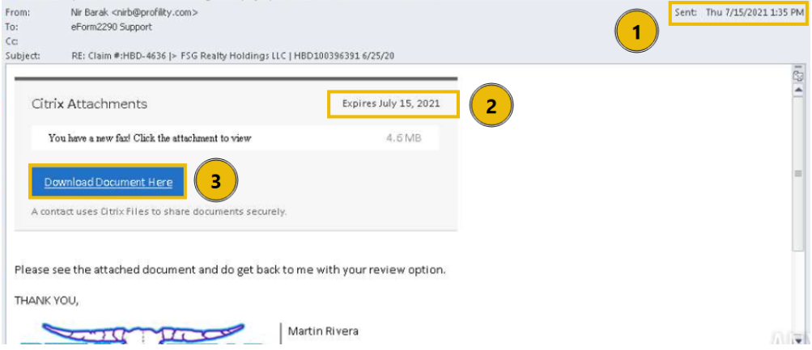

**7. Download document here — the redirect chain**
Followed the room's walkthrough of the landing pages: a fake OneDrive share page, then a fake Adobe Document Cloud page with a shady URL and oddly-worded instructions.

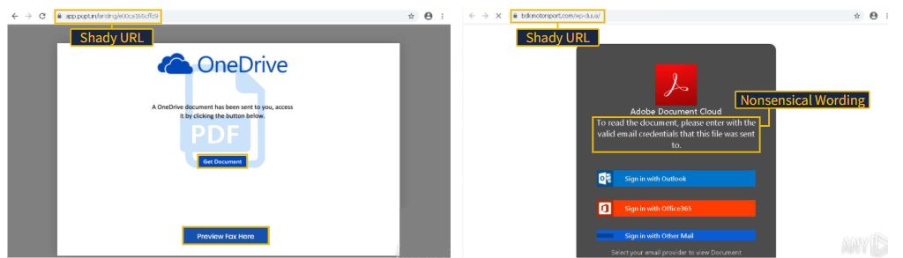

**8. Download document here — the credential harvest**
Reviewed the final step: a fake Outlook login prompt on `bdkmotorsport.com` that returns "InValid Credentials" no matter what's entered, since it's only forwarding the input to the attacker rather than authenticating anything.

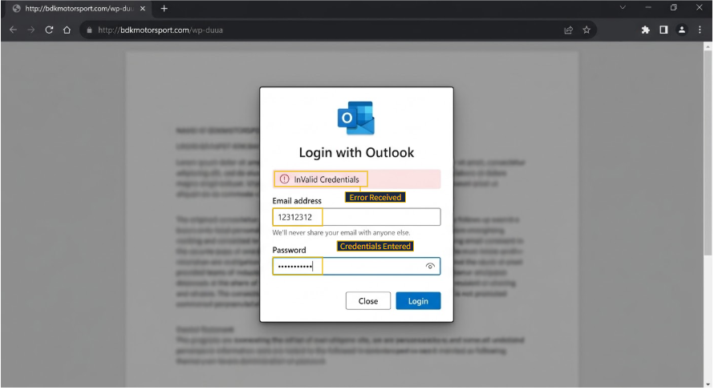

**9. Your Account is on hold — Netflix header**
Noted the sender display name "Netllx billing" (deliberate misspelling) and the "Your account is on hold" urgency hook.

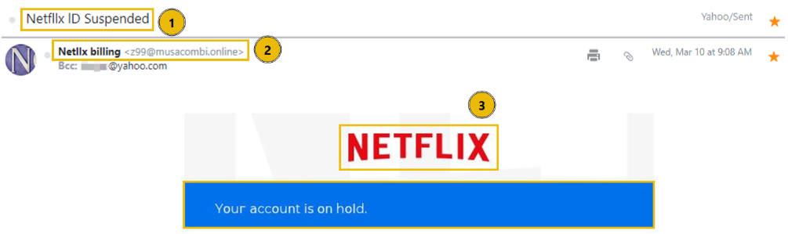

**10. Your Account is on hold — PDF attachment**
Reviewed the body and the attached PDF, which contains an "Update Payment Account" link pointing away from any real Netflix domain, plus an atypically formatted support phone number.

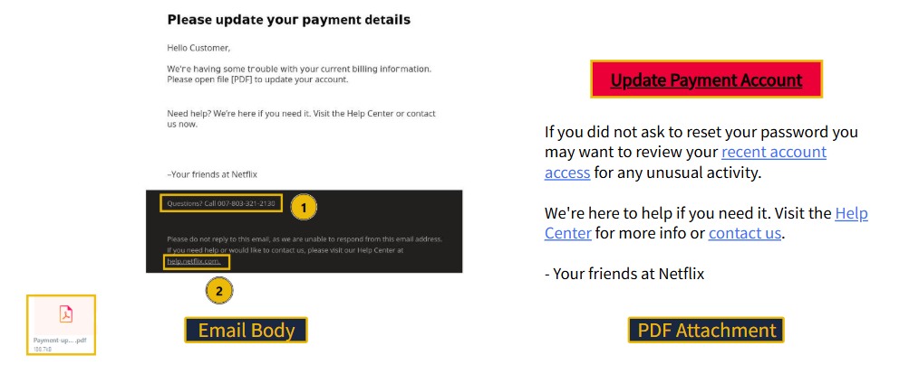

**11. Your Recent Purchase — Apple header**
Noted the BCC'd recipient, the "Action Required" urgency in the subject, and the typo-laden From/To addresses under the "Apple Support" display name.

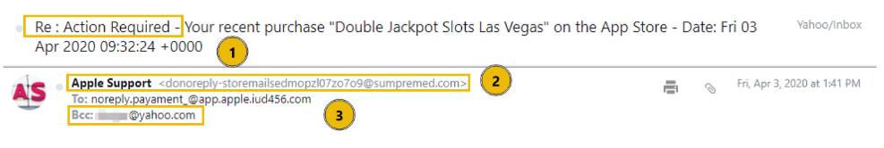

**12. Your Recent Purchase — .dot attachment and redirect**
Reviewed the blank email body and the unusual `.dot` attachment, whose embedded image links out to a long, deliberately convoluted redirect URL.

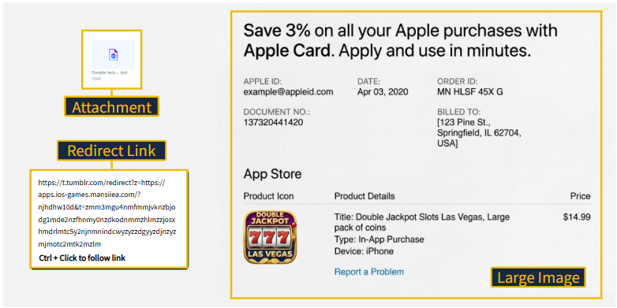

**13. Scheduled shipment — DHL header**
Noted the "DHL Express" display name not matching the real sending domain.

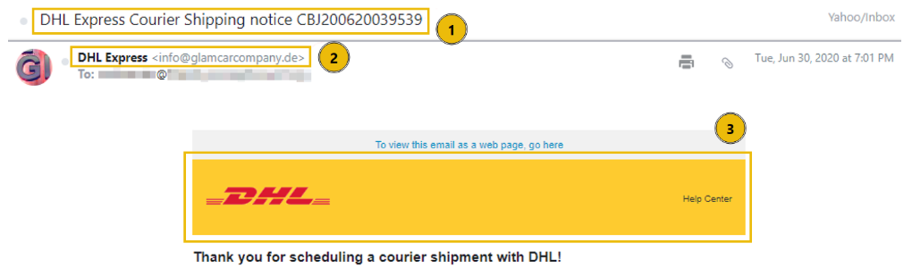

**14. Scheduled shipment — the .xlsx attachment**
Reviewed the attached spreadsheet: a German sender domain, an invoice addressed to a city in India, and Mandarin-language document content — three geographic markers that don't belong together.

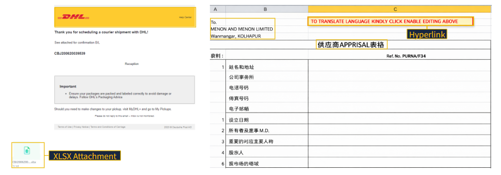

**15. Scheduled shipment — the executable**
Reviewed the payload: clicking the link inside the spreadsheet attempts to download and run `regasms.exe`, which threw a 16-bit MS-DOS subsystem error in this captured sample instead of executing.

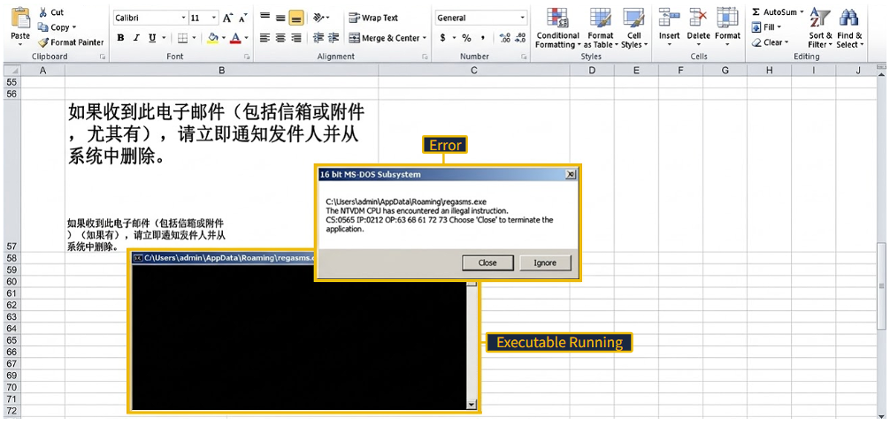

---

## 🔍 Key Findings

- **PayPal sample:** spoofed sender `gibberish@sultanbogor.com`, malicious link hidden behind an `is.gd` shortener.
- **Track your package:** spoofed sender `contact@beginpro.club`, hidden tracking pixel + visible link both routed through `devret.xyz`.
- **Download document here:** multi-stage redirect (fake OneDrive → fake Adobe → fake Outlook login); this is a **credential harvesting** attack — the technique the room's embedded question specifically names.
- **Netflix sample:** typo'd sender "Netllx billing," malicious link delivered via PDF attachment instead of a direct URL.
- **Apple sample:** recipient BCC'd, blank email body, malicious `.dot` attachment instead of body text.
- **DHL sample:** malicious `.xlsx` attachment attempting to drop and execute `regasms.exe`, with a real capability chain toward persistence, data exfiltration, or ransomware if it had run successfully.
- Recurring pattern across all six: none of them rely on a single tell. Every sample stacks a sender mismatch with an urgency hook with a payload delivery method (link, attachment, or both) — the red flags compound rather than standing alone.

---

## 💡 Lessons Learned

- The room's biggest reframe from Day 21 was showing how the exact same header-analysis technique (From address vs. display name, raw source inspection) applies identically whether the room hands you a training email or an actual captured phishing sample — the method doesn't change, only the stakes do.
- Attachments are being used as a deliberate alternative to links across several of these samples (Netflix's PDF, Apple's `.dot`, DHL's `.xlsx`) — worth remembering that "no suspicious link in the body" doesn't mean an email is safe.
- The DHL sample's geography mismatch (German domain, Indian recipient, Mandarin content) was a good reminder that some of the strongest tells aren't in the header at all — they're in internal inconsistencies within the payload itself.
- The room's closing note on AI-generated phishing content stuck with me: this sample set still had visible grammar and formatting issues to lean on, but that tell is disappearing as attackers use AI to clean up their copy, so header/domain/URL analysis needs to be the primary method, not spelling.
- This connects directly back to Day 21 — the Home Depot spoof there and the PayPal/DHL/Netflix spoofs here are the same brand-impersonation pattern, just with the sender-domain mismatch as the consistent tell across every single case.

