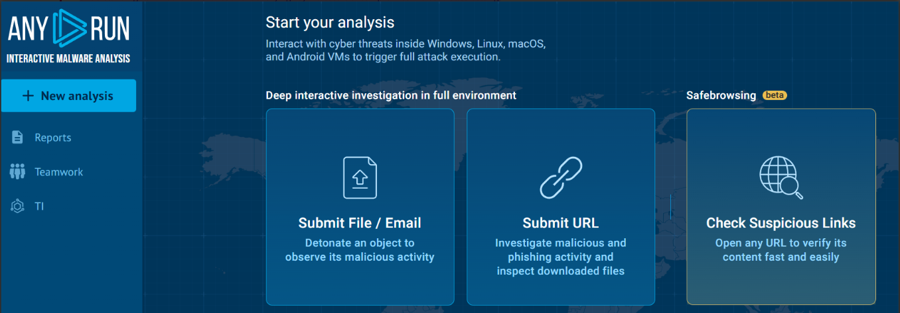
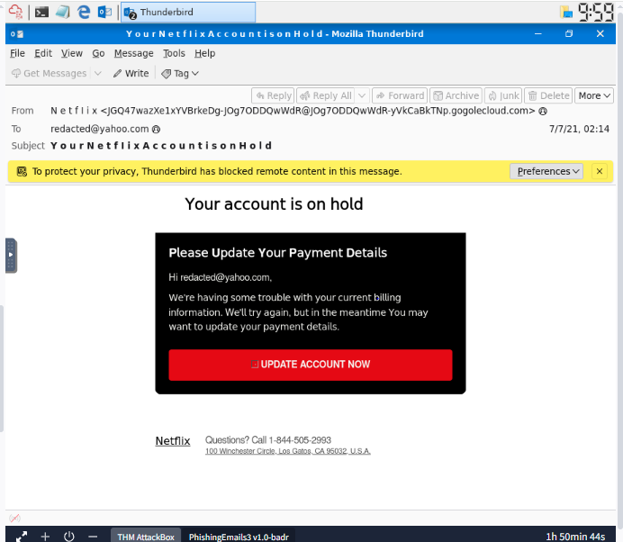
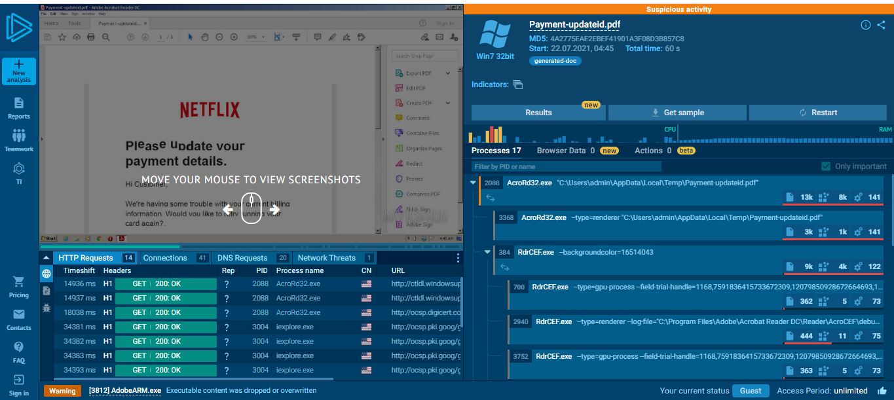
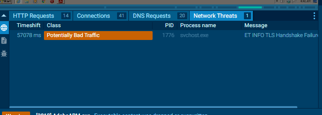
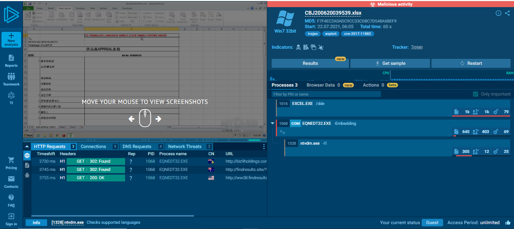
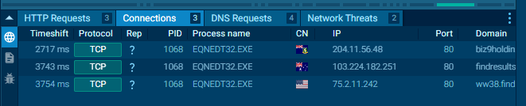
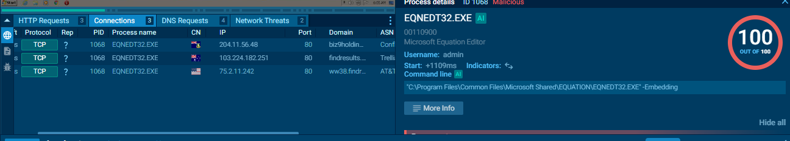
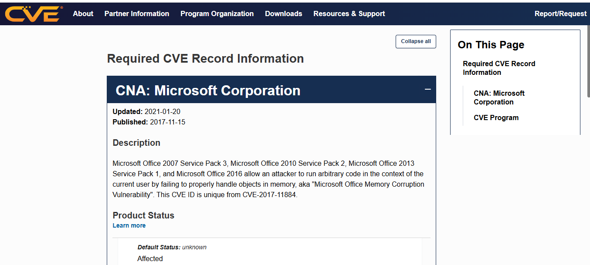

# Day 23: Phishing Analysis Tools

**Path:** SOC Level 1
**Platform:** TryHackMe
**Status:** ✅ Completed

---

## 📌 Overview

This room builds directly on Day 21 and 22 by moving from manual header/source inspection to the tooling that speeds up and deepens that same analysis. It opens by formalizing the artifact checklist an analyst should pull from any suspicious email — sender address, sender IP (and its reverse lookup), subject line urgency, recipient (To/CC/BCC), Reply-To, and date/time from the header; then URLs, attachment names, and attachment hashes from the body.

From there it walks through the toolchain for each stage: **Messageheader** (Google Admin Toolbox) and **Message Header Analyzer** for automating header parsing instead of reading raw source by hand; **IPinfo**, **URLScan.io**, and Cisco's **Talos IP & Domain Reputation Center** for checking whether an IP, domain, or URL has a known-bad reputation; **CyberChef's Extract URLs** and dedicated URL-extraction tools for pulling every link out of a body at once; and `sha256sum` for hashing an attachment before running that hash through Talos or **VirusTotal**.

The heavier lift is malware sandboxes — **ANY.RUN**, **Hybrid Analysis**, and **JOESandbox** — which let an analyst detonate a suspicious file or URL in an isolated environment and watch what it actually does: processes spawned, network connections made, and IOCs generated, without touching a real system. The room also introduces **PhishTool** as an all-in-one platform that surfaces the rendered view, raw HTML, and message source of an uploaded email side by side, ties in VirusTotal reputation data automatically, and lets an analyst formally resolve a case with notes — mirroring real SOC case-closure workflow.

The room then puts all of that to work across three real phishing cases: a Netflix "Your Account is on Hold" email investigated directly in Thunderbird, and two ANY.RUN sandbox reports — a fake Netflix "Update Payment Details" PDF, and a spoofed shipping-notice Excel file that turned out to exploit a specific, named CVE.

---

## 🛠️ Tools Used

- Mozilla Thunderbird — header + raw message source inspection (Case 1)
- ANY.RUN — reviewed the room's pre-run sandbox reports for the malicious PDF and XLSX attachments (Cases 2 and 3); I didn't detonate the files myself, I was working from the provided sandbox links
- cve.org — looked up the CVE the Excel attachment was exploiting

---

## 🪜 Steps Followed

**1. Reviewed the Identifying Artifacts example**
Before the lab, the room walks through a fictional "TryHatMe" phishing sample to illustrate the artifact checklist in practice — sender, subject urgency, attachment name, and embedded link, all in one annotated screenshot.

**2. Looked at the ANY.RUN interface**
Before diving into the case sandboxes, reviewed ANY.RUN's landing page and its three entry points: Submit File/Email, Submit URL, and Check Suspicious Links.

**3. Case 1 — Your Account is on Hold (Netflix)**
Opened `Phish3Case1.eml` in Thunderbird and reviewed the rendered "Your account is on hold" Netflix impersonation, then pulled the header fields and message source to identify the sender, recipient, Received-from IP, and Return-Path domain.

**4. Case 2 — Update Payment Details, ANY.RUN overview**
Reviewed the provided ANY.RUN sandbox report for `Payment-updateid.pdf`, a fake Netflix payment-update notice. The dashboard flagged it as **Suspicious activity** and showed the process tree, including AcroRd32.exe spawning multiple child processes.

**5. Case 2 — tracing the malicious IP**
Drilled into the AcroRd32.exe process details to pull the IP address it connected out to.

**6. Case 2 — checking Network Threats**
Reviewed the Network Threats tab, which flagged `svchost.exe` traffic as "Potentially Bad Traffic."

**7. Case 3 — Excel Executable, ANY.RUN overview**
Reviewed the provided sandbox report for `CBJ200620039539.xlsx`, flagged outright as **Malicious activity** with `trojan`, `exploit`, and `cve-2017-11882` indicator tags, and a process tree showing EXCEL.EXE spawning EQNEDT32.EXE, which in turn spawned `ntvdm.exe`.

**8. Case 3 — reviewing network connections**
Checked the Connections tab for EQNEDT32.EXE, which showed three outbound TCP connections to different IPs and domains on port 80.

**9. Case 3 — process details and malicious score**
Opened the process details panel for EQNEDT32.EXE (Microsoft Equation Editor), which ANY.RUN scored 100/100 malicious and showed the exact command line used to launch it.

**10. Case 3 — identifying the exploited CVE**
Went looking for which vulnerability the malicious Excel attachment was exploiting. Initially couldn't pin down the right one after checking a few candidates, but confirmed it was CVE-2017-11882 — a Microsoft Office memory corruption vulnerability affecting Office 2007 through 2016, tied to the Equation Editor component (which lines up exactly with EQNEDT32.EXE being the process that spawned in the sandbox).

---

## 🔍 Key Findings

**Case 1 — Your Account is on Hold:**
- Impersonated brand: Netflix
- Intended recipient: `redacted@yahoo.com`
- Received-from IP (message source): `10.197.37.234`
- Return-Path domain of interest: `eteckno.xyz`
- "UPDATE ACCOUNT NOW" button shortened URL: `https[://]t[.]co/yuxfZm8KPg?amp=1`

**Case 2 — Update Payment Details:**
- ANY.RUN verdict: Suspicious activity
- Attachment: `payment-updateid.pdf`
- SHA256: `cc6f1a04b10bcb168aeec8d870b97bd7c20fc161e8310b5bce1af8ed420e2c24`
- Malicious IP tied to AcroRd32.exe: `2.16.107.24`
- Process flagged as Potentially Bad Traffic: `svchost.exe`

**Case 3 — Excel Executable:**
- ANY.RUN verdict: Malicious activity
- Attachment: `CBJ200620039539.xlsx`
- SHA256: `5f94a66e0ce78d17afc2dd27fc17b44b3ffc13ac5f42d3ad6a5dcfb36715f3eb`
- IP tied to malicious domain `biz9holdings.com`: `204.11.56.48`
- Other malicious domain identified: `findresults.site`
- Exploited vulnerability: **CVE-2017-11882** (Microsoft Office Memory Corruption Vulnerability, via the Equation Editor component)

---

## 💡 Lessons Learned

- The artifact checklist from this room is basically Day 21's manual process turned into a repeatable procedure — same fields, just backed by tools instead of eyeballing raw source every time.
- Getting a malicious score of 100/100 tied directly to a specific process (EQNEDT32.EXE) rather than "the file" as a whole made it much clearer how a sandbox actually attributes malicious behavior — it's tracked per process in the execution tree, not as one blanket verdict.
- I got stuck for a bit trying to identify the CVE behind the Excel attachment and checked a couple of wrong candidates before landing on CVE-2017-11882 — worth remembering that the process name itself (EQNEDT32.EXE, Equation Editor) was the fastest route to the right CVE, since that binary is specifically tied to this vulnerability.
- Case 3's XLSX-to-EQNEDT32.EXE chain is the exact same delivery pattern (malicious spreadsheet attachment) as the DHL sample from Day 22, just with a confirmed, named exploit behind it this time instead of an unresolved 16-bit subsystem error — good to finally see what that class of attack looks like when it actually lands.
- Reviewing pre-run sandbox reports instead of detonating the files myself was a useful reminder that safe analysis doesn't always mean running the tool yourself — reading someone else's controlled execution is often the correct and expected move.

