# Day 24: Phishing Prevention

**Path:** SOC Level 1
**Platform:** TryHackMe
**Status:** ✅ Completed

---

## 📌 Overview

Days 21 through 23 were entirely about analyzing phishing *after* it lands in an inbox. This room flips to the defender's side of the equation: the authentication standards and technical controls organizations put in place to stop phishing before — or as — it arrives, plus the traffic-level analysis skills needed to investigate mail delivery itself. MITRE ATT&CK's Phishing for Information technique (T1598) frames the whole room: attackers trying to trick targets into divulging information, and defenders layering standards and tooling to cut that off.

**SPF (Sender Policy Framework)** is a DNS TXT record listing which IP addresses are authorized to send mail on a domain's behalf (`v=spf1 ip4:127.0.0.1 include:_spf.google.com -all`). The receiving server checks this record and maps the result to an action: Pass/Neutral/None → Accept, SoftFail/PermError → Flag as suspicious but still deliver, Fail/TempError → Reject outright.

**DKIM (DomainKeys Identified Mail)** adds a cryptographic signature instead of an IP allowlist: the sending server signs the message with a private key, and the receiving server pulls the matching public key from DNS to verify it. Its main advantage over SPF is that it survives forwarding, since the signature travels with the message rather than depending on the connecting IP. A record looks like `v=DKIM1; k=rsa; p=<public_key>`.

**DMARC (Domain-Based Message Authentication, Reporting, and Conformance)** ties SPF and DKIM together through *alignment* — checking that the domain in the visible `From` field actually matches what SPF and/or DKIM verified — and then tells the recipient what to do on failure via a policy tag (`v=DMARC1; p=quarantine; rua=mailto:postmaster@website.com`).

**S/MIME** is a different layer entirely: public-key cryptography for signing and encrypting individual messages, independent of the domain-level checks above. A digital signature (sender's private key → recipient verifies with sender's public key) provides authentication, non-repudiation, and integrity; encryption (sender encrypts with recipient's public key → only the recipient's private key can decrypt) provides confidentiality.

The room then moves into two hands-on Wireshark tasks against the same `traffic.pcap`: first querying raw SMTP response codes to find blocked/bounced mail, then digging into the Internet Message Format (IMF) layer to pull sender/recipient details, attachment names, and encoding straight out of the packet capture. It closes with the organizational side — email filtering, secure email gateways, link rewriting, and sandboxing as technical controls, paired with user-facing trust banners, phishing reporting, awareness training, and simulated phishing campaigns.

---

## 🛠️ Tools Used

- Wireshark — SMTP response-code filtering and IMF-layer packet inspection against `traffic.pcap`
- dmarcian's SPF Surveyor and Domain Checker — reviewing real SPF/DMARC records
- Google Admin Toolbox Messageheader — reviewing a real SPF softfail result
- wireshark.org's protocol reference docs — looked up the correct SMTP filter field

---

## 🪜 Steps Followed

**1. SPF — the workflow**
Reviewed how SPF verification actually happens: the sender's mail server sends the email, the recipient's server queries the sender domain's published SPF record via DNS, and the result routes to either the recipient's inbox or a rejection.

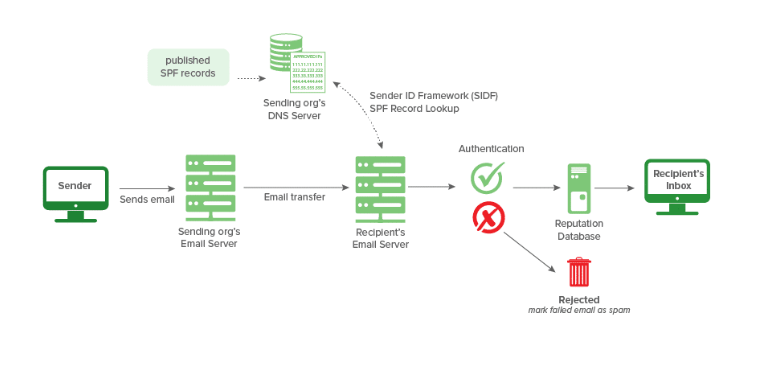

**2. SPF — a real record**
Looked at TryHackMe's own SPF record via dmarcian's SPF Surveyor — no bare IP addresses listed, just three included domains (`_spf.google.com`, `email.chargebee.com`, `7168674.spf05.hubspotemail.net`), meaning any IP those domains authorize is treated as a legitimate sender.

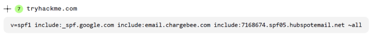

**3. SPF — a softfail in practice**
Reviewed a Messageheader analysis example showing an SPF result of `softfail with IP Unknown!` — the sending IP couldn't be verified against the domain's record, so the email gets flagged as suspicious but still delivered rather than blocked outright.

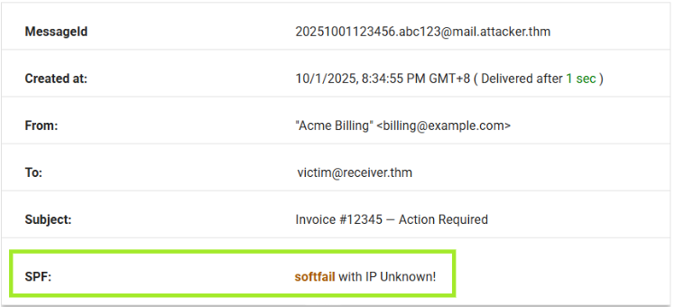

**4. DKIM — the workflow**
Reviewed the DKIM signing/verification flow: the public key gets published to DNS, the sending server signs the message with the matching private key, and the recipient's server retrieves the public key to confirm the signature before delivering to the inbox.

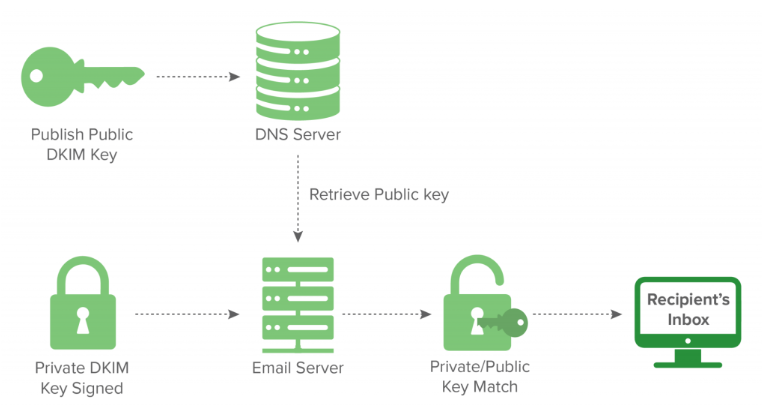

**5. DKIM — a real failure**
Reviewed a sample spam email header showing `dkim=permerror (no key for signature)` alongside `spf=pass` and `dmarc=fail` — a good example of how these three checks can disagree with each other on the same message.

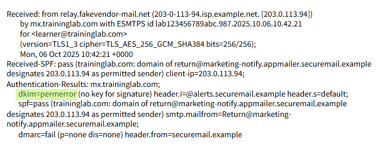

**6. DMARC — a passing domain**
Ran dmarcian's Domain Checker and reviewed a passing DMARC result, including the actual policy tag (`p=reject`) instructing recipient servers to reject any mail that fails alignment.

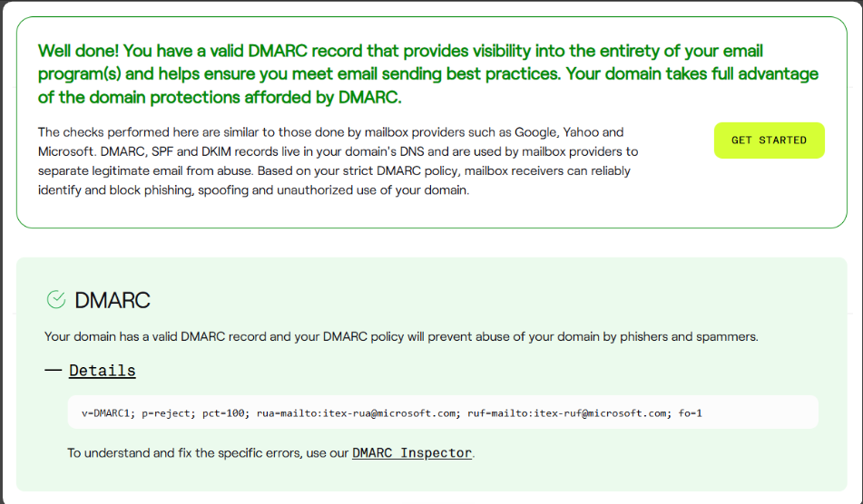

**7. S/MIME — the encryption flow**
Reviewed the Bob-and-Mary example: Bob signs with his private key and encrypts with Mary's public key; Mary verifies with Bob's public key and decrypts with her own private key.

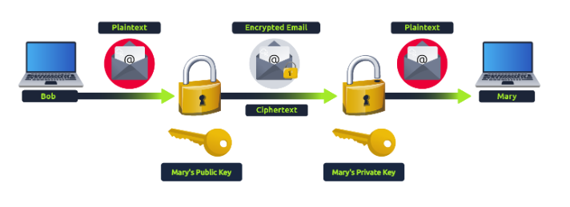

**8. Analyzing SMTP responses — finding the right filter**
Didn't know the correct Wireshark filter field offhand, so looked it up on Wireshark's own SMTP field reference page and confirmed it: `smtp.response.code`.

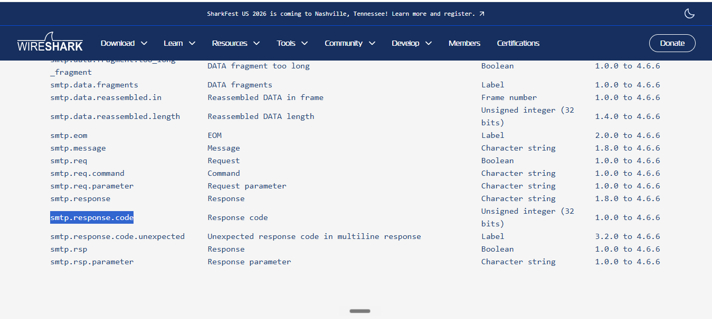

**9. Counting 220 responses**
Applied `smtp.response.code == 220` as a display filter — 19 packets matched, all `220 Service ready` responses.

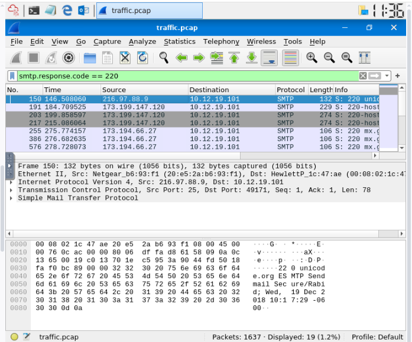

**10. Finding the Spamhaus block**
Searched the capture for a response mentioning `spamhaus.org` and found a `553` response — "Email blocked using spamhaus.org."

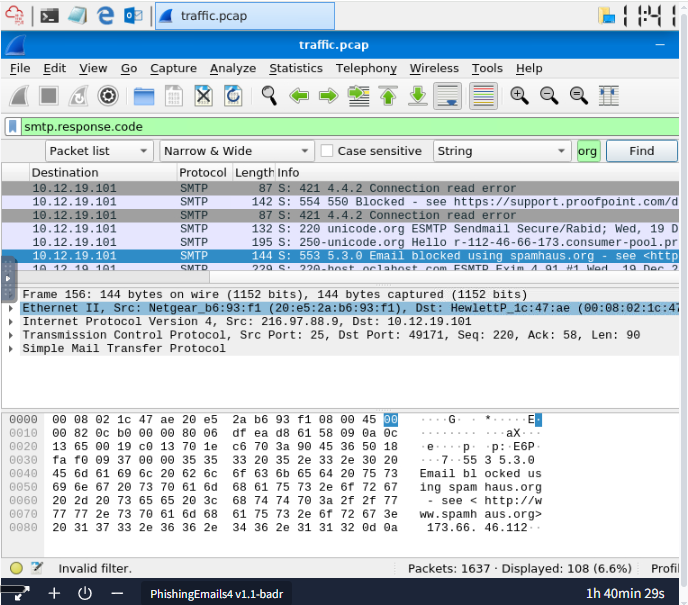

**11. Reading the full 553 response**
Expanded that same packet to get the complete response text: "Requested action not taken: mailbox name not allowed (553)."

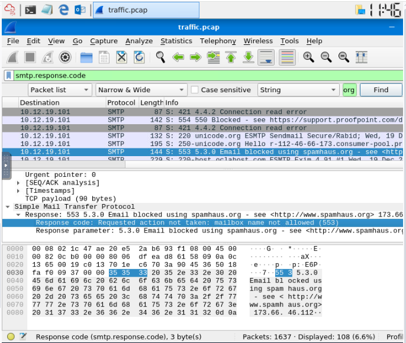

**12. Counting 552 responses**
Applied `smtp.response.code == 552` as a display filter — 6 messages matched, each blocked because "its content presents a potential security issue."

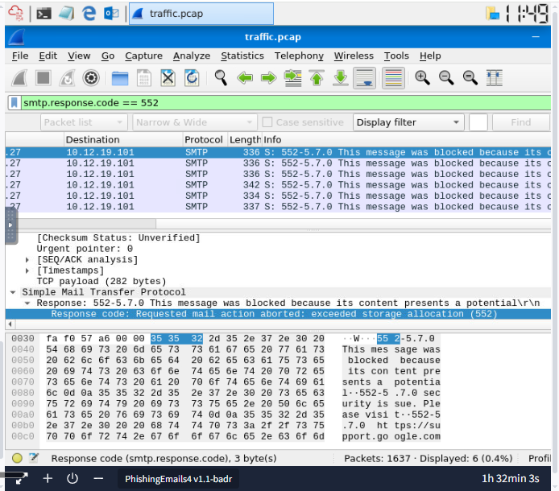

**13. Inspecting emails and attachments — packet count and first attachment**
Applied a plain `smtp` filter, which showed 512 of the capture's 1637 total packets are SMTP, and found packet 270 carrying an attachment named `document.zip`.

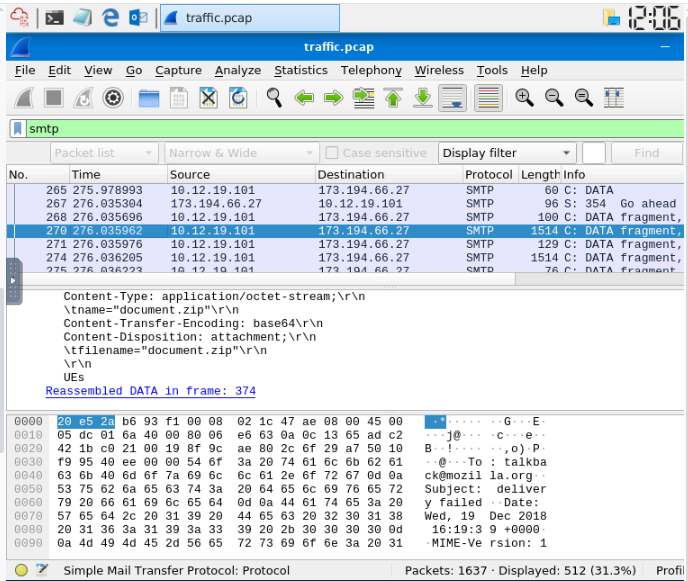

**14. Reading the bounce message**
Within that same filtered set, found the bounce notification text for packet 270: the message couldn't be delivered because host `212.253.25.152` wasn't responding.

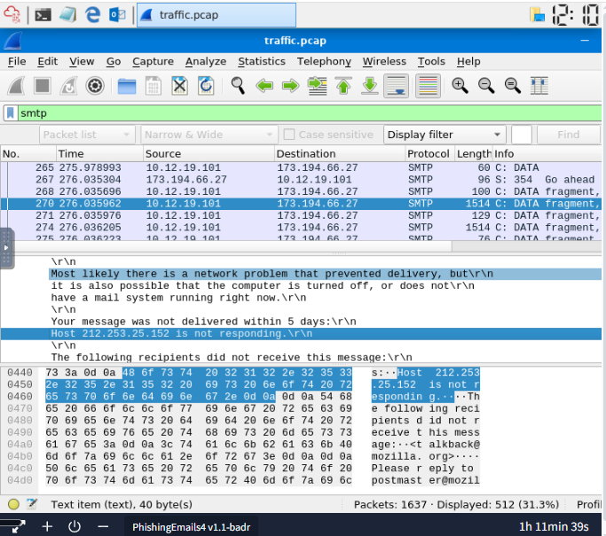

**15. Filtering by IMF for the malicious attachment**
Switched to `imf contains "attachment.scr"` to isolate the message carrying that attachment, confirming it was sent via Microsoft Outlook Express 6.00.2600.0000 and encoded in Base64.

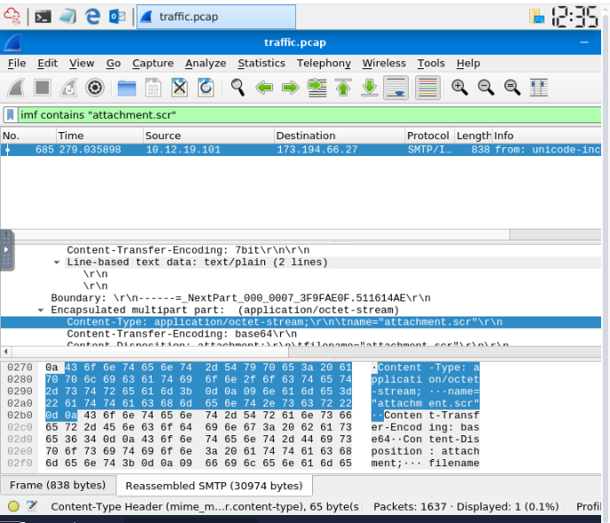

**16. How organizations stop phishing**
Reviewed an example of the user-facing side of phishing defense: a simulated-phishing-test landing page shown after a user clicks a training email, alongside the trust/warning banners ("Be Careful With This Message," external-sender + display-name-spoofing alerts) a real email client would show on a similar message.

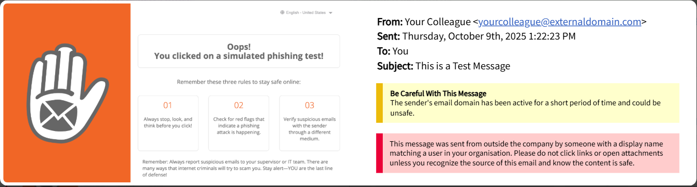

---

## 🔍 Key Findings

- Wireshark filter for SMTP response codes: `smtp.response.code`
- 220 (Service ready) responses in the capture: **19**
- Spamhaus-blocked message response code: **553** — full text: "Requested action not taken: mailbox name not allowed (553)"
- 552 (content flagged as a potential security issue) responses: **6**
- Total SMTP packets in the capture: **512** of 1637
- Packet 270 attachment: `document.zip`; undeliverable because host `212.253.25.152` wasn't responding
- Message carrying `attachment.scr`: sent via **Microsoft Outlook Express 6.00.2600.0000**, encoded in **Base64**

---

## 💡 Lessons Learned

- SPF, DKIM, and DMARC aren't three independent checks that all need to agree — DMARC's entire job is reconciling SPF and DKIM against the visible From domain, and the sample header in this room (SPF pass, DKIM permerror, DMARC fail) showed exactly how they can diverge on one message.
- Not knowing the right Wireshark filter field going in was a good forcing function — the room's own workflow (check the protocol reference docs first) is the same habit worth building generally instead of guessing filter syntax.
- The response-code side (220/552/553) and the IMF side (sender, attachment name, encoding) are really two layers of the same capture — SMTP tells you what the server decided about a message, IMF tells you what was actually inside it.
- This connects straight back to Days 21–23: the `attachment.scr` sample here is the same "disguised executable via email attachment" pattern from the Anatomy of a Phishing Email section in Day 22, just now visible at the raw packet level instead of through an email client's attachment view.
- The user-facing side (trust banners, simulated phishing tests) is a good reminder that everything analyzed in this path so far — headers, SPF/DKIM/DMARC, sandboxes — is the technical layer; organizations still need the human-facing layer for whatever technical controls miss.

