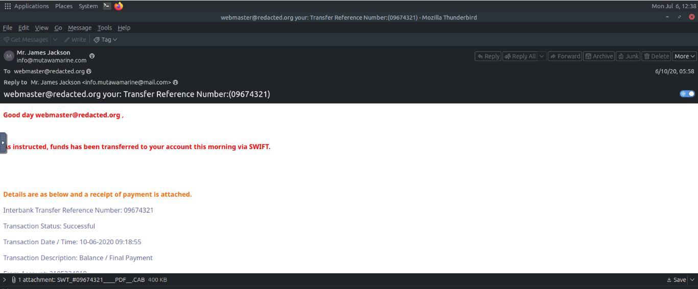
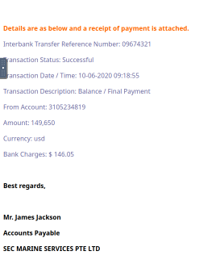
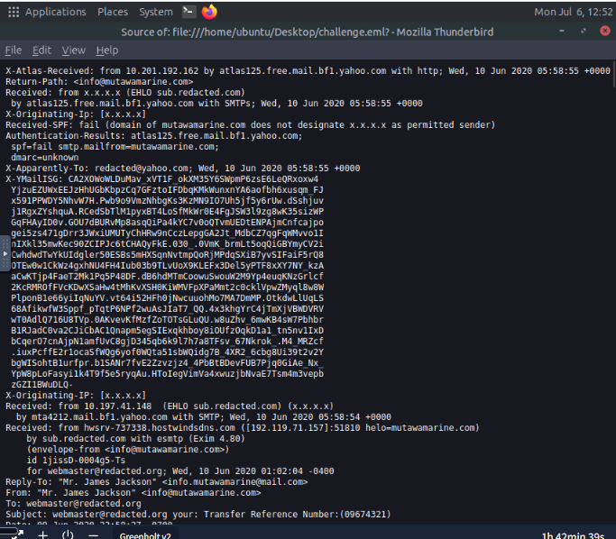
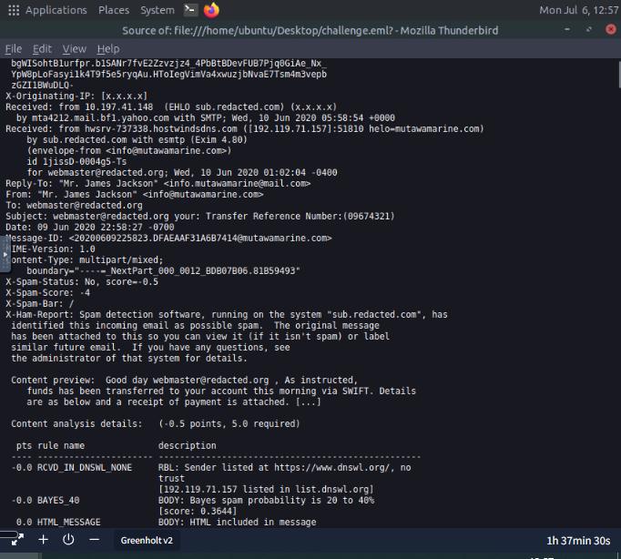
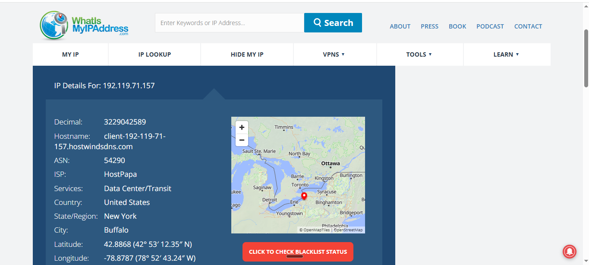
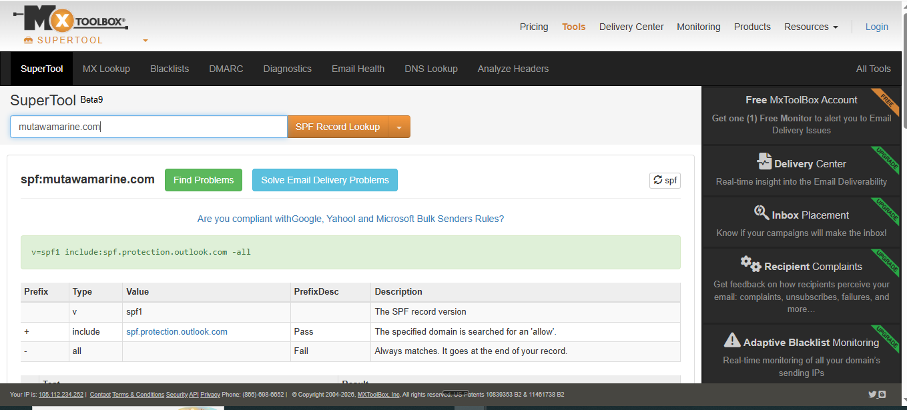
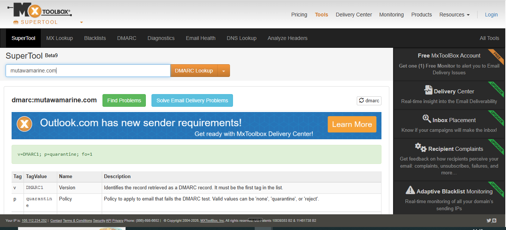
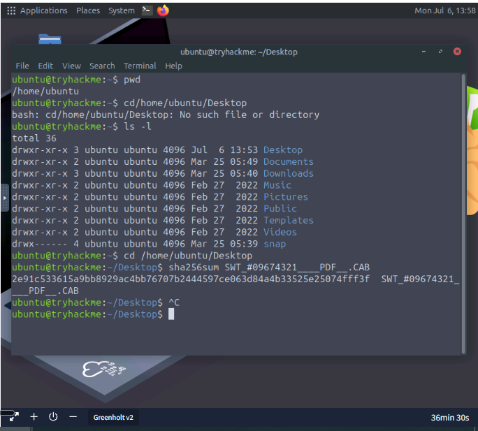
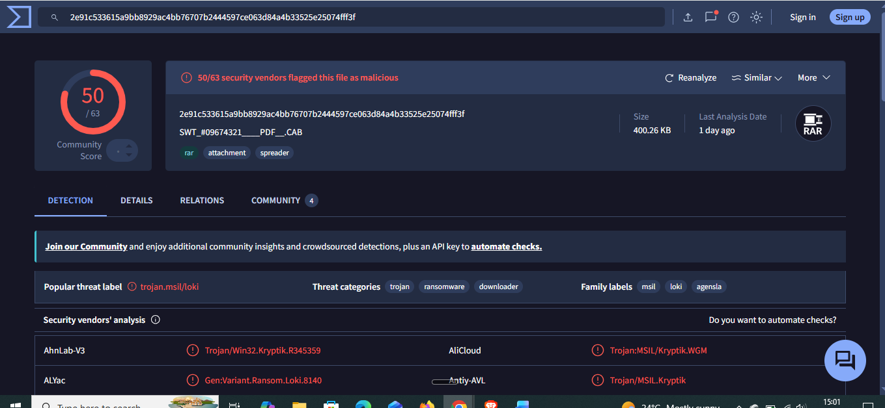

# Day 25: The Greenholt Phish

**Path:** SOC Level 1
**Platform:** TryHackMe
**Status:** ✅ Completed

---

## 📌 Overview

This room is a full end-to-end SOC investigation scenario rather than a series of isolated concept tasks: a sales executive at Greenholt PLC reported a suspicious email that looked like it came from a known customer but tripped several red flags — a generic greeting, an unexpected money-transfer request, and an unsolicited attachment, none of which matched that customer's usual communication style. The email got escalated to the SOC, and the job is to work the case the way an analyst actually would: pull apart the header, trace the originating infrastructure, run the sending domain's authentication records, and hash and check the attachment — to reach a legitimate-or-phishing verdict.

Structurally this is every tool from Days 21–24 applied together on one real case instead of practiced in isolation: Thunderbird for the rendered view and raw source (Day 21), IP reputation lookup (Day 23's tooling category), SPF/DMARC record lookups via MXToolbox (Day 24's authentication standards), `sha256sum` for hashing an attachment before checking it (Day 23), and VirusTotal for the final verdict on the file itself.

---

## 🛠️ Tools Used

- Mozilla Thunderbird — rendered view and raw message source of `challenge.eml`
- Terminal (`sha256sum`) — hashing the attachment
- WhatIsMyIPAddress.com — IP ownership/ISP lookup
- MXToolbox SuperTool — SPF and DMARC record lookups
- VirusTotal — file hash reputation and file-type identification

---

## 🪜 Steps Followed

**1. Deployed the lab and opened the sample**
Started the TryHackMe lab VM and opened `challenge.eml` on the desktop in Thunderbird to begin the investigation.

**2. Reviewed the header and body**
Read through the rendered email: sender display name "Mr. James Jackson," subject line carrying Transfer Reference Number `09674321`, and a body claiming funds had already been transferred via SWIFT, with a `.CAB` file attached as the "receipt."

**3. Read the rest of the body**
Continued through the transaction details and sign-off — "Mr. James Jackson, Accounts Payable, SEC MARINE SERVICES PTE LTD" — none of which is verifiable from the email itself.

**4. Opened the raw message source**
Switched to View Source to get past the rendered display and into the actual header block — sender address, Return-Path, SPF/DMARC/DKIM authentication results, and the full `Received:` chain.

**5. Found the real originating IP**
The `X-Originating-IP` field itself was redacted (`[x.x.x.x]`), so I traced the earliest `Received:` header instead and found the actual originating IP there: `192.119.71.157`, from `hwsrv-737338.hostwindsdns.com`, claiming HELO `mutawamarine.com`.

**6. Looked up the originating IP's owner**
Ran `192.119.71.157` through WhatIsMyIPAddress.com and confirmed the owning ISP: **HostPapa**.

**7. Ran an SPF lookup on the Return-Path domain**
Used MXToolbox's SuperTool against `mutawamarine.com` and pulled the full SPF record.

**8. Ran a DMARC lookup on the same domain**
Same tool, DMARC lookup this time, to get the domain's full DMARC policy.

**9. Hashed the attachment**
Downloaded the attachment (`SWT_#09674321____PDF_.CAB`) into the VM and ran `sha256sum` against it to get a hash to check.

**10. Checked the hash on VirusTotal**
Submitted the SHA256 hash to VirusTotal — 50 of 63 security vendors flagged it as malicious, confirmed the file size, and identified the real file type underneath the disguised `.CAB` extension.

---

## 🔍 Key Findings

- Transfer Reference Number in the subject line: `09674321`
- Sender display name: **Mr. James Jackson** | Sender address: `info@mutawamarine.com`
- Reply-To address: `info.mutawamarine@mail.com` — different from the sender address itself, a mismatch worth flagging on its own
- Originating IP (found in the earliest `Received:` header, not `X-Originating-IP`): `192.119.71.157`, owned by **HostPapa**
- SPF record for `mutawamarine.com`: `v=spf1 include:spf.protection.outlook.com -all`
- DMARC record for `mutawamarine.com`: `v=DMARC1; p=quarantine; fo=1`
- Attachment: `SWT_#09674321____PDF_.CAB`
- SHA256: `2e91c533615a9bb8929ac4bb76707b2444597ce063d84a4b33525e25074fff3f`
- VirusTotal: **50/63 vendors flagged malicious**, size 400.26 KB, actual file type **RAR** (not the PDF the filename implies)
- Verdict: **phishing** — the sender/reply-to mismatch, the disguised attachment (a RAR archive dressed up as a `.CAB`/`PDF`), and the VirusTotal detection rate all point the same direction, independent of whatever SPF/DMARC returned on the domain itself.

---

## 💡 Lessons Learned

- The `X-Originating-IP` field isn't guaranteed to be populated or trustworthy — this case was a direct example of needing to fall back to the earliest `Received:` header to get a real originating IP, which is a good habit to default to rather than assuming `X-Originating-IP` will always be there.
- The attachment's real identity (RAR) not matching either its extension (`.CAB`) or what the filename implied (`PDF`) was the clearest single tell in the whole case — file type mismatches keep showing up across this path as one of the most reliable indicators, more reliable than content or wording.
- This case pulled together nearly every technique from Days 21–24 into one investigation instead of one skill at a time — header analysis, IP attribution, SPF/DMARC lookups, hashing, and reputation checking — which made it clear how a real SOC ticket actually gets worked, as a sequence of these steps rather than any single one in isolation.
- The sender-vs-reply-to mismatch (`info@mutawamarine.com` vs `info.mutawamarine@mail.com`) was a smaller, easy-to-miss tell sitting right in the rendered header, well before any deeper investigation was needed — worth checking that field by habit on every suspicious email going forward.

