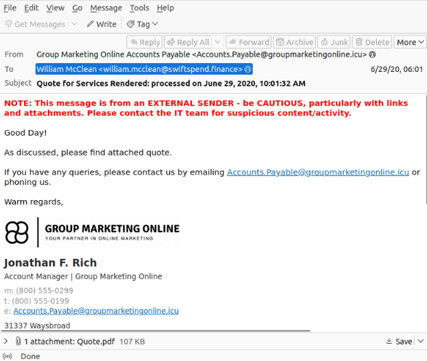
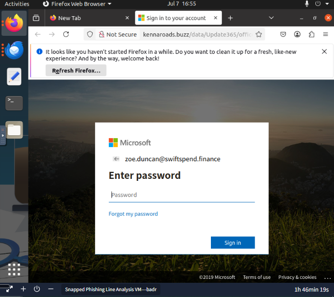
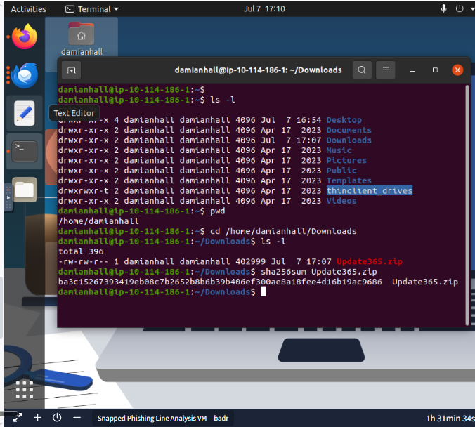
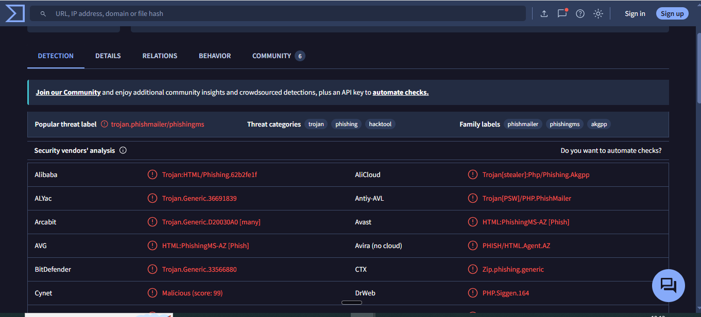
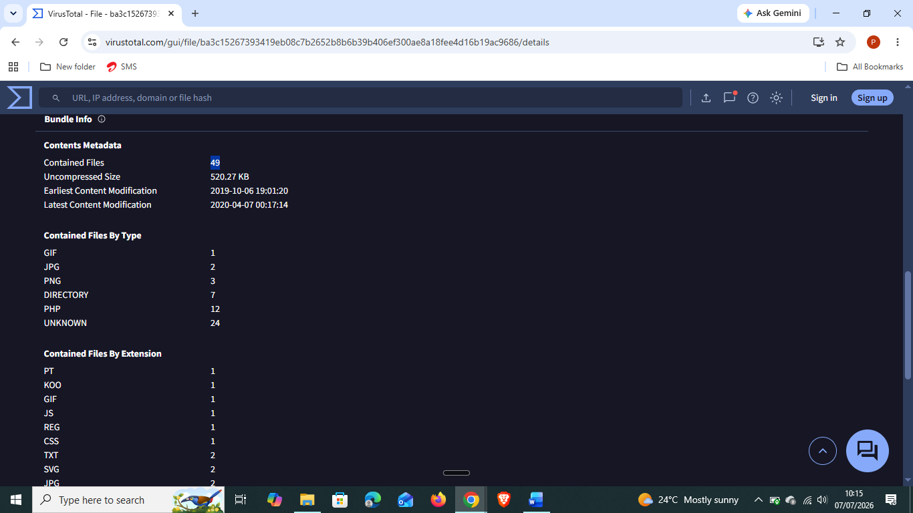
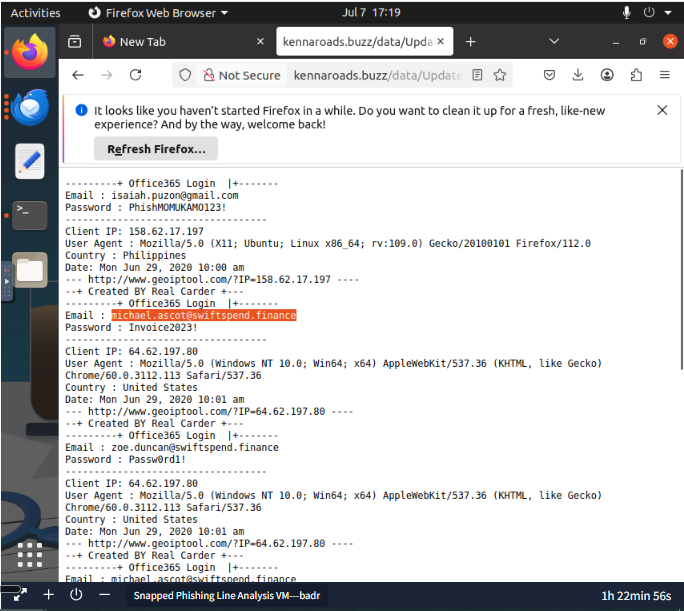
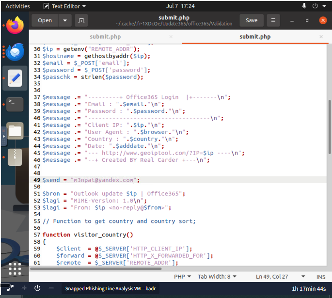
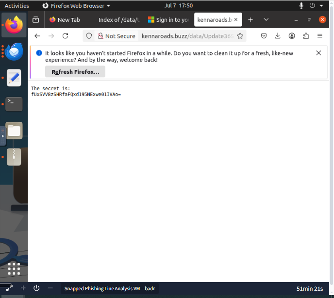
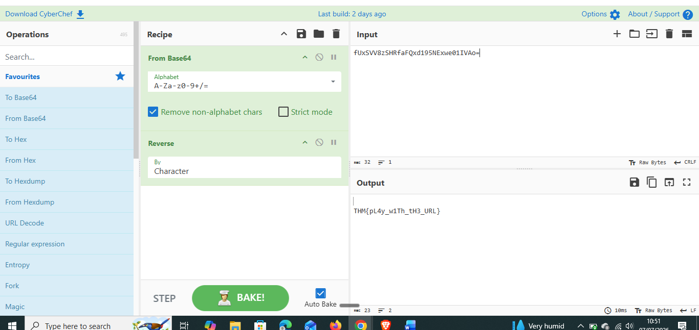

# Day 26: Snapped Phish-ing Line

**Path:** SOC Level 1
**Platform:** TryHackMe
**Status:** ✅ Completed

---

## 📌 Overview

This room is a full incident scoped around a fictional company, SwiftSpend Financial, where multiple employees across departments report the same suspicious email and some have already had their credentials compromised. Unlike Day 25's single-email investigation, the job here is to trace an entire phishing campaign end to end: analyze the email samples, follow a phishing URL to its landing page, pull the attacker's actual phishing kit off their own exposed web server, run CTI tooling against it, and dig into the kit's source code and logs to identify both victims and the adversary's own infrastructure.

The chain runs in five stages: identify the phishing emails and the sender address behind them; open one victim's attachment to find the redirection URL and its root domain; browse to that URL to see which brand the landing page impersonates (Microsoft, via a fake Office 365 login); back out of the deep phishing path to the open `/data` directory the attacker left exposed, and pull the `.zip` archive of their entire phishing kit straight off their server; hash and check that archive on VirusTotal; then extract it locally to read `submit.php` — the actual PHP script harvesting credentials — and cross-reference it against a `log.txt` file the attacker was also leaving exposed on the same server, which contains every set of credentials submitted so far.

---

## 🛠️ Tools Used

- Mozilla Thunderbird — reviewing the phishing email samples
- Firefox (in-VM) — browsing the phishing redirection URL and the exposed `/data` directory
- Terminal (`sha256sum`) — hashing the downloaded phishing kit archive
- VirusTotal — threat categorization and archive metadata for the phishing kit
- Text Editor — reading `submit.php` from the extracted phishing kit
- CyberChef — Base64 decode + Reverse (by Character) to recover the final flag

---

## 🪜 Steps Followed

**1. Reviewed the email samples**
Opened the `phish-emails` folder and went through the provided samples. Confirmed William McClean was the recipient of the "Quote for Services Rendered" email, and that the sender address behind the whole campaign was `Accounts.Payable@groupmarketingonline.icu`, displayed as "Group Marketing Online Accounts Payable."

**2. Investigated the attachment addressed to Zoe Duncan**
Opened the attachment in Zoe Duncan's email to find the embedded redirection URL, root domain `kennaroads.buzz`. *(No screenshot captured of the raw attachment/HTML source itself — I went straight from finding the URL to opening it in the browser.)*

**3. Opened the redirection URL in the VM browser**
Browsed to the URL from Zoe's attachment and confirmed the landing page was impersonating **Microsoft**, presented as a fake Office 365 password prompt pre-filled with `zoe.duncan@swiftspend.finance`.

**4. Found the exposed /data directory**
Got stuck at first trying to figure out where the `/data` directory actually was. After some research, modified the URL in the address bar to strip off the deep phishing-specific path segments and navigate directly to the open directory the attacker had left exposed — which listed the phishing kit archive, `Update365.zip`. *(No screenshot captured of the directory listing page itself.)*

**5. Hashed the phishing kit archive**
Downloaded `Update365.zip` into the VM and ran `sha256sum` against it.

**6. Checked the hash on VirusTotal**
Submitted the hash and reviewed the Detection tab — beyond the expected "phishing" classification, the archive was also flagged as a **Trojan**.

**7. Reviewed the archive's contents on VirusTotal**
Checked the Details tab for the bundle's contents metadata: the archive contains **49 files** in total.

**8. Investigated the exposed credential log**
Navigated to the `/data/Update365/` directory and opened the log file the attacker had also left exposed, listing every submitted Office 365 login attempt. Found that `michael.ascot@swiftspend.finance` appears **twice** — the only user who submitted credentials more than once.

**9. Extracted the kit and read submit.php**
Extracted the archive locally and opened `submit.php`, the PHP script actually harvesting the credentials server-side. Found the adversary's collection address hardcoded in the script: `$send = "m3npat@yandex.com"`.

**10. Looked for flag.txt — hit a dead end locally**
Tried to locate `flag.txt` on the local filesystem using `find / -name "flag.txt" 2>/dev/null`, with no results. Used the room's hint after getting stuck, which pointed out the file isn't part of the downloadable kit or on the local machine at all — it's hosted live on the attacker's own server, reachable by manually editing the URL path to `http://kennaroads.buzz/data/Update365/office365/flag.txt`.

**11. Decoded the flag**
Ran the encoded string through CyberChef with a `From Base64` step followed by `Reverse (By Character)`, revealing the final flag.

---

## 🔍 Key Findings

- "Quote for Services Rendered" email recipient: **William McClean**
- Phishing sender address: `Accounts.Payable@groupmarketingonline.icu`
- Redirection URL root domain (from Zoe Duncan's attachment): `kennaroads.buzz`
- Impersonated brand on the landing page: **Microsoft** (fake Office 365 login)
- Exposed phishing kit archive: `Update365.zip`
- SHA256: `ba3c15267393419eb08c7b2652b8b6b39b406ef300ae8a18fee4d16b19ac9686`
- VirusTotal threat categories: phishing **and Trojan**
- Files contained in the archive: **49**
- User who submitted credentials more than once: `michael.ascot@swiftspend.finance`
- Adversary's credential-collection email (from `submit.php`): `m3npat@yandex.com`
- Flag: **`THM{pL4y_w1Th_tH3_URL}`**

---

## 💡 Lessons Learned

- The single biggest technique in this room was realizing an attacker's own exposed web infrastructure can be walked like a normal directory tree — stripping a deep, obfuscated phishing path back to its root (`/data`) turned up the entire kit archive and a live credential log, both left wide open on the same server.
- Getting stuck twice in this room (finding `/data`, then finding `flag.txt`) and having to research or use the hint both times was a useful reminder that a phishing kit's "flag" or evidence isn't always local — sometimes the artifact you need is still live on the attacker's own server, not inside whatever you've already downloaded.
- Reading `submit.php` directly connected the dots between the credential log (Day 26's own evidence) and the "why" behind it — the script is the literal mechanism turning a submitted password into an email sitting in the adversary's inbox.
- The flag's decode step (Base64 + character reversal) was a good callback to Day 21's CyberChef troubleshooting — same tool, but a reminder that a single encoding layer isn't always the whole story.
- This room ties every previous phishing day together into one full incident shape: email analysis (Day 21), brand impersonation and URL tracing (Day 22), hashing and VirusTotal (Day 23), and the same header/redirect fundamentals for the URL work (Day 21/24) — but this time applied to hunt the *attacker's* infrastructure rather than just the message that landed in an inbox.

