# Day 27: Phishing Unfolding

**Path:** SOC Level 1
**Platform:** TryHackMe
**Status:** ✅ Completed (final scenario-complete/flag screen not captured — screenshots cover the alert triage work only)

---

## 📌 Overview

This one's a SOC Simulator scenario rather than a static theory room — alerts arrive in real time and I'm playing SOC analyst, triaging each one as it lands instead of working through a fixed set of questions. The brief: a phishing attack is unfolding inside a corporate network, and my job is to monitor the alert queue, work out which alerts are genuine (true positive) versus noise (false positive), and write up a case report for each one with the reasoning behind the call.

The scenario tracks three things per alert: what rule fired and why, whether it's a true or false positive, and what the recommended remediation is. Some alerts came in as singles, others got batched — the simulator let me file one case report covering more than one alert ID when they were clearly related.

I didn't finish this room in one sitting. I triaged the first batch of alerts on Jul 8, then picked the scenario back up and closed out the rest on Jul 30 — so the screenshots span two sessions.

---

## 🛠️ Tools Used

- TryHackMe SOC Simulator — Dashboard, Alert Queue, and Case Reports
- Documentation → Playbooks tab (Alert Triage Playbook) for the triage methodology

---

## 🪜 Steps Followed

**1. Read the scenario brief**
Opened the room and read the scenario overview and objectives before touching the dashboard.

**2. Reviewed the Alert Triage Playbook**
Before triaging anything, I checked the Documentation tab's playbook: assign the earliest alert to yourself, understand the alert logic, review the IOCs, then decide and write up the classification.

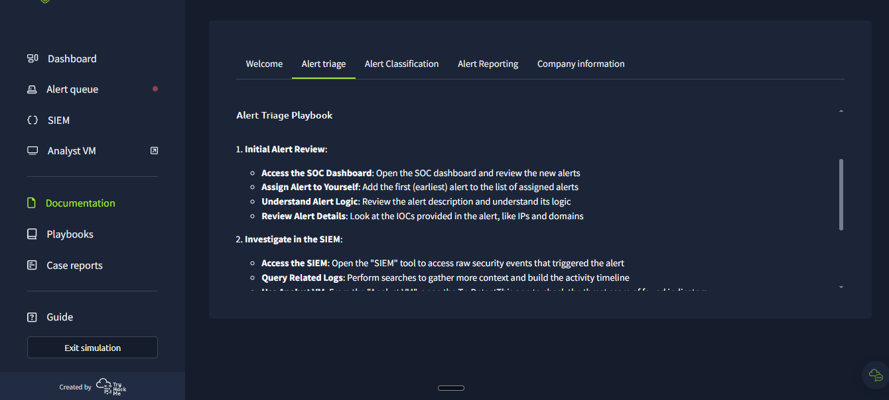
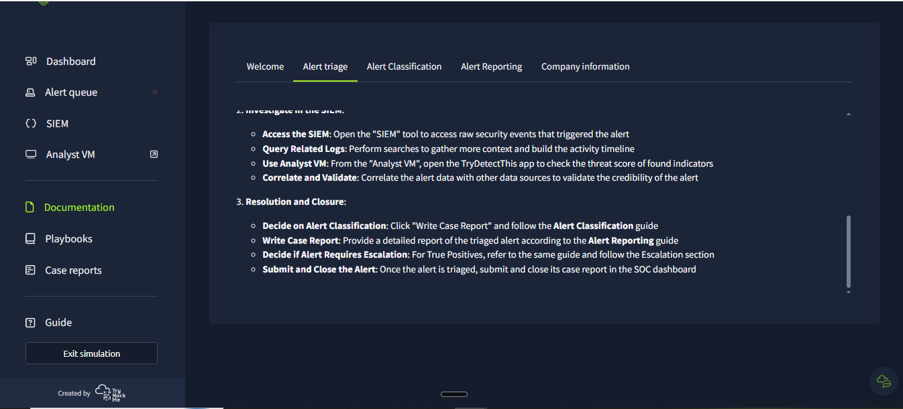

**3. First look at the dashboard**
Two alerts open: #1000, a phishing-type "suspicious email from external domain," and #1001, a process-type "suspicious parent-child relationship."

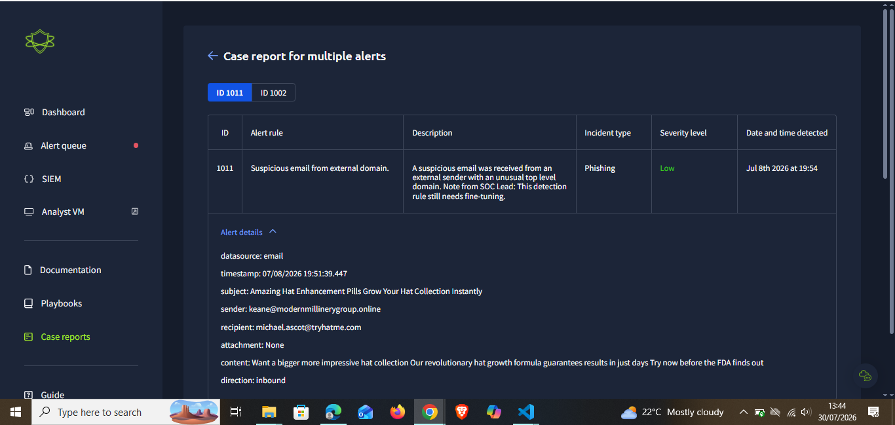

**4. Triaged alert #1000 — suspicious email**
The email pushed a "hat business" pitch and asked for banking details from an external sender. Called it a True Positive — the pitch was too good to be true — and recommended blocking the sender IP, noting no bank details were actually sent.

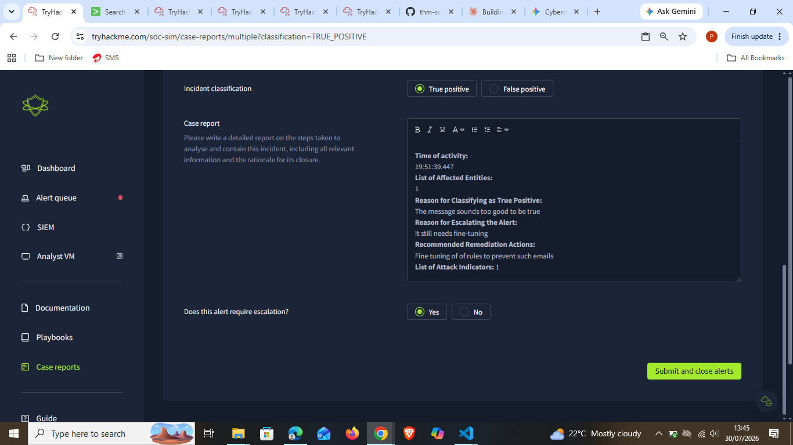

**5. Triaged alert #1001 — suspicious parent-child relationship**
Sysmon flagged `TrustedInstaller.exe` spawned by `services.exe`. Marked it True Positive since the relationship needed confirming, but didn't send it for escalation — recommended tracking the user/process to confirm legitimate intent instead.

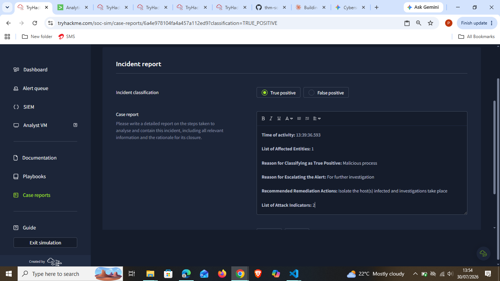

**6. Reviewed alert #1003 — another suspicious email**
Another phishing-style email landed ("Grow Your Hat Business Overnight"). I looked at the alert details, but I didn't capture the submitted report for this one.

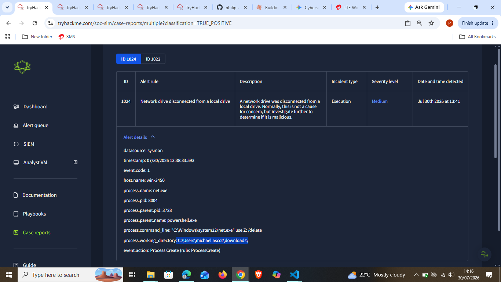

**7. Triaged alert #1005 — suspicious attachment**
A "FINAL NOTICE: Overdue Payment" email with a zip attachment (`ImportantInvoice-Febrary.zip`) and urgency-driven language. Classified True Positive and escalated it, specifically flagging the attachment as needing investigation before any other action.

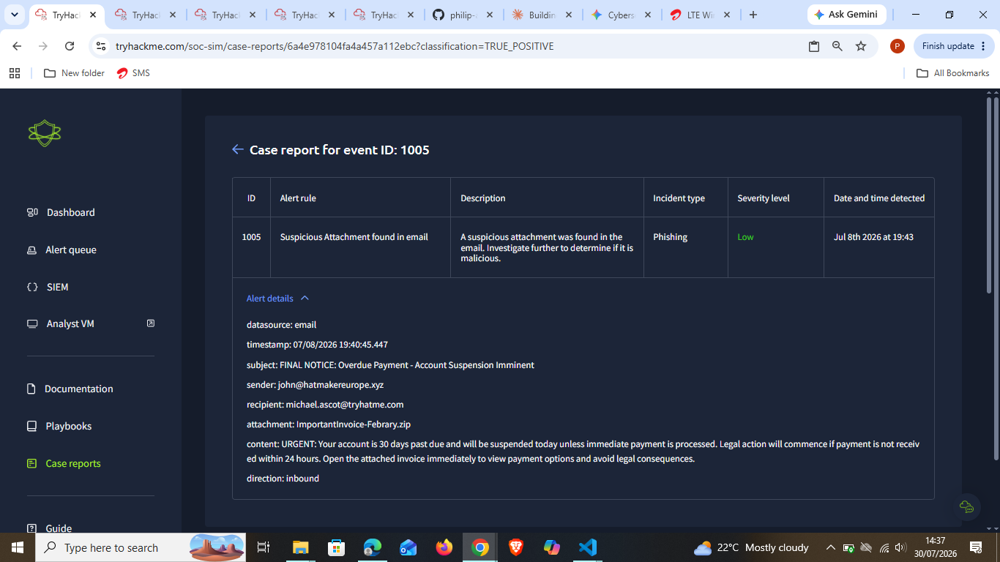

**8. Triaged alert #1006 — another parent-child relationship**
Sysmon showed `rdpclip.exe` spawned by `svchost.exe`. I wasn't confident this was malicious, and the report reflects that — I wrote it up as possibly an intruder process needing further investigation and recommended escalating, but didn't commit to a final True/False Positive selection on this one.

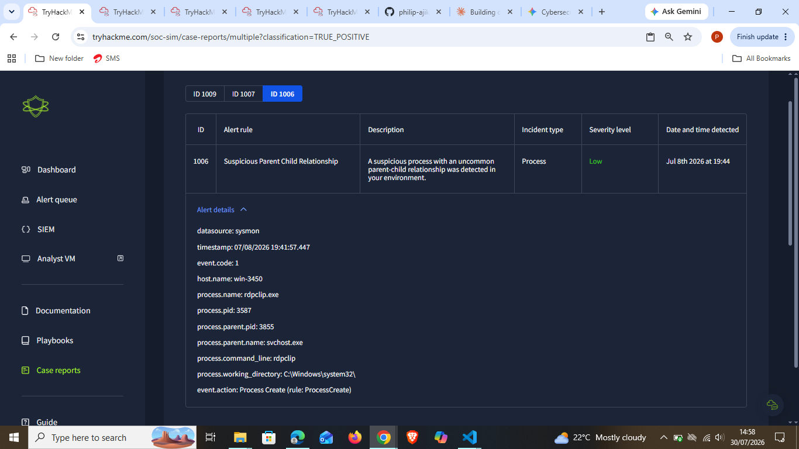
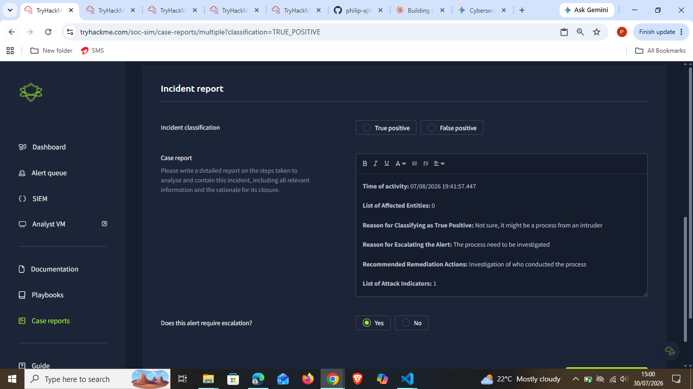

**9. Batched alerts #1011 and #1002**
Both got assigned to me together — #1011 was another "too good to be true" phishing email, #1002 a process alert. Filed one combined case report, classified True Positive, and escalated since the detection rule still needed fine-tuning.

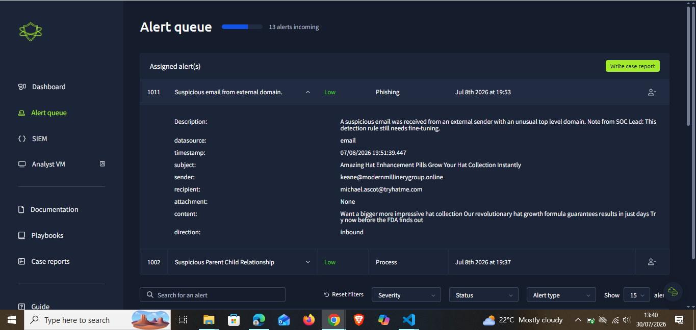

**10. Triaged alert #1013 — "Work from Home" scam email**
Classic scam email promising $10,000/day from home. Classified True Positive and escalated to fine-tune the mail rules. Hit a submission error on first attempt ("Unable to find assigned alerts for run...") — retried and got it through.

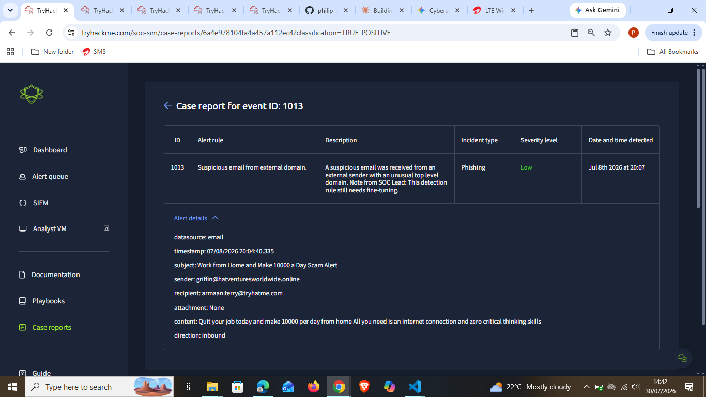
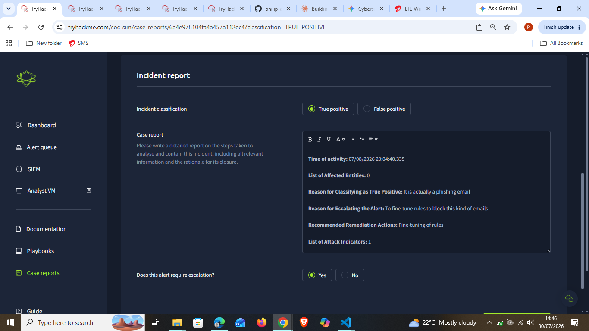
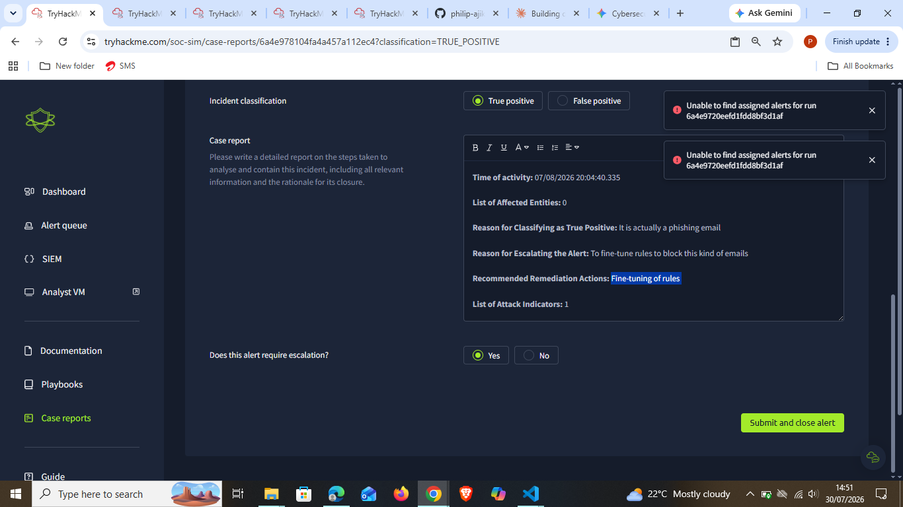

**11. Checked scenario progress**
Picked the scenario back up and checked the dashboard: 36 total alerts in this scenario, 16 closed so far, all 16 closed as True Positive, none as False Positive yet. Two new alerts open: #1024 (network drive disconnected) and #1022 (network drive mapped), both Execution-type and Medium severity.

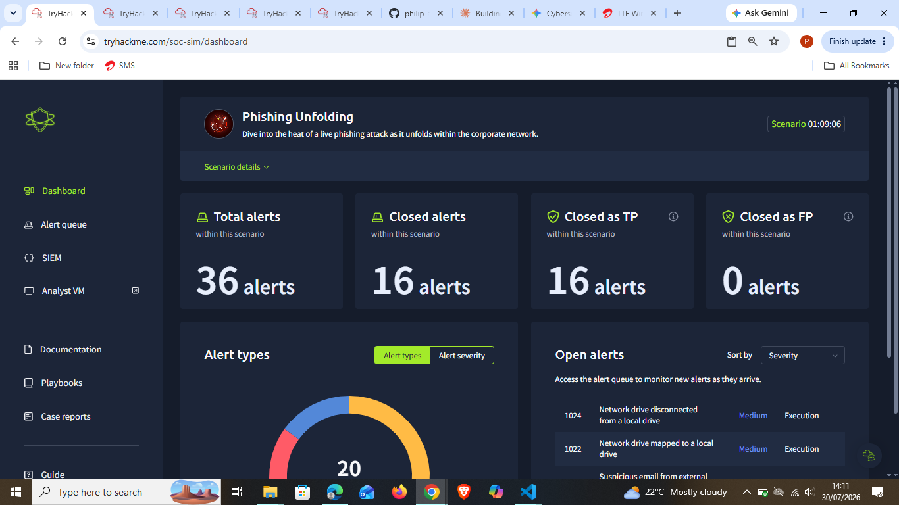

**12. Triaged alert #1014 — "Exclusive Offer" phishing email**
Batched view showed #1035, #1018, #1017, and #1014 together; I opened #1014's details — a "Buy 100 Hats Get 99 Free" spam/phishing email. Classified True Positive and escalated to filter and block similar emails.

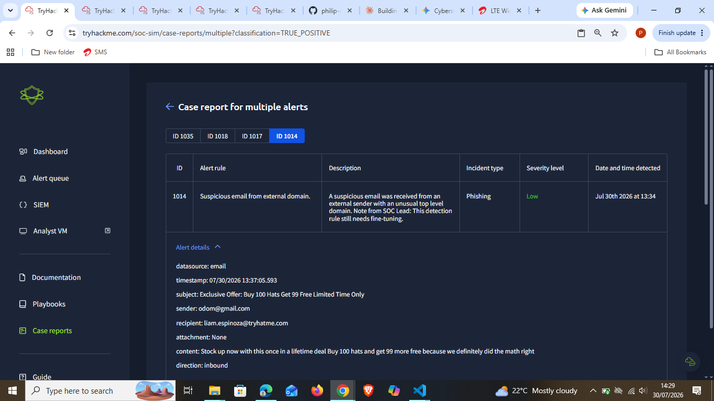
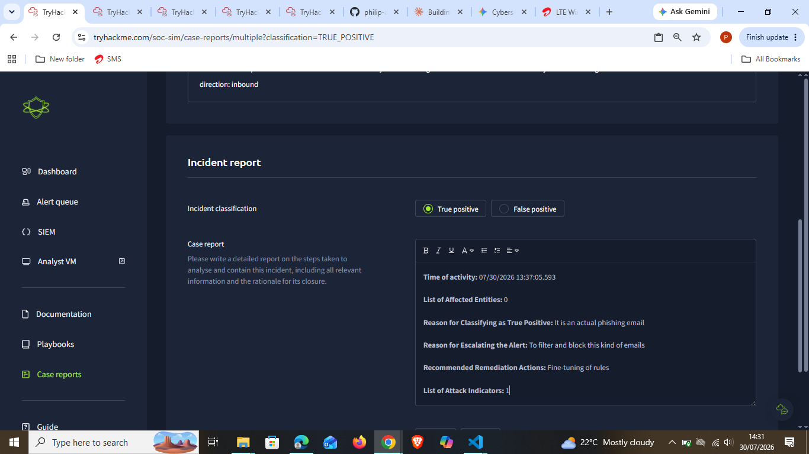

**13. Triaged alerts #1024 and #1022 — network drive activity**
Sysmon showed `net.exe` running `use Z: /delete`, spawned by `powershell.exe`. This time I classified it as a **False Positive** — the process turned out to be a legitimate one, not malicious drive tampering.

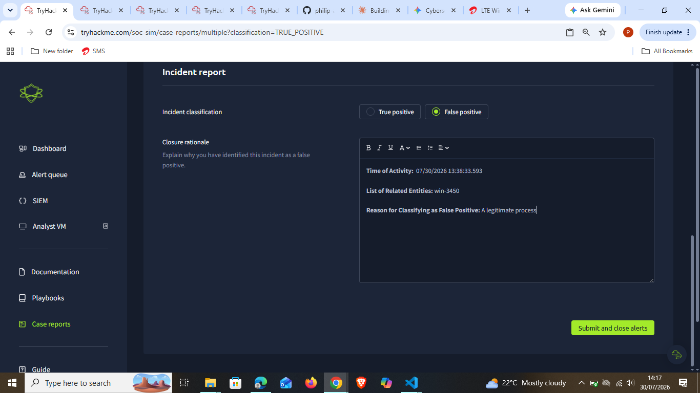

**14. Triaged alert #1034 — high-severity parent-child relationship**
This one stood out: `nslookup.exe` spawned by `powershell.exe`, with a base64-looking string piped to a `.haz4rdw4re.io` domain in the command line — classic DNS-based exfiltration pattern. Severity was High, unlike the Low/Medium alerts before it. Classified True Positive as a malicious process and recommended isolating the affected host pending investigation.

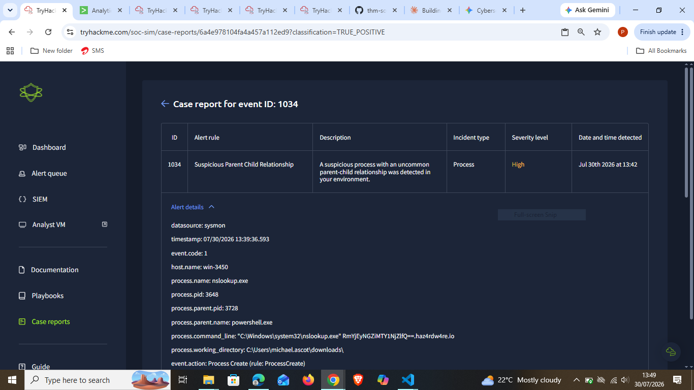

**15. Triaged alert #1000 — a second suspicious email**
A later suspicious-email alert also carrying ID #1000 came through — this time an "inheritance" scam requesting banking details. Classified True Positive and escalated to stop similar mail going forward.

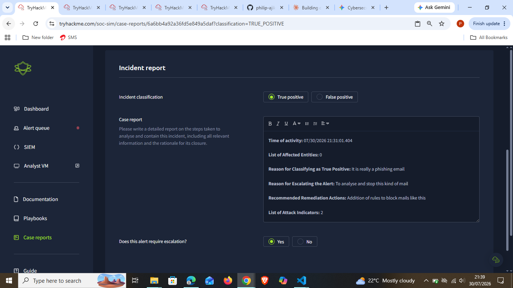

---

## 🔍 Key Findings

- No completion/flag screen was captured, so no `THM{...}` flag is recorded here for this room.
- Every phishing/scam email alert I triaged (#1000 ×2, #1003, #1005, #1011, #1013, #1014) was classified **True Positive** — the lures were all variations on the same "hat business" themed spam/scam content, which itself became a recognizable pattern across the scenario.
- Process alerts had mixed verdicts:
  - #1001 (`TrustedInstaller.exe` ← `services.exe`) — True Positive, needs user/intent confirmation
  - #1006 (`rdpclip.exe` ← `svchost.exe`) — uncertain, left unresolved pending investigation
  - #1024/#1022 (`net.exe use Z: /delete` ← `powershell.exe`) — **False Positive**, a legitimate process
  - #1034 (`nslookup.exe` ← `powershell.exe`, base64 string to `haz4rdw4re.io`) — True Positive, High severity, likely DNS exfiltration
- Mid-scenario checkpoint: 16 of 36 total alerts closed, all 16 as True Positive, 0 as False Positive — #1024 became the first False Positive I closed after that checkpoint.
- Hit and recovered from a platform submission error on alert #1013's case report.

---

## 💡 Lessons Learned

- The two process alerts that looked structurally similar on the surface (an odd parent-child relationship flagged by Sysmon) turned out very differently once I looked at the actual command line — #1024's `net.exe /delete` had a mundane, legitimate purpose, while #1034's `nslookup.exe` carried an encoded string to a suspicious domain. The command line and working directory made the difference, not just "is this parent-child pairing unusual."
- #1006 is an honest miss — I didn't commit to a final classification on that one and flagged it as uncertain instead of forcing a verdict I wasn't confident in.
- The repeating "hat business" theme across nearly every phishing email in this scenario is itself a useful signal — once you've seen a couple, the pattern becomes as much a red flag as any individual IOC.

