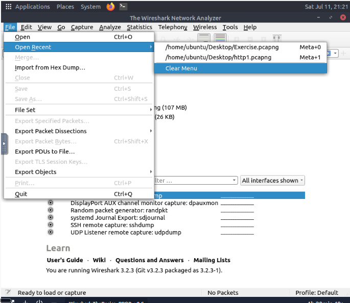
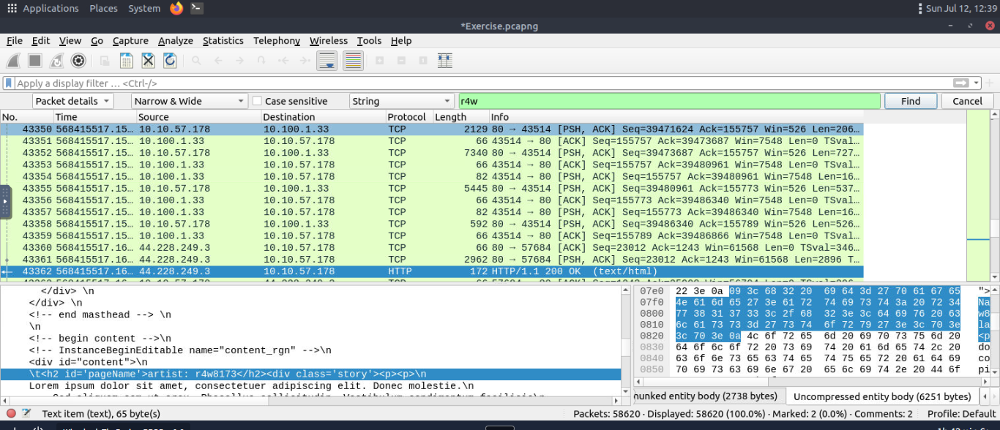
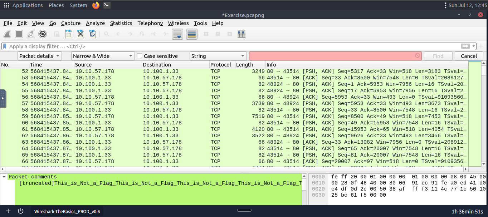
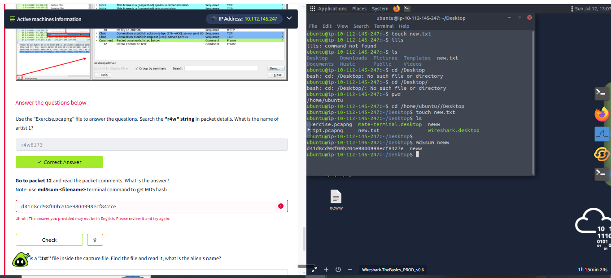
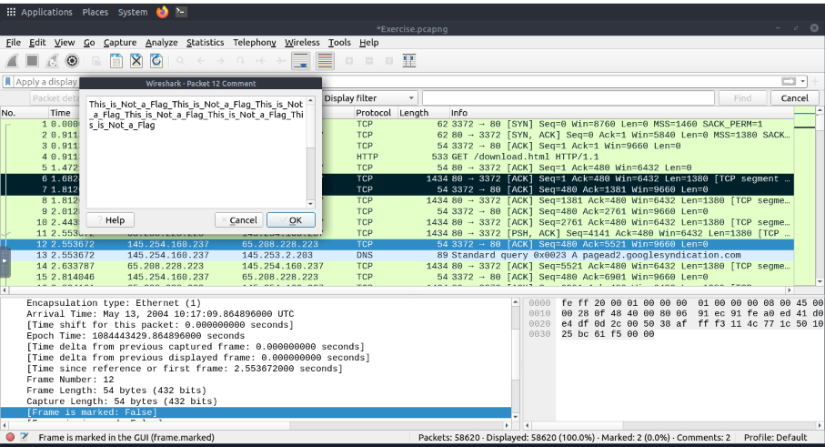
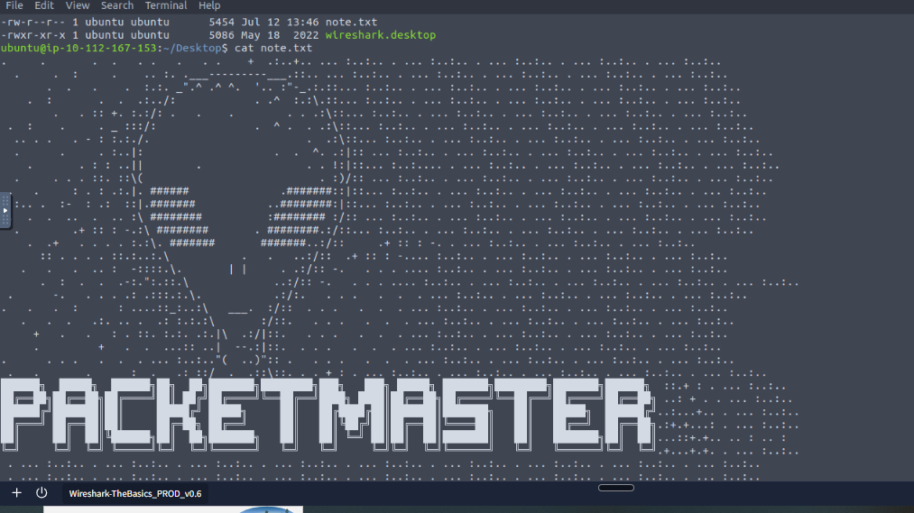
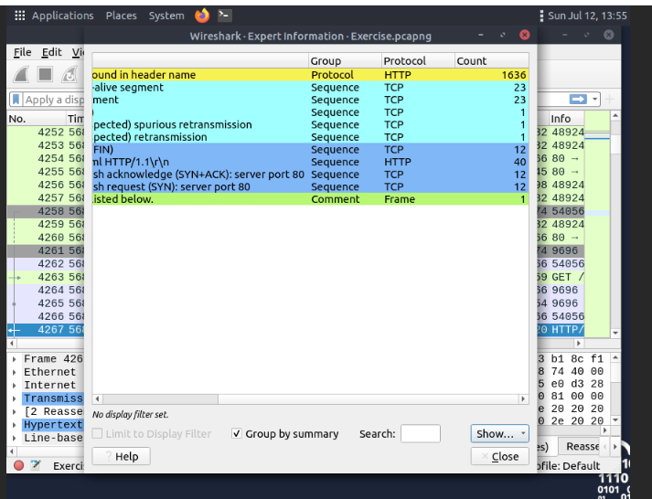
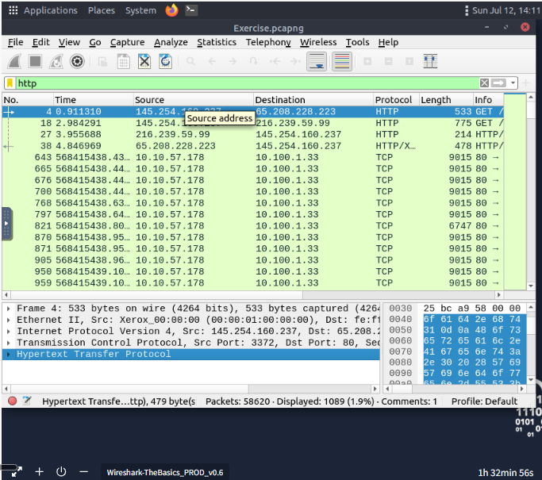
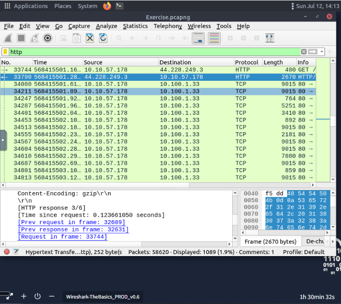
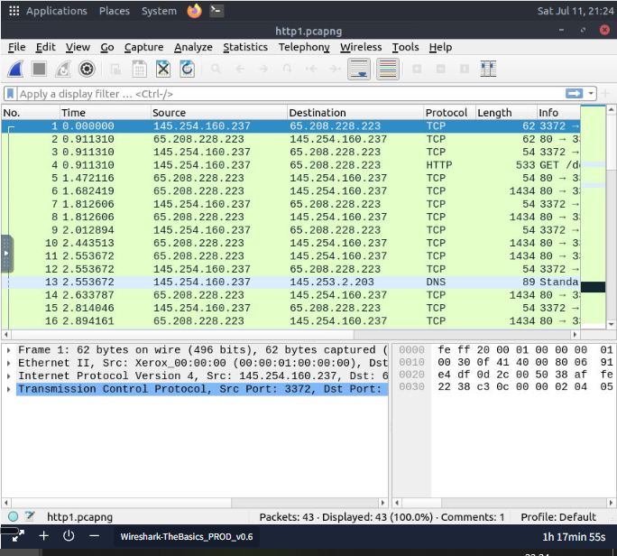

# Day 29: Wireshark: The Basics

**Path:** SOC Level 1
**Platform:** TryHackMe
**Status:** ✅ Completed

---

## 📌 Overview

Wireshark is an open-source, cross-platform packet analyser for both live traffic and existing captures (PCAPs) — one of the standard tools for packet-level analysis. It's used for troubleshooting network problems (load failures, congestion), spotting security anomalies (rogue hosts, odd port usage, suspicious traffic), and just learning protocol behaviour (response codes, payload structure). One thing worth keeping straight: **Wireshark is not an IDS**. It doesn't flag anything on its own and it doesn't modify packets — it only reads and displays them. Spotting the anomaly is entirely on the analyst.

The GUI centers around a single all-in-one page: a toolbar, the display filter bar, a recent-files list, capture filters/interfaces, and a status bar. Once a capture is loaded, packet data splits into three panes — the **packet list** (one line per packet: source, destination, protocol, info), the **packet details** (full protocol breakdown of whatever's selected), and the **packet bytes** (hex + ASCII, which highlights in sync with whatever field you click in the details pane).

A few things worth remembering from the walkthrough:
- **Colouring** — packets are colour-coded by protocol/condition by default; you can add temporary (session-only) or permanent (profile-saved) custom rules.
- **Sniffing** — blue shark button starts capture, red stops it, green restarts it.
- **Merging** — `File → Merge` combines two pcaps into a new one (needs saving before you can work on it).
- **File details** — `Statistics → Capture File Properties` (or the pcap icon, bottom-left) gives hash, capture time, comments, interface, and stats — handy when juggling multiple pcaps.
- **Packet navigation** — every packet gets a unique number; `Go to Packet` jumps straight to one; `Edit → Find Packet` searches by display filter, hex, string, or regex across the list/details/bytes panes (you have to search the *right* pane for what you're after); packets can be **marked** (session-only, shown in black) or **commented** (persists in the file until removed).
- **Exporting** — `File → Export...` pulls out a subset of packets, and `Export Objects` reconstructs whole transferred files for a handful of supported protocols (DICOM, HTTP, IMF, SMB, TFTP).
- **Time display** — defaults to "seconds since beginning of capture"; UTC is the more usable option, set via `View → Time Display Format`.
- **Expert Info** (`Analyse → Expert Information`) — surfaces protocol states across four severities (Chat/Note/Warn/Error), grouped by things like checksum errors, malformed packets, deprecated protocol usage, comments. Suggestions only — false positives/negatives are possible.
- **Filtering** — capture filters decide what gets captured, display filters decide what you *see* afterward. Right-click gives you Apply as Filter (single field), Conversation Filter (everything tied to an IP/port pair), Colourise Conversation (same idea, but highlight instead of filter), Prepare as Filter (stages the query without running it), and Apply as Column (pins a field as a visible column). `Follow TCP/UDP/HTTP Stream` reconstructs the full application-level exchange — server packets in blue, client in red — which is how you'd see things like unencrypted usernames/passwords.
- Basic display filter syntax: protocol name directly (`http`, `arp`, `dhcp`, `ftp`...), by port (`tcp.port == 80`), or by IP (`ip.addr == 192.168.1.2`).

---

## 🛠️ Tools Used

- Wireshark (v3.2.3) — GUI walkthrough, packet inspection, Export Objects, Expert Information
- Linux terminal — `md5sum` for hashing

---

## 🪜 Steps Followed

**1. Opened Wireshark and checked recent files**
Two recent captures listed: `Exercise.pcapng` and `http1.pcapng`.

**2. Loaded `http1.pcapng` and reviewed the basic packet flow**
TCP handshake, an HTTP GET, and a DNS query all visible in the packet list — a first look at how a capture actually reads once loaded.

**3. Switched to `Exercise.pcapng` and searched for the "r4w" string**
Found it in an HTTP 200 OK response body — the answer to "what is the name of artist 1" was `r4w8173`.

**4. Noticed the packet comments pane**
Spotted a truncated, repeating comment string sitting in the packet comments panel while browsing.

**5. Attempted the "packet 12 comment → MD5 hash" question — got it wrong first**
Created an empty file (`neww`), ran `md5sum` on it, and submitted that hash. TryHackMe rejected it. In hindsight this was the MD5 hash of an empty file, not an answer derived from the actual packet 12 comment.

**6. Opened packet 12's actual comment**
The comment was just a repeating `This_is_Not_a_Flag_...` string — no embedded instruction and no pointer to another packet, which didn't match what the question implied should be there. I flagged this as a discrepancy in the lab file rather than something I was missing.

**7. Used Export Objects to pull the embedded .txt file**
`File → Export Objects → HTTP`, filtered for `.txt`, found and saved `note.txt`. Opened it in the terminal — a large ASCII-art alien head with **PACKETMASTER** printed at the bottom.

**8. Reviewed Expert Information**
Opened `Analyse → Expert Information` to see the categorized list — HTTP header groupings, TCP sequence issues (keep-alive segments, spurious/suspected retransmissions), and comment entries.

**9. Applied HTTP as a filter from packet 4**
Right-clicked "Hypertext Transfer Protocol" on packet 4 and applied it as a filter — the resulting filter query was simply `http`.

**10. Inspected HTTP response details in Exercise.pcapng**
Looked at content-encoding (gzip) and the "previous request/response in frame" links Wireshark builds automatically between related packets.

---

## 🔍 Key Findings

- **Capture file comment flag:** `TryHackMe_Wireshark_Demo`
- **Total packets in Exercise.pcapng:** 58,620
- **SHA256 of the capture file:** `f446de335565fb0b0ee5e5a3266703c778b2f3dfad7efeaeccb2da5641a6d6eb`
- **Artist 1 (via "r4w" string search):** `r4w8173`
- **Packet 12 comment / MD5 question, correct answer:** `911cd574a42865a956ccde2d04495ebf` (my first attempt, `d41d8cd98f00b204e9800998ecf8427e`, was the MD5 of an empty file — a mistake, not the answer)
- **Alien's name (from the extracted .txt via Export Objects):** `PACKETMASTER`
- **Filter query from right-clicking HTTP on packet 4:** `http`
- Packet 12's actual comment content didn't match what the question implied it should contain (no pointer to another packet/file) — documented as a lab discrepancy rather than assumed to be my error.
- Didn't manage to answer the room's last question (total number of artists in the HTTP response after following the stream on packet 33790) — no screenshot or note captured for that one.

---

## 💡 Lessons Learned

- The empty-file MD5 mistake (`d41d8cd98f00b204e9800998ecf8427e`) was a useful one to make — it's a well-known hash precisely because it's what you get from hashing nothing, which made the error obvious once I looked at it again rather than assuming the room's answer was wrong.
- Distinguishing "the lab is broken" from "I'm missing something" mattered here — packet 12's comment genuinely didn't contain what the question setup implied, and it was worth writing that discrepancy up rather than quietly working around it.
- Export Objects turned out to be the right tool for the .txt/alien-name question — a good concrete example of reconstructing a transferred file instead of trying to eyeball it out of the hex pane.
- This is a natural follow-on from Day 28's Network Traffic Basics — that room was about *where* to place a tap and *why* full packet capture matters over logs; this one is the tool you'd actually use once you've got that capture in hand.

