# Day 30: Wireshark: Packet Operations

**Path:** SOC Level 1
**Platform:** TryHackMe
**Status:** ✅ Completed

---

## 📌 Overview

This one builds directly on Day 29 — same Wireshark fundamentals, but now doing the filtering with actual queries instead of right-click menus, plus a proper look at the Statistics menu.

**Statistics menu.** This is where you get the big-picture view of a capture before you start digging — good for building a hypothesis before an investigation gets specific:
- **Resolved Addresses** — IPs matched to hostnames, pulled from DNS answers in the capture. Good for quickly spotting what resources were actually accessed.
- **Protocol Hierarchy** — tree view of every protocol present, by packet count/percentage. Same "if you can click it, you can filter it" rule from the last room applies here too.
- **Conversations** — traffic between two specific endpoints, broken out by Ethernet/IPv4/IPv6/TCP/UDP.
- **Endpoints** — similar to Conversations, but one row per unique endpoint instead of per pair. Supports MAC→manufacturer resolution (via IEEE OUI lookup) and, if configured with a MaxMind GeoIP database, IP geolocation (country/city, AS org).
- **IPv4/IPv6 stats, DNS stats, HTTP stats** — protocol-specific breakdowns (rcode/opcode/query type for DNS; request/response codes for HTTP, etc.)

**Filtering with queries.** Capture filters decide what gets recorded (set before capture, fixed once running); display filters decide what you *see* afterward (changeable anytime, and the ones actually used day-to-day). Comparison operators (`==`, `!=`, `>`, `<`, `>=`, `<=`) and logical ones (`and`/`&&`, `or`/`||`, `not`/`!`) work as expected — `!=` is discouraged in favor of `!(...)` for consistency. The filter bar itself is colour-coded: green (valid), red (invalid), yellow (works but unreliable — fix it).

**Protocol-specific filters** — `ip.addr`/`ip.src`/`ip.dst` at the network layer (note: `ip.addr` ignores direction, `ip.src`/`ip.dst` don't), `tcp.port`/`udp.port` and their `srcport`/`dstport` variants at transport, and application-layer filters like `http.response.code`, `http.request.method`, `dns.flags.response`, `dns.qry.type` for HTTP/DNS specifically.

**Advanced filtering functions:**
- `contains` — case-sensitive substring search (`http.server contains "Apache"`)
- `matches` — case-insensitive regex (`http.host matches "\.(php|html)"`)
- `in` — set membership (`tcp.port in {80 443 8080}`)
- `upper()` / `lower()` — case-normalize a string field before comparing
- `string()` — cast a non-string field to a string for pattern matching (e.g. `string(frame.number) matches "[13579]$"` for odd frame numbers)

**Profiles** let you save a whole configuration (colouring rules, filter buttons) per investigation type instead of reconfiguring every time — switchable via `Edit → Configuration Profiles` or the profile section in the status bar.

---

## 🛠️ Tools Used

- Wireshark — Statistics menu (Resolved Addresses, Conversations, Endpoints, DNS, HTTP), display filters, Configuration Profiles
- A web search, once, to confirm the right filter for a DNS question (noted honestly below)

---

## 🪜 Steps Followed

**1. Resolved Addresses — IP for the "bbc" hostname**
Searched "bbc" in `Statistics → Resolved Addresses`. Found `199.232.24.81` resolving to `bbc.map.fastly.net`.

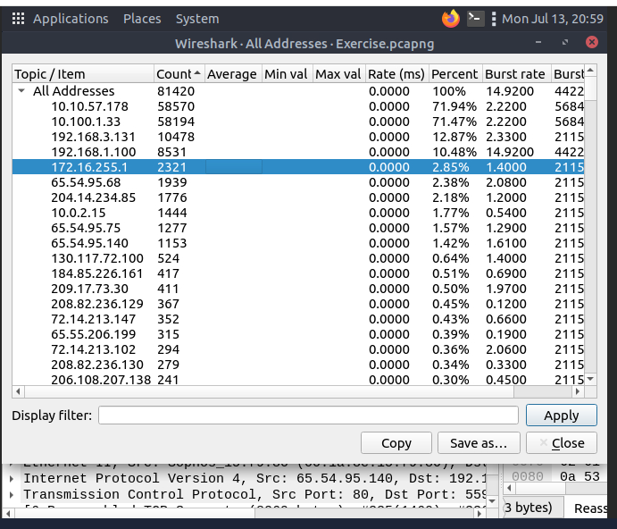

**2. Conversations — IPv4 count**
`Statistics → Conversations`, IPv4 tab: 435 conversations.

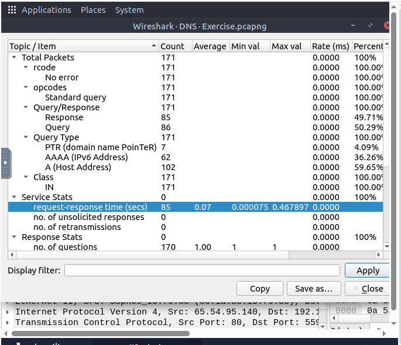

**3. Endpoints — bytes from the "Micro-St" MAC address**
`Statistics → Endpoints`, Ethernet tab: 7,474 KB from the Micro-St_9a:f1:f5 endpoint.

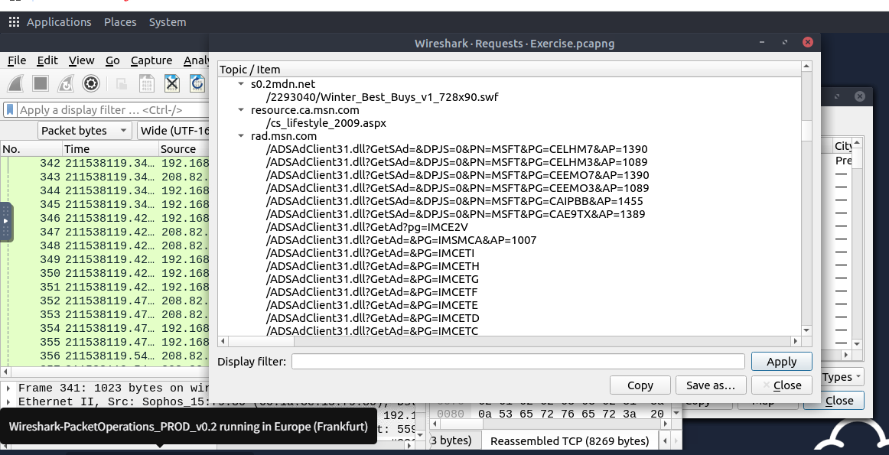

**4. Endpoints — IP linked to "Blicnet" AS organisation**
Same Endpoints window, IPv4 tab with the Country column enabled: `188.246.82.7`, Bosnia and Herzegovina.

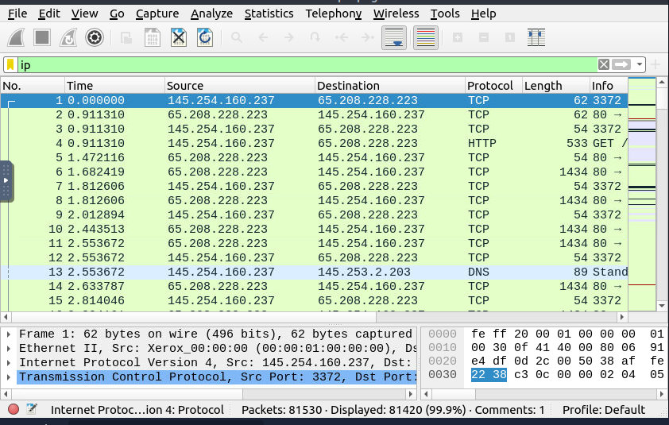

**5. Most-used IPv4 destination address**
`Statistics → IPv4 Statistics → All Addresses`, sorted by count: `10.100.1.33` at 71.47%.

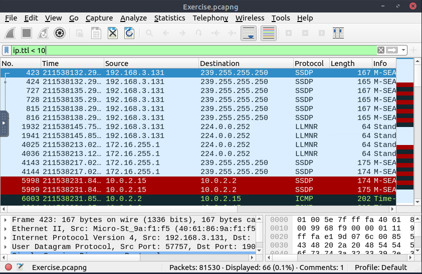

**6. DNS — max request-response time**
`Statistics → DNS`, Service Stats: max request-response time 0.467897 seconds.

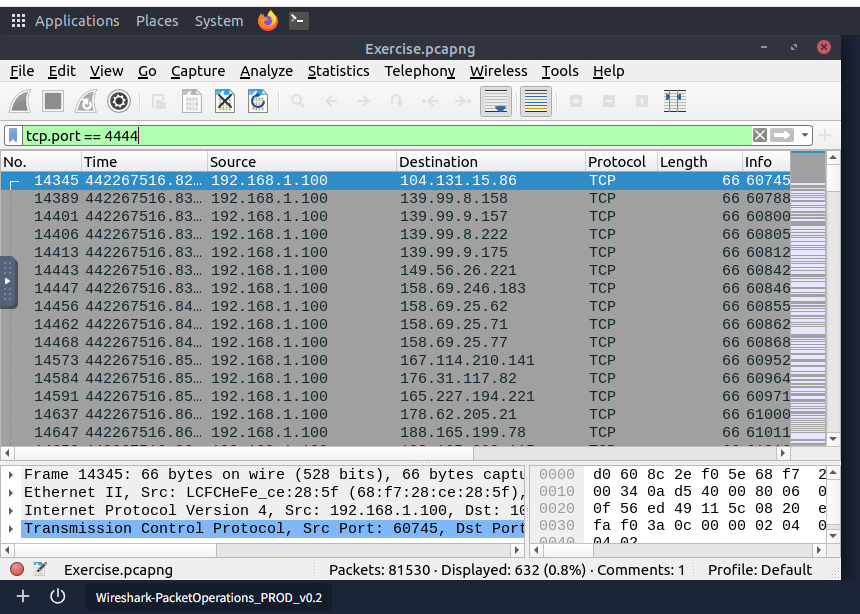

**7. HTTP requests to rad[.]msn[.]com**
`Statistics → HTTP → Requests`, reviewed the tree for rad.msn.com's request count.

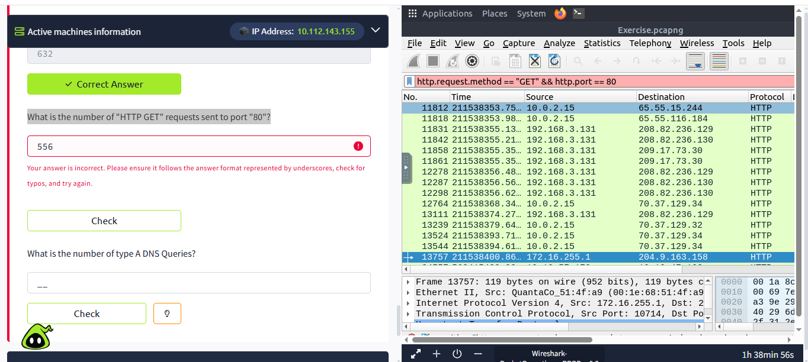

**8. Filtered `ip` — total IP packets**
Applied the plain `ip` filter: 81,420 displayed.

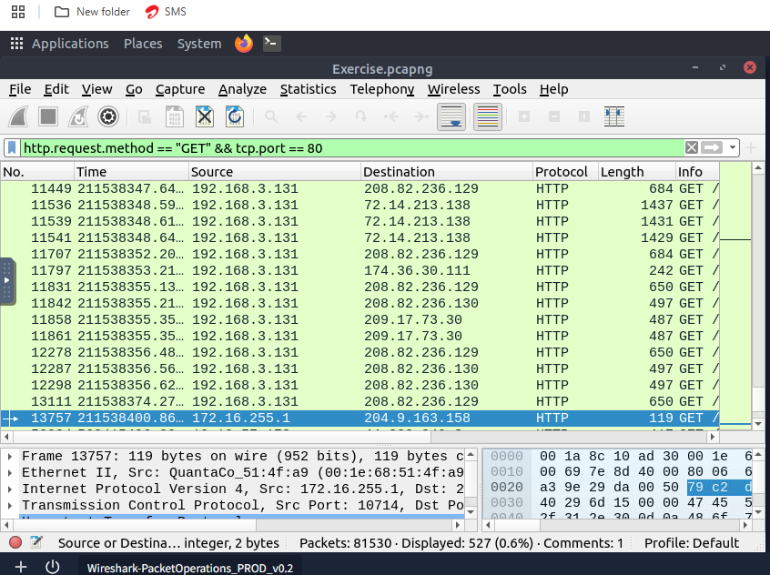

**9. Filtered `ip.ttl < 10`**
66 packets displayed.

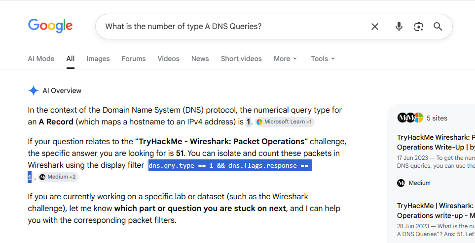

**10. Filtered `tcp.port == 4444`**
632 packets displayed.

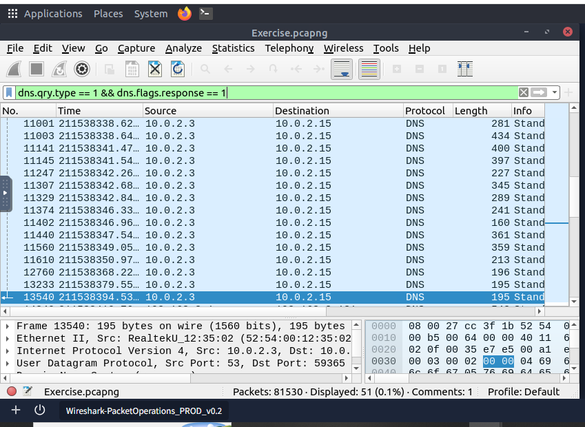

**11. Filtered for HTTP GET requests to port 80 — first attempt was wrong**
Used `http.request.method == "GET" && http.port == 80` and got 556, which TryHackMe rejected.

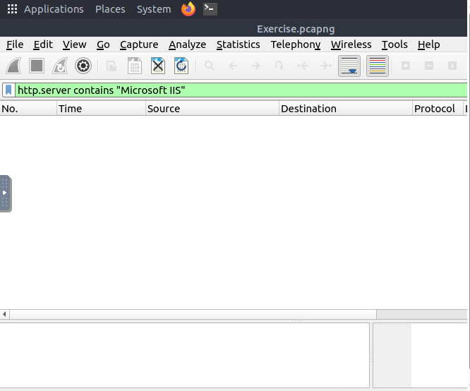

**12. Corrected the filter — `tcp.port` instead of `http.port`**
`http.request.method == "GET" && tcp.port == 80` gave the right count: 527.

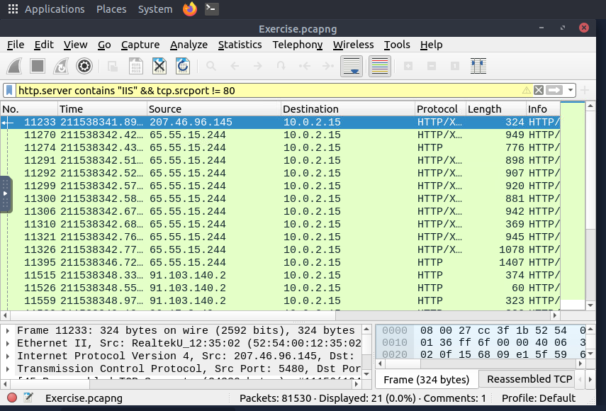

**13. Looked up the right DNS filter for type A queries**
Searched for the filter syntax rather than recalling it from memory.

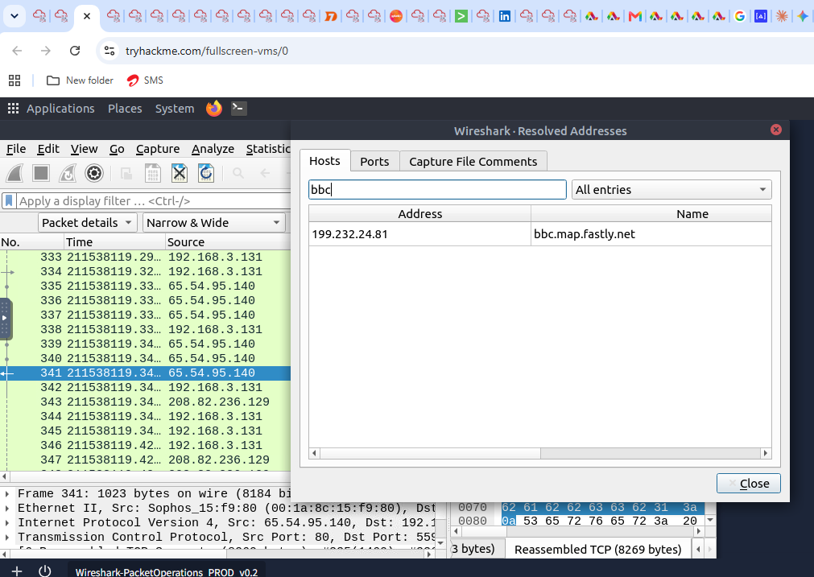

**14. Applied `dns.qry.type == 1 && dns.flags.response == 1`**
51 packets displayed — type A DNS queries.

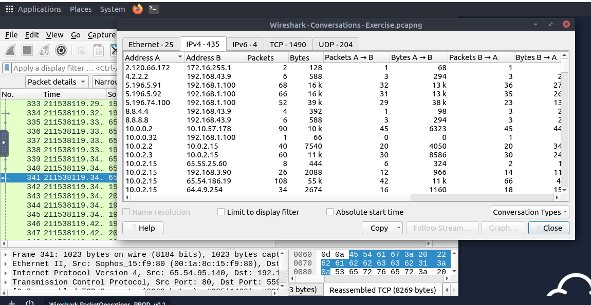

**15. Started filtering for Microsoft IIS servers**
`http.server contains "Microsoft IIS"` returned no results yet at this point — needed adjusting.

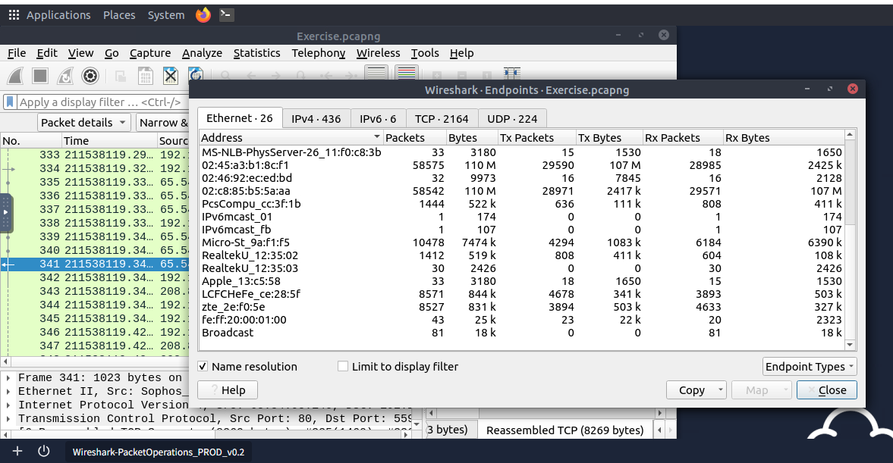

**16. Filtered for IIS servers not on port 80**
`http.server contains "IIS" && tcp.srcport != 80` — 21 packets.

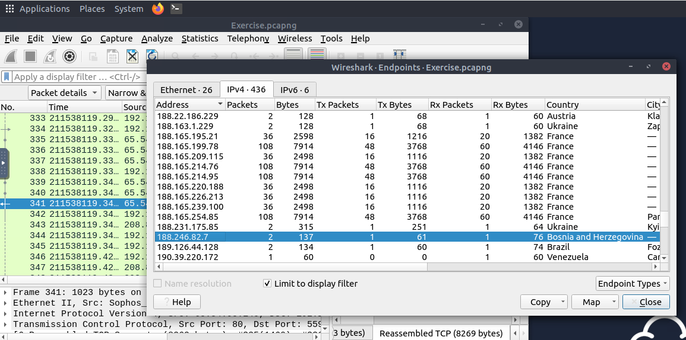

**17. Tried filtering for IIS version 7.5 — hit a syntax error**
`http.server contains "IIS" && matches "version7.5"` — invalid filter syntax.

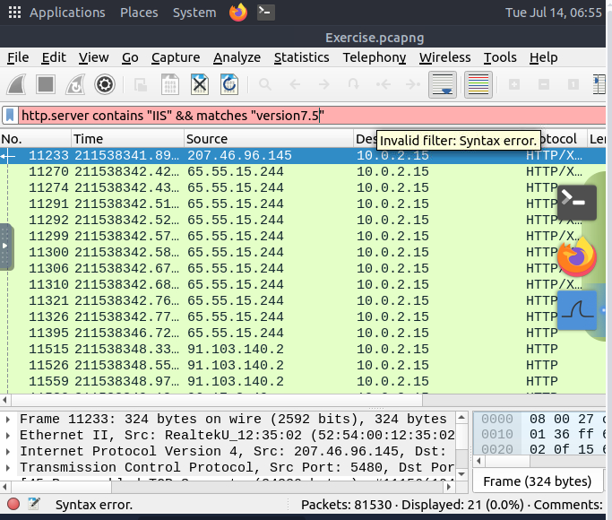

**18. Fixed the filter — separate `matches` clause on the right field**
`http.server contains "IIS" && http.server matches "7.5"` — 71 packets.

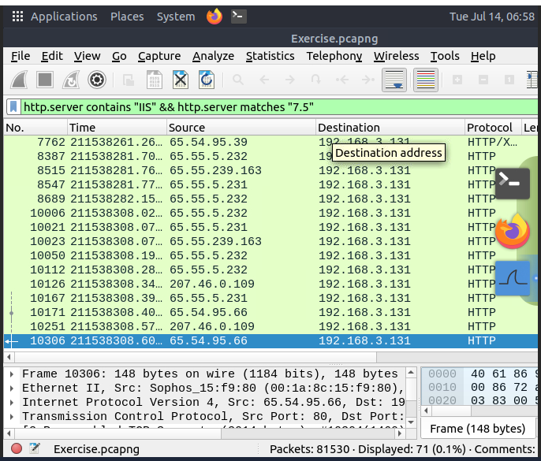

**19. Filtered `tcp.port in {3333, 4444, 9999}`**
2,235 packets across all three ports.

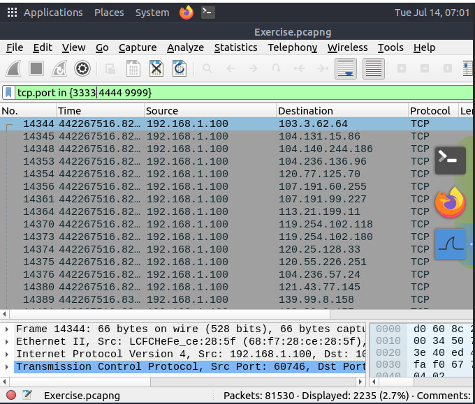

**20. Filtered for packets with even TTL values**
`string(ip.ttl) matches "[02468]$"` — 77,289 packets.

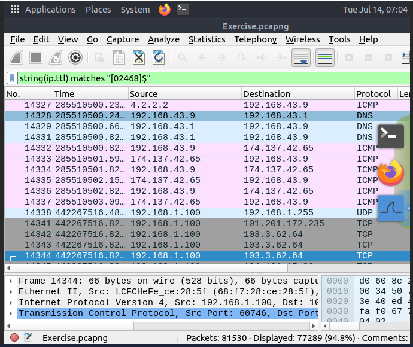

**21. Switched to the "Checksum Control" profile and filtered for bad TCP checksums**
`tcp.checksum.status == bad` — 34,185 packets.

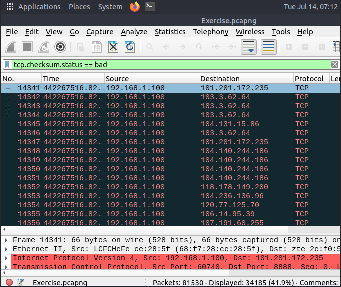

**22. Used an existing filter button**
Clicked the pre-made "gif/jpeg with http-200" filter button (`(http.response.code == 200) && (http.content_type matches "image(gif|jpeg)")`) — 261 packets displayed.

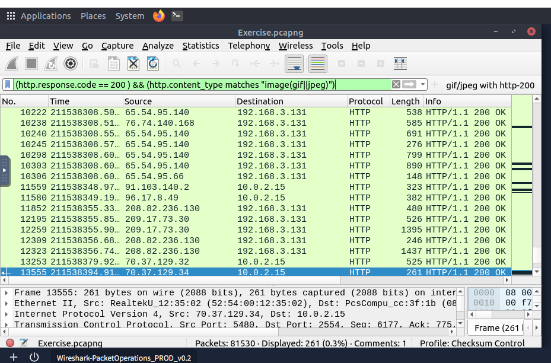

---

## 🔍 Key Findings

| Question | Answer |
|---|---|
| IP address of hostname starting with "bbc" | `199.232.24.81` |
| Number of IPv4 conversations | 435 |
| Bytes (KB) from the "Micro-St" MAC address | 7,474 |
| IP linked to "Blicnet" AS organisation | `188.246.82.7` |
| Most-used IPv4 destination address | `10.100.1.33` |
| Max DNS request-response time | 0.467897 sec |
| HTTP requests to rad[.]msn[.]com | 39 |
| Number of IP packets | 81,420 |
| Packets with TTL < 10 | 66 |
| Packets using TCP port 4444 | 632 |
| HTTP GET requests to port 80 | 527 |
| Type A DNS queries | 51 |
| IIS server packets not from port 80 | 21 |
| IIS server packets, version 7.5 | 71 |
| Packets on ports 3333, 4444, or 9999 | 2,235 |
| Packets with even TTL values | 77,289 |
| Bad TCP checksum packets (Checksum Control profile) | 34,185 |
| Packets shown by the existing filter button | 261 |

---

## 💡 Lessons Learned

- The `http.port` vs `tcp.port` mix-up on the GET-requests-to-port-80 question was a good reminder that `http.port` and `tcp.port` aren't interchangeable even when you'd expect them to line up — worth double-checking which protocol layer a filter field actually belongs to.
- Same story with the IIS version filter — `&& matches "version7.5"` with no field named threw a syntax error; `matches` needs a field to operate on (`http.server matches "7.5"`), it's not a standalone clause.
- Used a web search once, for the DNS type A query filter, rather than recalling it — noted here rather than presented as recalled from memory.
- This room is really "Day 29 with queries" — the Statistics menu additions (Conversations, Endpoints, GeoIP/AS lookups) are the genuinely new material; the filter syntax builds directly on the display-filter basics from Day 29.

