# Day 33: Intro to LAN

**Path:** SOC Level 1
**Platform:** TryHackMe
**Status:** ✅ Completed

---

## 📌 Overview

This room covered how a Local Area Network is actually laid out (topology), the two dedicated devices that make it work (switches and routers), and three of the protocols that let devices on that network find and configure each other (subnetting, ARP, and DHCP).

**LAN topologies** are the physical/logical design of how devices connect. The room walked through three, each with its own trade-off between cost, scalability, and fault tolerance:

- **Star topology** — every device connects individually to a central switch/hub. It's the most common design today because it's reliable and scalable (easy to add devices), but it costs more in cabling and dedicated hardware, and it has one obvious weak point: if the central device fails, every device attached to it loses connectivity, even though the individual link cables are all fine.
- **Bus topology** — every device taps into a single shared cable, the "backbone" (the room's analogy: leaves branching off one stem). It's cheap and easy to set up since it needs no dedicated switching hardware, but every device's traffic shares that one cable, so it bottlenecks fast under simultaneous demand and is hard to troubleshoot because you can't isolate which device is causing the slowdown. Worse, the backbone itself is a single point of failure — cut it anywhere and the devices on either side can no longer talk at all.
- **Ring topology** — devices connect directly to two neighbours to form a closed loop, with data passed device-to-device until it reaches its destination. A device only forwards someone else's data if it has none of its own to send first. Traffic only moves in one direction, which makes faults easy to isolate and avoids the bottlenecking a bus topology suffers from — but it also means a single broken cable or downed device breaks the entire ring, since there's no alternate path around the gap.

**Switches** aggregate multiple devices (4 to 64+ ports) using Ethernet and are smarter than a hub: rather than repeating every packet out every port, a switch tracks which device sits on which port and only forwards a packet to its actual destination, cutting down unnecessary traffic. **Routers** connect separate networks and route data between them. Switches and routers can be connected together to add redundant paths through a network — if one path goes down, traffic can still get through another, at some cost to raw performance but with no full outage.

**Subnetting** is splitting one network into smaller networks within itself — the room's analogy is slicing a cake so each department (accounting, finance, HR) gets its own reserved piece. A subnet mask, like an IP address, is four octets (32 bits, 0–255 each), and IP addresses inside a subnet serve three roles: the **network address** (identifies the subnet itself, e.g. `192.168.1.0`), the **host address** (identifies one device on it, e.g. `192.168.1.100`), and the **default gateway** (the device capable of sending traffic to other networks, usually `.1` or `.254`, e.g. `192.168.1.254`). Subnetting buys efficiency, security, and control — the room's example is a café keeping its employee/register network fully separate from its public Wi-Fi hotspot, while both still share the same upstream Internet connection.

**ARP (Address Resolution Protocol)** is how a device maps an IP address to a MAC address on its local network, storing the result in a local ARP cache. It works via two message types: an **ARP Request** ("who has this IP address?") is broadcast to the whole network, and only the device that actually owns that IP responds with an **ARP Reply** carrying its MAC address, which the requester then caches.

**DHCP (Dynamic Host Configuration Protocol)** automatically assigns IP addresses instead of requiring manual configuration, through a four-step exchange: **DHCP Discover** (the device asks if any DHCP server is present), **DHCP Offer** (a server proposes an IP address), **DHCP Request** (the device confirms it wants that address), and **DHCP ACK** (the server confirms and the device can start using it).

---

## 🛠️ Tools Used

- TryHackMe's browser-based "Topology Flaws" interactive lab (Star, Bus, and Ring topology simulations)

---

## 🪜 Steps Followed

**1. Opened the Topology Flaws lab.** The lab's premise: walk through each topology and deliberately break it to see its failure mode first-hand.

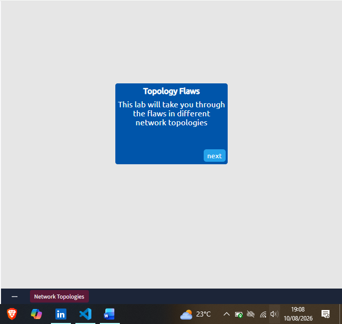

**2. Started with the Ring topology.** All devices connect to two others to form a closed loop.

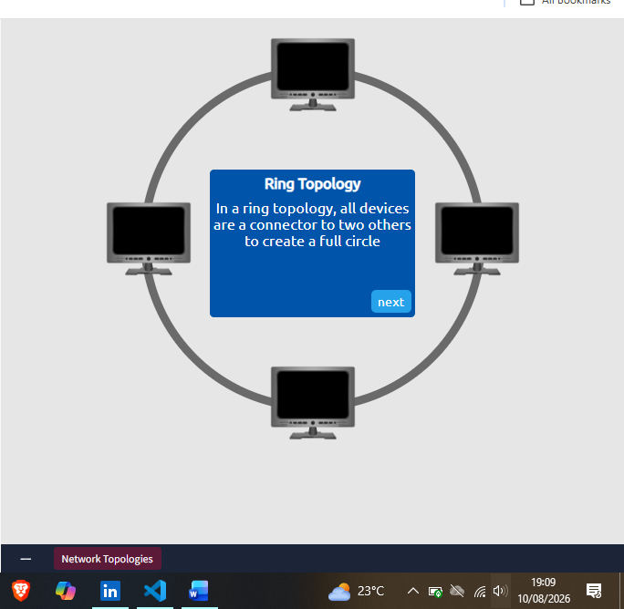

**3. Watched how data actually travels around the ring.** Packets pass from device to device around the loop until they reach their destination.

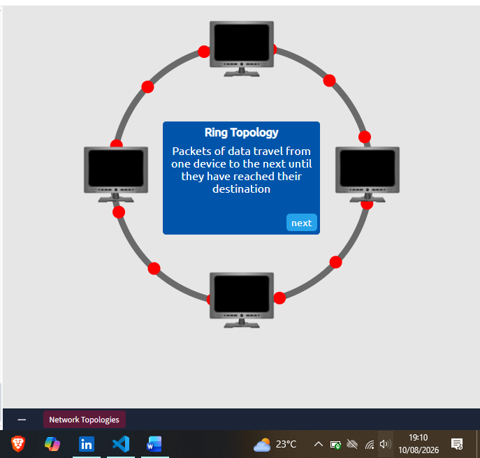

**4. Read the explained flaw.** A downed device or a broken cable anywhere on the ring stops data from passing at all — there's no alternate path.

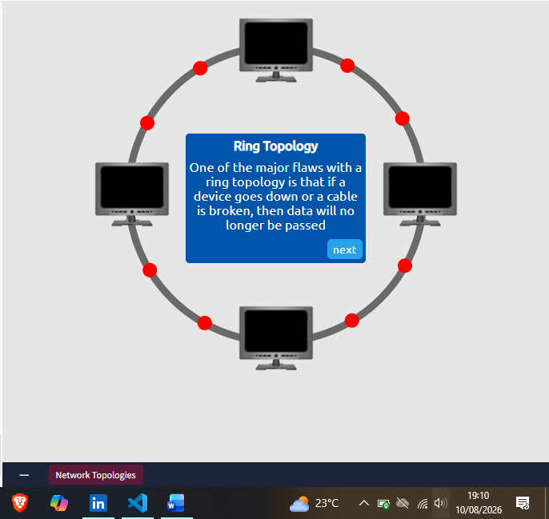

**5. Got the instructions to break it myself.** Hovering over the middle of any cable segment lets you cut it and watch what happens to in-flight packets.

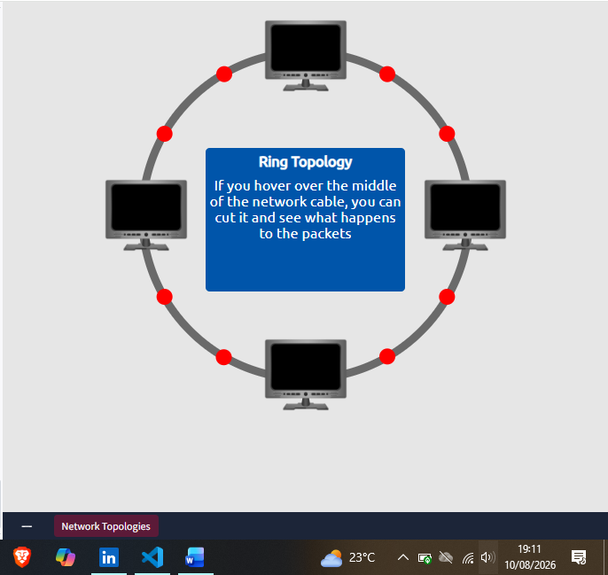

**6. Cut the cable.** Mid-cut, with a packet visibly caught at the break point instead of completing its trip around the loop.

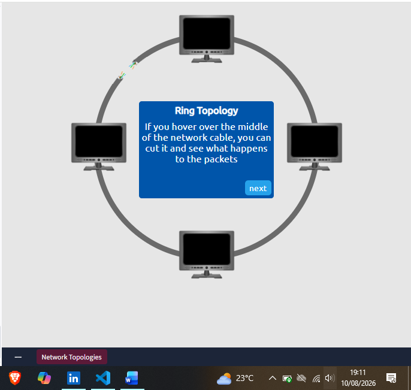

**7. Confirmed the ring was fully down.** With the loop broken, packets can no longer travel around it and no devices can talk to each other — exactly the single-point-of-failure flaw the theory described.

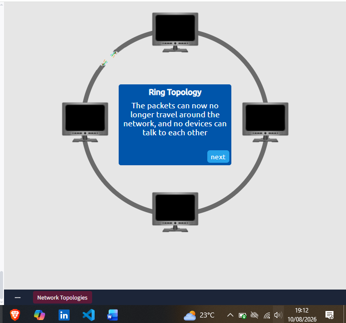

**8. Moved on to the Bus topology.** All devices tap into a single shared backbone cable.

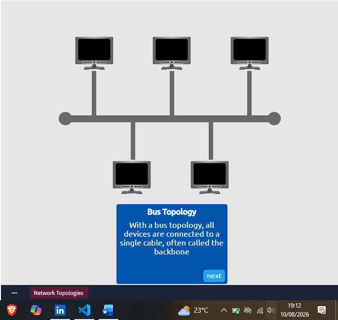

**9. Reviewed how data moves along the bus.** Data travels in both directions down the backbone simultaneously until it reaches the destination device.

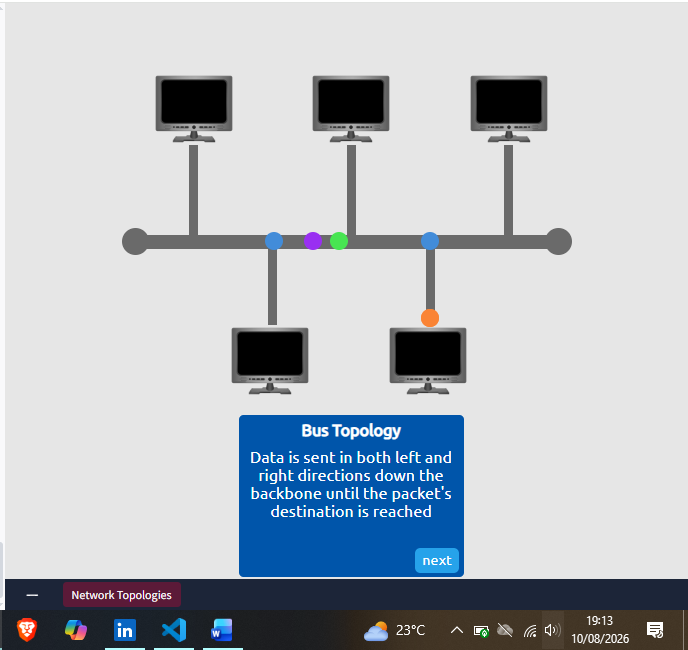

**10. Read the explained flaw.** A bus topology can't handle a large volume of simultaneous data — shared-cable contention bottlenecks it fast.

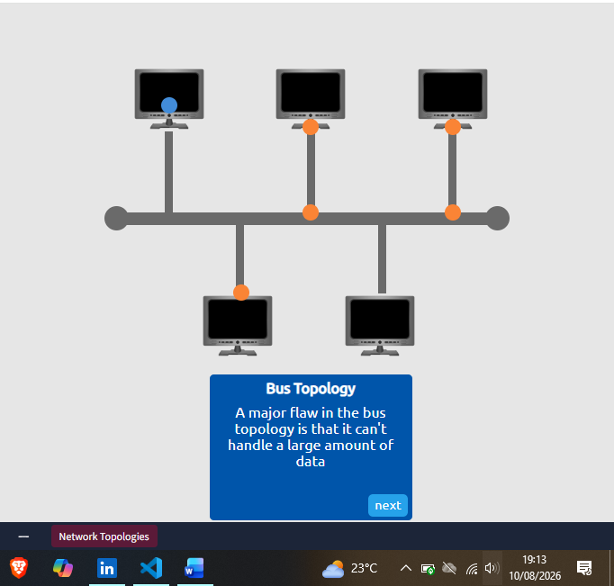

**11. Got the instructions to break it myself.** The task: flood the bus with packets as fast as possible and try to take the whole network down.

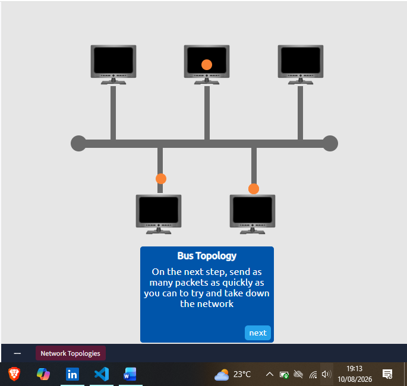

**12. Set up the first packet send.** Used the From/To dropdowns to select a source and destination computer on the bus and queued up a send.

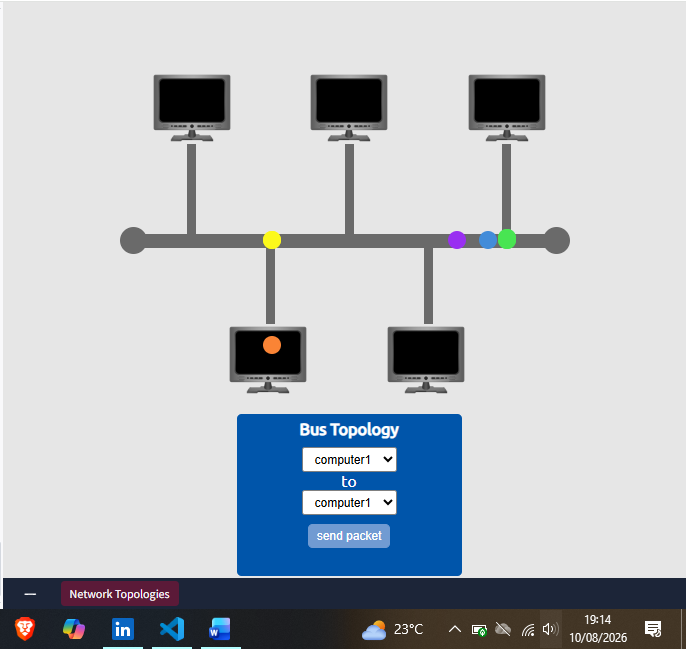

**13. Sent packets rapidly between computer1 and computer2.** Multiple packets in flight along the backbone at once, visibly stacking up on the shared cable.

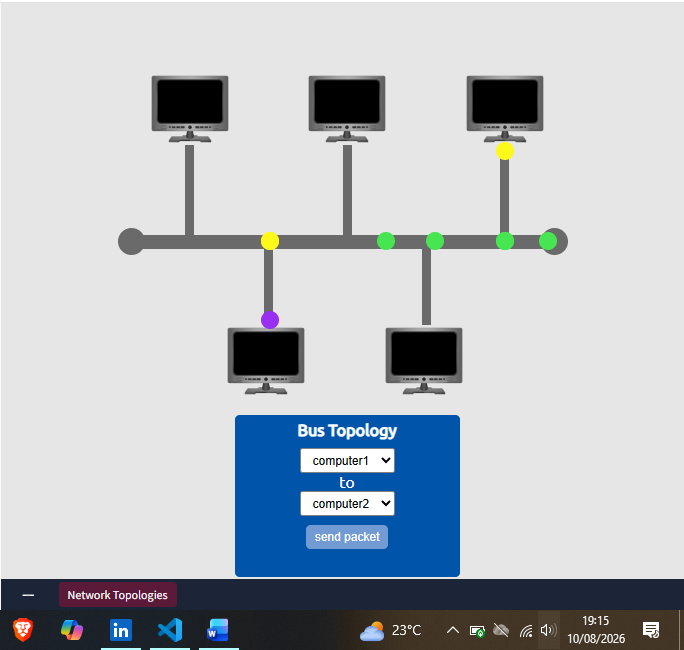

**14. Confirmed the bus network went down.** The whole backbone turned red — flooding it with simultaneous traffic bottlenecked it into total failure, exactly as the flaw description predicted.

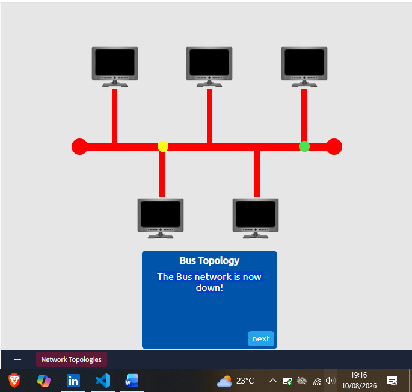

**15. Moved on to the Star topology.** Every device connects individually to a central switch/hub.

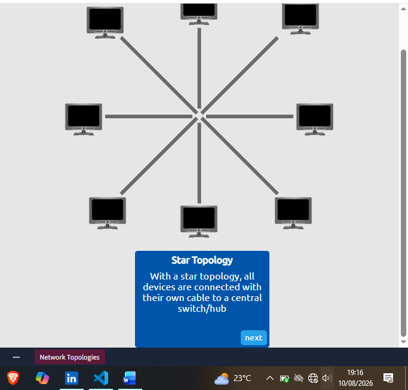

**16. Read the explained flaw and saw it in action.** Every packet has to pass through the central switch — if that switch goes down, the entire network loses connectivity even though the individual device links are untouched.

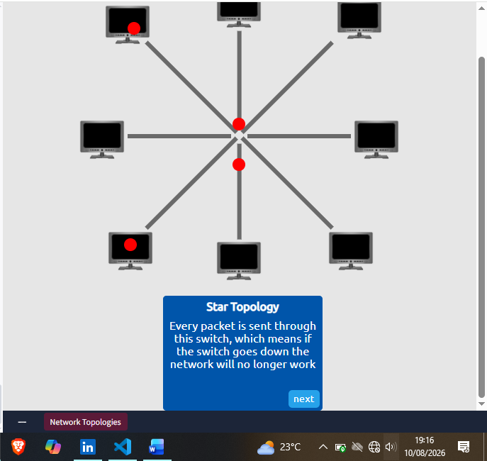

**17. Confirmed the star network went down.** With the central switch taken out, none of the individually-cabled devices could reach each other anymore.

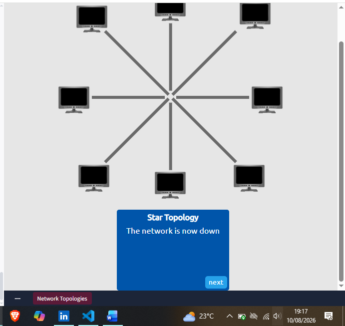

**18. Completed the lab and got the flag.** Having broken all three topologies, the lab confirmed completion with the flag: `THM{TOPOLOGY_FLAWS}`.

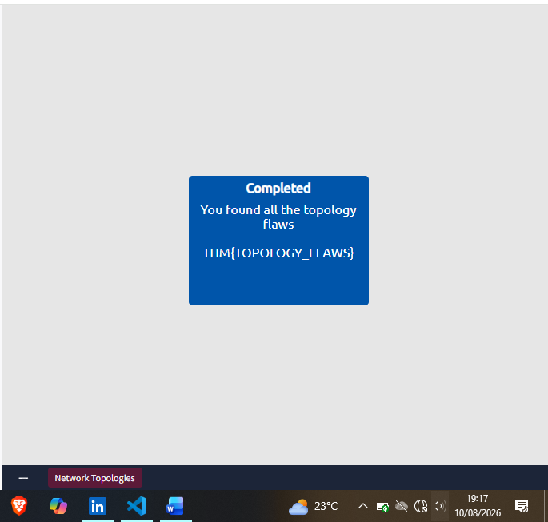

---

## 🔍 Key Findings

- **Topology Flaws lab flag:** `THM{TOPOLOGY_FLAWS}` — earned by triggering the specific failure mode of all three topologies (Ring, Bus, Star) in the interactive lab.
- **Ring topology failure:** a single cut cable breaks the entire loop — no redundant path exists, so the whole ring goes down at once.
- **Bus topology failure:** flooding the shared backbone with simultaneous packets bottlenecks and takes down the entire network — the flaw is contention on the one shared cable, not a physical break.
- **Star topology failure:** taking out the central switch kills connectivity for every attached device, even though each device's individual cable link is still intact — the switch itself is the single point of failure.

---

## 💡 Lessons Learned

- Seeing all three topologies fail back-to-back in the same lab made the trade-off concrete in a way the theory alone didn't: Ring and Bus both die from "shared medium" problems (one from a physical break, one from contention), while Star trades that away for a *different* single point of failure — the central hardware itself. None of the three topologies actually eliminates a single point of failure; each just relocates it.
- This connects directly to [[Day 32]]'s Layer 2/Layer 3 switch material — knowing a switch is the failure point in a star topology is exactly why the earlier room's note about connecting switches and routers together for redundancy matters in practice, not just as an abstract "best practice."
- The ARP section here is a good refresher tied to [[Day 31]]'s ARP-poisoning investigation: the request/reply/cache mechanism described in the theory is precisely the mechanism that MITM attack was abusing — a device answering an ARP Request for an IP it doesn't actually own.
