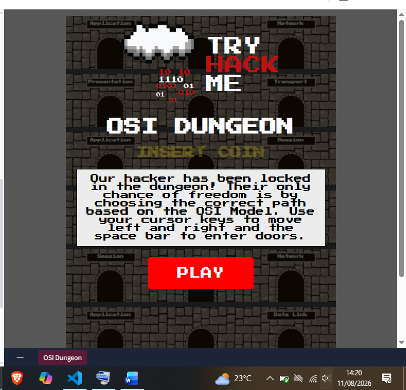
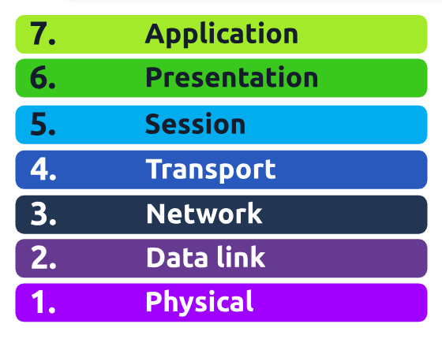
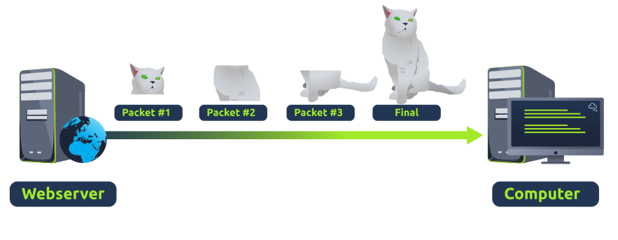
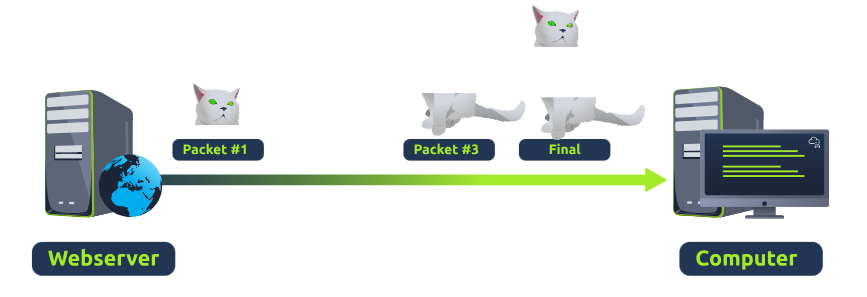
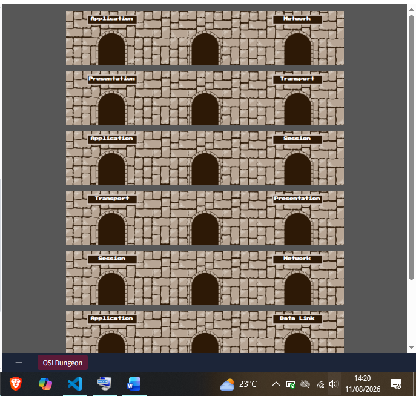
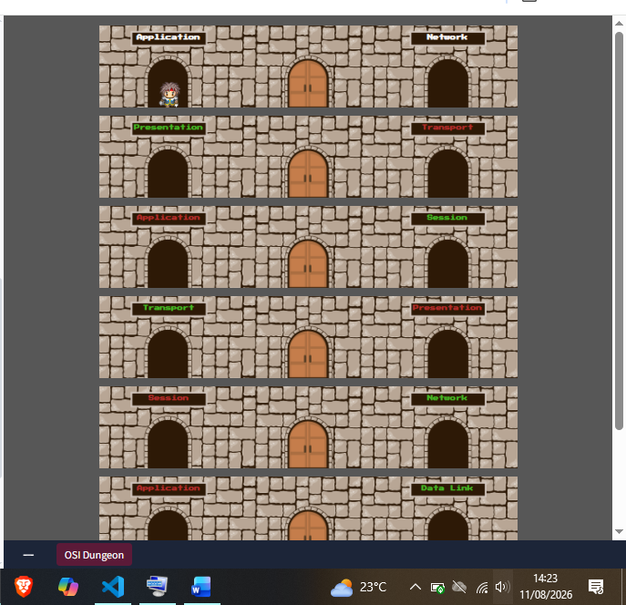
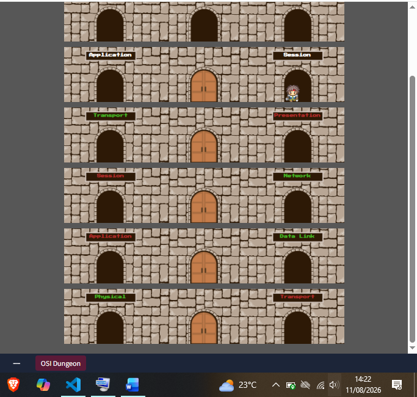
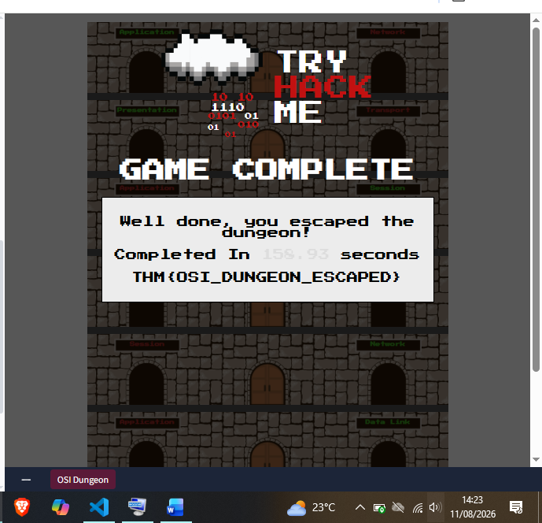

# Day 34: OSI Model

**Path:** SOC Level 1
**Platform:** TryHackMe
**Status:** ✅ Completed

---

## 📌 Overview

This room is the framework that ties everything from the last few days together: the **OSI (Open Systems Interconnection) Model**, the seven-layer standard that governs how every networked device sends, receives, and interprets data — regardless of how differently those devices are built or designed. As data moves through the layers, information gets added at each stage; that process is called **encapsulation**. Working from Layer 1 up to Layer 7:

- **Layer 1 — Physical.** The actual hardware: electrical signals moving 1s and 0s across a medium like an Ethernet cable. The lowest, simplest layer.
- **Layer 2 — Data Link.** Handles physical addressing. Takes a packet from the network layer (which already has the remote computer's IP address) and adds the destination's MAC address — the burnt-in, technically-unchangeable-but-spoofable identifier tied to a device's Network Interface Card (NIC). It's the MAC address that traffic is actually delivered to on the wire, and this layer also formats data for transmission.
- **Layer 3 — Network.** Where routing and reassembly happen — determining the most efficient path for chunks of data to travel and identifying devices by IP address (e.g. `192.168.1.100`). Routing protocols like OSPF and RIP decide the "best" path based on shortest route, historical reliability, and physical link speed (copper vs. fibre). Devices that route by IP address, like routers, are called Layer 3 devices for exactly this reason.
- **Layer 4 — Transport.** Decides how data actually gets sent, via one of two protocols:
  - **TCP** reserves a constant connection between two devices and error-checks along the way, guaranteeing data arrives complete and in order — at the cost of speed, since a lost chunk means the whole transmission can't be used, and a slow link bottlenecks the whole reserved connection. TCP is the right fit for anything that needs to be accurate and complete: file sharing, browsing, email.
  - **UDP** skips all of that — no synchronization, no guarantee, no reserved connection — which makes it much faster but means data might simply never arrive. It's the right fit when speed matters more than completeness or occasional loss is tolerable: device discovery protocols like ARP and DHCP, or video streaming, where a few lost pixels barely matter.
- **Layer 5 — Session.** Once data is correctly formatted, this layer creates and maintains the connection (the "session") between two devices, and closes it if it goes unused or is lost. Sessions can include checkpoints, so only new data needs resending after a loss, saving bandwidth — and crucially, sessions are unique: data from one session can't cross over into another.
- **Layer 6 — Presentation.** The standardization layer — it translates data to and from the application layer so that two pieces of software built completely differently (e.g. two different email clients) can still understand data sent between them in the same way. Encryption, like HTTPS, happens here.
- **Layer 7 — Application.** The layer most people actually interact with: the rules and protocols that govern how a user works with data through email clients, browsers, or file-transfer software like FileZilla, plus underlying protocols like DNS that translate website addresses into IP addresses.

---

## 🛠️ Tools Used

- TryHackMe's browser-based "OSI Dungeon" interactive game (Task: Practical – OSI Game)

---

## 🪜 Steps Followed

**1. Opened the OSI Dungeon and read the brief.** The premise: a hacker is locked in the dungeon, and the only way out is choosing the correct sequence of doors based on the OSI Model's layer order, using the cursor keys to move and space bar to enter doors.

**2. Reviewed the seven-layer reference before playing.** Kept the Physical → Data Link → Network → Transport → Session → Presentation → Application order (Layer 1 to Layer 7) in mind as the path I'd need to walk through the dungeon.

**3. Reviewed the TCP delivery diagram from the theory section.** All three packets making up the cat picture arrive intact and in order, and the "Computer" reassembles them into the complete final image — illustrating TCP's guarantee of accuracy and order.

**4. Reviewed the matching UDP delivery diagram.** Only Packet #1 and Packet #3 arrive — Packet #2 never does — so the "Computer" ends up with an incomplete, broken image. No error checking, no guarantee, no resend.

**5. Started the dungeon run.** Rows of doorways labelled with OSI layer names on both left and right, none yet marked correct or incorrect — the starting state before making any choices.

**6. Made the first few door choices.** Doors began turning green (correct pick) or red (wrong pick) as I moved through the top rows, aiming to always pick the door matching the next layer up in OSI order.

**7. Continued deeper into the dungeon.** Further rows resolved to green/red, with earlier mistakes visible in red and correct choices holding in green as I moved down through the remaining layers.

**8. Escaped the dungeon and got the flag.** Completed the run in 158.93 seconds (staff high score to beat was 19 seconds — didn't get close to that) and got the completion flag: `THM{OSI_DUNGEON_ESCAPED}`.

---

## 🔍 Key Findings

- **OSI Dungeon flag:** `THM{OSI_DUNGEON_ESCAPED}` — earned by picking the doors matching the correct Layer 1 → Layer 7 OSI order, completed in 158.93 seconds (well off the staff high score of 19 seconds).
- **TCP vs UDP, illustrated directly:** the room's cat-picture diagrams show it cleanly — TCP delivers every packet and reassembles the full image; UDP drops a packet mid-transfer with no attempt to recover it, leaving the image incomplete.
- **Layer-to-protocol mapping confirmed:** MAC addressing sits at Layer 2 (Data Link), IP addressing and routing at Layer 3 (Network), TCP/UDP at Layer 4 (Transport), and encryption (e.g. HTTPS) at Layer 6 (Presentation).

---

## 💡 Lessons Learned

- The dungeon format made the layer *order* stick in a way that just reading the list didn't — having to actually pick between two doors at each floor forced recalling whether Session comes before or after Presentation, rather than just recognizing the names.
- The TCP/UDP diagrams reframed something I'd only think about at the packet level: UDP isn't "worse" than TCP, it's a different trade — and the ARP/DHCP callback to [[Day 33]] made that concrete, since both of those protocols deliberately use UDP because a lost broadcast just means retrying, not corrupting a file.
- Worth remembering for later Wireshark work ([[Day 31]]): everything I was filtering on there (MAC addresses, IP addresses, TCP handshakes, UDP unreachable messages) maps directly onto specific OSI layers — Layer 2 for MAC, Layer 3 for IP/routing, Layer 4 for TCP/UDP behaviour. Having the model explicit now should make it faster to reason about *why* a given packet behaves the way it does, not just recognize the pattern.
