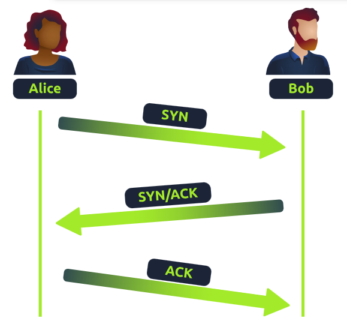
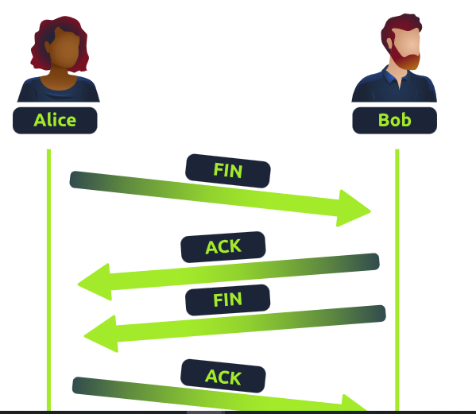
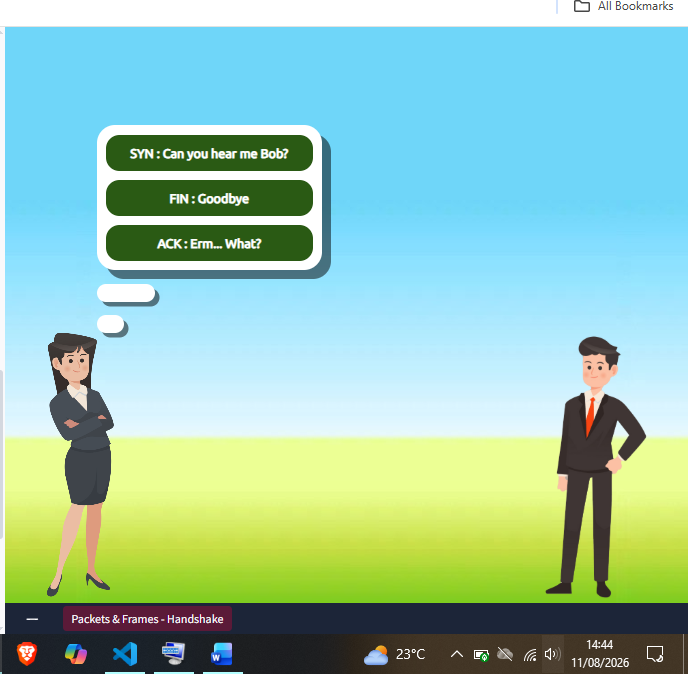
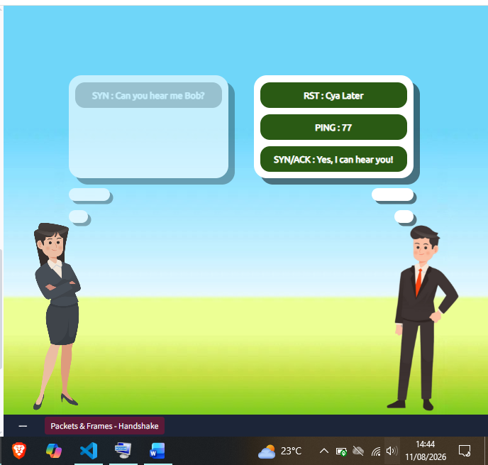
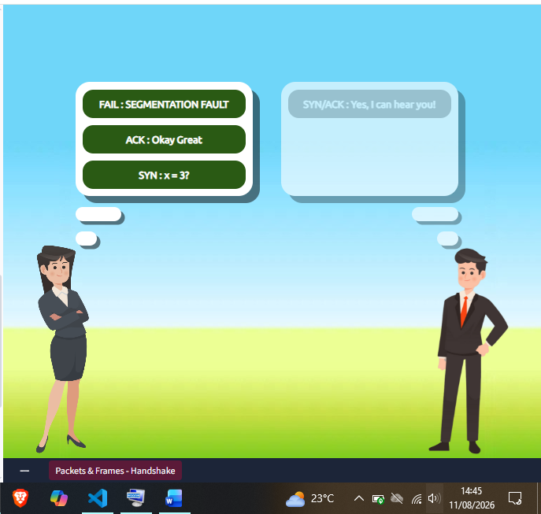
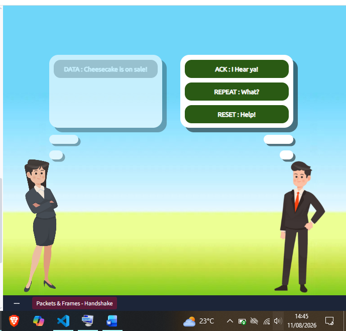
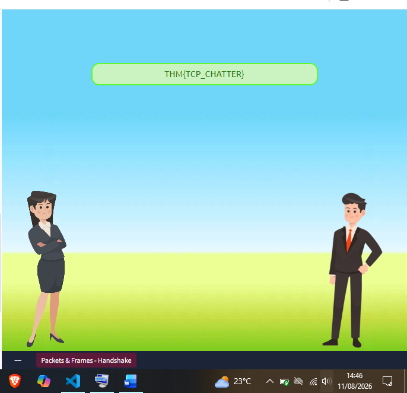
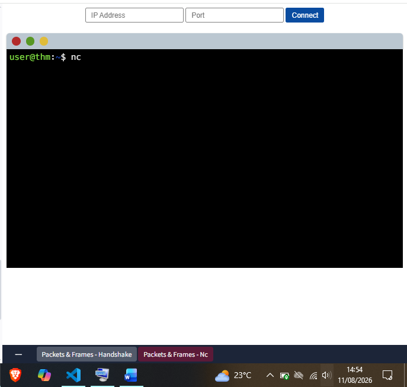
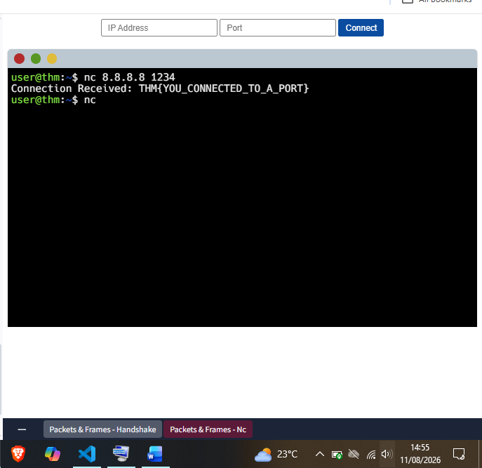

# Day 35: Packets & Frames

**Path:** SOC Level 1
**Platform:** TryHackMe
**Status:** ✅ Completed

---

## 📌 Overview

This room drilled into the specific unit of data behind everything covered so far — and drew a precise line between two terms that are often used loosely: **packets** and **frames**.

A **packet** is Layer 3 (Network) data — an IP header plus a payload. A **frame** is what a Layer 2 (Data Link) device wraps around that packet, adding information like MAC addresses so it can actually be delivered on the wire. The room's analogy: the frame is the envelope, the packet is the letter inside it. Once the recipient opens the envelope (frame), they know how to forward the letter (packet) onward — this wrapping/unwrapping is the same encapsulation/decapsulation process covered in the OSI Model room. As a rule of thumb: talking about IP addresses means talking about packets; once that encapsulating information is stripped away, it's the frame itself.

Sending data as small packets rather than one giant message is what keeps networks from bottlenecking — a webpage image, for instance, arrives as several packets and gets reassembled once it's fully received. Every IP packet carries standard headers, including **Time to Live** (an expiry timer so a lost packet doesn't clog the network forever), **Checksum** (integrity checking — if the data changes in transit, the checksum won't match), and **Source/Destination Address** (so data knows where it came from and where it's going).

**TCP/IP and the Three-Way Handshake.** TCP/IP is effectively a four-layer summary of the OSI model (Application, Transport, Internet, Network Interface), and it's **connection-based** — a connection has to be established between client and server before any data moves. That's what the **three-way handshake** does:

1. **SYN** — client: "here's my Initial Sequence Number (ISN) to synchronize with" (e.g. 0)
2. **SYN/ACK** — server: "here's my ISN (e.g. 5,000), and I acknowledge yours (0)"
3. **ACK** — client: "I acknowledge your ISN (5,000); here's data at my ISN+1 (1)"

Each side's next sequence number is always the previous one plus 1, which is how both ends agree on ordering. TCP packets carry headers beyond the basic IP ones too: **Source/Destination Port**, **Sequence/Acknowledgement Number**, **Checksum**, **Data**, and **Flag** (which determines handshake behaviour — SYN, SYN/ACK, ACK, DATA, FIN to close cleanly, or RST to abruptly kill the connection, usually signalling something went wrong). Closing a TCP connection is a mirrored handshake: one side sends **FIN**, the other acknowledges and sends its own FIN back, and the first side acknowledges that too — clean and reserved-resource-conscious, versus RST's abrupt "something broke."

**UDP/IP**, by contrast, is **stateless** — no three-way handshake, no synchronization, no acknowledgement. It's faster and simpler (fewer headers — TTL, source/destination address, source/destination port, data — no sequence numbers or handshake flags) but has zero guarantee of delivery, which is why it fits tolerant use cases like video streaming or voice chat rather than anything that needs to arrive intact.

**Ports.** The room's analogy: a harbour has ports built for specific ship types, and a cruise liner can't dock at a fishing-boat port. Networking ports work the same way — a numerical value from 0–65535 that enforces which application's data goes where. Ports 0–1024 are "common" ports with standardized protocol assignments: **FTP** (21), **SSH** (22), **HTTP** (80), **HTTPS** (443), **SMB** (445), **RDP** (3389). These are conventions, not hard rules — a service can run on a non-standard port, but then it has to be addressed explicitly with a colon and port number (e.g. `example.com:8080`), since clients otherwise assume the standard port.

---

## 🛠️ Tools Used

- TryHackMe's browser-based "Packets & Frames - Handshake" interactive lab (TCP three-way handshake reconstruction)
- TryHackMe's browser-based "Packets & Frames - Nc" interactive lab (`nc` / netcat port connection)

---

## 🪜 Steps Followed

**1. Reviewed the three-way handshake diagram.** Alice sends `SYN`, Bob replies `SYN/ACK`, Alice replies `ACK` — the connection-establishment sequence from the theory section, laid out visually before touching the practical.

**2. Reviewed the connection-close diagram.** Alice sends `FIN`, Bob acknowledges and sends his own `FIN` back, Alice acknowledges that — the mirrored four-step teardown.

**3. Started the Handshake practical — Alice's first move.** Picked `SYN: Can you hear me Bob?` from Alice's available options (the other two, `FIN: Goodbye` and `ACK: Erm... What?`, would have made no sense as an opening message).

**4. Bob's turn.** With Alice's SYN grayed out (sent), picked `SYN/ACK: Yes, I can hear you!` from Bob's options over `RST: Cya Later` and `PING: 77` — the correct handshake response to a SYN.

**5. Alice's turn again.** Picked `ACK: Okay Great` over `FAIL: SEGMENTATION FAULT` and `SYN: x = 3?` — acknowledging Bob's SYN/ACK completes the three-way handshake.

**6. Connection established — data and Bob's acknowledgement.** With the handshake complete, Alice's line showed `DATA: Cheesecake is on sale!`; picked `ACK: I Hear ya!` for Bob over `REPEAT: What?` and `RESET: Help!` to acknowledge the data was received.

**7. Completed the conversation and got the flag.** With the full SYN → SYN/ACK → ACK → DATA → ACK sequence correctly reassembled, the lab revealed: `THM{TCP_CHATTER}`.

**8. Opened the Ports practical (`nc`).** A bare terminal with IP Address / Port fields and an `nc` prompt waiting for a target.

**9. Connected to `8.8.8.8` on port `1234` as instructed.** Ran `nc 8.8.8.8 1234` and the terminal confirmed the connection with the flag: `THM{YOU_CONNECTED_TO_A_PORT}`.

---

## 🔍 Key Findings

- **Handshake practical flag:** `THM{TCP_CHATTER}` — earned by correctly reassembling the full exchange: `SYN` → `SYN/ACK` → `ACK` → `DATA` → `ACK`.
- **Ports practical flag:** `THM{YOU_CONNECTED_TO_A_PORT}` — earned by connecting with `nc 8.8.8.8 1234`.
- The distractor options in the handshake lab (`RST`, `PING`, `FAIL: SEGMENTATION FAULT`, `REPEAT`, `RESET`) map directly to the theory's "things that go wrong" — RST especially, as the abrupt last-resort connection-killer versus a clean FIN close.

---

## 💡 Lessons Learned

- The packet-vs-frame distinction (Layer 3 vs. Layer 2, IP header vs. MAC-address wrapper) is one of those things that's easy to gloss over as "basically the same thing" until you have to reason about which layer a given piece of information belongs to — worth keeping sharp for [[Day 31]]-style Wireshark work, where `eth.dst` (frame/MAC) and `ip.dst` (packet/IP) filters are doing genuinely different jobs.
- Reconstructing the handshake by hand (rather than just reading the diagram) made the ISN/ACK-number-plus-1 relationship much more concrete — it's easy to nod along to "the next sequence number is ISN+1" in the abstract, harder to skip past it when a wrong pick in the lab would have broken the conversation.
- The ports table here (FTP 21, SSH 22, HTTP 80, HTTPS 443, SMB 445, RDP 3389) is worth committing to memory outright — these come up constantly in any packet capture or service-enumeration context, and having them memorized instead of looked-up will speed up later rooms.
