# Day 36: Extending Your Network

**Path:** SOC Level 1
**Platform:** TryHackMe
**Status:** ✅ Completed

---

## 📌 Overview

This room stepped back from packet-level analysis to cover the infrastructure that traffic actually travels through — the pieces that decide whether a packet reaches its destination at all, and who's allowed to see it along the way.

**Port forwarding** is what makes a service reachable from outside its own network. On its own, a webserver on `192.168.1.10:80` is only visible to the two other machines on the same local network — that's an intranet. Port forwarding, configured at the router, opens that specific port up so an external network can reach it through the router's public IP (`82.62.51.70` in the room's example) instead of the private one. The room's key distinction: port forwarding just *opens* the port; it doesn't decide whether the traffic that arrives through it is allowed to proceed — that's a firewall's job.

**Firewalls** sit at the border of a network and permit or deny traffic based on source, destination, port, and protocol, after inspecting the packets. There are two primary categories: **stateful** firewalls track the entire connection (not just one packet) to make a decision — more resource-hungry, but capable of blocking a whole bad connection outright, even mid-handshake. **Stateless** firewalls judge each packet in isolation against a static rule set — cheaper to run, but "dumb": a rule that doesn't match exactly is useless, and one bad packet doesn't get the rest of the device blocked. Stateless firewalls are still valuable specifically because they're cheap to run against high-volume traffic, like a DDoS.

**VPNs** create an encrypted tunnel between devices on separate networks so they can communicate as if they were on one private network, even though the traffic is really crossing the public Internet. Beyond connecting geographically separate offices, VPNs buy privacy (encryption prevents sniffing, especially valuable on untrusted public Wi-Fi) and a degree of anonymity (though only as much as the VPN provider itself chooses not to log). The room covered three VPN technologies: **PPP**, which handles authentication/encryption using a matched private key and public certificate (similar to SSH) but can't leave a network on its own — it's non-routable; **PPTP**, which is what actually lets PPP-encrypted data leave the network, and is easy to set up but weakly encrypted; and **IPSec**, which encrypts using the existing IP framework — harder to configure, but strong encryption when it's set up right. TryHackMe itself uses a VPN to connect users to vulnerable machines without exposing those machines directly to the Internet.

**LAN devices — routers, switches, and VLANs.** Routers operate at Layer 3 and connect separate networks together, choosing a path for data based on factors like shortest path, reliability, or link speed when multiple paths exist. Switches connect multiple devices within a single network using Ethernet cable, and come in two flavours: **Layer 2 switches** just forward frames to the correct device by MAC address; **Layer 3 switches** do that too, but can additionally route packets between devices using IP — meaning they can partially take over a router's job. That routing capability is what makes **VLANs** (Virtual LANs) possible: a Layer 3 switch can assign different IP subnets (e.g. `192.168.1.1` for Sales, `192.168.2.1` for Accounting) to virtually separate groups of devices on the same physical switch, so they share infrastructure like the Internet connection while staying logically and securely isolated from each other.

---

## 🛠️ Tools Used

- TryHackMe's browser-based Firewall simulator (static site, Task: Practical – Firewall)
- TryHackMe's browser-based Network Simulator (static site, Task: Practical – Network Simulator)

---

## 🪜 Steps Followed

**1. Reviewed the "before" state of port forwarding.** A webserver at `192.168.1.10:80` sitting behind a router, reachable only by the two other machines on its own network — no external access exists yet.

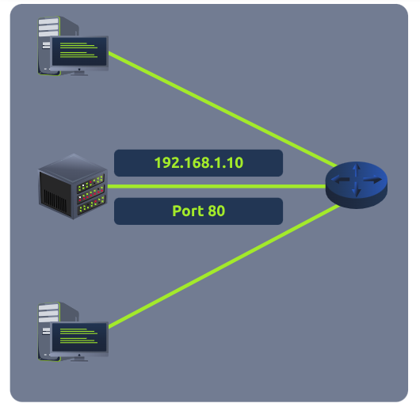

**2. Reviewed the "after" state once port forwarding is applied.** The same webserver becomes reachable from an entirely separate network (Network #2) over the Internet, routed through the first router's public IP (`82.62.51.70`) to the destination's public IP (`172.68.43.21`) on port 80.

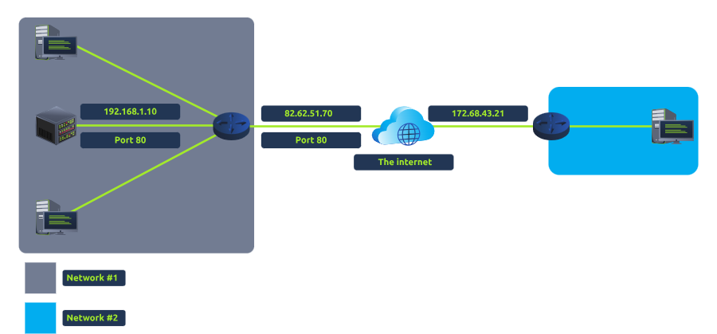

**3. Opened the Firewall practical simulator.** The scenario: `203.0.110.1` is under attack, and packets shown in red are coming from the attacker's machine — the task is to write rules that stop the malicious (red) traffic without blocking the legitimate (green) traffic, specifically on port 80.

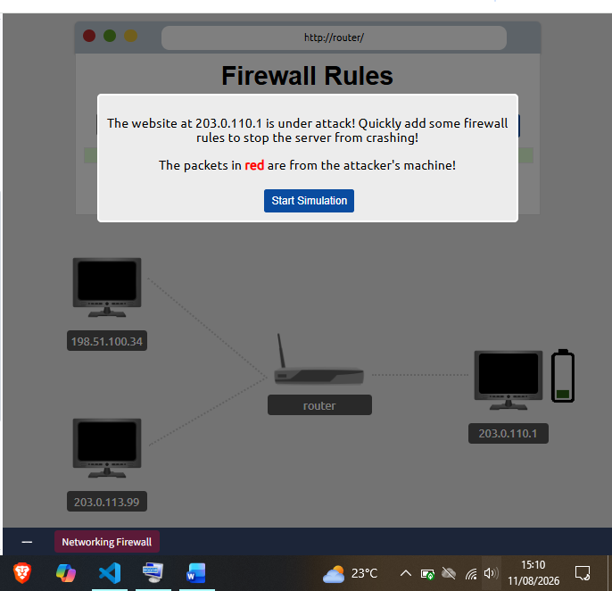

**4. First rule attempt crashed the simulated server.** Got the rule wrong on the first pass and had to restart the simulation — a reminder that a firewall rule that's too broad (or too narrow) can do as much damage as no rule at all.

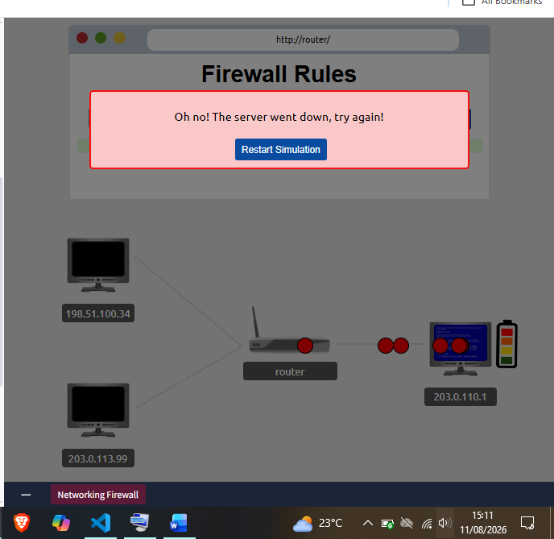

**5. Corrected the rule and saved the server.** With the right port-80 rule blocking only the malicious source, the simulator confirmed success and returned the flag: `THM{FIREWALLS_RULE}`.

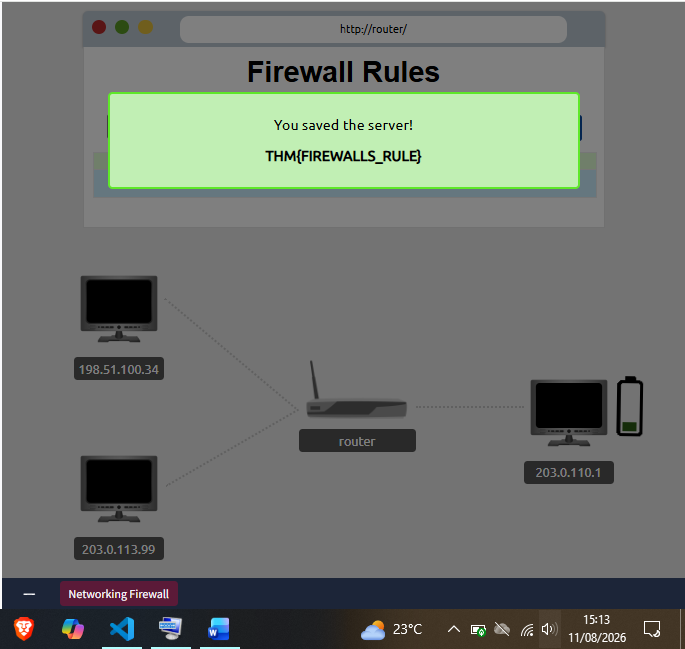

**6. Reviewed the VPN three-network diagram.** Two separate office networks (#1 and #2), each also containing a device that's part of a third, VPN-only network (#3) — those two VPN-connected devices can talk to each other privately even though they physically sit on different networks.

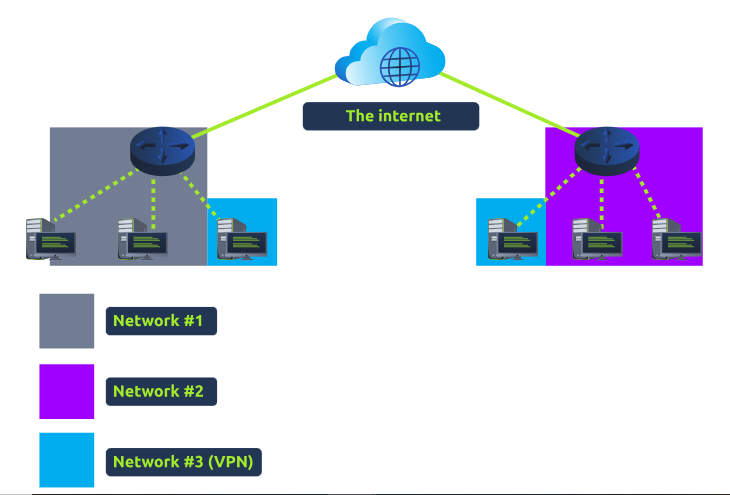

**7. Reviewed the Layer 2 switch diagram.** A single router connected to one Layer 2 switch, which fans out to six computers — the switch's only job here is forwarding frames to the right device by MAC address, with no routing involved.

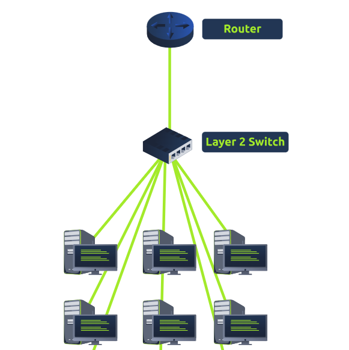

**8. Reviewed the Layer 3 switch / VLAN diagram.** One switch, two IP subnets (`192.168.1.1` and `192.168.2.1`), splitting devices into a Sales VLAN and an Accounting VLAN — same physical switch and shared router, but logically separated traffic.

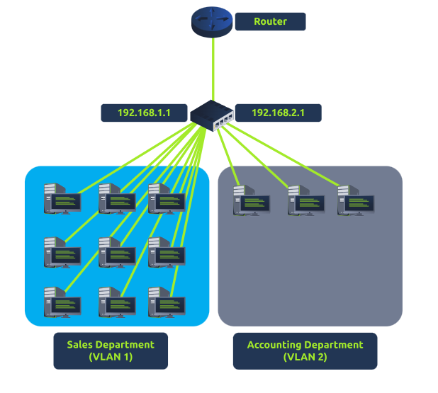

**9. Opened the Network Simulator practical.** Laid out three computers (computer1, computer2, computer3) connected through two switches and a central router, with a legend for packet types (TCP, TCP Handshake, UDP, ARP, Ping) and a panel to send packets and watch the network log.

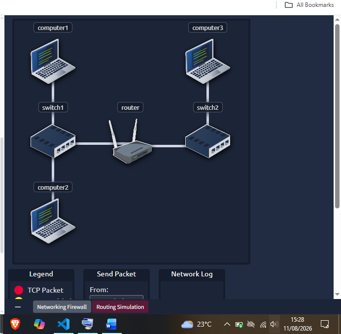

**10. Configured and sent a TCP packet from computer1 to computer3.** Set From: `computer1`, To: `computer3`, Packet Type: `TCP`, Data: `Hello!!!!`, as instructed by the task.

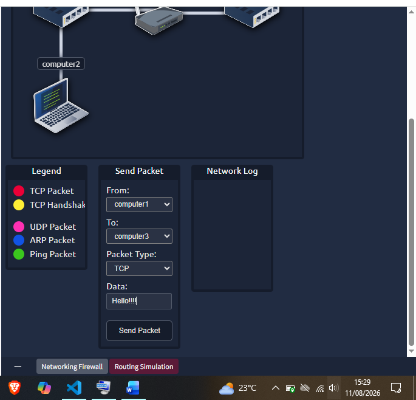

**11. Watched the handshake complete and got the flag.** The Network Log showed the TCP packet leaving computer1, computer3 acknowledging it, and the handshake completing — an embedded-page alert then popped up with the flag: `THM{YOU'VE_GOT_DATA}`.

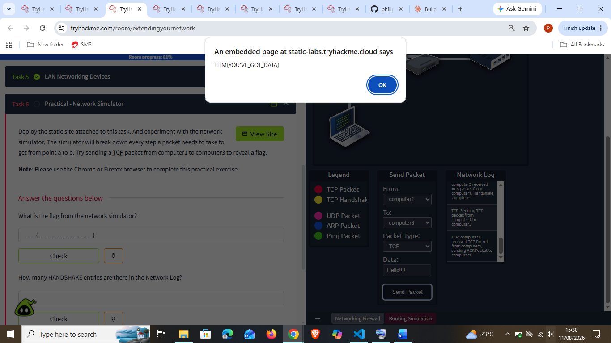

---

## 🔍 Key Findings

- **Firewall practical flag:** `THM{FIREWALLS_RULE}` — reached after one failed rule attempt (server crash/restart) followed by a correct port-80 rule blocking the attacker's red-flagged traffic.
- **Network Simulator flag:** `THM{YOU'VE_GOT_DATA}` — revealed after successfully sending a TCP packet from computer1 to computer3 and completing the handshake.
- The room also asks *"How many HANDSHAKE entries are there in the Network Log?"* — I didn't capture a screenshot of the full log or note the count while working through it, so I'm not including a number here rather than guess.
- Stateful firewalls judge whole connections and can block a device outright; stateless firewalls judge individual packets against static rules and are cheaper but far less flexible.
- Layer 3 switches are the piece that makes VLANs possible — they combine Layer 2's per-device frame forwarding with IP-based routing, which a plain Layer 2 switch can't do.

---

## 💡 Lessons Learned

- The firewall practical made the port-forwarding-vs-firewall distinction click in a way the theory alone didn't: port forwarding just opens the door, and a firewall is what decides who's allowed to actually walk through it. Crashing the simulated server on the first attempt was a useful (harmless) way to feel that difference.
- Seeing the VLAN diagram right after the plain Layer 2 switch diagram made it obvious *why* Layer 3 switches matter — the VLAN split is only possible because the switch can also route by IP, not just forward by MAC.
- This room connects directly to [[Day 31]]'s traffic analysis: knowing what a TCP handshake, an ARP packet, or a UDP packet look like at the infrastructure/simulator level here makes it much faster to recognize those same patterns inside a real Wireshark capture.
- Small honesty note: I didn't screenshot the full Network Log, so I can't back up an exact HANDSHAKE-entry count for this write-up — worth remembering to capture the full log next time a task asks for a specific count out of it.
