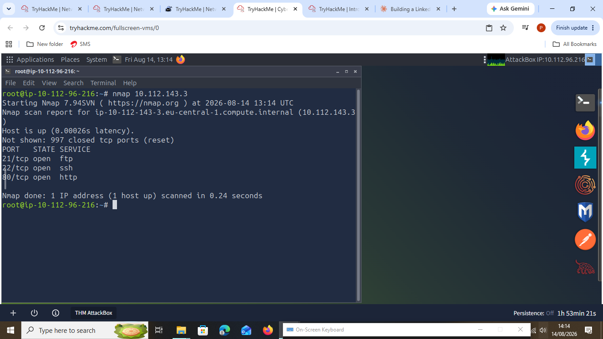
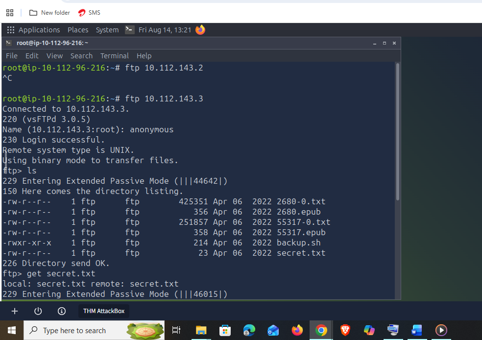
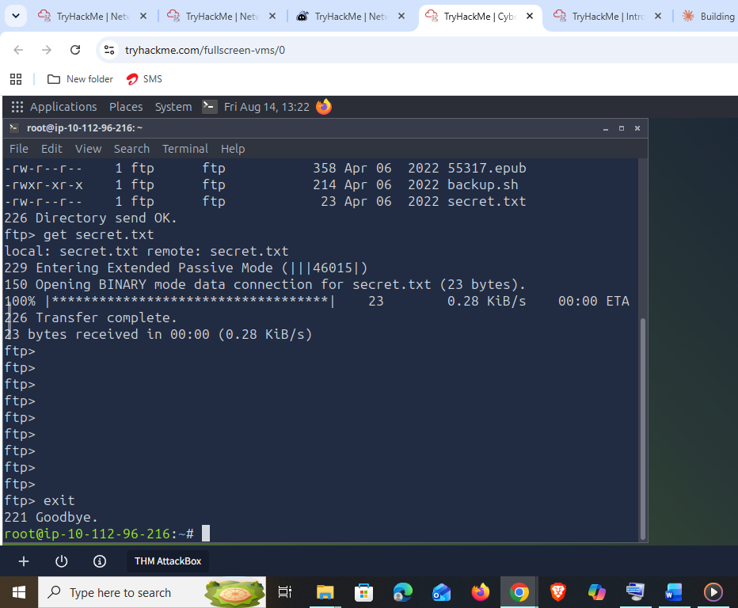
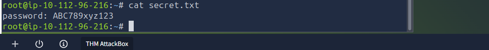
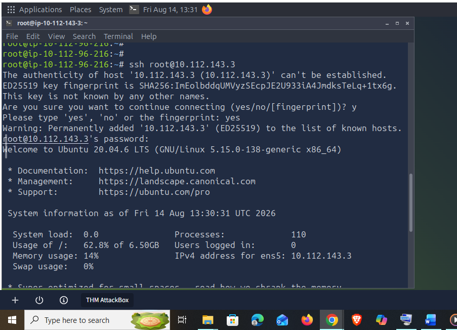
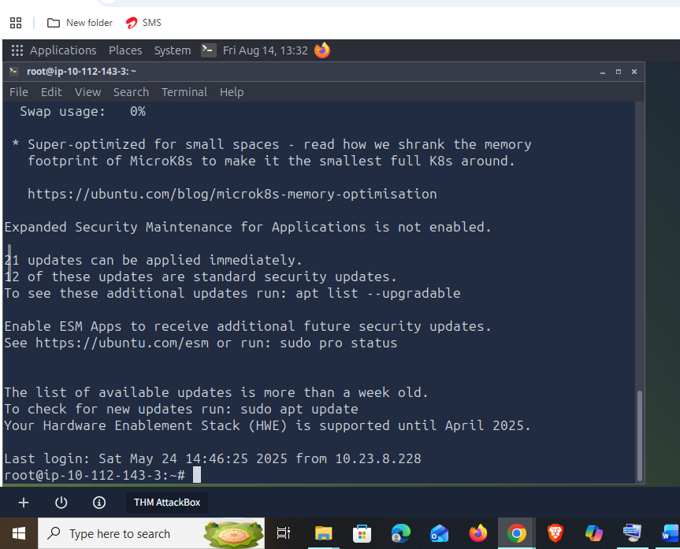
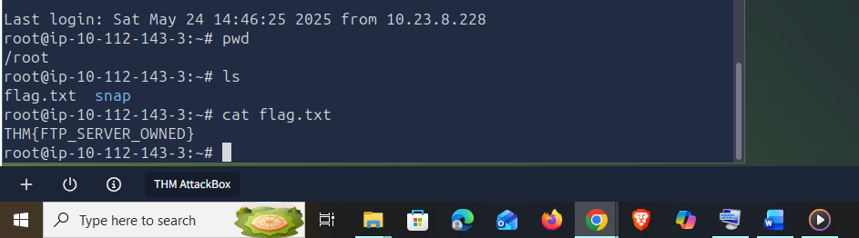
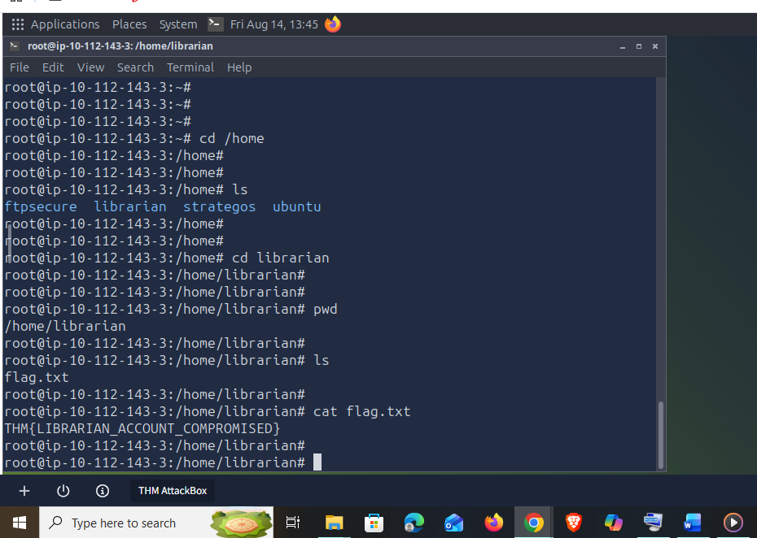

# Day 38: Network Security

**Path:** SOC Level 1
**Platform:** TryHackMe
**Status:** ✅ Completed

---

## 📌 Overview

This room is an introduction to network security and attacker methodology, capped off with a hands-on walkthrough of actually breaking into a target Linux server. It opens with the basics of what network security protects — the confidentiality, integrity, and availability of a network and its data — and the hardware/software split behind it:

- **Hardware appliances:** firewalls (allow/block traffic on predefined rules), IDS (detects intrusions/intrusion attempts), IPS (blocks detected intrusions), and VPN concentrators (protect confidentiality and integrity of traffic in transit).
- **Software solutions:** antivirus (detects and blocks malicious files) and host firewalls (software-based, e.g. Windows Defender Firewall, macOS's application firewall — as opposed to a dedicated hardware appliance).

The room cites IBM Security's Cost of a Data Breach Report 2021: the average breach cost $4.24 million in 2021, up from $3.86 million in 2020, with the healthcare sector far above average at $9.23 million per breach versus $3.79 million for education.

The core of the room is Lockheed Martin's **Cyber Kill Chain**, a 7-step model for how an attack against a network typically unfolds:

1. **Recon** — learning about the target (servers, OS, IPs, usernames, emails)
2. **Weaponization** — preparing a malicious file/payload
3. **Delivery** — getting that payload to the target (email, USB, etc.)
4. **Exploitation** — the target executes the malicious component
5. **Installation** — the malware installs itself on the target
6. **Command & Control (C2)** — the attacker gains remote control
7. **Actions on Objectives** — the attacker achieves their goal, e.g. data exfiltration

The room's analogy stuck with me: it compares this to a thief casing a house — watching who lives there, when they leave, whether there are cameras or alarms — before planning the actual break-in.

The rest of the room walks the Recon → Exploitation stages hands-on against a live target (10.112.143.3), using Nmap for recon and FTP misconfiguration as the actual way in.

---

## 🛠️ Tools Used

- Nmap (initial port/service recon)
- FTP client (anonymous login, file listing, file download)
- SSH (root login using the harvested password)
- Target: THM AttackBox against Linux VM at 10.112.143.3

---

## 🪜 Steps Followed

**1. Ran an Nmap scan against the target**
Scanned 10.112.143.3 to see what was running and reachable from outside.

Three open ports/services turned up: **21/tcp (FTP)**, **22/tcp (SSH)**, **80/tcp (HTTP)**.

**2. Connected to the FTP server and tried an anonymous login**
First attempt was against 10.112.143.2, which didn't respond, so I connected to the actual target (10.112.143.3) instead. Logged in with username `anonymous`, which the server accepted without a password. Listed the directory and started pulling down `secret.txt`.

The directory held 6 files: three `.txt` files, two `.epub` files, and one `.sh` script (`backup.sh`) — `secret.txt` was the one worth pulling since its name stood out from the rest.

**3. Finished the file transfer and exited the FTP session**
Confirmed the 23-byte transfer completed, then exited back to the AttackBox shell.

**4. Read the contents of secret.txt**
Catted the downloaded file directly on the AttackBox.

Password found: **ABC789xyz123**.

**5. Tried the discovered password against the root SSH account**
Since the file had been left sitting on a public FTP share, it was worth testing whether it belonged to a privileged account. SSH'd in as `root@10.112.143.3` and supplied the password from `secret.txt` — it worked.

**6. Collected the flag in /root**
Confirmed the working directory with `pwd`, listed files with `ls`, and read the flag.

Flag: **THM{FTP_SERVER_OWNED}**

**7. Checked other users' home directories using root privileges**
Since root has full access to every user's files, moved into `/home`, found a `librarian` account among the users, and dropped into that directory to see what was there.

Flag: **THM{LIBRARIAN_ACCOUNT_COMPROMISED}**

---

## 🔍 Key Findings

- Open services on 10.112.143.3: **FTP (21), SSH (22), HTTP (80)**
- FTP server (vsFTPd 3.0.5) allowed **anonymous login** with no password
- Password recovered from `secret.txt`: **ABC789xyz123**
- That password was valid for the **root** SSH account — a plaintext credential leak on a public share led directly to full root compromise
- `THM{FTP_SERVER_OWNED}` — flag in `/root`
- `THM{LIBRARIAN_ACCOUNT_COMPROMISED}` — flag in `/home/librarian`, readable only because root can read any user's files
- IOC-style pattern worth calling out: this is a textbook Cyber Kill Chain **Recon → Exploitation** chain in miniature — Nmap recon revealed the attack surface, the FTP server's own misconfiguration (anonymous access + a stray credential file) did the rest, no actual "weaponized payload" was even needed to reach root.

---

## 💡 Lessons Learned

- The single biggest lesson here is how much damage a misconfigured FTP server can do on its own — anonymous access wasn't the real problem, it was anonymous access sitting next to a file that had no business being world-readable. The technical bar to full root compromise here was just `ftp`, `get`, and `cat`.
- Recon isn't just "scan and move on" — the room's framing of Nmap as step one of the Cyber Kill Chain matched exactly how it played out: the three open ports directly dictated what to try next (FTP first, since it's the most likely to have exposed something).
- Root privilege escalation via a leaked password is a good reminder that credential hygiene failures (a password committed to a shared/public location) are still one of the most common real-world root causes for full compromise, even without any "hacking" in the exploit-development sense.
- This connects to [[day37]] (NetworkMiner) — that room's Credentials tab pulled hashes and cleartext creds straight out of captured traffic, while this room shows the other common way creds get exposed: sitting in a plaintext file on a misconfigured, publicly-reachable service. Different discovery method, same root cause (credentials that shouldn't be reachable, ending up reachable).
