# Day 41: Intro to Log Analysis

**Path:** SOC Level 1
**Platform:** TryHackMe
**Status:** ✅ Completed

---

## 📌 Overview

This room moves from the *why* of logging (covered in [Day 39](../day-39-intro-to-logs/README.md) and [Day 40](../day40/day40.md)) into the actual mechanics of analysing a log file — first from the command line, then with regular expressions, and finally with CyberChef as a dedicated analysis tool.

The room opens with the basics: what a log entry contains (timestamp, source, severity, action, and event-specific fields), and why organisations bother collecting and analysing them — system troubleshooting, security incident detection, proactive threat hunting, and regulatory compliance. It walks through severity levels (Informational → Warning → Error → Critical) using a firewall log example, then recaps the log types from Intro to Logs (application, audit, security, server, system, network, database, web server).

The **investigation theory** section covers timelines — chronological reconstructions of events used in incident response to trace an attacker's TTPs — and the idea of a **super timeline** (or consolidated timeline), which merges multiple log sources into one unified view. Tools like Plaso (log2timeline) automate this rather than requiring an analyst to manually correlate timestamps across every log source and application. Consistent time zones matter here too — Splunk, for example, converts everything to UNIX time internally (`_time`) and re-localises for display, so correlation across distributed systems stays accurate.

On the detection side, the room lists **common log file locations** (Nginx/Apache access and error logs, MySQL/PostgreSQL logs, PHP error logs, Linux syslog/auth.log, iptables/Snort logs) and walks through recognisable **attack signatures** to look for directly in log text:

- **SQL injection** — malformed queries containing `'`, `--`, `#`, `UNION`, or time-based payloads like `WAITFOR DELAY` / `SLEEP()`.
- **XSS** — `<script>` tags or event handlers (`onmouseover`, `onclick`, `onerror`) injected into parameters.
- **Path traversal** — repeated `../` sequences (or their URL-encoded forms `%2E%2E%2F`) aimed at sensitive files like `/etc/passwd`.

It also covers **abnormal user behaviour** patterns worth watching for: multiple failed logins (brute force), logins at unusual hours, geographic anomalies or impossible travel, frequent password changes, and unusual user-agent strings — calling out that tools like Nmap and Hydra leave identifiable default user-agent strings in web logs.

The room closes the theory portion with a comparison of **automated vs. manual analysis** — automated tools (XPLG, SolarWinds Loggly) save time and are good at pattern recognition but are usually commercial and can miss novel, never-seen-before events; manual analysis is cheap, thorough, and reduces false positives, but is slow and risks missing things in large datasets.

The hands-on portion covers three toolsets in sequence: **command-line log analysis** (`cat`, `less`, `tail`, `head`, `wc`, `cut`, `sort`, `uniq`, `sed`, `awk`, `grep`) against `apache-1691435735822.log`; **regular expressions**, both via `grep -E` on the CLI and via RegExr.com for building/testing patterns; and **CyberChef**, GCHQ's "Cyber Swiss Army Knife," used here for Base64 decoding, the "Magic" auto-detection operation, and regex-based extraction (`List matches`) against uploaded log files.

---

## 🛠️ Tools Used

- Kali Linux terminal (`cat`, `less`, `tail`, `head`, `wc`, `cut`, `sort`, `uniq`, `sed`, `awk`, `grep`)
- `unzip` — to extract the regex practice files
- [RegExr](https://regexr.com/) — online regex build/test tool
- [CyberChef](https://gchq.github.io/CyberChef/) — Base64 decode, Magic, Regular expression (List matches) operations

---

## 🪜 Steps Followed

### Part 1 — Command-line log analysis (`apache-1691435735822.log`)

**1. Located the log file**
Ran `ls`, `cd Downloads`, `ls` again — found `apache-1691435735822.log` sitting in the Downloads folder.

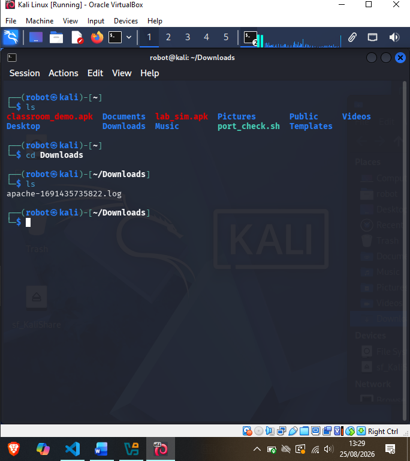

**2. Viewed the full file with `cat`**
Ran `cat apache-1691435735822.log` — confirmed it works but produces a wall of text, exactly as the room warns, making it impractical for anything beyond a quick first look.

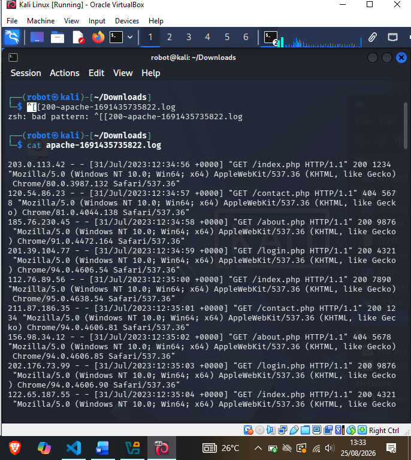

**3. Viewed it page-by-page with `less`**
Ran `less apache-1691435735822.log` for a more manageable, scrollable view, then quit back to the prompt.

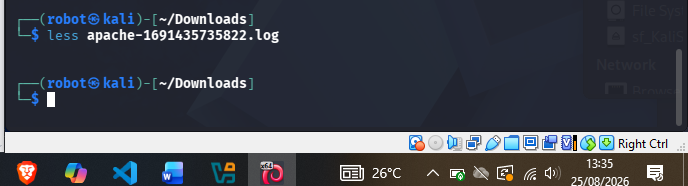

**4. Followed the tail of the log in real time**
Ran `tail -f -n 5 apache-1691435735822.log` to show the last 5 lines and follow new entries as they'd be written.

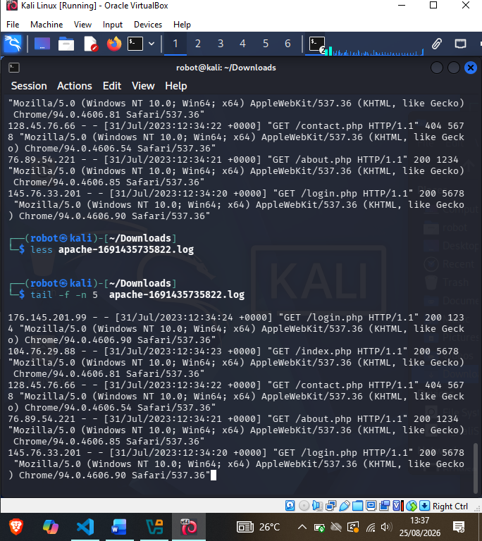

**5. Tried `head -f` (invalid), corrected to `head -n 5`**
First attempt used a nonexistent `-f` flag with `head`, which correctly errored out. Corrected to `head -n 5 apache-1691435735822.log` to print the first 5 lines.

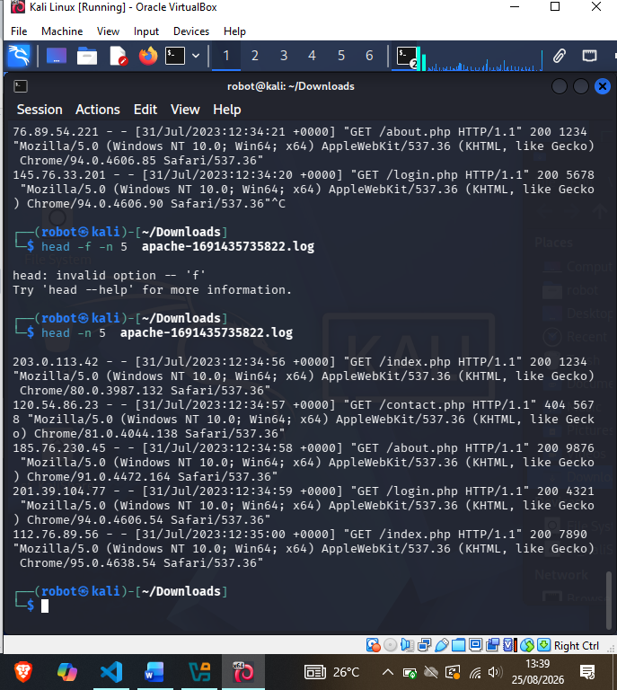

**6. Got file stats with `wc`**
Ran `wc apache-1691435735822.log` — confirmed **70** lines, **1562** words, **14305** characters, matching the room's reference numbers exactly.

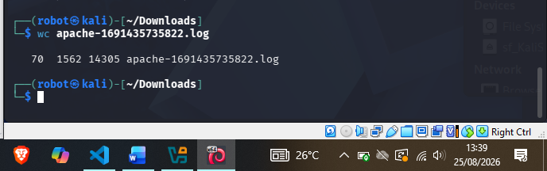

**7. Extracted IP addresses with `cut`**
Ran `cut -d ' ' -f 1 apache-1691435735822.log` to pull just the first space-delimited field (the source IP) from every line.

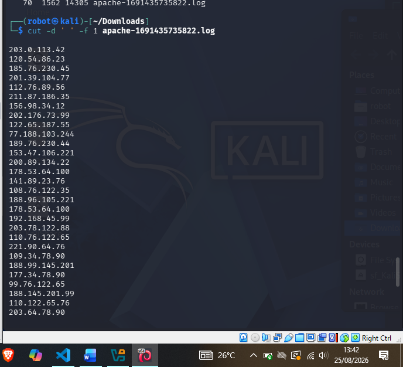

**8. Sorted the IP list numerically**
Piped the `cut` output into `sort -n` to arrange the IPs in ascending order.

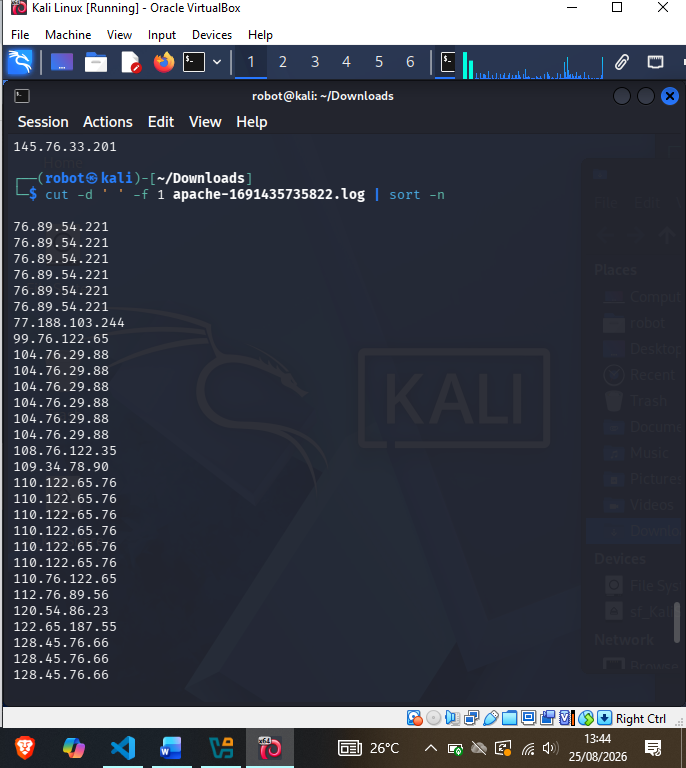

**9. Reversed the sort order**
Added `-r` to `sort` to flip it to descending order.

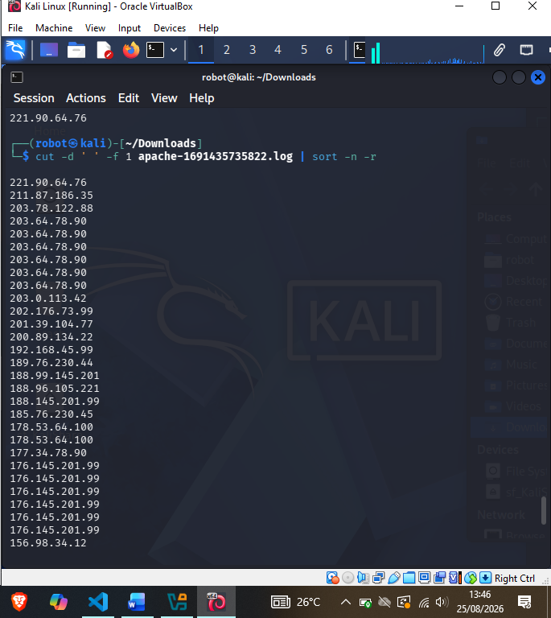

**10. Counted HTTP 200 responses with `awk`**
Ran `tail -n 5` to spot-check the log format again, then `awk '$9 == 200' apache-1691435735822.log | wc -l` — field 9 (the HTTP status code) filtered for exact matches of `200`, piped into `wc -l` to get a total count of **52**.

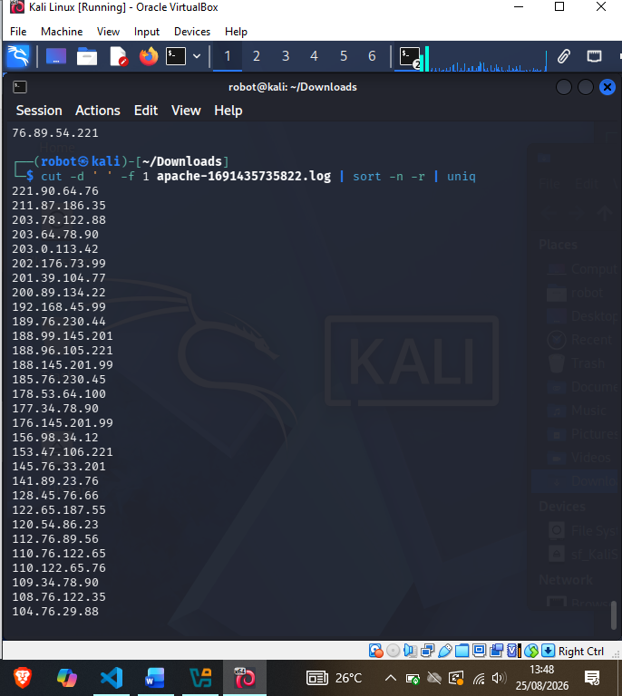

**11. Removed duplicate IPs with `uniq`**
Ran `cut -d ' ' -f 1 apache-1691435735822.log | sort -n -r | uniq` to collapse the sorted, reverse-ordered IP list down to unique entries.

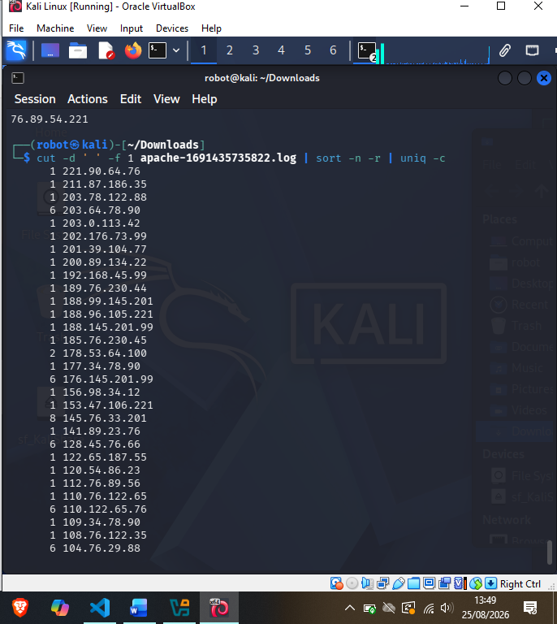

**12. Counted occurrences per IP with `uniq -c`**
Appended `-c` to prefix each unique IP with its occurrence count — a quick way to spot which IPs generated the most traffic.

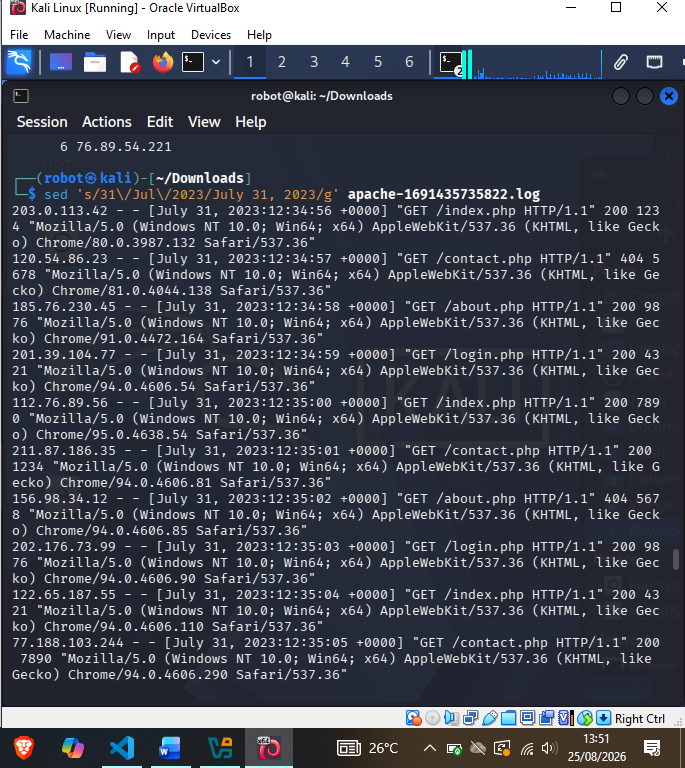

**13. Reformatted the date with `sed`**
Ran `sed 's/31\/Jul\/2023/July 31, 2023/g' apache-1691435735822.log` to substitute the compact Apache date format with a more readable one across the whole file (output only — the original file was untouched).

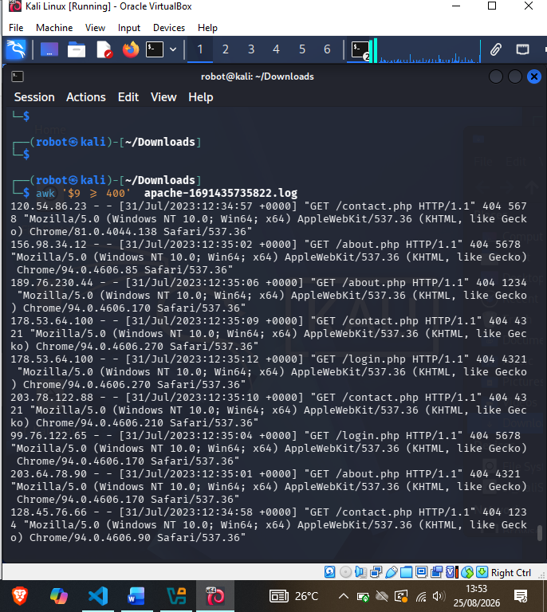

**14. Filtered for HTTP error statuses with `awk`**
Ran `awk '$9 >= 400' apache-1691435735822.log` to print every entry where the HTTP status code field was 400 or higher — i.e., client/server error responses.

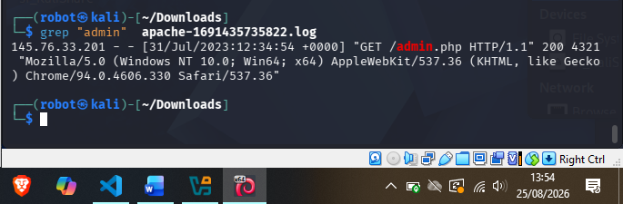

**15. Searched for admin panel access with `grep`**
Ran `grep "admin" apache-1691435735822.log` — found a single hit: a request to `/admin.php` from `145.76.33.201`.

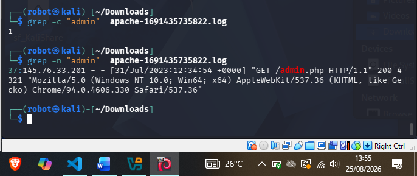

**16. Counted and located the match**
Ran `grep -c "admin"` (returned `1`, confirming the single match) and `grep -n "admin"` (returned line number **37** alongside the matched entry).

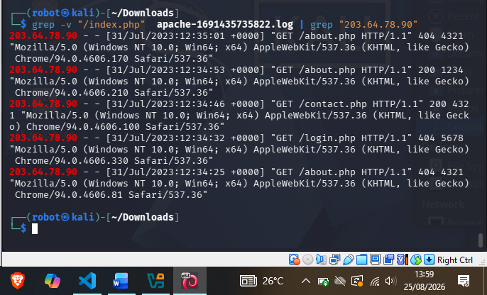

**17. Filtered out noise and isolated a specific IP**
Ran `grep -v "/index.php" apache-1691435735822.log | grep "203.64.78.90"` — excluded all `/index.php` hits, then piped that into a second `grep` to isolate only entries from `203.64.78.90`.

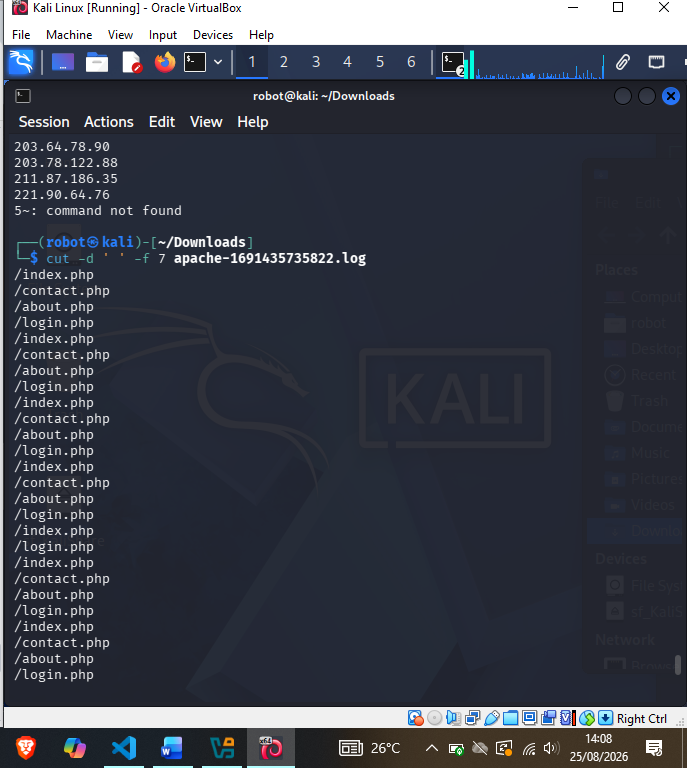

**18. Extracted URLs, hit a typo, corrected it**
First attempt at extracting URLs (field 7) had a typo and returned `command not found`. Corrected to `cut -d ' ' -f 7 apache-1691435735822.log`, which returned a clean list of every requested URL path.

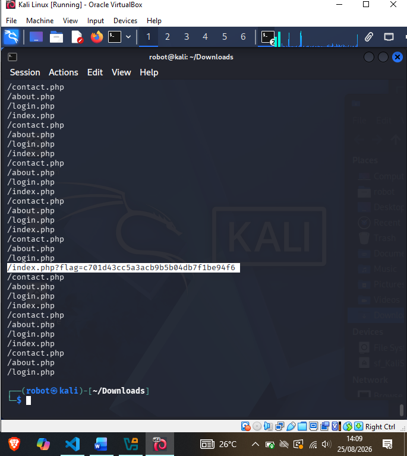

**19. Spotted the flag in the URL list**
Scrolling through the URL output, one entry stood out: `/index.php?flag=c701d43cc5a3acb9b5b04db7f1be94f6` — the flag for the "unique URL entries" question.

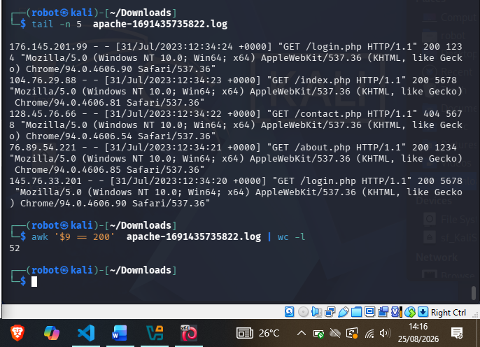

**20. Identified the highest-traffic IP**
Revisited the full `cut | sort -n -r | uniq -c` output — `145.76.33.201` had the highest count at **8** occurrences, confirming it as the top traffic source.

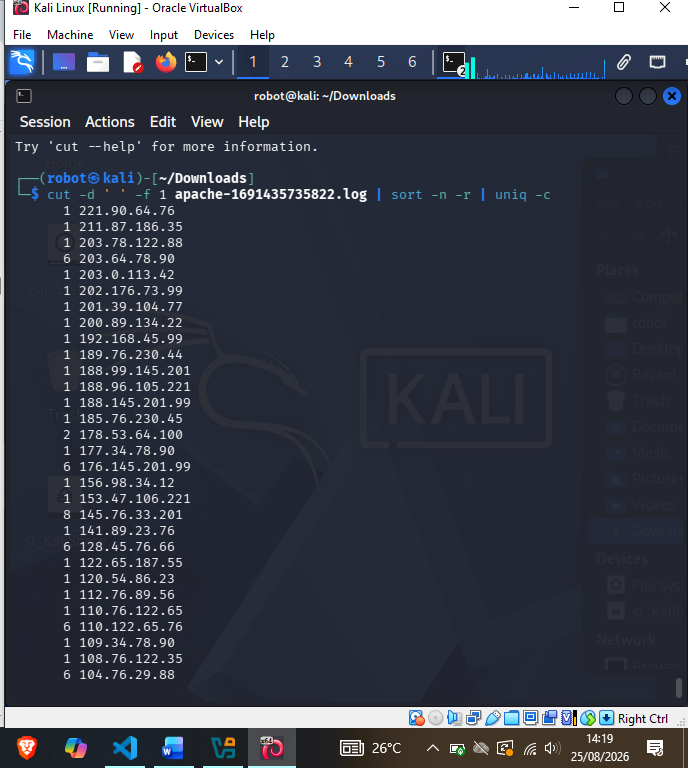

**21. Found the exact timestamp for a specific request**
Scrolled through the raw log to find the `/login.php` request from `110.122.65.76`, confirming its full timestamp: `31/Jul/2023:12:34:40 +0000`.

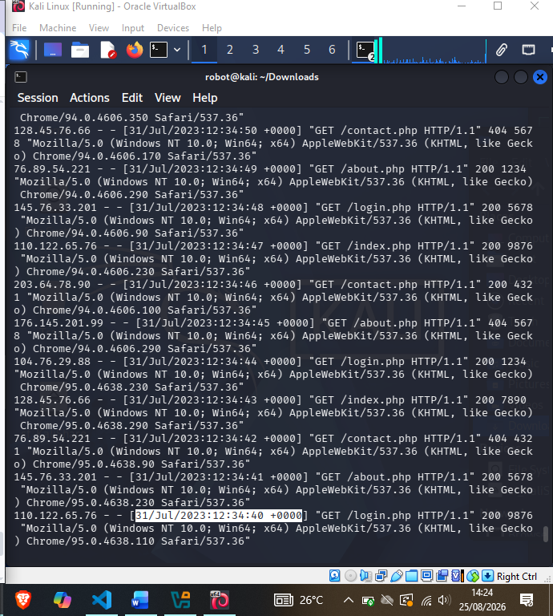

### Part 2 — Regular expressions

**22. Unzipped the regex practice files and tested a range pattern**
Ran `unzip regex-1691439084284.zip`, `cd regex`, then `grep -E 'post=1[0-9]' apache-ex2.log` — matched blog post IDs 10–19 (visible hits: `post=12`, `post=14`, `post=11`) using the room's example pattern.

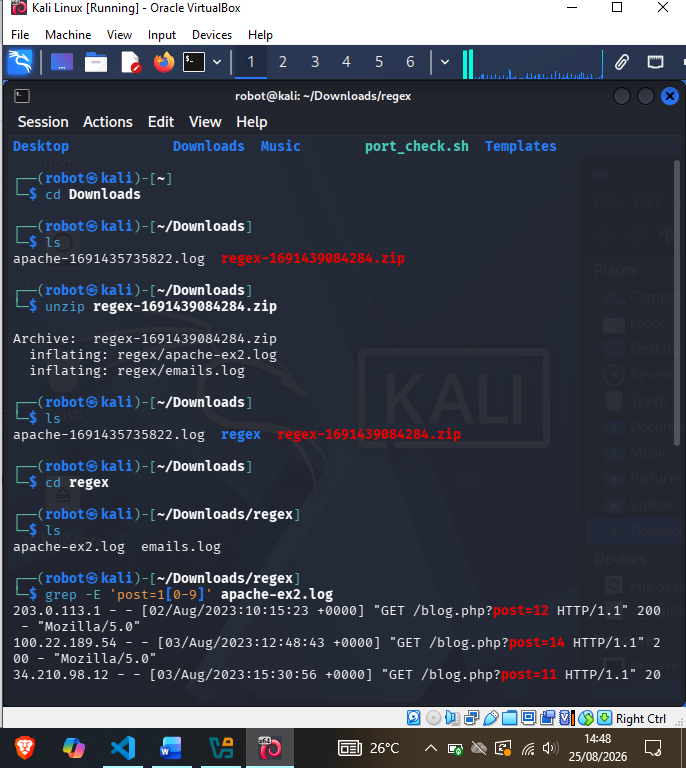

**23. Opened RegExr to build patterns interactively**
Loaded [regexr.com](https://regexr.com/) with its default sample pattern and text to get familiar with the interface before testing the room's actual pattern.

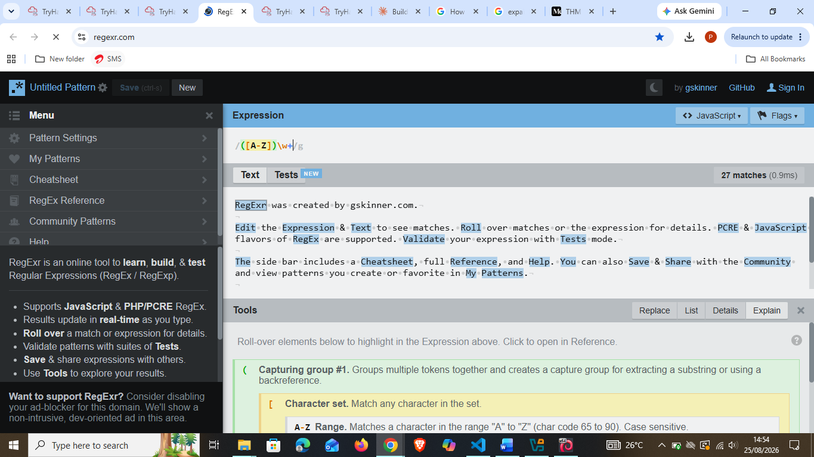

**24. Tested the room's IPv4 extraction pattern**
Applied `\b([0-9]{1,3}\.){3}[0-9]{1,3}\b` against a sample log line — successfully isolated just the IP address (`126.47.40.189`) from the full entry.

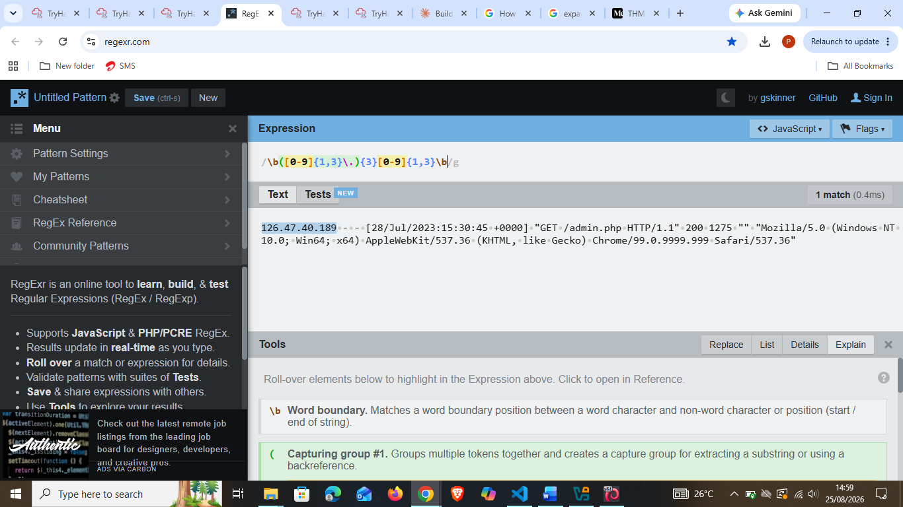

### Part 3 — CyberChef

**25. Launched CyberChef**
Opened [gchq.github.io/CyberChef](https://gchq.github.io/CyberChef/) with a blank recipe and input, ready to start building.

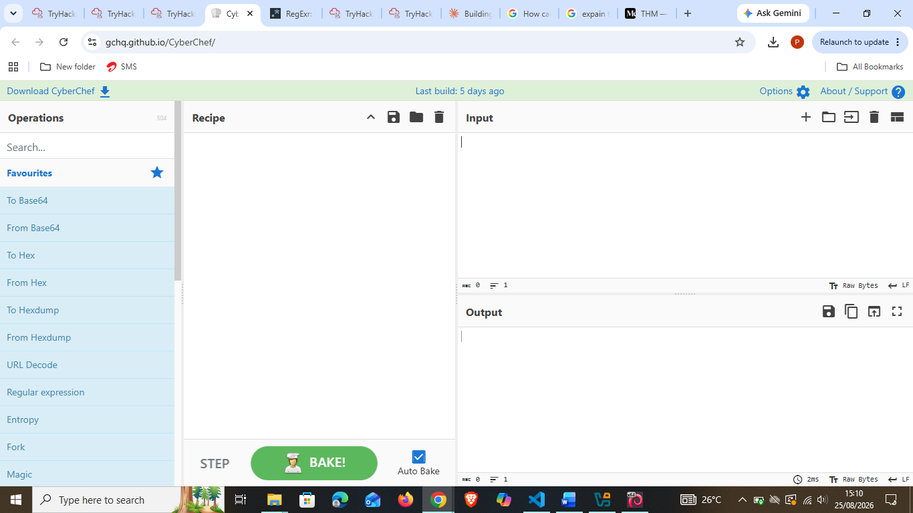

**26. Decoded the room's Base64 example**
Input `dHJ5aGFja21l`, applied the **From Base64** operation — output confirmed as `tryhackme`.

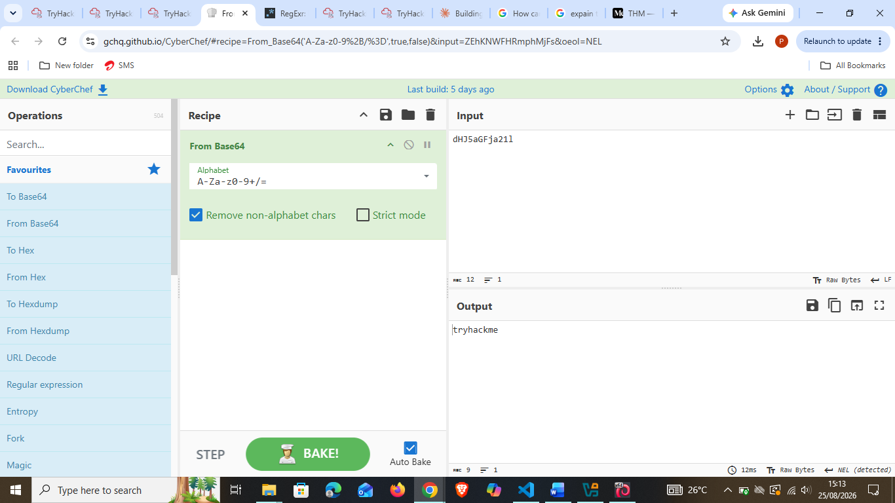

**27. Tried the Magic operation on the same input**
Swapped to the **Magic** operation instead — it correctly auto-suggested the `From_Base64` recipe and produced the same `tryhackme` result snippet.

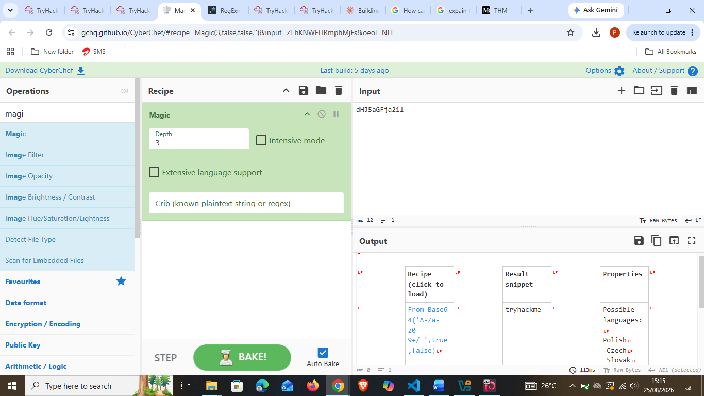

**28. Uploaded loganalysis.zip and extracted IPs by regex**
Uploaded the zip (containing `access.log` and `encodedflag.txt`), applied the **Regular expression** operation with the IPv4 pattern and **List matches** output format. Among the results was **212.14.17.145** — the IP beginning in 212 asked about in the task.

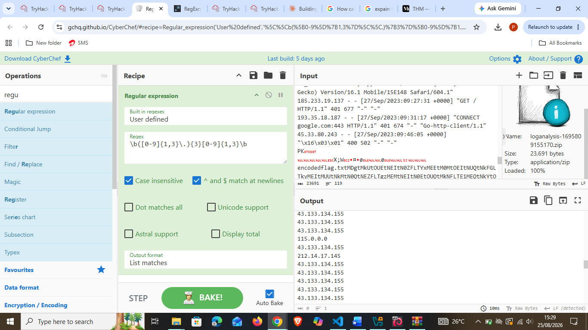

**29. Searched for encoded request parameters**
Changed the regex to `(POST|GET) /.*=` against `access.log` to surface any requests carrying a parameter — turned up `GET /VEhNe0NZQkVSQ0hFRl9XSVpBUkR9==`, an obvious Base64-looking string in the URL.

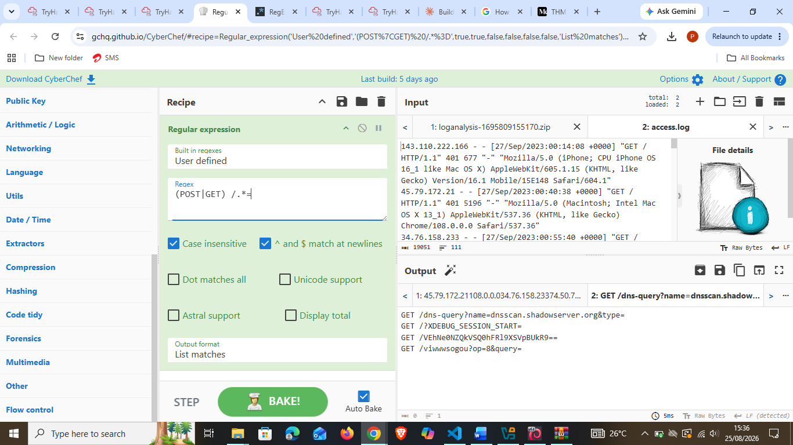

**30. Decoded the flag from the request**
Fed the isolated string into **From Base64** — decoded cleanly to `THM{CYBERCHEF_WIZARD}`.

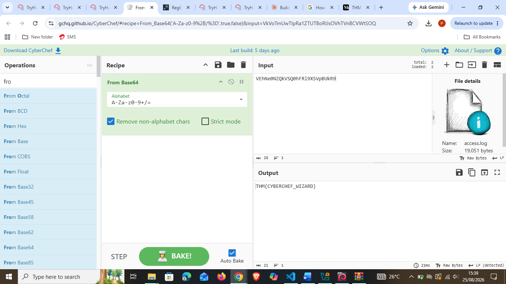

**31. Decoded encodedflag.txt and extracted the MAC address**
Applied **From Base64** to `encodedflag.txt`, then chained a MAC-address regex (`[A-Fa-f\d]{2}(?:[:-][A-Fa-f\d]{2}){5}`) — extracted **08-2E-9A-4B-7F-61**.

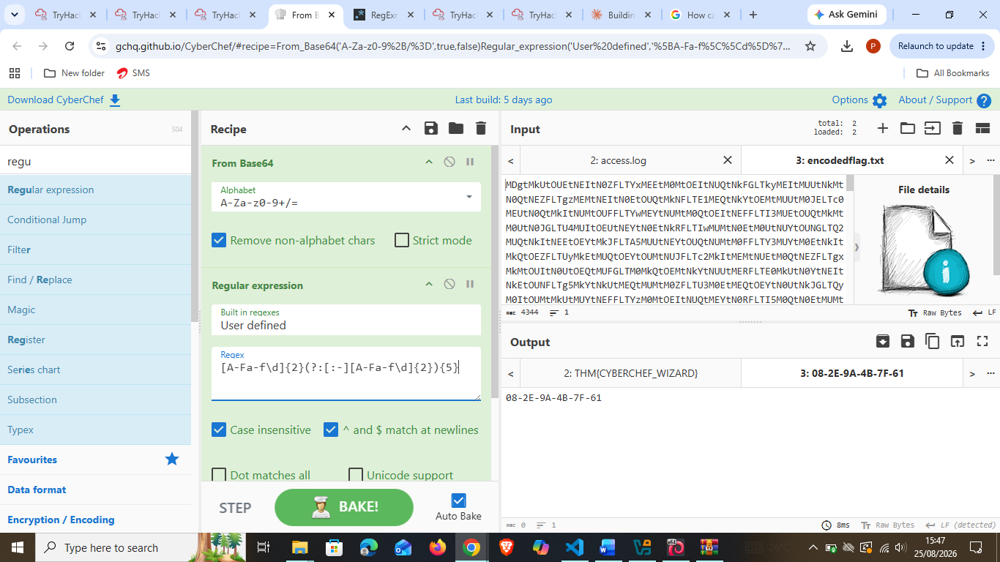

---

## 🔍 Key Findings

- File stats for `apache-1691435735822.log`: **70** lines, **1562** words, **14305** characters
- Total HTTP 200 responses logged: **52**
- IP address that generated the most traffic: **145.76.33.201** (8 requests)
- Full timestamp for `110.122.65.76`'s `/login.php` request: **31/Jul/2023:12:34:40 +0000**
- Flag found in a unique URL entry via `cut`: **c701d43cc5a3acb9b5b04db7f1be94f6**
- `grep -E 'post=1[0-9]'` isolates blog post IDs 10–19; the same pattern shifted to `post=2[0-9]` would cover IDs 20–29
- Logstash's filter plugin for parsing unstructured log data into structured fields: **Grok**
- Full IPv4 address beginning in 212 (from `access.log` via CyberChef regex): **212.14.17.145**
- Base64-encoded request parameter decoded to: **THM{CYBERCHEF_WIZARD}**
- MAC address extracted from `encodedflag.txt` via CyberChef: **08-2E-9A-4B-7F-61**
- Sigma rules are written in **YAML**; the rule name field is `title`. YARA rules use the `rule` keyword to name a rule.
- Pattern worth flagging: the single `/admin.php` hit and the URL-embedded flag parameter both came from log entries that stood out specifically because they deviated from the otherwise repetitive GET requests to `/index.php`, `/about.php`, `/contact.php`, and `/login.php` — a small-scale, hands-on example of the "abnormal behaviour" detection principle the room covers in its theory section.

---

## 💡 Lessons Learned

- Ran into a genuine networking snag partway through this room: trying to transfer files from the Windows host to the Kali VM via a temporary Python HTTP server (`python -m http.server 8000`) left the VM unable to reach the host *or* the internet. Root cause was a conflicting second network adapter in VirtualBox silently set to Host-Only, which was misrouting traffic. Fixed by isolating/disabling the second adapter, confirming Adapter 1 was set to NAT, and restarting NetworkManager (`sudo systemctl restart NetworkManager`) to rebuild the routing table. Worth remembering for next time: in a standard VirtualBox NAT setup, the host machine is always reachable from the guest at `10.0.2.2`.
- The command-line section really drove home how much can be done with nothing but `cut`, `sort`, `uniq -c`, and `grep` — no SIEM needed to answer "which IP hit us the most" or "how many failed logins happened." That's a good baseline skill to have before reaching for heavier tooling.
- Chaining `grep -v` (to exclude noise) into a second `grep` (to isolate a specific IP) is a pattern I'll reuse — filtering out the "boring" traffic first makes the interesting traffic much easier to spot manually.
- CyberChef's **Magic** operation is a nice first move when you don't know what encoding you're looking at — it correctly guessed Base64 here without me specifying anything, which would save time on an unfamiliar payload during a real investigation.
- The regex pattern for IPv4 addresses (`\b([0-9]{1,3}\.){3}[0-9]{1,3}\b`) is straightforward enough to memorise and reuse across grep, RegExr, and CyberChef — same logic, three different tools, which is a good demonstration of how portable regex skills are across the analyst toolkit.
- This room's Sigma and YARA sections connect directly back to detection engineering concepts — worth following up with the dedicated Sigma and YARA rooms mentioned, since this one only scratches the surface (rule structure and keywords, not actually writing rules from scratch).
