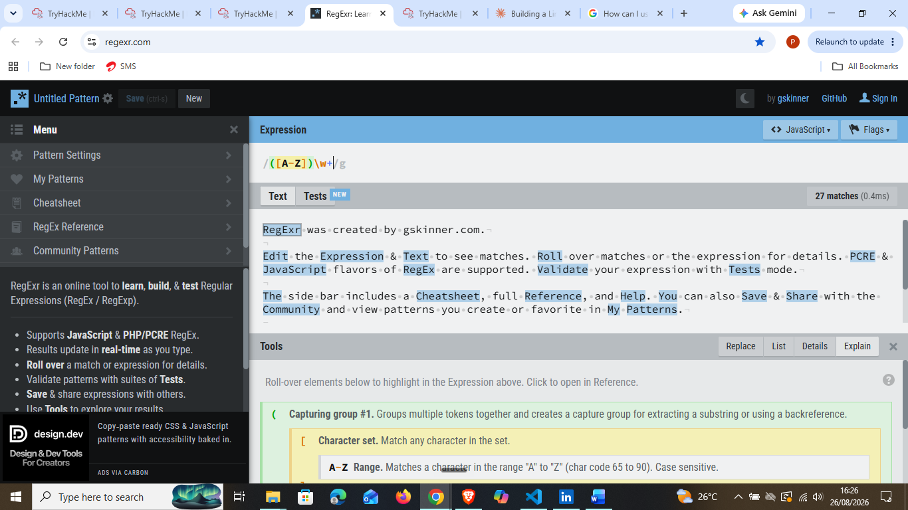

# Day 42: Regular Expressions

**Path:** SOC Level 1
**Platform:** TryHackMe
**Status:** ✅ Completed

---

## 📌 Overview

This room is a hands-on introduction to regular expressions (regex) — patterns you define to search text and match exactly what you're looking for. There's no lab machine to deploy for this one; it's a "learn by doing" room where you test expressions either with `egrep <pattern> <file>` on a Unix box or, as I did, with the online editor at regexr.com.

The room builds up regex concepts in layers:

- **Charsets** — enclosing characters in `[square brackets]` matches any occurrence of those characters, not the literal string. `[abc]` matches every `a`, `b`, or `c` it finds, not just the string "abc". Ranges (`[a-c]`), combined ranges (`[a-cx-z]`), and full alphabetical/numeric ranges (`[a-zA-Z]`, `file[1-3]`) all follow from this. The `^` hat symbol inside brackets *excludes* a charset instead of excluding a single character.
- **Wildcards and optional characters** — `.` matches any single character except a line break, and `?` makes the preceding character optional (`abc?` matches `ab` and `abc`). A literal dot has to be escaped with `\.`, or `.` will match anything in that position.
- **Metacharacters and repetitions** — shorthand classes like `\d`/`\D`, `\w`/`\W`, `\s`/`\S` save you from writing out charsets by hand (and `\w` includes underscores, unlike `\W`). Repetition operators (`{n}`, `{n,m}`, `{n,}`, `*`, `+`) control how many times the preceding token has to match in a row.
- **Starts with/ends with, groups, and either/or** — `^` anchors to the start of a line (outside brackets, unlike its exclusion role inside them), `$` anchors to the end. Parentheses define groups, which combine with the `|` pipe for either/or matching, or with `{n}` to repeat a whole pattern.

The room's own note on strategy stuck with me: there's rarely one "correct" regex for a given match — the goal is to be specific enough to exclude what you don't want, without over-engineering a pattern when a simpler charset would do.

---

## 🛠️ Tools Used

- [regexr.com](https://regexr.com/) — online regex editor used to build and test every expression in this room, with live match highlighting and a breakdown of what each token does
- No lab VM/machine — this room is entirely text-and-editor based

---

## 🪜 Steps Followed

**1. Worked through charsets, wildcards, and metacharacter questions**
Answered the room's progressive practice questions on charsets (`[cog]`, `[Ff]ile[1-9]`, `[^7]` exclusions), wildcards/optional characters (`.at`, `cat\.xyz`), and metacharacter shorthand + repetition operators (`cats{4}`, `\w{5}\W`, `\S*\s*\S*`). No screenshots captured for this stretch — answers were typed directly into the room's text fields.

**2. Explored charset/range matching in regexr.com**
Before tackling the trickier repetition question, I used regexr.com to experiment with a capturing group and character-range charset (`([A-Z])\w+`) against sample text, confirming how ranges like `A-Z` match case-sensitively and how the tool's side panel breaks down each token.

**3. Solved the filename repetition question without metacharacters**
Question 4 of the Metacharacters/Repetitions section — match `ab0001`, `bb0000`, `abc1000`, `cba0110`, `c0000` without using a metacharacter — was the trickiest part of the room. TryHackMe's own answer field was too small to comfortably build the pattern in, so I moved to regexr.com to work it out. Landed on `[abc]{1,3}[0-1]{4}`, which matched all five filenames, before confirming it as the expression TryHackMe was looking for.

![Testing [abc]{1,3}[0-1]{4} against the target filenames in regexr](screenshots/02-repetition-question-abc-filenames-solved.png)

**4. Completed the anchors, groups, and either/or questions**
Finished the room with the `^`/`$` anchor questions, the `(day|night)`-style either/or group question, the `$\d$\S+` line-anchored pattern, the IPv4-matching group `(\d{1,3}\.){3}\d{1,3}`, and the email-parsing group `(\w+)@(\w+)\.com`. No screenshots for this section — answered directly in the room's text fields.

---

## 🔍 Key Findings

- Charsets match **occurrences** of characters, not literal strings — `[abc]` matches `abc`, `cba`, and `ca` alike
- `[abc]zz` → `[a-c]zz` (range shorthand) → `[a-cx-z]zz` (combined ranges) all resolve to the same style of match
- `[^k]ing` excludes a single character from a charset; `^abc` (outside brackets) anchors to the start of a line — same symbol, different meaning depending on context
- Solved filename pattern (no metacharacters): `[abc]{1,3}[0-1]{4}` — matches `ab0001`, `bb0000`, `abc1000`, `cba0110`, `c0000`
- IPv4 address pattern using groups: `(\d{1,3}\.){3}\d{1,3}`
- Email username/domain capture pattern: `(\w+)@(\w+)\.com`
- `\w` includes underscores; `\W` does not — relevant for filenames like `test_file`

---

## 💡 Lessons Learned

- The room's efficiency rule — be specific enough to exclude what you don't want, but not so specific the pattern becomes unnecessarily long — is the single most useful mental model from this room. `[a-c]` over `[a-z]` when you only need a-c, but `[a-z]` over `[acfrsz]` when the list of exact characters gets long.
- Question 4 (the no-metacharacter filename match) took real trial and error. TryHackMe's in-room answer box being too small to iterate in pushed me to regexr.com, which turned out to be the better workflow anyway — worth doing from the start next time rather than fighting the room's UI first.
- The dual meaning of `^` (exclude inside `[brackets]`, anchor to line-start outside them) is an easy mix-up point — worth flagging explicitly since it's the kind of thing that causes a "correct-looking" pattern to silently fail.
- Regex is clearly going to matter for log parsing and SIEM query filtering later in this path — this room is foundational rather than a one-off skill.
