# Day 43: Network Security Essentials

**Path:** SOC Level 1
**Platform:** TryHackMe
**Status:** ✅ Completed

---

## 📌 Overview

This room builds directly on Day 38's Cyber Kill Chain intro by zooming into the **network perimeter** specifically — the boundary between an organization's trusted internal network and the untrusted internet, and the first place a SOC analyst sees signs of an attack.

The room breaks a small enterprise network down into its core assets and why each matters defensively:

- **User workstations** — the most common initial entry point (phishing, malicious downloads); often under-monitored, giving attackers a foothold for lateral movement.
- **File & database servers** — hold the business's actual data; prime ransomware and exfiltration targets.
- **Application servers** (web, email, VPN) — externally facing, constantly scanned for exploitable vulnerabilities or weak configs.
- **Active Directory / auth servers** — the identity backbone; a single compromised domain admin account can bring down the whole enterprise.
- **Routers & switches** — not usually exposed directly, but a compromise here enables MitM attacks or hidden traffic channels.
- **Firewalls / perimeter devices** — the primary gatekeeper; logs every connection attempt and is often the earliest indicator of a port scan, brute force, or exploitation attempt.

It also draws a clear line between two log categories that together build a full attack timeline:

- **Host-centric logs** (OS logs, application logs, AV/EDR/HIDS) — tell you *what happened inside a room*: process creation, file access, user activity on a specific machine.
- **Network-centric logs** (firewall, IDS/IPS, router flow data, web proxy, VPN) — tell you *who entered and left the building*: source/destination IPs, ports, protocols, and whether traffic was allowed or blocked.

Key perimeter components covered: firewalls, routers/gateways, the DMZ (where public-facing servers like web/mail/VPN sit isolated from the internal LAN), and remote access/VPN gateways. The room's traffic-pattern heuristics were the most immediately useful part:

- One source hitting many destinations/ports = **scanning**
- One source repeatedly hitting one destination = **brute-forcing**
- Traffic at perfectly regular intervals = **malware beaconing**

The room then splits into a guided walkthrough (Task 6 — three standalone scenarios) followed by a full month-long incident investigation (Task 7 — the "Perimeter Logs: Investigating the Breach" challenge against Initech Corp's firewall, WAF/IDS, and VPN logs).

---

## 🛠️ Tools Used

- Linux terminal (AttackBox) — `cat`, `grep`, `cut`, `sort`, `uniq -c`, `head`, `tail`
- No Splunk this time — did the whole investigation via manual command-line log analysis (Method 1), even though the room also offers a pre-ingested Splunk instance at `MACHINE_IP:8000` (Method 2) as an alternative.

---

## 🪜 Steps Followed

### Task 6 — Monitoring the Perimeter in Action (guided scenarios)

**1. Navigated to the task6 log folder**
Found three sample log files to work through: `firewall_logs.txt`, `vpn_logs.txt`, `waf_logs.txt`.

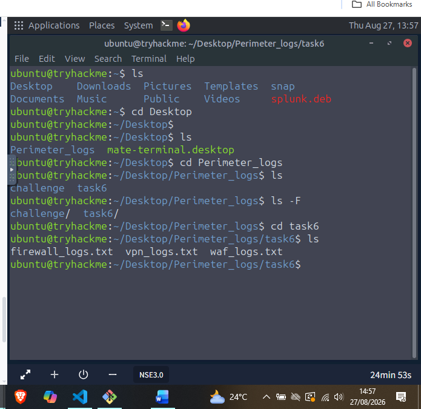

**2. Scenario 1 — Port scanning (firewall logs)**
Read through `firewall_logs.txt` looking for the classic scan pattern: one external IP hitting many ports on the same internal host in quick succession.

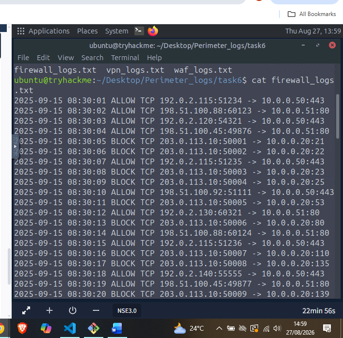

Verdict: **203.0.113.10** was probing multiple internal ports (21, 22, 23, 25, 53...) — a classic port scan looking for an open service to target.

**3. Scenario 2 — Attacking the web server (WAF logs)**
Read through `waf_logs.txt`, which — unlike a plain firewall log — tells you *why* a request was blocked.

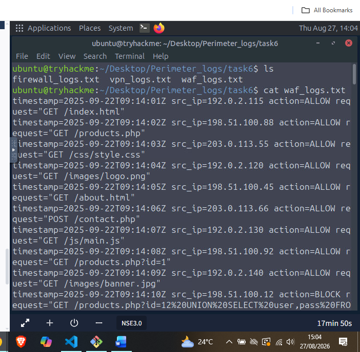

**4. Isolated the SQL injection attempt**
Scrolled to the blocked request carrying a UNION SELECT payload against `products.php`.

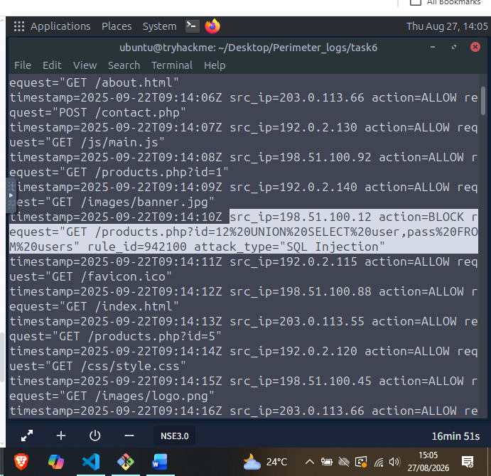

Verdict: **198.51.100.12** was the single source IP behind the blocked web attacks, actively attempting SQL injection (and elsewhere in the log, XSS and directory traversal) against the web app.

**5. Scenario 3 — VPN brute force (auth logs)**
Read through `vpn_logs.txt` — a mix of `SUCCESS_AUTH` and `FAILED_AUTH` entries.

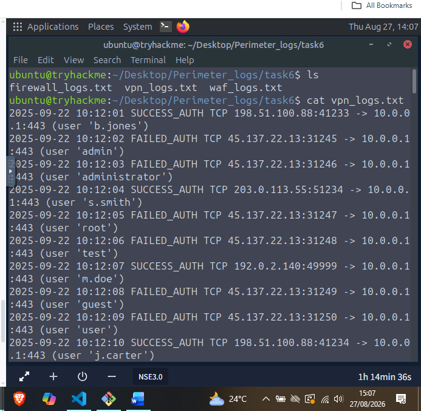

**6. Picked out the brute-force pattern**
A handful of scattered successful logins (legitimate employees) were mixed in with a flood of failed attempts cycling through common usernames.

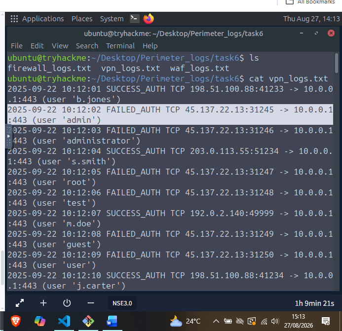

**7. Confirmed the attacking IP**
Grouped the failures and traced them to a single source repeatedly trying `admin`, `administrator`, `root`, `test`, `guest`, `user`.

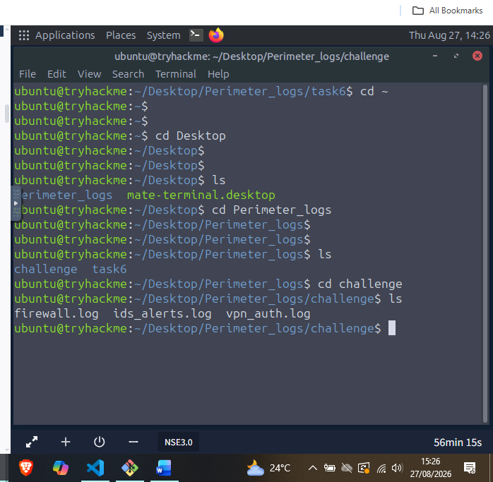

Verdict: **45.137.22.13** was brute-forcing the VPN gateway with a common-username wordlist; **90 attempts failed** in total. The scattered successful logins from other IPs were benign employee traffic.

### Task 7 — Perimeter Logs: Investigating the Breach (Initech Corp incident)

**Scenario:** Initech Corp deployed a new firewall + IDS. Analysts noticed abnormal traffic over the past month but never got a full analysis done. My job: review a month of `firewall.log`, `ids_alerts.log`, and `vpn_auth.log` from `/Perimeter_logs/challenge/` to determine what technique(s) the adversary used and whether they actually breached the perimeter.

**Reference — Initech's network assets:**

| IP | Hostname | Role | OS | Criticality |
|---|---|---|---|---|
| 10.0.0.20 | FINANCE-SRV1 | File/Finance Server (SMB) | Windows | High |
| 10.0.0.50 | VPN-GW | VPN Gateway | Linux | Critical |
| 10.0.0.51 | APP-WEB-01 | Internal Web/App | Linux | High |
| 10.0.0.60 | WORKSTATION-60 | Employee Workstation | Windows 10 | Medium |
| 10.8.0.23 | VPN-CLIENT-ATTK | VPN Assigned Client (Ephemeral) | N/A | Critical |
| 10.0.1.10 | DMZ-WEB | DMZ Web Server | Linux | Medium |

**8. Moved into the challenge folder**
A different, larger set of logs than task6: `firewall.log`, `ids_alerts.log`, `vpn_auth.log`.

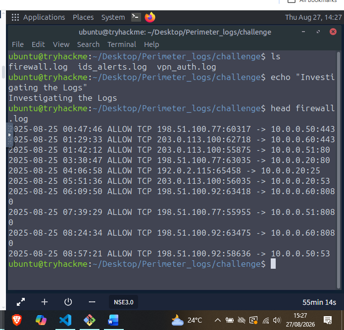

**9. Previewed each log file**
Ran `head` on all three to get a feel for the format before filtering anything.

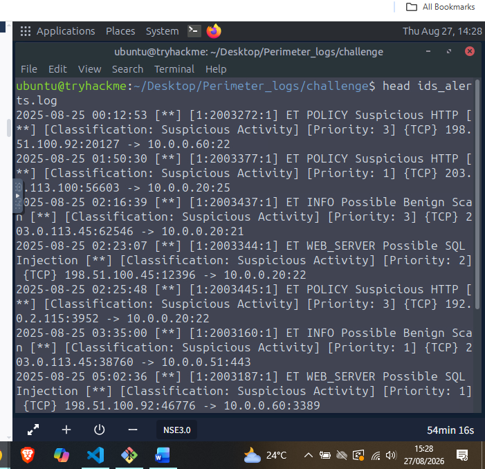
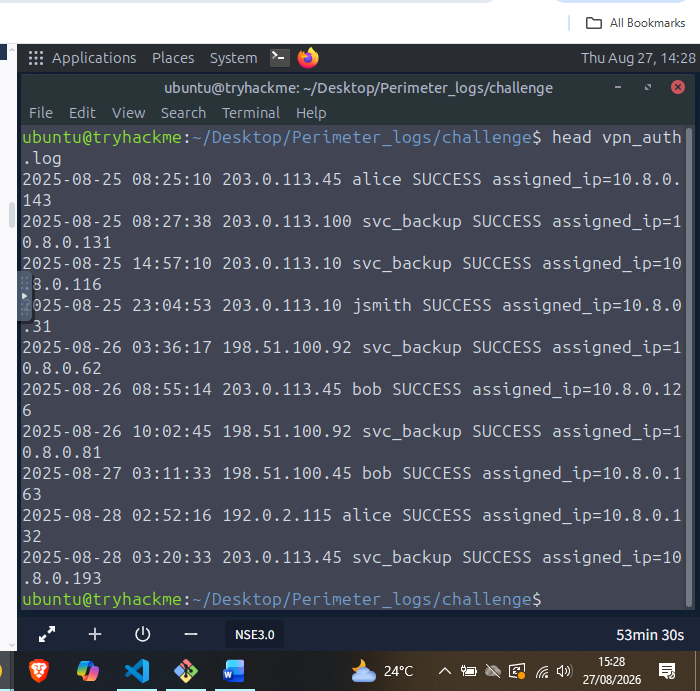
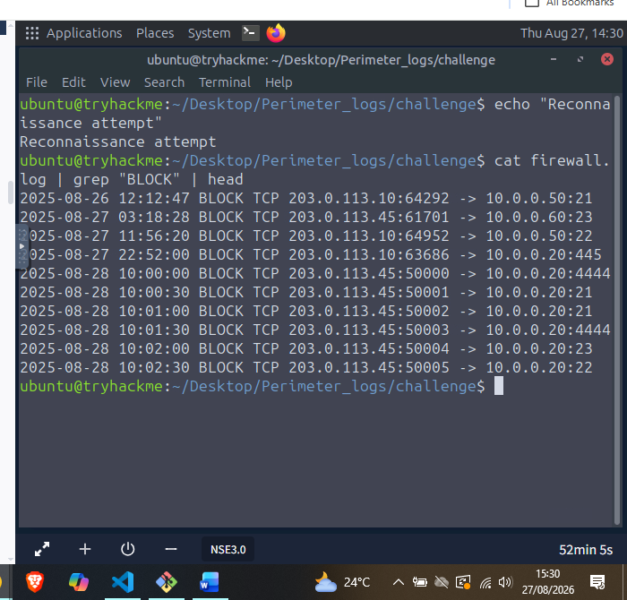

**10. Reconnaissance — checked blocked firewall requests**
Started with the blocked traffic, the earliest sign of a scan.

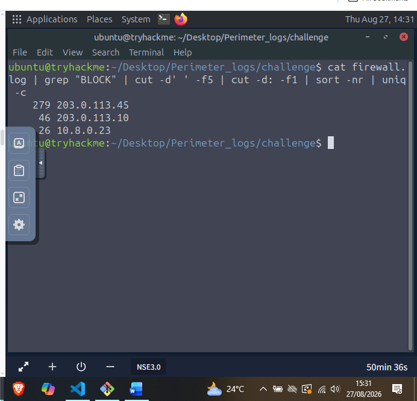

**11. Identified the top source of blocked requests**
Counted and sorted blocked-request sources.

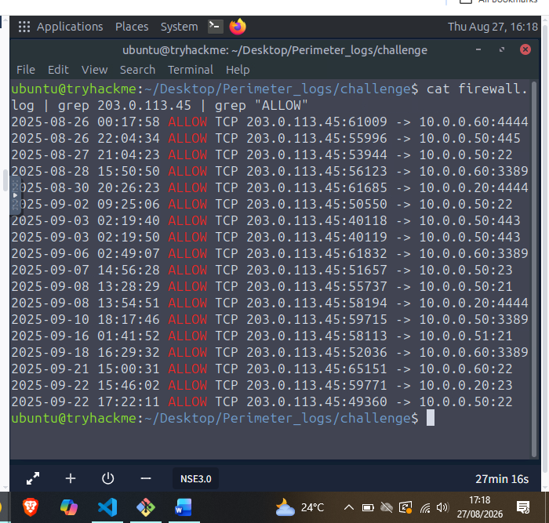

Result: **203.0.113.45 — 279 blocked hits** (well ahead of the next-highest, 203.0.113.10 at 46). This is the external IP that performed the most reconnaissance against the perimeter.

**12. Checked whether the firewall ever allowed that IP through**
If reconnaissance found nothing, the story stops here — so I checked for any ALLOW entries against 203.0.113.45.

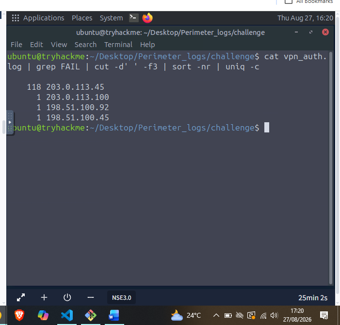

It had gotten through — this pointed toward a successful initial-access attempt, not just a scan the firewall fully blocked.

**13. VPN brute force — counted failed logins by source**
Pivoted to `vpn_auth.log` to see if the same IP was hammering the VPN gateway.

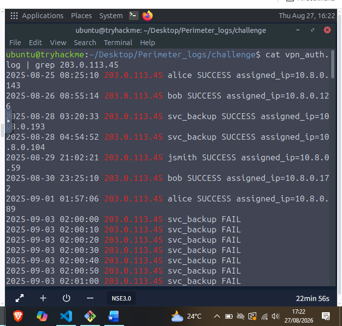

Result: **118 failed logins from 203.0.113.45** — far more than any other source.

**14. Reviewed that IP's full VPN auth history**
Filtered `vpn_auth.log` down to just 203.0.113.45's activity.

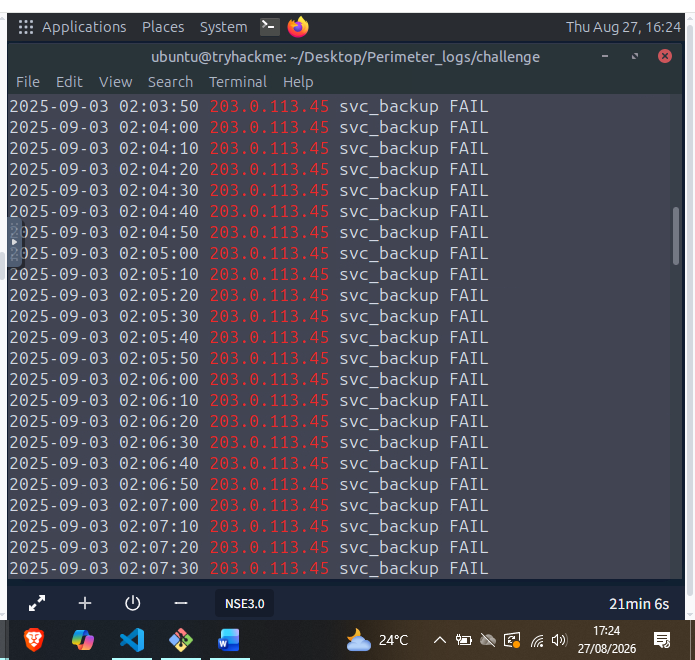
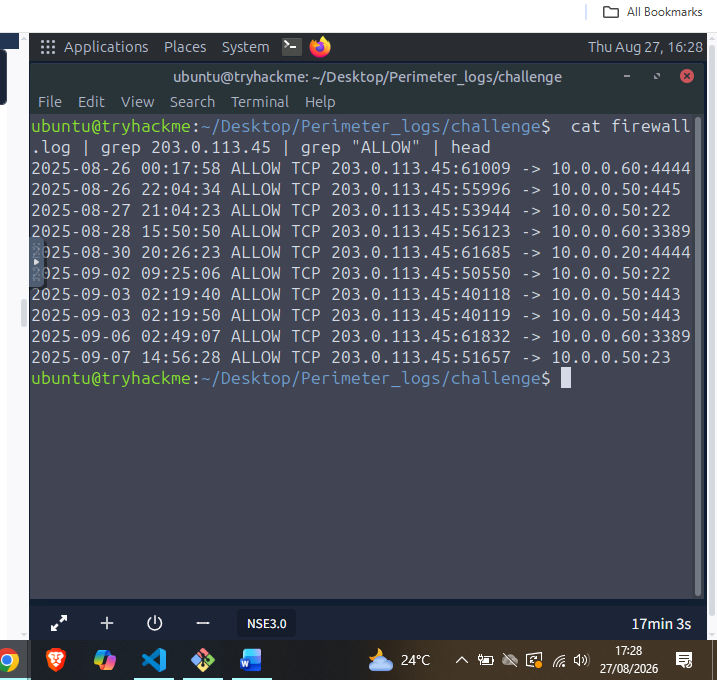

The early entries showed occasional successful logins under several different usernames before the log shifted into a long, repeated `svc_backup FAIL` streak — a brute-force run specifically targeting the `svc_backup` service account.

**15. Found the successful login and the assigned VPN client IP**
Kept scrolling until the `svc_backup` failure streak finally turned into a success.

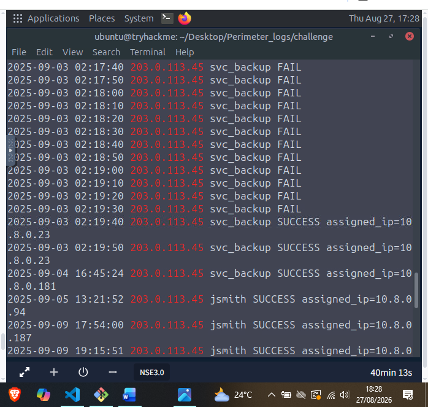

The `svc_backup` account was compromised and assigned VPN client IP **10.8.0.23** — matching the network asset table's `VPN-CLIENT-ATTK` entry exactly. This is the pivot point: the attacker is now inside the network with a routable internal IP.

**16. Lateral movement — checked what the compromised presence reached internally**
Went back to `firewall.log` to see what 203.0.113.45 was allowed to touch on the internal side.

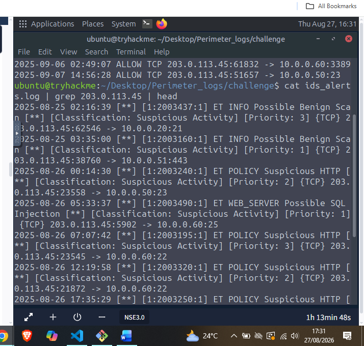

It was reaching **10.0.0.20, 10.0.0.51, and 10.0.0.60** over SMB/RDP/SSH/HTTPS (445, 3389, 22, 443) — probing the finance server, the internal web/app server, and an employee workstation.

**17. Reviewed IDS alerts against the same IP**
Broadened the view with `tail` to catch alerts across the full log, not just the earliest ones.

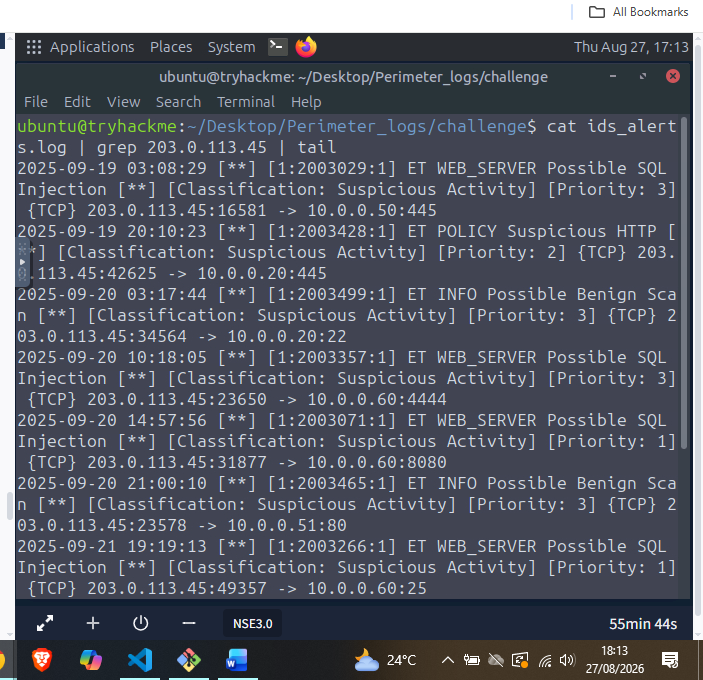

**18. Confirmed SMB exploitation and lateral movement**
Narrowed specifically to SMB-related alerts.

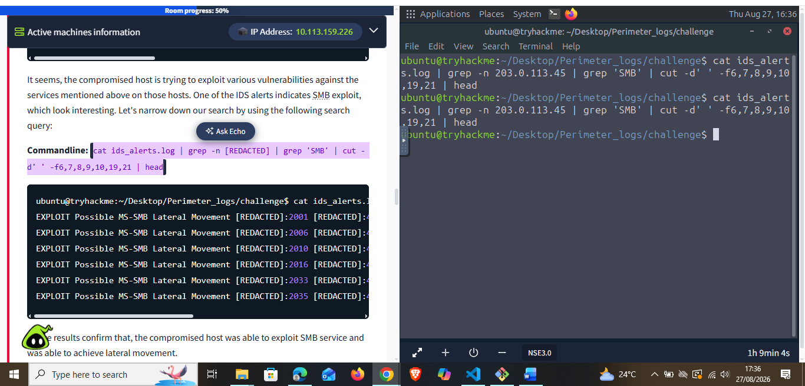

The IDS confirmed it directly: repeated **"EXPLOIT Possible MS-SMB Lateral Movement"** alerts — the attacker successfully exploited the SMB service to move laterally.

**19. C2 Beaconing — pulled the relevant alert fields**
Cut down the IDS alert log to the fields that mattered for spotting a beaconing pattern.

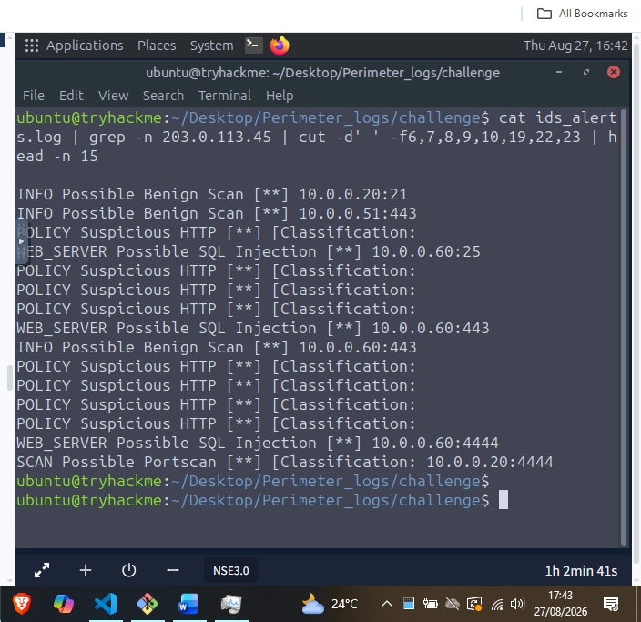

**20. Got the alert-type breakdown**
Counted and sorted to see which alert types dominated.

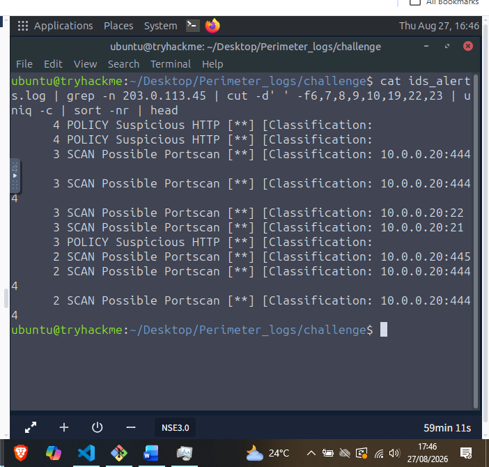

The stats showed a mix of **Suspicious HTTP (POLICY)** and repeated **Possible Portscan (SCAN)** alerts against the same internal targets — consistent with a compromised internal host actively probing and beaconing outward, not just being scanned from outside anymore.

**21. Data exfiltration — checked outbound traffic volume**
Filtered the firewall log for all traffic tied to the attacker's IP, condensed to source/destination/port.

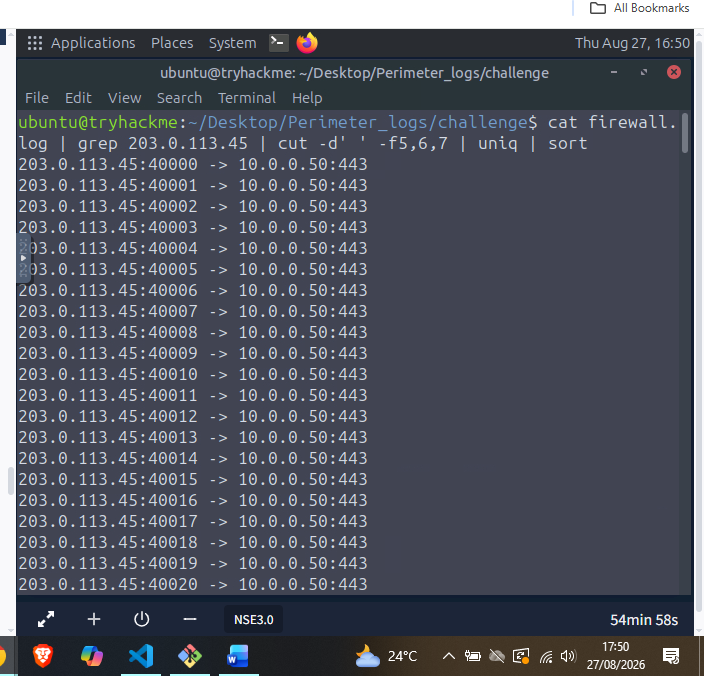

Result: a long, repeated pattern of connections landing on **10.0.0.50:443** (VPN-GW) — a high volume of traffic concentrated on one destination and port is exactly the kind of pattern the room flags as a possible data exfiltration indicator.

---

## 🔍 Key Findings

**Task 6 (scenarios):**
- Port scan source IP: **203.0.113.10**
- WAF-blocked attack source IP: **198.51.100.12** (SQL injection, XSS, directory traversal all attempted)
- VPN brute-force failed attempts: **90**
- VPN brute-force attacker IP: **45.137.22.13**

**Task 7 (Initech Corp incident):**
- External IP behind the most reconnaissance: **203.0.113.45** (279 blocked firewall hits)
- That IP was also let through the firewall at least once — the first sign this wasn't "just" a scan
- VPN brute force against the perimeter: **118 failed logins**, from the same IP
- Compromised account: **svc_backup**, brute-forced via VPN, eventually succeeding
- Attacker's assigned internal VPN IP: **10.8.0.23** (matches `VPN-CLIENT-ATTK` in the asset table)
- Lateral movement targets: **10.0.0.20 (FINANCE-SRV1), 10.0.0.51 (APP-WEB-01), 10.0.0.60 (WORKSTATION-60)** via SMB/RDP/SSH/HTTPS
- Confirmed exploitation technique: **SMB lateral movement** (explicit IDS "EXPLOIT Possible MS-SMB Lateral Movement" alert)
- C2/beaconing indicators: repeated Suspicious HTTP + Portscan alerts from the same internal host against the same targets
- Data exfiltration indicator: sustained, repeated outbound connections from the compromised host to **10.0.0.50:443** (VPN-GW)
- Full attack chain confirmed end-to-end: **Recon → VPN brute force (initial access) → Lateral movement (SMB) → C2 beaconing → Possible data exfiltration**

---

## 💡 Lessons Learned

- The single biggest thing that clicked in this room was how one external IP's fingerprint changes shape as an attack progresses — 203.0.113.45 started as a noisy port-scan source, then became a brute-force source, then an internal pivot IP, then a lateral-movement source, then a beaconing/exfil source. Recognizing that it's *the same actor* across differently-shaped log entries is the actual skill being taught here, not any single grep command.
- The room's three traffic-pattern heuristics (one-to-many = scanning, one-to-one repeated = brute-forcing, perfectly regular intervals = beaconing) turned out to be genuinely load-bearing — I used all three, in that exact order, working through the Initech incident.
- Host-centric vs. network-centric logs is a distinction I'll keep coming back to: everything in this room was network-centric (firewall/IDS/VPN), which told me *who talked to whom and when* but never *what actually happened on 10.0.0.20 once SMB was exploited*. That's the natural next question a host-centric log (Windows Event Logs on FINANCE-SRV1, for instance) would answer — this room deliberately stayed at the perimeter layer.
- This connects directly to [[day38]] (Network Security) — that room's Cyber Kill Chain (Recon → Weaponization → Delivery → Exploitation → Installation → C2 → Actions on Objectives) mapped almost one-to-one onto this investigation: Recon (port/VPN scanning) → Exploitation (SMB) → C2 (beaconing alerts) → Actions on Objectives (the exfiltration pattern to VPN-GW). Day 38 introduced the model against a toy FTP box; this room applied the same thinking to a realistic month of perimeter logs.
- Filtering by a single pivot value (the attacker's IP, then the compromised account, then the assigned VPN IP) across three completely different log formats was the actual investigative technique — not any one command in isolation.
