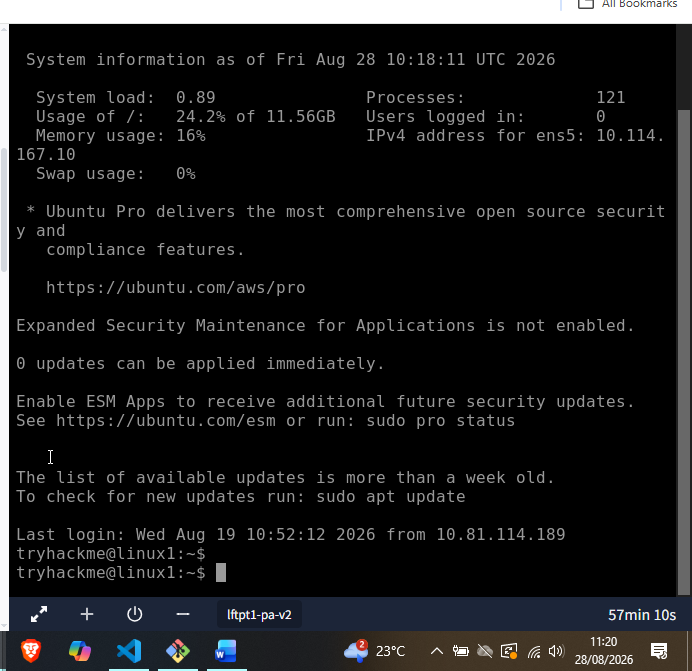
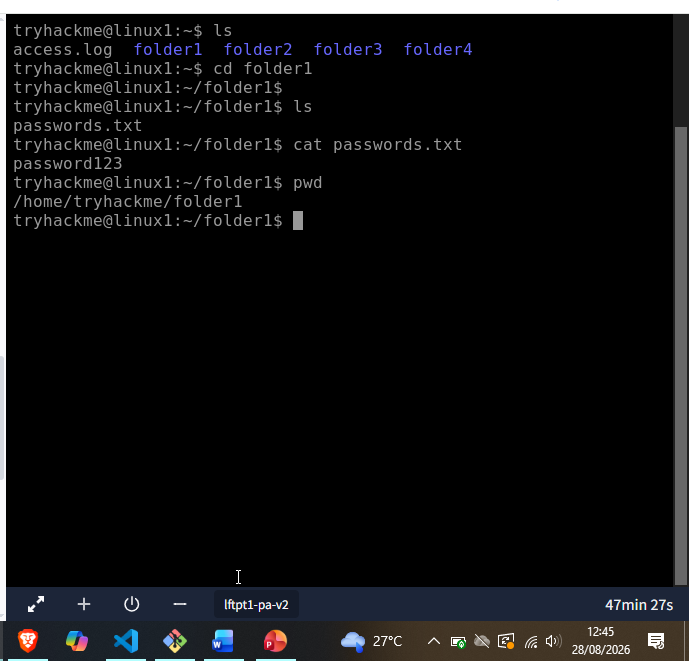
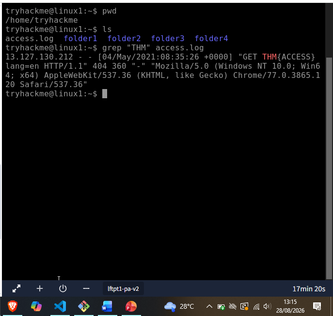
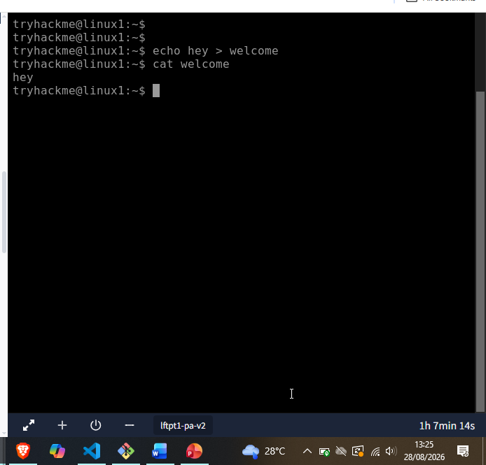

# Day 44: Linux Fundamentals (Pt1)

**Path:** SOC Level 1
**Platform:** TryHackMe
**Status:** ✅ Completed

---

## 📌 Overview

A back-to-basics room on the Linux terminal — the actual starting point for almost everything else in this path. The room opens by pointing out how much of daily life already runs on Linux without most people noticing: websites, car entertainment/control panels, point-of-sale systems, critical infrastructure like traffic light controllers and industrial sensors, and phones.

The core idea running through the room is that interacting with Linux is a conversation: you give it an instruction (a **command**), it gives you **output**. The first command covered is `whoami` — who am I on this system — which matters in security work specifically because you're constantly switching between users, and what you can/can't do depends entirely on which user you are.

Core navigation commands covered:

| Command | What it does |
|---|---|
| `ls` | list what's in the current folder |
| `cd` | change directory — move into a folder |
| `cat` | show the contents of a file |
| `pwd` | print working directory — "where am I?" |

On this system, folders show up in blue in the terminal, which makes it easy to tell folders from files at a glance.

Then it moves into search, so you're not stuck manually scrolling through long files:

| Command | What it does |
|---|---|
| `find` | search for files by name, e.g. `find -name passwords.txt` |
| `grep` | search *inside* a file for text, e.g. `grep "password123" passwords.txt` |

Finally, shell operators — the connective tissue that lets you combine commands and control where their output goes:

| Operator | What it does |
|---|---|
| `&` | runs the command in the background, doesn't wait for it to finish |
| `&&` | runs both commands, but waits for the first to finish before starting the second |
| `>` | redirects output to a file, **overwriting** whatever's there |
| `>>` | redirects output to a file, **appending** to whatever's there |

---

## 🛠️ Tools Used

- Linux terminal (TryHackMe-provided Ubuntu VM) — `whoami`, `ls`, `cd`, `cat`, `pwd`, `grep`, `echo`, `>`

---

## 🪜 Steps Followed

**1. Logged into the Linux machine for the first time**
Connected to the room's Ubuntu box and took in the initial login banner/system info before touching anything.

**2. Practiced basic navigation — ls, cd, cat, pwd**
Listed the home folder, moved into `folder1`, listed its contents, read the file inside it, then confirmed my location.

The home folder held **4 folders** (`folder1`–`folder4`) plus `access.log`. Only **folder1** actually contained a file (`passwords.txt`), and `cat`-ing it revealed the contents: **password123**.

**3. Searched access.log for a flag using grep**
`access.log` in the home folder was hundreds of lines long — instead of scrolling manually, filtered it directly for the flag marker.

Flag: **THM{ACCESS}**, found inside an HTTP GET request line in the log.

**4. Tried the `>` redirect operator**
Used `echo` to write text into a new file, then `cat` to confirm the redirect actually worked.

`echo hey > welcome` created a file called `welcome` containing `hey`; `cat welcome` confirmed it.

---

## 🔍 Key Findings

- Home folder contains 4 folders (`folder1`–`folder4`); only **folder1** holds a file
- Password found via `cat` in folder1: **password123**
- Flag found via `grep "THM" access.log`: **THM{ACCESS}**
- Confirmed the `>` redirect operator overwrites/creates a file with a command's output (`echo hey > welcome` → `welcome` contains `hey`)

---

## 💡 Lessons Learned

- This room is deliberately foundational, and it showed — nothing here was hard, but it's the muscle memory (`ls` → `cd` → `cat` → `pwd`, then `grep` to search instead of scrolling) that every later room in this path has been quietly assuming I already have.
- `grep` for a flag inside a huge log file is a pattern I'll be reaching for constantly — I've effectively already been doing this manually in [[day43]] (Network Security Essentials), where most of the investigation was `cat`/`grep`/`cut`/`sort`/`uniq -c` chains against firewall, IDS, and VPN logs. This room is really the "day 1" version of the exact same skill I was already using at a much more advanced level in that incident investigation.
- The distinction between `>` and `>>` is small but easy to get burned by — overwrite vs. append matters a lot once you're capturing command output during an actual investigation and don't want to accidentally destroy earlier findings.
- Knowing "who am I" (`whoami`) before doing anything else on a box is a habit worth keeping from day one — it's a one-word command but it's the thing that tells you what you're even allowed to do next.
