# Day 45: Network Discovery Detection

**Path:** SOC Level 1
**Platform:** TryHackMe
**Status:** ✅ Completed

---

## 📌 Overview

This room is the direct follow-up to [[day43]] (Network Security Essentials) and [[day44]] (Linux Fundamentals) — it explicitly lists both as prerequisites, and it shows: the whole room is `head`/`cut` log analysis in the terminal plus Kibana, applied specifically to **network discovery** (scanning) activity.

The core idea: before attacking a network, an attacker has to understand it first — what's reachable, what IPs/ports/services/OS versions are running, and whether any of it is vulnerable. Defenders run similar discovery activity too (asset inventory, attack-surface reduction, patch verification), which creates a real detection challenge: research crawlers, search engines, and legitimate internal vulnerability scans all *look* like reconnaissance too. SOC teams handle this by allowlisting known benign scanners, layering in threat intel to flag only known-malicious sources (or at least raise severity), and keeping some generic scan-detection use cases as a backstop.

**External vs. internal scanning:**
- **External scanning** — source IP is outside the org, destination is inside. Maps to the MITRE ATT&CK **Reconnaissance** phase; the attacker has no foothold yet. Lower severity — response is usually just blocking the source IP at the perimeter (though the attacker can always come back from a new IP).
- **Internal-to-internal scanning** — both source and destination are private IPs inside the org. Maps to the **Discovery** phase — the attacker already has a foothold and is preparing for lateral movement. Much higher severity: blocking an IP isn't enough here, it needs full incident response and root-cause analysis.

**Horizontal vs. vertical port scanning:**
- **Horizontal scan** — same source IP, same destination *port*, but many destination IPs. Used to find every host exposing one specific port (the room's example: WannaCry sweeping for SMB/445 across a network).
- **Vertical scan** — same source IP, same destination IP, but many destination *ports*. Used to footprint one specific host of interest and enumerate everything it's running.

**Scan mechanics:**
- **Ping sweep** — ICMP echo requests to find which hosts are alive. Simple, but easily blocked by modern security controls.
- **TCP SYN scan** — abuses the TCP three-way handshake (SYN → SYN-ACK → ACK): if a SYN-ACK comes back, the host is up and that port is open. Stealthy — blends in with normal traffic.
- **UDP scan** — sends an (often empty) UDP packet; an ICMP port-unreachable reply means the port is closed, no response by timeout is treated as "maybe open" (unreliable), and an actual UDP reply back confirms open. Slow and unreliable by nature since it depends on waiting out a timeout.

---

## 🛠️ Tools Used

- Linux terminal — `pwd`, `ls`, `cd`, `head`, `cut` (with `-d ","` and multi-field `-f`)
- Kibana (Elastic Discover) — KQL search bar, field columns, `zeek.conn.conn_state`
- Log source: three exported SIEM CSVs (`log-session-0.csv`, `log-session-1.csv`, `log-session-2.csv`) in `~/Downloads/logs`, plus the same data pre-loaded in Kibana

---

## 🪜 Steps Followed

**1. Navigated to the exported log files**
Found three CSVs sitting in `~/Downloads/logs`, exported from a SIEM.

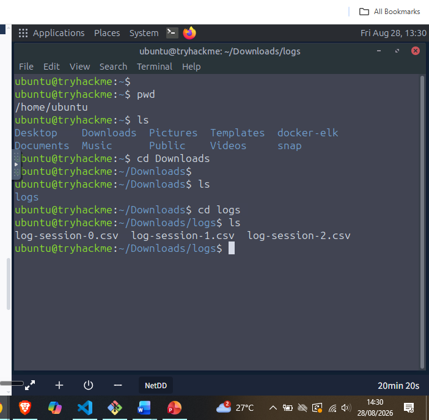

**2. Previewed log-session-1.csv**
Used `head -n2` to check the header row and a sample entry before filtering anything.

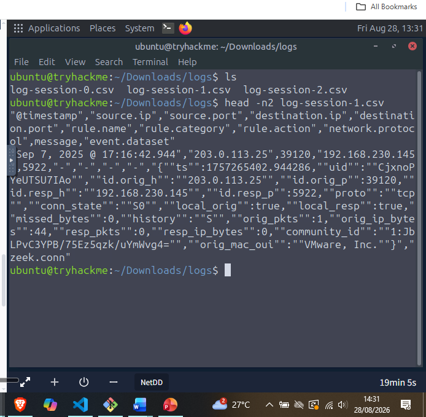

The sample entry showed source **203.0.113.25** (external) hitting destination **192.168.230.145:5922**, connection state `S0` (a connection attempt with no reply — consistent with a scan, not an established session).

**3. Previewed log-session-2.csv**
Same approach, different file.

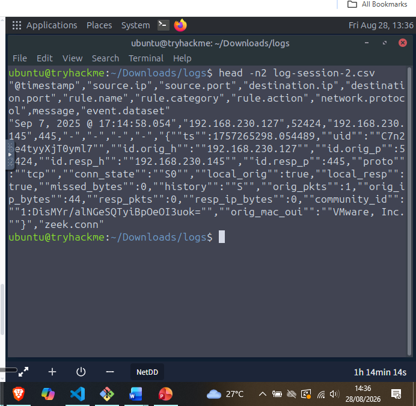

This entry showed source **192.168.230.127** (internal, private range) hitting destination **192.168.230.145:445**, also `S0` — internal-to-internal traffic, the signature of internal/Discovery-phase scanning rather than external reconnaissance.

**4. Took a closer look at the log-session-1.csv entry**
Zoomed in on the same output to confirm the field values clearly.

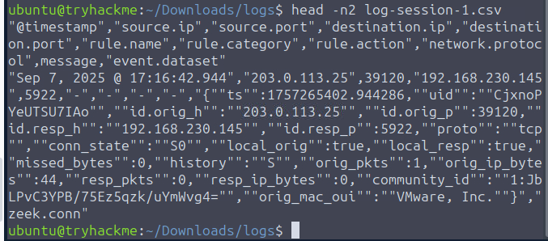

Between steps 2–4: **log-session-2.csv** is the file showing internal scanning activity, and **203.0.113.25** is the external IP performing external scanning (found via log-session-1.csv). Getting the actual entry *count* for the internal scanning IP needed the room's hint to land on the right filtering command.

**5. Extracted specific columns from log-session-2.csv with cut**
Since the timestamp field itself contains a comma, the column numbering had to account for that shift — first attempt targeted source/destination IP and port fields.

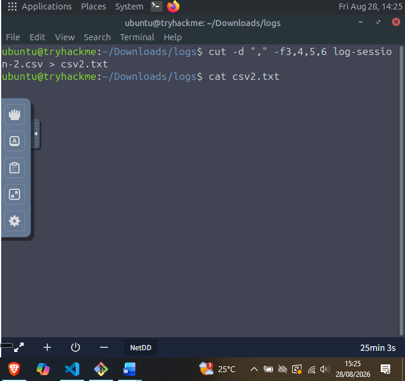

**6. Found the horizontal scan pattern**
The output revealed the same source IP hitting a *sequential range* of destination IPs.

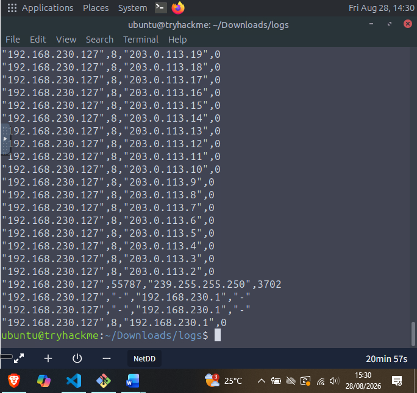

Source **192.168.230.127** was sweeping across destinations from `203.0.113.19` down to `203.0.113.2` — a full **203.0.113.0/24** range — the horizontal scan signature (same source, same port, many destination IPs).

**7. Found the vertical scan pattern in the same file**
Continued through the cut output looking for the opposite pattern.

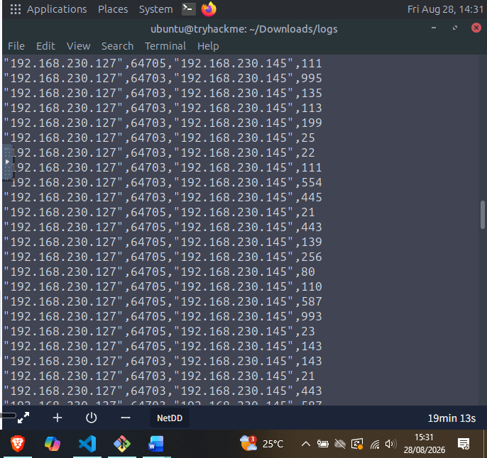

The same source (**192.168.230.127**) was also hitting a long, varied list of destination ports (111, 995, 135, 113, 199, 25, 22, 554, 445, 21, 443, 139, 256, 80, 110, 587, 993, 23, 143...) all against a single destination — **192.168.230.145** — the vertical scan signature.

**8. Re-ran the cut with the corrected field set**
Widened the extraction to include the destination-port and rule-name fields together for a clearer read.

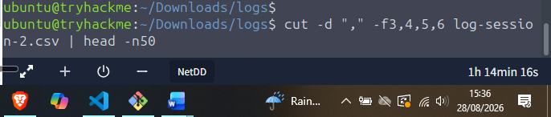

**9. Isolated the narrow, targeted port scan**
Scrolling further through that same extraction surfaced a much smaller, repeating set of ports against two specific destinations.

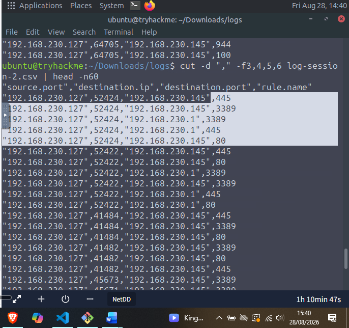

Only three ports kept repeating against `192.168.230.145` and `192.168.230.1`: **80, 445, 3389** — all common, high-value services (HTTP, SMB, RDP) rather than a broad sweep, suggesting a targeted footprint rather than a blind scan.

**10. Switched to Kibana to confirm the ping sweep source**
Logged into the Elastic Discover dashboard and searched for `icmp` traffic, adding `network.protocol` and `source.ip` as columns.

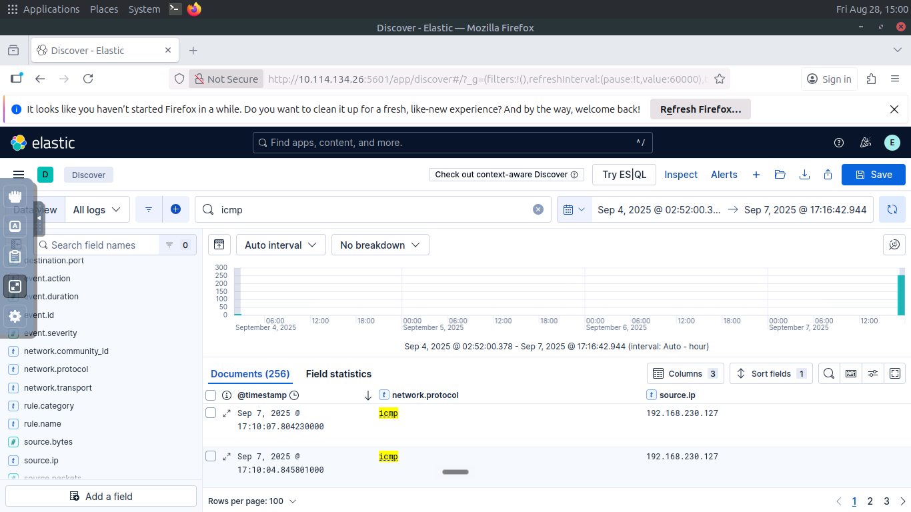

**11. Confirmed the TCP SYN scan via connection state**
Cleared the filter, added `zeek.conn.conn_state` as a column alongside source/destination IP and protocol, and reviewed the state values for the external-to-internal traffic.

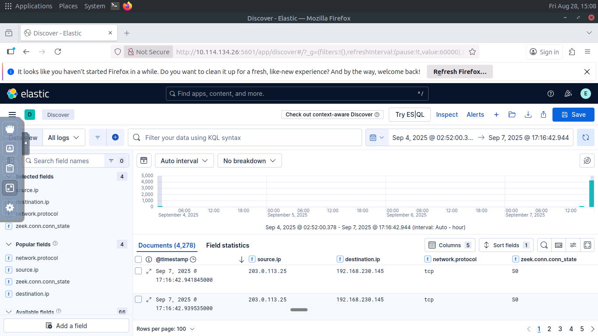

Source **192.168.230.127** was the one running the ICMP ping sweep across the subnet. Separately, the `S0` connection state on **203.0.113.25 → 192.168.230.145** traffic (TCP with no completed handshake) confirmed a **TCP SYN scan**. No evidence of any UDP scanning turned up anywhere in the logs.

---

## 🔍 Key Findings

- **log-session-2.csv** = the file showing internal-to-internal scanning activity
- Internal scanning source: **192.168.230.127**, generating **2,276** log entries (had to check the room hint for the right filtering command)
- External scanning source: **203.0.113.25** (found in log-session-1.csv)
- Horizontal scan: source 192.168.230.127 sweeping the **203.0.113.0/24** range
- Vertical scan target: **192.168.230.145**, hit across a wide, varied port list
- Narrow/targeted port scan on the same host + `192.168.230.1`: only **80, 445, 3389**
- Ping sweep source (via Kibana `icmp` filter): **192.168.230.127**
- Scan type against 203.0.113.25 → 192.168.230.145 (via `zeek.conn.conn_state`): **TCP SYN scan**
- No UDP scanning activity found in the logs
- Pattern worth calling out: the same internal IP (192.168.230.127) shows up as the source for *every* internal scanning pattern in this dataset — the ping sweep, the horizontal sweep across the external /24, and the vertical scan against .145. Three different scan techniques from one single host is a strong signal that whatever's running on 192.168.230.127 is either a dedicated (possibly unauthorized) scanning tool, or a compromised host doing internal reconnaissance ahead of lateral movement.

---

## 💡 Lessons Learned

- The external-vs-internal distinction is really a severity distinction in disguise: external scanning against the perimeter is "somebody's knocking", internal-to-internal scanning is "somebody's already inside and casing the place." The response is completely different — block-an-IP vs. full incident response — which makes correctly classifying source/destination IP ranges the very first thing worth doing with any scan alert.
- Horizontal vs. vertical scanning is really just "one port, many hosts" vs. "one host, many ports" — but recognizing which one you're looking at tells you the attacker's *intent*: horizontal means they're hunting for anyone running a specific vulnerable service (like WannaCry hunting SMB); vertical means they've already picked their target and are footprinting it specifically.
- This room made the `cut -d ","` timestamp gotcha very real — a timestamp field containing its own comma silently shifts every column number after it, and getting that wrong (my first `-f3,4,6` attempt) means quietly grabbing the wrong data without any error to flag it. Worth double-checking field alignment against the header row every time, not just trusting the column count.
- Kibana's `zeek.conn.conn_state` field turned out to be a much faster way to distinguish scan types than staring at raw CSVs — `S0` specifically (connection attempt seen, no reply) is the tell-tale sign of a SYN scan, and it's a single field lookup instead of manually reasoning through SYN/SYN-ACK/ACK sequences by hand.
- This connects directly to [[day43]]'s Cyber Kill Chain framing: everything in this room sits squarely in the **Reconnaissance** and early **Discovery** stages — the step before any of Day 43's lateral movement, C2, or exfiltration findings would even be possible. Catching this stage early is the whole point of perimeter and internal scan monitoring.
